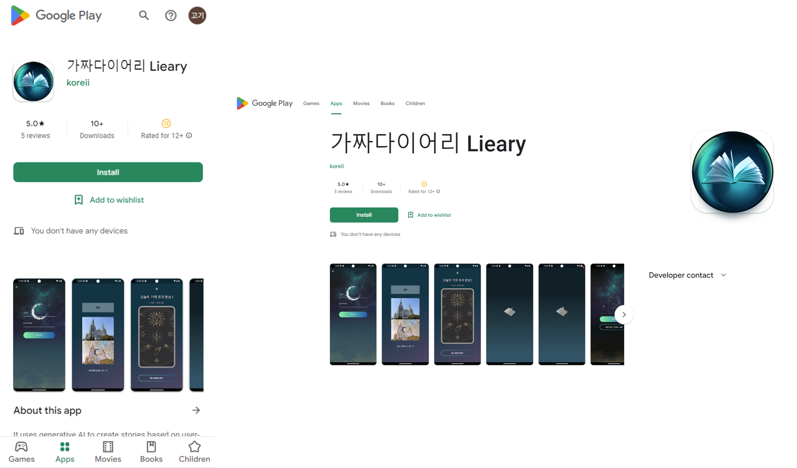
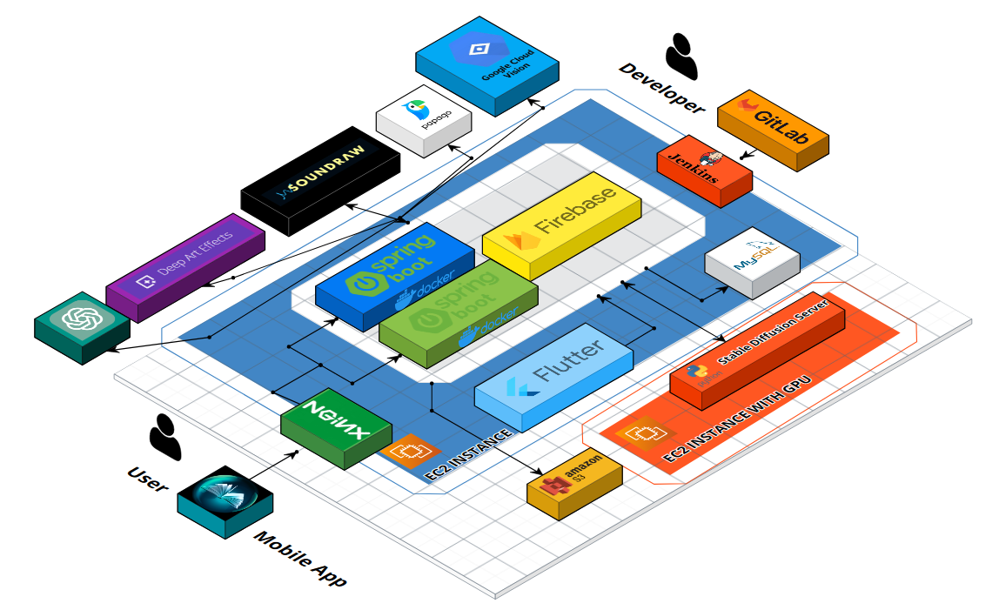

# 📔 가짜 다이어리 Lieary : 평범한 일상을 더욱 특별하게, 나만의 우주🪐를 작성하는 오늘

<br>

[App Download Link](https://play.google.com/store/apps/details?id=com.a1012.frontend&hl=en-KR)



<br>

## 🎦 소개 영상

가짜 다이어리 Lieary 프로젝트
[]()

<br>

---

<br>

## 🎦 프로젝트 진행 기간

2023.04.10 ~ 2023.05.19 (진행일 : 40일)

<br>

---

<br>

## 🎦 배경

가짜 다이어리 서비스는 지루한 일상을 재미있게 바꾸어보자는 발상에서 출발했습니다.

<br>

반복되는 일상 속에서 특별한 순간을 담은 사진이나, 키워드를 입력해서
나의 하루와 관계된 재미있는 컨텐츠를 만들어 줌으로써 사용자에게 활력을 주는 서비스를 제공하고자 했습니다.

<br>

---

<br>

## 🎦 기능 설명

### ⬛ 카드 기능


<br>
✔  사진을 업로드하고 몇 가지 키워드를 입력함으로써 자신의 일상을 기록으로 남길 수 있는 기능
<br><br>
✔ 사진은 직접 촬영하거나 혹은 보관함에 있는 사진을 선택
<br><br>

✔ Deep Art Effect : Image To Imgae 기술 ▶ 유저가 업로드 한 이미지 카드화
<br><br>

✔ Google Cloud Vision - 이미지 캡셔닝 활용 ▶ 사진과 관련된 키워드 추출

- 이미지 캡셔닝 : 이미지를 분석하여 관련도가 높은 단어를 순서대로 나열

<br>
✔ 카카오 맵 위치 기반 API 활용하여 유저 편의성 향상
<br>

<br><br>

### ⬛ 일기 기능


<br>
✔  정해진 시간에 자동으로 생성되는 일기 & 직접 생성하는 일기
<br><br>
✔ 카드의 선택은 5개까지 가능하고 선택한 카드에 포함된 키워드들이 일기의 내용을 구성
<br><br>
✔ Chat GPT-4 : 제시된 키워드와 미리 지정한 프롬프트를 활용하여 일기 생성

<br>
✔ Stable Diffusion : 제시된 키워드 기반 표지, 삽화 생성

<br>
✔ Sound Raw : 제시된 키워드 기반 음악 생성

<br>

<details>
    <summary>Problem & Solution</summary>
    💛 Problem 
    <br>
    (1) 생성형 AI가 만들어주는 결과가 일정하지 않음
    (2) GPT-3.5는 낮은 퀄리티의 컨텐츠 생산
    <br><br>
    💙 Solution
    <br>
    (1) 프롬프트 엔지니어링 연구 <br>
    - AI에 넘기는 프롬프트를 조정함으로써 원하는 답을 얻어냄
    <br>
    (2) OpenAI에 GPT-4 API 승인 요청
    <br><br>
    ➡ GPT의 이야기 및 Stable Diffusion의 삽화 퀄리티를 높여 유저 경험을 향상
</details>

<br><br>

<br>

### ⬛ Social Service : 교환 기능


<br>
✔ 각자의 일기를 교환해서 볼 수 있는 기능

<br>
✔ 교환할 대상을 선택하고 신청을 누르면 교환이 진행

<br>
✔ 수신자가 교환 수락 후 답장할 일기 선택하면 교환 과정 완료 되어 교환된 일기 확인할 수 있음

<br><br>
<br>

### ⬛ 카카오톡 공유


<br>
✔ 카드, 일기 정보(이미지, 타이틀 등) 카카오톡 공유 기능

<br>
✔ 카카오톡 공유 기능을 통해서 잠재적 유저 확보 기대

<br>

---

<br>

## ✅ 사용 기술
<br>
 
  
 
 
 
  
   
 

 

<br>

---

## ✅ 시스템 구성도



---

## ✅ 프로젝트 파일 구조도

<details>
    <summary>✨ 프론트엔드 </summary>


```
📦frontend
 ┣ 📂.dart_tool
 ┃ ┣ 📂flutter_build
 ┃ ┃ ┣ 📂0eded09529863f8fe53ba493bcf80e27
 ┃ ┃ ┃ ┣ 📜.filecache
 ┃ ┃ ┃ ┣ 📜app.dill
 ┃ ┃ ┃ ┣ 📜debug_android_application.stamp
 ┃ ┃ ┃ ┣ 📜flutter_assets.d
 ┃ ┃ ┃ ┣ 📜gen_dart_plugin_registrant.stamp
 ┃ ┃ ┃ ┣ 📜gen_localizations.stamp
 ┃ ┃ ┃ ┣ 📜kernel_snapshot.d
 ┃ ┃ ┃ ┣ 📜kernel_snapshot.stamp
 ┃ ┃ ┃ ┗ 📜outputs.json
 ┃ ┃ ┗ 📜dart_plugin_registrant.dart
 ┃ ┣ 📜package_config.json
 ┃ ┣ 📜package_config_subset
 ┃ ┗ 📜version
 ┣ 📂.idea
 ┃ ┣ 📂libraries
 ┃ ┃ ┣ 📜Dart_Packages.xml
 ┃ ┃ ┣ 📜Dart_SDK.xml
 ┃ ┃ ┗ 📜Flutter_Plugins.xml
 ┃ ┣ 📜.gitignore
 ┃ ┣ 📜frontend.iml
 ┃ ┣ 📜git_toolbox_prj.xml
 ┃ ┣ 📜modules.xml
 ┃ ┣ 📜vcs.xml
 ┃ ┗ 📜workspace.xml
 ┣ 📂android
 ┃ ┣ 📂.gradle
 ┃ ┃ ┣ 📂7.5
 ┃ ┃ ┃ ┣ 📂checksums
 ┃ ┃ ┃ ┃ ┗ 📜checksums.lock
 ┃ ┃ ┃ ┣ 📂dependencies-accessors
 ┃ ┃ ┃ ┃ ┣ 📜dependencies-accessors.lock
 ┃ ┃ ┃ ┃ ┗ 📜gc.properties
 ┃ ┃ ┃ ┣ 📂executionHistory
 ┃ ┃ ┃ ┃ ┣ 📜executionHistory.bin
 ┃ ┃ ┃ ┃ ┗ 📜executionHistory.lock
 ┃ ┃ ┃ ┣ 📂fileChanges
 ┃ ┃ ┃ ┃ ┗ 📜last-build.bin
 ┃ ┃ ┃ ┣ 📂fileHashes
 ┃ ┃ ┃ ┃ ┣ 📜fileHashes.bin
 ┃ ┃ ┃ ┃ ┣ 📜fileHashes.lock
 ┃ ┃ ┃ ┃ ┗ 📜resourceHashesCache.bin
 ┃ ┃ ┃ ┣ 📂vcsMetadata
 ┃ ┃ ┃ ┗ 📜gc.properties
 ┃ ┃ ┣ 📂buildOutputCleanup
 ┃ ┃ ┃ ┣ 📜buildOutputCleanup.lock
 ┃ ┃ ┃ ┣ 📜cache.properties
 ┃ ┃ ┃ ┗ 📜outputFiles.bin
 ┃ ┃ ┣ 📂vcs-1
 ┃ ┃ ┃ ┗ 📜gc.properties
 ┃ ┃ ┗ 📜file-system.probe
 ┃ ┣ 📂app
 ┃ ┃ ┣ 📂src
 ┃ ┃ ┃ ┣ 📂debug
 ┃ ┃ ┃ ┃ ┗ 📜AndroidManifest.xml
 ┃ ┃ ┃ ┣ 📂main
 ┃ ┃ ┃ ┃ ┣ 📂java
 ┃ ┃ ┃ ┃ ┃ ┗ 📂io
 ┃ ┃ ┃ ┃ ┃ ┃ ┗ 📂flutter
 ┃ ┃ ┃ ┃ ┃ ┃ ┃ ┗ 📂plugins
 ┃ ┃ ┃ ┃ ┃ ┃ ┃ ┃ ┗ 📜GeneratedPluginRegistrant.java
 ┃ ┃ ┃ ┃ ┣ 📂kotlin
 ┃ ┃ ┃ ┃ ┃ ┗ 📂com
 ┃ ┃ ┃ ┃ ┃ ┃ ┗ 📂example
 ┃ ┃ ┃ ┃ ┃ ┃ ┃ ┗ 📂frontend
 ┃ ┃ ┃ ┃ ┃ ┃ ┃ ┃ ┗ 📜MainActivity.kt
 ┃ ┃ ┃ ┃ ┣ 📂res
 ┃ ┃ ┃ ┃ ┃ ┣ 📂drawable
 ┃ ┃ ┃ ┃ ┃ ┃ ┣ 📜app_icon.png
 ┃ ┃ ┃ ┃ ┃ ┃ ┗ 📜launch_background.xml
 ┃ ┃ ┃ ┃ ┃ ┣ 📂drawable-v21
 ┃ ┃ ┃ ┃ ┃ ┃ ┗ 📜launch_background.xml
 ┃ ┃ ┃ ┃ ┃ ┣ 📂mipmap-hdpi
 ┃ ┃ ┃ ┃ ┃ ┃ ┗ 📜ic_launcher.png
 ┃ ┃ ┃ ┃ ┃ ┣ 📂mipmap-mdpi
 ┃ ┃ ┃ ┃ ┃ ┃ ┗ 📜ic_launcher.png
 ┃ ┃ ┃ ┃ ┃ ┣ 📂mipmap-xhdpi
 ┃ ┃ ┃ ┃ ┃ ┃ ┗ 📜ic_launcher.png
 ┃ ┃ ┃ ┃ ┃ ┣ 📂mipmap-xxhdpi
 ┃ ┃ ┃ ┃ ┃ ┃ ┗ 📜ic_launcher.png
 ┃ ┃ ┃ ┃ ┃ ┣ 📂mipmap-xxxhdpi
 ┃ ┃ ┃ ┃ ┃ ┃ ┗ 📜ic_launcher.png
 ┃ ┃ ┃ ┃ ┃ ┣ 📂values
 ┃ ┃ ┃ ┃ ┃ ┃ ┗ 📜styles.xml
 ┃ ┃ ┃ ┃ ┃ ┗ 📂values-night
 ┃ ┃ ┃ ┃ ┃ ┃ ┗ 📜styles.xml
 ┃ ┃ ┃ ┃ ┗ 📜AndroidManifest.xml
 ┃ ┃ ┃ ┗ 📂profile
 ┃ ┃ ┃ ┃ ┗ 📜AndroidManifest.xml
 ┃ ┃ ┣ 📜build.gradle
 ┃ ┃ ┗ 📜google-services.json
 ┃ ┣ 📂gradle
 ┃ ┃ ┗ 📂wrapper
 ┃ ┃ ┃ ┣ 📜gradle-wrapper.jar
 ┃ ┃ ┃ ┗ 📜gradle-wrapper.properties
 ┃ ┣ 📜.gitignore
 ┃ ┣ 📜build.gradle
 ┃ ┣ 📜gradle.properties
 ┃ ┣ 📜gradlew
 ┃ ┣ 📜gradlew.bat
 ┃ ┣ 📜local.properties
 ┃ ┗ 📜settings.gradle
 ┣ 📂assets
 ┃ ┣ 📂diary_load_1
 ┃ ┃ ┗ 📜chrome_8Yy8iAY3tK.png
 ┃ ┣ 📂font
 ┃ ┃ ┣ 📂Cafe24
 ┃ ┃ ┃ ┗ 📜Cafe24SsurroundAir.ttf
 ┃ ┃ ┗ 📂Nanum_Square_Neo
 ┃ ┃ ┃ ┣ 📜NanumSquareNeoOTF-Bd.otf
 ┃ ┃ ┃ ┣ 📜NanumSquareNeoOTF-Eb.otf
 ┃ ┃ ┃ ┣ 📜NanumSquareNeoOTF-Hv.otf
 ┃ ┃ ┃ ┣ 📜NanumSquareNeoOTF-Lt.otf
 ┃ ┃ ┃ ┗ 📜NanumSquareNeoOTF-Rg.otf
 ┃ ┣ 📂gif-file
 ┃ ┃ ┣ 📜diary_loading.gif
 ┃ ┃ ┣ 📜diary_loading_1.gif
 ┃ ┃ ┣ 📜diary_loading_2.gif
 ┃ ┃ ┣ 📜diary_loading_3.gif
 ┃ ┃ ┣ 📜diary_loading_4.gif
 ┃ ┃ ┣ 📜moon_bright.gif
 ┃ ┃ ┣ 📜moon_brighter_faster.gif
 ┃ ┃ ┣ 📜moon_faster.gif
 ┃ ┃ ┣ 📜moon_real.gif
 ┃ ┃ ┗ 📜moon_real2.gif
 ┃ ┣ 📂img
 ┃ ┃ ┣ 📜app_icon.png
 ┃ ┃ ┣ 📜background.png
 ┃ ┃ ┣ 📜background_1.png
 ┃ ┃ ┣ 📜background_1_darken.png
 ┃ ┃ ┣ 📜background_1_littledark.png
 ┃ ┃ ┣ 📜background_2.png
 ┃ ┃ ┣ 📜background_pink_darken.png
 ┃ ┃ ┣ 📜bg_galaxy.png
 ┃ ┃ ┣ 📜bg_icon.png
 ┃ ┃ ┣ 📜bg_menu.png
 ┃ ┃ ┣ 📜bg_moon.png
 ┃ ┃ ┣ 📜book_cover.png
 ┃ ┃ ┣ 📜cardlist_tmpcard.png
 ┃ ┃ ┣ 📜cardlist_topcards.png
 ┃ ┃ ┣ 📜cards.jpg
 ┃ ┃ ┣ 📜card_example.jpg
 ┃ ┃ ┣ 📜compass-full.svg
 ┃ ┃ ┣ 📜cover_test.png
 ┃ ┃ ┣ 📜diary_cover.png
 ┃ ┃ ┣ 📜diary_list.png
 ┃ ┃ ┣ 📜diary_loading_1.jpg
 ┃ ┃ ┣ 📜diary_paper.png
 ┃ ┃ ┣ 📜diary_paper2.png
 ┃ ┃ ┣ 📜diary_paper3.png
 ┃ ┃ ┣ 📜diary_paper4.png
 ┃ ┃ ┣ 📜diary_paper5.png
 ┃ ┃ ┣ 📜diary_paper6.png
 ┃ ┃ ┣ 📜example.jpg
 ┃ ┃ ┣ 📜friend_icon.png
 ┃ ┃ ┣ 📜home_icon.png
 ┃ ┃ ┣ 📜icon_alarm.png
 ┃ ┃ ┣ 📜icon_cam.png
 ┃ ┃ ┣ 📜icon_close.png
 ┃ ┃ ┣ 📜icon_menu.png
 ┃ ┃ ┣ 📜icon_menu_page.png
 ┃ ┃ ┣ 📜illustration_test1.png
 ┃ ┃ ┣ 📜illustration_test2.png
 ┃ ┃ ┣ 📜illustration_test3.png
 ┃ ┃ ┣ 📜image_plus.png
 ┃ ┃ ┣ 📜image_put.png
 ┃ ┃ ┣ 📜kakao.png
 ┃ ┃ ┣ 📜line_bottom.png
 ┃ ┃ ┣ 📜line_top.png
 ┃ ┃ ┣ 📜logo_big.png
 ┃ ┃ ┣ 📜logo_small.png
 ┃ ┃ ┣ 📜main_background.png
 ┃ ┃ ┣ 📜menu_white.png
 ┃ ┃ ┣ 📜music_icon.png
 ┃ ┃ ┣ 📜music_off.png
 ┃ ┃ ┣ 📜old_main_background.jpg
 ┃ ┃ ┣ 📜plus_image.png
 ┃ ┃ ┣ 📜silver_moon.png
 ┃ ┃ ┣ 📜small_moon.png
 ┃ ┃ ┣ 📜temp.jpg
 ┃ ┃ ┣ 📜tutorial_books.png
 ┃ ┃ ┣ 📜tutorial_cards.png
 ┃ ┃ ┣ 📜tutorial_effect1.png
 ┃ ┃ ┣ 📜tutorial_effect2.png
 ┃ ┃ ┣ 📜tutorial_openbook.png
 ┃ ┃ ┗ 📜wing_divider.png
 ┃ ┣ 📂lottie
 ┃ ┃ ┣ 📜1-alien.json
 ┃ ┃ ┣ 📜1-tarot.json
 ┃ ┃ ┣ 📜105550sparkle.json
 ┃ ┃ ┣ 📜1_planets.json
 ┃ ┃ ┣ 📜2-alien.json
 ┃ ┃ ┣ 📜2-tarot.json
 ┃ ┃ ┣ 📜2_planet.json
 ┃ ┃ ┣ 📜3_planet.json
 ┃ ┃ ┣ 📜alarm.json
 ┃ ┃ ┣ 📜alarm_moon.json
 ┃ ┃ ┣ 📜book-loop-perspective.json
 ┃ ┃ ┣ 📜book.json
 ┃ ┃ ┣ 📜camera_loop.json
 ┃ ┃ ┣ 📜diary_write.json
 ┃ ┃ ┣ 📜exchange_small.json
 ┃ ┃ ┣ 📜friend_planet.json
 ┃ ┃ ┣ 📜friend_space.json
 ┃ ┃ ┣ 📜image_put.json
 ┃ ┃ ┣ 📜image_up.json
 ┃ ┃ ┣ 📜loading_basic.json
 ┃ ┃ ┣ 📜loading_circles.json
 ┃ ┃ ┣ 📜loading_image.json
 ┃ ┃ ┣ 📜loading_image_circle.json
 ┃ ┃ ┣ 📜login_ent.json
 ┃ ┃ ┣ 📜menu.json
 ┃ ┃ ┣ 📜menu_grinstar.json
 ┃ ┃ ┣ 📜menu_icon.json
 ┃ ┃ ┣ 📜menu_star.json
 ┃ ┃ ┣ 📜moonstar.json
 ┃ ┃ ┣ 📜moon_rotate.json
 ┃ ┃ ┣ 📜random.json
 ┃ ┃ ┣ 📜searchFriend.json
 ┃ ┃ ┣ 📜send_small.json
 ┃ ┃ ┣ 📜star-twinkle.json
 ┃ ┃ ┗ 📜stars.json
 ┃ ┣ 📂svg
 ┃ ┃ ┣ 📜atronaut-svgrepo-com.svg
 ┃ ┃ ┣ 📜document-svgrepo-com.svg
 ┃ ┃ ┣ 📜photo-svgrepo-com.svg
 ┃ ┃ ┗ 📜user-2-svgrepo-com.svg
 ┃ ┗ 📂wav
 ┃ ┃ ┗ 📜test_music2.wav
 ┣ 📂build
 ┃ ┣ 📂3f695e4899cd70a120e70fd6d6901abc
 ┃ ┃ ┣ 📜gen_dart_plugin_registrant.stamp
 ┃ ┃ ┣ 📜gen_localizations.stamp
 ┃ ┃ ┗ 📜_composite.stamp
 ┃ ┣ 📂app
 ┃ ┃ ┣ 📂generated
 ┃ ┃ ┃ ┣ 📂ap_generated_sources
 ┃ ┃ ┃ ┃ ┗ 📂debug
 ┃ ┃ ┃ ┃ ┃ ┗ 📂out
 ┃ ┃ ┃ ┣ 📂res
 ┃ ┃ ┃ ┃ ┣ 📂google-services
 ┃ ┃ ┃ ┃ ┃ ┗ 📂debug
 ┃ ┃ ┃ ┃ ┃ ┃ ┗ 📂values
 ┃ ┃ ┃ ┃ ┃ ┃ ┃ ┗ 📜values.xml
 ┃ ┃ ┃ ┃ ┣ 📂pngs
 ┃ ┃ ┃ ┃ ┃ ┗ 📂debug
 ┃ ┃ ┃ ┃ ┗ 📂resValues
 ┃ ┃ ┃ ┃ ┃ ┗ 📂debug
 ┃ ┃ ┃ ┗ 📂source
 ┃ ┃ ┃ ┃ ┗ 📂buildConfig
 ┃ ┃ ┃ ┃ ┃ ┗ 📂debug
 ┃ ┃ ┃ ┃ ┃ ┃ ┗ 📂com
 ┃ ┃ ┃ ┃ ┃ ┃ ┃ ┗ 📂a1012
 ┃ ┃ ┃ ┃ ┃ ┃ ┃ ┃ ┗ 📂frontend
 ┃ ┃ ┃ ┃ ┃ ┃ ┃ ┃ ┃ ┗ 📜BuildConfig.java
 ┃ ┃ ┣ 📂intermediates
 ┃ ┃ ┃ ┣ 📂aar_metadata_check
 ┃ ┃ ┃ ┃ ┗ 📂debug
 ┃ ┃ ┃ ┣ 📂annotation_processor_list
 ┃ ┃ ┃ ┃ ┗ 📂debug
 ┃ ┃ ┃ ┃ ┃ ┗ 📜annotationProcessors.json
 ┃ ┃ ┃ ┣ 📂apk_ide_redirect_file
 ┃ ┃ ┃ ┃ ┗ 📂debug
 ┃ ┃ ┃ ┃ ┃ ┗ 📜redirect.txt
 ┃ ┃ ┃ ┣ 📂app_metadata
 ┃ ┃ ┃ ┃ ┗ 📂debug
 ┃ ┃ ┃ ┃ ┃ ┗ 📜app-metadata.properties
 ┃ ┃ ┃ ┣ 📂assets
 ┃ ┃ ┃ ┃ ┗ 📂debug
 ┃ ┃ ┃ ┃ ┃ ┗ 📂mergeDebugAssets
 ┃ ┃ ┃ ┃ ┃ ┃ ┗ 📂flutter_assets
 ┃ ┃ ┃ ┃ ┃ ┃ ┃ ┣ 📂assets
 ┃ ┃ ┃ ┃ ┃ ┃ ┃ ┃ ┣ 📂font
 ┃ ┃ ┃ ┃ ┃ ┃ ┃ ┃ ┃ ┣ 📂Cafe24
 ┃ ┃ ┃ ┃ ┃ ┃ ┃ ┃ ┃ ┃ ┗ 📜Cafe24SsurroundAir.ttf
 ┃ ┃ ┃ ┃ ┃ ┃ ┃ ┃ ┃ ┗ 📂Nanum_Square_Neo
 ┃ ┃ ┃ ┃ ┃ ┃ ┃ ┃ ┃ ┃ ┣ 📜NanumSquareNeoOTF-Bd.otf
 ┃ ┃ ┃ ┃ ┃ ┃ ┃ ┃ ┃ ┃ ┣ 📜NanumSquareNeoOTF-Eb.otf
 ┃ ┃ ┃ ┃ ┃ ┃ ┃ ┃ ┃ ┃ ┣ 📜NanumSquareNeoOTF-Hv.otf
 ┃ ┃ ┃ ┃ ┃ ┃ ┃ ┃ ┃ ┃ ┣ 📜NanumSquareNeoOTF-Lt.otf
 ┃ ┃ ┃ ┃ ┃ ┃ ┃ ┃ ┃ ┃ ┗ 📜NanumSquareNeoOTF-Rg.otf
 ┃ ┃ ┃ ┃ ┃ ┃ ┃ ┃ ┣ 📂gif-file
 ┃ ┃ ┃ ┃ ┃ ┃ ┃ ┃ ┃ ┣ 📜diary_loading.gif
 ┃ ┃ ┃ ┃ ┃ ┃ ┃ ┃ ┃ ┣ 📜diary_loading_1.gif
 ┃ ┃ ┃ ┃ ┃ ┃ ┃ ┃ ┃ ┣ 📜diary_loading_2.gif
 ┃ ┃ ┃ ┃ ┃ ┃ ┃ ┃ ┃ ┣ 📜diary_loading_3.gif
 ┃ ┃ ┃ ┃ ┃ ┃ ┃ ┃ ┃ ┣ 📜diary_loading_4.gif
 ┃ ┃ ┃ ┃ ┃ ┃ ┃ ┃ ┃ ┣ 📜moon_bright.gif
 ┃ ┃ ┃ ┃ ┃ ┃ ┃ ┃ ┃ ┣ 📜moon_brighter_faster.gif
 ┃ ┃ ┃ ┃ ┃ ┃ ┃ ┃ ┃ ┣ 📜moon_faster.gif
 ┃ ┃ ┃ ┃ ┃ ┃ ┃ ┃ ┃ ┣ 📜moon_real.gif
 ┃ ┃ ┃ ┃ ┃ ┃ ┃ ┃ ┃ ┗ 📜moon_real2.gif
 ┃ ┃ ┃ ┃ ┃ ┃ ┃ ┃ ┣ 📂img
 ┃ ┃ ┃ ┃ ┃ ┃ ┃ ┃ ┃ ┣ 📜app_icon.png
 ┃ ┃ ┃ ┃ ┃ ┃ ┃ ┃ ┃ ┣ 📜background.png
 ┃ ┃ ┃ ┃ ┃ ┃ ┃ ┃ ┃ ┣ 📜background_1.png
 ┃ ┃ ┃ ┃ ┃ ┃ ┃ ┃ ┃ ┣ 📜background_1_darken.png
 ┃ ┃ ┃ ┃ ┃ ┃ ┃ ┃ ┃ ┣ 📜background_1_littledark.png
 ┃ ┃ ┃ ┃ ┃ ┃ ┃ ┃ ┃ ┣ 📜background_2.png
 ┃ ┃ ┃ ┃ ┃ ┃ ┃ ┃ ┃ ┣ 📜background_pink_darken.png
 ┃ ┃ ┃ ┃ ┃ ┃ ┃ ┃ ┃ ┣ 📜bg_galaxy.png
 ┃ ┃ ┃ ┃ ┃ ┃ ┃ ┃ ┃ ┣ 📜bg_icon.png
 ┃ ┃ ┃ ┃ ┃ ┃ ┃ ┃ ┃ ┣ 📜bg_menu.png
 ┃ ┃ ┃ ┃ ┃ ┃ ┃ ┃ ┃ ┣ 📜bg_moon.png
 ┃ ┃ ┃ ┃ ┃ ┃ ┃ ┃ ┃ ┣ 📜book_cover.png
 ┃ ┃ ┃ ┃ ┃ ┃ ┃ ┃ ┃ ┣ 📜cardlist_tmpcard.png
 ┃ ┃ ┃ ┃ ┃ ┃ ┃ ┃ ┃ ┣ 📜cardlist_topcards.png
 ┃ ┃ ┃ ┃ ┃ ┃ ┃ ┃ ┃ ┣ 📜cards.jpg
 ┃ ┃ ┃ ┃ ┃ ┃ ┃ ┃ ┃ ┣ 📜card_example.jpg
 ┃ ┃ ┃ ┃ ┃ ┃ ┃ ┃ ┃ ┣ 📜compass-full.svg
 ┃ ┃ ┃ ┃ ┃ ┃ ┃ ┃ ┃ ┣ 📜cover_test.png
 ┃ ┃ ┃ ┃ ┃ ┃ ┃ ┃ ┃ ┣ 📜diary_cover.png
 ┃ ┃ ┃ ┃ ┃ ┃ ┃ ┃ ┃ ┣ 📜diary_list.png
 ┃ ┃ ┃ ┃ ┃ ┃ ┃ ┃ ┃ ┣ 📜diary_loading_1.jpg
 ┃ ┃ ┃ ┃ ┃ ┃ ┃ ┃ ┃ ┣ 📜diary_paper.png
 ┃ ┃ ┃ ┃ ┃ ┃ ┃ ┃ ┃ ┣ 📜diary_paper2.png
 ┃ ┃ ┃ ┃ ┃ ┃ ┃ ┃ ┃ ┣ 📜diary_paper3.png
 ┃ ┃ ┃ ┃ ┃ ┃ ┃ ┃ ┃ ┣ 📜diary_paper4.png
 ┃ ┃ ┃ ┃ ┃ ┃ ┃ ┃ ┃ ┣ 📜diary_paper5.png
 ┃ ┃ ┃ ┃ ┃ ┃ ┃ ┃ ┃ ┣ 📜diary_paper6.png
 ┃ ┃ ┃ ┃ ┃ ┃ ┃ ┃ ┃ ┣ 📜example.jpg
 ┃ ┃ ┃ ┃ ┃ ┃ ┃ ┃ ┃ ┣ 📜friend_icon.png
 ┃ ┃ ┃ ┃ ┃ ┃ ┃ ┃ ┃ ┣ 📜home_icon.png
 ┃ ┃ ┃ ┃ ┃ ┃ ┃ ┃ ┃ ┣ 📜icon_alarm.png
 ┃ ┃ ┃ ┃ ┃ ┃ ┃ ┃ ┃ ┣ 📜icon_cam.png
 ┃ ┃ ┃ ┃ ┃ ┃ ┃ ┃ ┃ ┣ 📜icon_close.png
 ┃ ┃ ┃ ┃ ┃ ┃ ┃ ┃ ┃ ┣ 📜icon_menu.png
 ┃ ┃ ┃ ┃ ┃ ┃ ┃ ┃ ┃ ┣ 📜icon_menu_page.png
 ┃ ┃ ┃ ┃ ┃ ┃ ┃ ┃ ┃ ┣ 📜illustration_test1.png
 ┃ ┃ ┃ ┃ ┃ ┃ ┃ ┃ ┃ ┣ 📜illustration_test2.png
 ┃ ┃ ┃ ┃ ┃ ┃ ┃ ┃ ┃ ┣ 📜illustration_test3.png
 ┃ ┃ ┃ ┃ ┃ ┃ ┃ ┃ ┃ ┣ 📜image_plus.png
 ┃ ┃ ┃ ┃ ┃ ┃ ┃ ┃ ┃ ┣ 📜image_put.png
 ┃ ┃ ┃ ┃ ┃ ┃ ┃ ┃ ┃ ┣ 📜kakao.png
 ┃ ┃ ┃ ┃ ┃ ┃ ┃ ┃ ┃ ┣ 📜line_bottom.png
 ┃ ┃ ┃ ┃ ┃ ┃ ┃ ┃ ┃ ┣ 📜line_top.png
 ┃ ┃ ┃ ┃ ┃ ┃ ┃ ┃ ┃ ┣ 📜logo_big.png
 ┃ ┃ ┃ ┃ ┃ ┃ ┃ ┃ ┃ ┣ 📜logo_small.png
 ┃ ┃ ┃ ┃ ┃ ┃ ┃ ┃ ┃ ┣ 📜main_background.png
 ┃ ┃ ┃ ┃ ┃ ┃ ┃ ┃ ┃ ┣ 📜menu_white.png
 ┃ ┃ ┃ ┃ ┃ ┃ ┃ ┃ ┃ ┣ 📜music_icon.png
 ┃ ┃ ┃ ┃ ┃ ┃ ┃ ┃ ┃ ┣ 📜music_off.png
 ┃ ┃ ┃ ┃ ┃ ┃ ┃ ┃ ┃ ┣ 📜old_main_background.jpg
 ┃ ┃ ┃ ┃ ┃ ┃ ┃ ┃ ┃ ┣ 📜plus_image.png
 ┃ ┃ ┃ ┃ ┃ ┃ ┃ ┃ ┃ ┣ 📜silver_moon.png
 ┃ ┃ ┃ ┃ ┃ ┃ ┃ ┃ ┃ ┣ 📜small_moon.png
 ┃ ┃ ┃ ┃ ┃ ┃ ┃ ┃ ┃ ┣ 📜temp.jpg
 ┃ ┃ ┃ ┃ ┃ ┃ ┃ ┃ ┃ ┣ 📜tutorial_books.png
 ┃ ┃ ┃ ┃ ┃ ┃ ┃ ┃ ┃ ┣ 📜tutorial_cards.png
 ┃ ┃ ┃ ┃ ┃ ┃ ┃ ┃ ┃ ┣ 📜tutorial_effect1.png
 ┃ ┃ ┃ ┃ ┃ ┃ ┃ ┃ ┃ ┣ 📜tutorial_effect2.png
 ┃ ┃ ┃ ┃ ┃ ┃ ┃ ┃ ┃ ┣ 📜tutorial_openbook.png
 ┃ ┃ ┃ ┃ ┃ ┃ ┃ ┃ ┃ ┗ 📜wing_divider.png
 ┃ ┃ ┃ ┃ ┃ ┃ ┃ ┃ ┣ 📂lottie
 ┃ ┃ ┃ ┃ ┃ ┃ ┃ ┃ ┃ ┣ 📜1-alien.json
 ┃ ┃ ┃ ┃ ┃ ┃ ┃ ┃ ┃ ┣ 📜1-tarot.json
 ┃ ┃ ┃ ┃ ┃ ┃ ┃ ┃ ┃ ┣ 📜105550sparkle.json
 ┃ ┃ ┃ ┃ ┃ ┃ ┃ ┃ ┃ ┣ 📜1_planets.json
 ┃ ┃ ┃ ┃ ┃ ┃ ┃ ┃ ┃ ┣ 📜2-alien.json
 ┃ ┃ ┃ ┃ ┃ ┃ ┃ ┃ ┃ ┣ 📜2-tarot.json
 ┃ ┃ ┃ ┃ ┃ ┃ ┃ ┃ ┃ ┣ 📜2_planet.json
 ┃ ┃ ┃ ┃ ┃ ┃ ┃ ┃ ┃ ┣ 📜3_planet.json
 ┃ ┃ ┃ ┃ ┃ ┃ ┃ ┃ ┃ ┣ 📜alarm.json
 ┃ ┃ ┃ ┃ ┃ ┃ ┃ ┃ ┃ ┣ 📜alarm_moon.json
 ┃ ┃ ┃ ┃ ┃ ┃ ┃ ┃ ┃ ┣ 📜book-loop-perspective.json
 ┃ ┃ ┃ ┃ ┃ ┃ ┃ ┃ ┃ ┣ 📜book.json
 ┃ ┃ ┃ ┃ ┃ ┃ ┃ ┃ ┃ ┣ 📜camera_loop.json
 ┃ ┃ ┃ ┃ ┃ ┃ ┃ ┃ ┃ ┣ 📜diary_write.json
 ┃ ┃ ┃ ┃ ┃ ┃ ┃ ┃ ┃ ┣ 📜exchange_small.json
 ┃ ┃ ┃ ┃ ┃ ┃ ┃ ┃ ┃ ┣ 📜friend_planet.json
 ┃ ┃ ┃ ┃ ┃ ┃ ┃ ┃ ┃ ┣ 📜friend_space.json
 ┃ ┃ ┃ ┃ ┃ ┃ ┃ ┃ ┃ ┣ 📜image_put.json
 ┃ ┃ ┃ ┃ ┃ ┃ ┃ ┃ ┃ ┣ 📜image_up.json
 ┃ ┃ ┃ ┃ ┃ ┃ ┃ ┃ ┃ ┣ 📜loading_basic.json
 ┃ ┃ ┃ ┃ ┃ ┃ ┃ ┃ ┃ ┣ 📜loading_circles.json
 ┃ ┃ ┃ ┃ ┃ ┃ ┃ ┃ ┃ ┣ 📜loading_image.json
 ┃ ┃ ┃ ┃ ┃ ┃ ┃ ┃ ┃ ┣ 📜loading_image_circle.json
 ┃ ┃ ┃ ┃ ┃ ┃ ┃ ┃ ┃ ┣ 📜login_ent.json
 ┃ ┃ ┃ ┃ ┃ ┃ ┃ ┃ ┃ ┣ 📜menu.json
 ┃ ┃ ┃ ┃ ┃ ┃ ┃ ┃ ┃ ┣ 📜menu_grinstar.json
 ┃ ┃ ┃ ┃ ┃ ┃ ┃ ┃ ┃ ┣ 📜menu_icon.json
 ┃ ┃ ┃ ┃ ┃ ┃ ┃ ┃ ┃ ┣ 📜menu_star.json
 ┃ ┃ ┃ ┃ ┃ ┃ ┃ ┃ ┃ ┣ 📜moonstar.json
 ┃ ┃ ┃ ┃ ┃ ┃ ┃ ┃ ┃ ┣ 📜moon_rotate.json
 ┃ ┃ ┃ ┃ ┃ ┃ ┃ ┃ ┃ ┣ 📜random.json
 ┃ ┃ ┃ ┃ ┃ ┃ ┃ ┃ ┃ ┣ 📜searchFriend.json
 ┃ ┃ ┃ ┃ ┃ ┃ ┃ ┃ ┃ ┣ 📜send_small.json
 ┃ ┃ ┃ ┃ ┃ ┃ ┃ ┃ ┃ ┣ 📜star-twinkle.json
 ┃ ┃ ┃ ┃ ┃ ┃ ┃ ┃ ┃ ┗ 📜stars.json
 ┃ ┃ ┃ ┃ ┃ ┃ ┃ ┃ ┣ 📂svg
 ┃ ┃ ┃ ┃ ┃ ┃ ┃ ┃ ┃ ┣ 📜atronaut-svgrepo-com.svg
 ┃ ┃ ┃ ┃ ┃ ┃ ┃ ┃ ┃ ┣ 📜document-svgrepo-com.svg
 ┃ ┃ ┃ ┃ ┃ ┃ ┃ ┃ ┃ ┣ 📜photo-svgrepo-com.svg
 ┃ ┃ ┃ ┃ ┃ ┃ ┃ ┃ ┃ ┗ 📜user-2-svgrepo-com.svg
 ┃ ┃ ┃ ┃ ┃ ┃ ┃ ┃ ┗ 📂wav
 ┃ ┃ ┃ ┃ ┃ ┃ ┃ ┃ ┃ ┗ 📜test_music.wav
 ┃ ┃ ┃ ┃ ┃ ┃ ┃ ┣ 📂fonts
 ┃ ┃ ┃ ┃ ┃ ┃ ┃ ┃ ┗ 📜MaterialIcons-Regular.otf
 ┃ ┃ ┃ ┃ ┃ ┃ ┃ ┣ 📂packages
 ┃ ┃ ┃ ┃ ┃ ┃ ┃ ┃ ┗ 📂cupertino_icons
 ┃ ┃ ┃ ┃ ┃ ┃ ┃ ┃ ┃ ┗ 📂assets
 ┃ ┃ ┃ ┃ ┃ ┃ ┃ ┃ ┃ ┃ ┗ 📜CupertinoIcons.ttf
 ┃ ┃ ┃ ┃ ┃ ┃ ┃ ┣ 📂shaders
 ┃ ┃ ┃ ┃ ┃ ┃ ┃ ┃ ┗ 📜ink_sparkle.frag
 ┃ ┃ ┃ ┃ ┃ ┃ ┃ ┣ 📜.env
 ┃ ┃ ┃ ┃ ┃ ┃ ┃ ┣ 📜AssetManifest.json
 ┃ ┃ ┃ ┃ ┃ ┃ ┃ ┣ 📜FontManifest.json
 ┃ ┃ ┃ ┃ ┃ ┃ ┃ ┣ 📜isolate_snapshot_data
 ┃ ┃ ┃ ┃ ┃ ┃ ┃ ┣ 📜kernel_blob.bin
 ┃ ┃ ┃ ┃ ┃ ┃ ┃ ┣ 📜NOTICES.Z
 ┃ ┃ ┃ ┃ ┃ ┃ ┃ ┗ 📜vm_snapshot_data
 ┃ ┃ ┃ ┣ 📂compatible_screen_manifest
 ┃ ┃ ┃ ┃ ┗ 📂debug
 ┃ ┃ ┃ ┃ ┃ ┗ 📜output-metadata.json
 ┃ ┃ ┃ ┣ 📂compile_and_runtime_not_namespaced_r_class_jar
 ┃ ┃ ┃ ┃ ┗ 📂debug
 ┃ ┃ ┃ ┃ ┃ ┗ 📜R.jar
 ┃ ┃ ┃ ┣ 📂compressed_assets
 ┃ ┃ ┃ ┃ ┗ 📂debug
 ┃ ┃ ┃ ┃ ┃ ┗ 📂out
 ┃ ┃ ┃ ┃ ┃ ┃ ┗ 📂assets
 ┃ ┃ ┃ ┃ ┃ ┃ ┃ ┗ 📂flutter_assets
 ┃ ┃ ┃ ┃ ┃ ┃ ┃ ┃ ┣ 📂assets
 ┃ ┃ ┃ ┃ ┃ ┃ ┃ ┃ ┃ ┣ 📂font
 ┃ ┃ ┃ ┃ ┃ ┃ ┃ ┃ ┃ ┃ ┣ 📂Cafe24
 ┃ ┃ ┃ ┃ ┃ ┃ ┃ ┃ ┃ ┃ ┃ ┗ 📜Cafe24SsurroundAir.ttf.jar
 ┃ ┃ ┃ ┃ ┃ ┃ ┃ ┃ ┃ ┃ ┗ 📂Nanum_Square_Neo
 ┃ ┃ ┃ ┃ ┃ ┃ ┃ ┃ ┃ ┃ ┃ ┣ 📜NanumSquareNeoOTF-Bd.otf.jar
 ┃ ┃ ┃ ┃ ┃ ┃ ┃ ┃ ┃ ┃ ┃ ┣ 📜NanumSquareNeoOTF-Eb.otf.jar
 ┃ ┃ ┃ ┃ ┃ ┃ ┃ ┃ ┃ ┃ ┃ ┣ 📜NanumSquareNeoOTF-Hv.otf.jar
 ┃ ┃ ┃ ┃ ┃ ┃ ┃ ┃ ┃ ┃ ┃ ┣ 📜NanumSquareNeoOTF-Lt.otf.jar
 ┃ ┃ ┃ ┃ ┃ ┃ ┃ ┃ ┃ ┃ ┃ ┗ 📜NanumSquareNeoOTF-Rg.otf.jar
 ┃ ┃ ┃ ┃ ┃ ┃ ┃ ┃ ┃ ┣ 📂gif-file
 ┃ ┃ ┃ ┃ ┃ ┃ ┃ ┃ ┃ ┃ ┣ 📜diary_loading.gif.jar
 ┃ ┃ ┃ ┃ ┃ ┃ ┃ ┃ ┃ ┃ ┣ 📜diary_loading_1.gif.jar
 ┃ ┃ ┃ ┃ ┃ ┃ ┃ ┃ ┃ ┃ ┣ 📜diary_loading_2.gif.jar
 ┃ ┃ ┃ ┃ ┃ ┃ ┃ ┃ ┃ ┃ ┣ 📜diary_loading_3.gif.jar
 ┃ ┃ ┃ ┃ ┃ ┃ ┃ ┃ ┃ ┃ ┣ 📜diary_loading_4.gif.jar
 ┃ ┃ ┃ ┃ ┃ ┃ ┃ ┃ ┃ ┃ ┣ 📜moon_bright.gif.jar
 ┃ ┃ ┃ ┃ ┃ ┃ ┃ ┃ ┃ ┃ ┣ 📜moon_brighter_faster.gif.jar
 ┃ ┃ ┃ ┃ ┃ ┃ ┃ ┃ ┃ ┃ ┣ 📜moon_faster.gif.jar
 ┃ ┃ ┃ ┃ ┃ ┃ ┃ ┃ ┃ ┃ ┣ 📜moon_real.gif.jar
 ┃ ┃ ┃ ┃ ┃ ┃ ┃ ┃ ┃ ┃ ┗ 📜moon_real2.gif.jar
 ┃ ┃ ┃ ┃ ┃ ┃ ┃ ┃ ┃ ┣ 📂img
 ┃ ┃ ┃ ┃ ┃ ┃ ┃ ┃ ┃ ┃ ┣ 📜app_icon.png.jar
 ┃ ┃ ┃ ┃ ┃ ┃ ┃ ┃ ┃ ┃ ┣ 📜background.png.jar
 ┃ ┃ ┃ ┃ ┃ ┃ ┃ ┃ ┃ ┃ ┣ 📜background_1.png.jar
 ┃ ┃ ┃ ┃ ┃ ┃ ┃ ┃ ┃ ┃ ┣ 📜background_1_darken.png.jar
 ┃ ┃ ┃ ┃ ┃ ┃ ┃ ┃ ┃ ┃ ┣ 📜background_1_littledark.png.jar
 ┃ ┃ ┃ ┃ ┃ ┃ ┃ ┃ ┃ ┃ ┣ 📜background_2.png.jar
 ┃ ┃ ┃ ┃ ┃ ┃ ┃ ┃ ┃ ┃ ┣ 📜background_pink_darken.png.jar
 ┃ ┃ ┃ ┃ ┃ ┃ ┃ ┃ ┃ ┃ ┣ 📜bg_galaxy.png.jar
 ┃ ┃ ┃ ┃ ┃ ┃ ┃ ┃ ┃ ┃ ┣ 📜bg_icon.png.jar
 ┃ ┃ ┃ ┃ ┃ ┃ ┃ ┃ ┃ ┃ ┣ 📜bg_menu.png.jar
 ┃ ┃ ┃ ┃ ┃ ┃ ┃ ┃ ┃ ┃ ┣ 📜bg_moon.png.jar
 ┃ ┃ ┃ ┃ ┃ ┃ ┃ ┃ ┃ ┃ ┣ 📜book_cover.png.jar
 ┃ ┃ ┃ ┃ ┃ ┃ ┃ ┃ ┃ ┃ ┣ 📜cardlist_tmpcard.png.jar
 ┃ ┃ ┃ ┃ ┃ ┃ ┃ ┃ ┃ ┃ ┣ 📜cardlist_topcards.png.jar
 ┃ ┃ ┃ ┃ ┃ ┃ ┃ ┃ ┃ ┃ ┣ 📜cards.jpg.jar
 ┃ ┃ ┃ ┃ ┃ ┃ ┃ ┃ ┃ ┃ ┣ 📜card_example.jpg.jar
 ┃ ┃ ┃ ┃ ┃ ┃ ┃ ┃ ┃ ┃ ┣ 📜compass-full.svg.jar
 ┃ ┃ ┃ ┃ ┃ ┃ ┃ ┃ ┃ ┃ ┣ 📜cover_test.png.jar
 ┃ ┃ ┃ ┃ ┃ ┃ ┃ ┃ ┃ ┃ ┣ 📜diary_cover.png.jar
 ┃ ┃ ┃ ┃ ┃ ┃ ┃ ┃ ┃ ┃ ┣ 📜diary_list.png.jar
 ┃ ┃ ┃ ┃ ┃ ┃ ┃ ┃ ┃ ┃ ┣ 📜diary_loading_1.jpg.jar
 ┃ ┃ ┃ ┃ ┃ ┃ ┃ ┃ ┃ ┃ ┣ 📜diary_paper.png.jar
 ┃ ┃ ┃ ┃ ┃ ┃ ┃ ┃ ┃ ┃ ┣ 📜diary_paper2.png.jar
 ┃ ┃ ┃ ┃ ┃ ┃ ┃ ┃ ┃ ┃ ┣ 📜diary_paper3.png.jar
 ┃ ┃ ┃ ┃ ┃ ┃ ┃ ┃ ┃ ┃ ┣ 📜diary_paper4.png.jar
 ┃ ┃ ┃ ┃ ┃ ┃ ┃ ┃ ┃ ┃ ┣ 📜diary_paper5.png.jar
 ┃ ┃ ┃ ┃ ┃ ┃ ┃ ┃ ┃ ┃ ┣ 📜diary_paper6.png.jar
 ┃ ┃ ┃ ┃ ┃ ┃ ┃ ┃ ┃ ┃ ┣ 📜example.jpg.jar
 ┃ ┃ ┃ ┃ ┃ ┃ ┃ ┃ ┃ ┃ ┣ 📜friend_icon.png.jar
 ┃ ┃ ┃ ┃ ┃ ┃ ┃ ┃ ┃ ┃ ┣ 📜home_icon.png.jar
 ┃ ┃ ┃ ┃ ┃ ┃ ┃ ┃ ┃ ┃ ┣ 📜icon_alarm.png.jar
 ┃ ┃ ┃ ┃ ┃ ┃ ┃ ┃ ┃ ┃ ┣ 📜icon_cam.png.jar
 ┃ ┃ ┃ ┃ ┃ ┃ ┃ ┃ ┃ ┃ ┣ 📜icon_close.png.jar
 ┃ ┃ ┃ ┃ ┃ ┃ ┃ ┃ ┃ ┃ ┣ 📜icon_menu.png.jar
 ┃ ┃ ┃ ┃ ┃ ┃ ┃ ┃ ┃ ┃ ┣ 📜icon_menu_page.png.jar
 ┃ ┃ ┃ ┃ ┃ ┃ ┃ ┃ ┃ ┃ ┣ 📜illustration_test1.png.jar
 ┃ ┃ ┃ ┃ ┃ ┃ ┃ ┃ ┃ ┃ ┣ 📜illustration_test2.png.jar
 ┃ ┃ ┃ ┃ ┃ ┃ ┃ ┃ ┃ ┃ ┣ 📜illustration_test3.png.jar
 ┃ ┃ ┃ ┃ ┃ ┃ ┃ ┃ ┃ ┃ ┣ 📜image_plus.png.jar
 ┃ ┃ ┃ ┃ ┃ ┃ ┃ ┃ ┃ ┃ ┣ 📜image_put.png.jar
 ┃ ┃ ┃ ┃ ┃ ┃ ┃ ┃ ┃ ┃ ┣ 📜kakao.png.jar
 ┃ ┃ ┃ ┃ ┃ ┃ ┃ ┃ ┃ ┃ ┣ 📜line_bottom.png.jar
 ┃ ┃ ┃ ┃ ┃ ┃ ┃ ┃ ┃ ┃ ┣ 📜line_top.png.jar
 ┃ ┃ ┃ ┃ ┃ ┃ ┃ ┃ ┃ ┃ ┣ 📜logo_big.png.jar
 ┃ ┃ ┃ ┃ ┃ ┃ ┃ ┃ ┃ ┃ ┣ 📜logo_small.png.jar
 ┃ ┃ ┃ ┃ ┃ ┃ ┃ ┃ ┃ ┃ ┣ 📜main_background.png.jar
 ┃ ┃ ┃ ┃ ┃ ┃ ┃ ┃ ┃ ┃ ┣ 📜menu_white.png.jar
 ┃ ┃ ┃ ┃ ┃ ┃ ┃ ┃ ┃ ┃ ┣ 📜music_icon.png.jar
 ┃ ┃ ┃ ┃ ┃ ┃ ┃ ┃ ┃ ┃ ┣ 📜music_off.png.jar
 ┃ ┃ ┃ ┃ ┃ ┃ ┃ ┃ ┃ ┃ ┣ 📜old_main_background.jpg.jar
 ┃ ┃ ┃ ┃ ┃ ┃ ┃ ┃ ┃ ┃ ┣ 📜plus_image.png.jar
 ┃ ┃ ┃ ┃ ┃ ┃ ┃ ┃ ┃ ┃ ┣ 📜silver_moon.png.jar
 ┃ ┃ ┃ ┃ ┃ ┃ ┃ ┃ ┃ ┃ ┣ 📜small_moon.png.jar
 ┃ ┃ ┃ ┃ ┃ ┃ ┃ ┃ ┃ ┃ ┣ 📜temp.jpg.jar
 ┃ ┃ ┃ ┃ ┃ ┃ ┃ ┃ ┃ ┃ ┣ 📜tutorial_books.png.jar
 ┃ ┃ ┃ ┃ ┃ ┃ ┃ ┃ ┃ ┃ ┣ 📜tutorial_cards.png.jar
 ┃ ┃ ┃ ┃ ┃ ┃ ┃ ┃ ┃ ┃ ┣ 📜tutorial_effect1.png.jar
 ┃ ┃ ┃ ┃ ┃ ┃ ┃ ┃ ┃ ┃ ┣ 📜tutorial_effect2.png.jar
 ┃ ┃ ┃ ┃ ┃ ┃ ┃ ┃ ┃ ┃ ┣ 📜tutorial_openbook.png.jar
 ┃ ┃ ┃ ┃ ┃ ┃ ┃ ┃ ┃ ┃ ┗ 📜wing_divider.png.jar
 ┃ ┃ ┃ ┃ ┃ ┃ ┃ ┃ ┃ ┣ 📂lottie
 ┃ ┃ ┃ ┃ ┃ ┃ ┃ ┃ ┃ ┃ ┣ 📜1-alien.json.jar
 ┃ ┃ ┃ ┃ ┃ ┃ ┃ ┃ ┃ ┃ ┣ 📜1-tarot.json.jar
 ┃ ┃ ┃ ┃ ┃ ┃ ┃ ┃ ┃ ┃ ┣ 📜105550sparkle.json.jar
 ┃ ┃ ┃ ┃ ┃ ┃ ┃ ┃ ┃ ┃ ┣ 📜1_planets.json.jar
 ┃ ┃ ┃ ┃ ┃ ┃ ┃ ┃ ┃ ┃ ┣ 📜2-alien.json.jar
 ┃ ┃ ┃ ┃ ┃ ┃ ┃ ┃ ┃ ┃ ┣ 📜2-tarot.json.jar
 ┃ ┃ ┃ ┃ ┃ ┃ ┃ ┃ ┃ ┃ ┣ 📜2_planet.json.jar
 ┃ ┃ ┃ ┃ ┃ ┃ ┃ ┃ ┃ ┃ ┣ 📜3_planet.json.jar
 ┃ ┃ ┃ ┃ ┃ ┃ ┃ ┃ ┃ ┃ ┣ 📜alarm.json.jar
 ┃ ┃ ┃ ┃ ┃ ┃ ┃ ┃ ┃ ┃ ┣ 📜alarm_moon.json.jar
 ┃ ┃ ┃ ┃ ┃ ┃ ┃ ┃ ┃ ┃ ┣ 📜book-loop-perspective.json.jar
 ┃ ┃ ┃ ┃ ┃ ┃ ┃ ┃ ┃ ┃ ┣ 📜book.json.jar
 ┃ ┃ ┃ ┃ ┃ ┃ ┃ ┃ ┃ ┃ ┣ 📜camera_loop.json.jar
 ┃ ┃ ┃ ┃ ┃ ┃ ┃ ┃ ┃ ┃ ┣ 📜diary_write.json.jar
 ┃ ┃ ┃ ┃ ┃ ┃ ┃ ┃ ┃ ┃ ┣ 📜exchange_small.json.jar
 ┃ ┃ ┃ ┃ ┃ ┃ ┃ ┃ ┃ ┃ ┣ 📜friend_planet.json.jar
 ┃ ┃ ┃ ┃ ┃ ┃ ┃ ┃ ┃ ┃ ┣ 📜friend_space.json.jar
 ┃ ┃ ┃ ┃ ┃ ┃ ┃ ┃ ┃ ┃ ┣ 📜image_put.json.jar
 ┃ ┃ ┃ ┃ ┃ ┃ ┃ ┃ ┃ ┃ ┣ 📜image_up.json.jar
 ┃ ┃ ┃ ┃ ┃ ┃ ┃ ┃ ┃ ┃ ┣ 📜loading_basic.json.jar
 ┃ ┃ ┃ ┃ ┃ ┃ ┃ ┃ ┃ ┃ ┣ 📜loading_circles.json.jar
 ┃ ┃ ┃ ┃ ┃ ┃ ┃ ┃ ┃ ┃ ┣ 📜loading_image.json.jar
 ┃ ┃ ┃ ┃ ┃ ┃ ┃ ┃ ┃ ┃ ┣ 📜loading_image_circle.json.jar
 ┃ ┃ ┃ ┃ ┃ ┃ ┃ ┃ ┃ ┃ ┣ 📜login_ent.json.jar
 ┃ ┃ ┃ ┃ ┃ ┃ ┃ ┃ ┃ ┃ ┣ 📜menu.json.jar
 ┃ ┃ ┃ ┃ ┃ ┃ ┃ ┃ ┃ ┃ ┣ 📜menu_grinstar.json.jar
 ┃ ┃ ┃ ┃ ┃ ┃ ┃ ┃ ┃ ┃ ┣ 📜menu_icon.json.jar
 ┃ ┃ ┃ ┃ ┃ ┃ ┃ ┃ ┃ ┃ ┣ 📜menu_star.json.jar
 ┃ ┃ ┃ ┃ ┃ ┃ ┃ ┃ ┃ ┃ ┣ 📜moonstar.json.jar
 ┃ ┃ ┃ ┃ ┃ ┃ ┃ ┃ ┃ ┃ ┣ 📜moon_rotate.json.jar
 ┃ ┃ ┃ ┃ ┃ ┃ ┃ ┃ ┃ ┃ ┣ 📜random.json.jar
 ┃ ┃ ┃ ┃ ┃ ┃ ┃ ┃ ┃ ┃ ┣ 📜searchFriend.json.jar
 ┃ ┃ ┃ ┃ ┃ ┃ ┃ ┃ ┃ ┃ ┣ 📜send_small.json.jar
 ┃ ┃ ┃ ┃ ┃ ┃ ┃ ┃ ┃ ┃ ┣ 📜star-twinkle.json.jar
 ┃ ┃ ┃ ┃ ┃ ┃ ┃ ┃ ┃ ┃ ┗ 📜stars.json.jar
 ┃ ┃ ┃ ┃ ┃ ┃ ┃ ┃ ┃ ┣ 📂svg
 ┃ ┃ ┃ ┃ ┃ ┃ ┃ ┃ ┃ ┃ ┣ 📜atronaut-svgrepo-com.svg.jar
 ┃ ┃ ┃ ┃ ┃ ┃ ┃ ┃ ┃ ┃ ┣ 📜document-svgrepo-com.svg.jar
 ┃ ┃ ┃ ┃ ┃ ┃ ┃ ┃ ┃ ┃ ┣ 📜photo-svgrepo-com.svg.jar
 ┃ ┃ ┃ ┃ ┃ ┃ ┃ ┃ ┃ ┃ ┗ 📜user-2-svgrepo-com.svg.jar
 ┃ ┃ ┃ ┃ ┃ ┃ ┃ ┃ ┃ ┗ 📂wav
 ┃ ┃ ┃ ┃ ┃ ┃ ┃ ┃ ┃ ┃ ┗ 📜test_music.wav.jar
 ┃ ┃ ┃ ┃ ┃ ┃ ┃ ┃ ┣ 📂fonts
 ┃ ┃ ┃ ┃ ┃ ┃ ┃ ┃ ┃ ┗ 📜MaterialIcons-Regular.otf.jar
 ┃ ┃ ┃ ┃ ┃ ┃ ┃ ┃ ┣ 📂packages
 ┃ ┃ ┃ ┃ ┃ ┃ ┃ ┃ ┃ ┗ 📂cupertino_icons
 ┃ ┃ ┃ ┃ ┃ ┃ ┃ ┃ ┃ ┃ ┗ 📂assets
 ┃ ┃ ┃ ┃ ┃ ┃ ┃ ┃ ┃ ┃ ┃ ┗ 📜CupertinoIcons.ttf.jar
 ┃ ┃ ┃ ┃ ┃ ┃ ┃ ┃ ┣ 📂shaders
 ┃ ┃ ┃ ┃ ┃ ┃ ┃ ┃ ┃ ┗ 📜ink_sparkle.frag.jar
 ┃ ┃ ┃ ┃ ┃ ┃ ┃ ┃ ┣ 📜.env.jar
 ┃ ┃ ┃ ┃ ┃ ┃ ┃ ┃ ┣ 📜AssetManifest.json.jar
 ┃ ┃ ┃ ┃ ┃ ┃ ┃ ┃ ┣ 📜FontManifest.json.jar
 ┃ ┃ ┃ ┃ ┃ ┃ ┃ ┃ ┣ 📜isolate_snapshot_data.jar
 ┃ ┃ ┃ ┃ ┃ ┃ ┃ ┃ ┣ 📜kernel_blob.bin.jar
 ┃ ┃ ┃ ┃ ┃ ┃ ┃ ┃ ┣ 📜NOTICES.Z.jar
 ┃ ┃ ┃ ┃ ┃ ┃ ┃ ┃ ┗ 📜vm_snapshot_data.jar
 ┃ ┃ ┃ ┣ 📂data_binding_layout_info_type_merge
 ┃ ┃ ┃ ┃ ┗ 📂debug
 ┃ ┃ ┃ ┃ ┃ ┗ 📂out
 ┃ ┃ ┃ ┣ 📂desugar_graph
 ┃ ┃ ┃ ┃ ┗ 📂debug
 ┃ ┃ ┃ ┃ ┃ ┗ 📂out
 ┃ ┃ ┃ ┃ ┃ ┃ ┣ 📂currentProject
 ┃ ┃ ┃ ┃ ┃ ┃ ┃ ┣ 📂dirs_bucket_0
 ┃ ┃ ┃ ┃ ┃ ┃ ┃ ┃ ┗ 📜graph.bin
 ┃ ┃ ┃ ┃ ┃ ┃ ┃ ┣ 📂dirs_bucket_1
 ┃ ┃ ┃ ┃ ┃ ┃ ┃ ┃ ┗ 📜graph.bin
 ┃ ┃ ┃ ┃ ┃ ┃ ┃ ┣ 📂dirs_bucket_2
 ┃ ┃ ┃ ┃ ┃ ┃ ┃ ┃ ┗ 📜graph.bin
 ┃ ┃ ┃ ┃ ┃ ┃ ┃ ┣ 📂dirs_bucket_3
 ┃ ┃ ┃ ┃ ┃ ┃ ┃ ┃ ┗ 📜graph.bin
 ┃ ┃ ┃ ┃ ┃ ┃ ┃ ┣ 📂dirs_bucket_4
 ┃ ┃ ┃ ┃ ┃ ┃ ┃ ┃ ┗ 📜graph.bin
 ┃ ┃ ┃ ┃ ┃ ┃ ┃ ┣ 📂dirs_bucket_5
 ┃ ┃ ┃ ┃ ┃ ┃ ┃ ┃ ┗ 📜graph.bin
 ┃ ┃ ┃ ┃ ┃ ┃ ┃ ┣ 📂jar_a418ac08f69dc62040986806c0f31a736af11ab8d9c3471b6f993ed9dd49b9ec_bucket_0
 ┃ ┃ ┃ ┃ ┃ ┃ ┃ ┃ ┗ 📜graph.bin
 ┃ ┃ ┃ ┃ ┃ ┃ ┃ ┣ 📂jar_a418ac08f69dc62040986806c0f31a736af11ab8d9c3471b6f993ed9dd49b9ec_bucket_1
 ┃ ┃ ┃ ┃ ┃ ┃ ┃ ┃ ┗ 📜graph.bin
 ┃ ┃ ┃ ┃ ┃ ┃ ┃ ┣ 📂jar_a418ac08f69dc62040986806c0f31a736af11ab8d9c3471b6f993ed9dd49b9ec_bucket_2
 ┃ ┃ ┃ ┃ ┃ ┃ ┃ ┃ ┗ 📜graph.bin
 ┃ ┃ ┃ ┃ ┃ ┃ ┃ ┣ 📂jar_a418ac08f69dc62040986806c0f31a736af11ab8d9c3471b6f993ed9dd49b9ec_bucket_3
 ┃ ┃ ┃ ┃ ┃ ┃ ┃ ┃ ┗ 📜graph.bin
 ┃ ┃ ┃ ┃ ┃ ┃ ┃ ┣ 📂jar_a418ac08f69dc62040986806c0f31a736af11ab8d9c3471b6f993ed9dd49b9ec_bucket_4
 ┃ ┃ ┃ ┃ ┃ ┃ ┃ ┃ ┗ 📜graph.bin
 ┃ ┃ ┃ ┃ ┃ ┃ ┃ ┗ 📂jar_a418ac08f69dc62040986806c0f31a736af11ab8d9c3471b6f993ed9dd49b9ec_bucket_5
 ┃ ┃ ┃ ┃ ┃ ┃ ┃ ┃ ┗ 📜graph.bin
 ┃ ┃ ┃ ┃ ┃ ┃ ┣ 📂externalLibs
 ┃ ┃ ┃ ┃ ┃ ┃ ┣ 📂mixedScopes
 ┃ ┃ ┃ ┃ ┃ ┃ ┗ 📂otherProjects
 ┃ ┃ ┃ ┣ 📂desugar_lib_dex
 ┃ ┃ ┃ ┃ ┗ 📂debug
 ┃ ┃ ┃ ┃ ┃ ┗ 📜classes1000.dex
 ┃ ┃ ┃ ┣ 📂dex
 ┃ ┃ ┃ ┃ ┗ 📂debug
 ┃ ┃ ┃ ┃ ┃ ┣ 📂mergeExtDexDebug
 ┃ ┃ ┃ ┃ ┃ ┃ ┣ 📜classes.dex
 ┃ ┃ ┃ ┃ ┃ ┃ ┣ 📜classes2.dex
 ┃ ┃ ┃ ┃ ┃ ┃ ┗ 📜classes3.dex
 ┃ ┃ ┃ ┃ ┃ ┣ 📂mergeLibDexDebug
 ┃ ┃ ┃ ┃ ┃ ┃ ┣ 📂0
 ┃ ┃ ┃ ┃ ┃ ┃ ┃ ┗ 📜classes.dex
 ┃ ┃ ┃ ┃ ┃ ┃ ┣ 📂1
 ┃ ┃ ┃ ┃ ┃ ┃ ┣ 📂10
 ┃ ┃ ┃ ┃ ┃ ┃ ┣ 📂11
 ┃ ┃ ┃ ┃ ┃ ┃ ┣ 📂12
 ┃ ┃ ┃ ┃ ┃ ┃ ┣ 📂13
 ┃ ┃ ┃ ┃ ┃ ┃ ┣ 📂14
 ┃ ┃ ┃ ┃ ┃ ┃ ┣ 📂15
 ┃ ┃ ┃ ┃ ┃ ┃ ┣ 📂2
 ┃ ┃ ┃ ┃ ┃ ┃ ┣ 📂3
 ┃ ┃ ┃ ┃ ┃ ┃ ┣ 📂4
 ┃ ┃ ┃ ┃ ┃ ┃ ┣ 📂5
 ┃ ┃ ┃ ┃ ┃ ┃ ┣ 📂6
 ┃ ┃ ┃ ┃ ┃ ┃ ┣ 📂7
 ┃ ┃ ┃ ┃ ┃ ┃ ┣ 📂8
 ┃ ┃ ┃ ┃ ┃ ┃ ┗ 📂9
 ┃ ┃ ┃ ┃ ┃ ┗ 📂mergeProjectDexDebug
 ┃ ┃ ┃ ┃ ┃ ┃ ┣ 📂0
 ┃ ┃ ┃ ┃ ┃ ┃ ┃ ┗ 📜classes.dex
 ┃ ┃ ┃ ┃ ┃ ┃ ┣ 📂1
 ┃ ┃ ┃ ┃ ┃ ┃ ┃ ┗ 📜classes.dex
 ┃ ┃ ┃ ┃ ┃ ┃ ┣ 📂10
 ┃ ┃ ┃ ┃ ┃ ┃ ┣ 📂11
 ┃ ┃ ┃ ┃ ┃ ┃ ┣ 📂12
 ┃ ┃ ┃ ┃ ┃ ┃ ┣ 📂13
 ┃ ┃ ┃ ┃ ┃ ┃ ┣ 📂14
 ┃ ┃ ┃ ┃ ┃ ┃ ┣ 📂15
 ┃ ┃ ┃ ┃ ┃ ┃ ┣ 📂2
 ┃ ┃ ┃ ┃ ┃ ┃ ┣ 📂3
 ┃ ┃ ┃ ┃ ┃ ┃ ┣ 📂4
 ┃ ┃ ┃ ┃ ┃ ┃ ┣ 📂5
 ┃ ┃ ┃ ┃ ┃ ┃ ┃ ┗ 📜classes.dex
 ┃ ┃ ┃ ┃ ┃ ┃ ┣ 📂6
 ┃ ┃ ┃ ┃ ┃ ┃ ┣ 📂7
 ┃ ┃ ┃ ┃ ┃ ┃ ┣ 📂8
 ┃ ┃ ┃ ┃ ┃ ┃ ┗ 📂9
 ┃ ┃ ┃ ┣ 📂dex_archive_input_jar_hashes
 ┃ ┃ ┃ ┃ ┗ 📂debug
 ┃ ┃ ┃ ┃ ┃ ┗ 📜out
 ┃ ┃ ┃ ┣ 📂dex_number_of_buckets_file
 ┃ ┃ ┃ ┃ ┗ 📂debug
 ┃ ┃ ┃ ┃ ┃ ┗ 📜out
 ┃ ┃ ┃ ┣ 📂duplicate_classes_check
 ┃ ┃ ┃ ┃ ┗ 📂debug
 ┃ ┃ ┃ ┣ 📂external_file_lib_dex_archives
 ┃ ┃ ┃ ┃ ┗ 📂debug
 ┃ ┃ ┃ ┣ 📂external_libs_dex_archive
 ┃ ┃ ┃ ┃ ┗ 📂debug
 ┃ ┃ ┃ ┃ ┃ ┗ 📂out
 ┃ ┃ ┃ ┣ 📂external_libs_dex_archive_with_artifact_transforms
 ┃ ┃ ┃ ┃ ┗ 📂debug
 ┃ ┃ ┃ ┃ ┃ ┗ 📂out
 ┃ ┃ ┃ ┣ 📂flutter
 ┃ ┃ ┃ ┃ ┗ 📂debug
 ┃ ┃ ┃ ┃ ┃ ┣ 📂flutter_assets
 ┃ ┃ ┃ ┃ ┃ ┃ ┣ 📂assets
 ┃ ┃ ┃ ┃ ┃ ┃ ┃ ┣ 📂font
 ┃ ┃ ┃ ┃ ┃ ┃ ┃ ┃ ┣ 📂Cafe24
 ┃ ┃ ┃ ┃ ┃ ┃ ┃ ┃ ┃ ┗ 📜Cafe24SsurroundAir.ttf
 ┃ ┃ ┃ ┃ ┃ ┃ ┃ ┃ ┗ 📂Nanum_Square_Neo
 ┃ ┃ ┃ ┃ ┃ ┃ ┃ ┃ ┃ ┣ 📜NanumSquareNeoOTF-Bd.otf
 ┃ ┃ ┃ ┃ ┃ ┃ ┃ ┃ ┃ ┣ 📜NanumSquareNeoOTF-Eb.otf
 ┃ ┃ ┃ ┃ ┃ ┃ ┃ ┃ ┃ ┣ 📜NanumSquareNeoOTF-Hv.otf
 ┃ ┃ ┃ ┃ ┃ ┃ ┃ ┃ ┃ ┣ 📜NanumSquareNeoOTF-Lt.otf
 ┃ ┃ ┃ ┃ ┃ ┃ ┃ ┃ ┃ ┗ 📜NanumSquareNeoOTF-Rg.otf
 ┃ ┃ ┃ ┃ ┃ ┃ ┃ ┣ 📂gif-file
 ┃ ┃ ┃ ┃ ┃ ┃ ┃ ┃ ┣ 📜diary_loading.gif
 ┃ ┃ ┃ ┃ ┃ ┃ ┃ ┃ ┣ 📜diary_loading_1.gif
 ┃ ┃ ┃ ┃ ┃ ┃ ┃ ┃ ┣ 📜diary_loading_2.gif
 ┃ ┃ ┃ ┃ ┃ ┃ ┃ ┃ ┣ 📜diary_loading_3.gif
 ┃ ┃ ┃ ┃ ┃ ┃ ┃ ┃ ┣ 📜diary_loading_4.gif
 ┃ ┃ ┃ ┃ ┃ ┃ ┃ ┃ ┣ 📜moon_bright.gif
 ┃ ┃ ┃ ┃ ┃ ┃ ┃ ┃ ┣ 📜moon_brighter_faster.gif
 ┃ ┃ ┃ ┃ ┃ ┃ ┃ ┃ ┣ 📜moon_faster.gif
 ┃ ┃ ┃ ┃ ┃ ┃ ┃ ┃ ┣ 📜moon_real.gif
 ┃ ┃ ┃ ┃ ┃ ┃ ┃ ┃ ┗ 📜moon_real2.gif
 ┃ ┃ ┃ ┃ ┃ ┃ ┃ ┣ 📂img
 ┃ ┃ ┃ ┃ ┃ ┃ ┃ ┃ ┣ 📜app_icon.png
 ┃ ┃ ┃ ┃ ┃ ┃ ┃ ┃ ┣ 📜background.png
 ┃ ┃ ┃ ┃ ┃ ┃ ┃ ┃ ┣ 📜background_1.png
 ┃ ┃ ┃ ┃ ┃ ┃ ┃ ┃ ┣ 📜background_1_darken.png
 ┃ ┃ ┃ ┃ ┃ ┃ ┃ ┃ ┣ 📜background_1_littledark.png
 ┃ ┃ ┃ ┃ ┃ ┃ ┃ ┃ ┣ 📜background_2.png
 ┃ ┃ ┃ ┃ ┃ ┃ ┃ ┃ ┣ 📜background_pink_darken.png
 ┃ ┃ ┃ ┃ ┃ ┃ ┃ ┃ ┣ 📜bg_galaxy.png
 ┃ ┃ ┃ ┃ ┃ ┃ ┃ ┃ ┣ 📜bg_icon.png
 ┃ ┃ ┃ ┃ ┃ ┃ ┃ ┃ ┣ 📜bg_menu.png
 ┃ ┃ ┃ ┃ ┃ ┃ ┃ ┃ ┣ 📜bg_moon.png
 ┃ ┃ ┃ ┃ ┃ ┃ ┃ ┃ ┣ 📜book_cover.png
 ┃ ┃ ┃ ┃ ┃ ┃ ┃ ┃ ┣ 📜cardlist_tmpcard.png
 ┃ ┃ ┃ ┃ ┃ ┃ ┃ ┃ ┣ 📜cardlist_topcards.png
 ┃ ┃ ┃ ┃ ┃ ┃ ┃ ┃ ┣ 📜cards.jpg
 ┃ ┃ ┃ ┃ ┃ ┃ ┃ ┃ ┣ 📜card_example.jpg
 ┃ ┃ ┃ ┃ ┃ ┃ ┃ ┃ ┣ 📜compass-full.svg
 ┃ ┃ ┃ ┃ ┃ ┃ ┃ ┃ ┣ 📜cover_test.png
 ┃ ┃ ┃ ┃ ┃ ┃ ┃ ┃ ┣ 📜diary_cover.png
 ┃ ┃ ┃ ┃ ┃ ┃ ┃ ┃ ┣ 📜diary_list.png
 ┃ ┃ ┃ ┃ ┃ ┃ ┃ ┃ ┣ 📜diary_loading_1.jpg
 ┃ ┃ ┃ ┃ ┃ ┃ ┃ ┃ ┣ 📜diary_paper.png
 ┃ ┃ ┃ ┃ ┃ ┃ ┃ ┃ ┣ 📜diary_paper2.png
 ┃ ┃ ┃ ┃ ┃ ┃ ┃ ┃ ┣ 📜diary_paper3.png
 ┃ ┃ ┃ ┃ ┃ ┃ ┃ ┃ ┣ 📜diary_paper4.png
 ┃ ┃ ┃ ┃ ┃ ┃ ┃ ┃ ┣ 📜diary_paper5.png
 ┃ ┃ ┃ ┃ ┃ ┃ ┃ ┃ ┣ 📜diary_paper6.png
 ┃ ┃ ┃ ┃ ┃ ┃ ┃ ┃ ┣ 📜example.jpg
 ┃ ┃ ┃ ┃ ┃ ┃ ┃ ┃ ┣ 📜friend_icon.png
 ┃ ┃ ┃ ┃ ┃ ┃ ┃ ┃ ┣ 📜home_icon.png
 ┃ ┃ ┃ ┃ ┃ ┃ ┃ ┃ ┣ 📜icon_alarm.png
 ┃ ┃ ┃ ┃ ┃ ┃ ┃ ┃ ┣ 📜icon_cam.png
 ┃ ┃ ┃ ┃ ┃ ┃ ┃ ┃ ┣ 📜icon_close.png
 ┃ ┃ ┃ ┃ ┃ ┃ ┃ ┃ ┣ 📜icon_menu.png
 ┃ ┃ ┃ ┃ ┃ ┃ ┃ ┃ ┣ 📜icon_menu_page.png
 ┃ ┃ ┃ ┃ ┃ ┃ ┃ ┃ ┣ 📜illustration_test1.png
 ┃ ┃ ┃ ┃ ┃ ┃ ┃ ┃ ┣ 📜illustration_test2.png
 ┃ ┃ ┃ ┃ ┃ ┃ ┃ ┃ ┣ 📜illustration_test3.png
 ┃ ┃ ┃ ┃ ┃ ┃ ┃ ┃ ┣ 📜image_plus.png
 ┃ ┃ ┃ ┃ ┃ ┃ ┃ ┃ ┣ 📜image_put.png
 ┃ ┃ ┃ ┃ ┃ ┃ ┃ ┃ ┣ 📜kakao.png
 ┃ ┃ ┃ ┃ ┃ ┃ ┃ ┃ ┣ 📜line_bottom.png
 ┃ ┃ ┃ ┃ ┃ ┃ ┃ ┃ ┣ 📜line_top.png
 ┃ ┃ ┃ ┃ ┃ ┃ ┃ ┃ ┣ 📜logo_big.png
 ┃ ┃ ┃ ┃ ┃ ┃ ┃ ┃ ┣ 📜logo_small.png
 ┃ ┃ ┃ ┃ ┃ ┃ ┃ ┃ ┣ 📜main_background.png
 ┃ ┃ ┃ ┃ ┃ ┃ ┃ ┃ ┣ 📜menu_white.png
 ┃ ┃ ┃ ┃ ┃ ┃ ┃ ┃ ┣ 📜music_icon.png
 ┃ ┃ ┃ ┃ ┃ ┃ ┃ ┃ ┣ 📜music_off.png
 ┃ ┃ ┃ ┃ ┃ ┃ ┃ ┃ ┣ 📜old_main_background.jpg
 ┃ ┃ ┃ ┃ ┃ ┃ ┃ ┃ ┣ 📜plus_image.png
 ┃ ┃ ┃ ┃ ┃ ┃ ┃ ┃ ┣ 📜silver_moon.png
 ┃ ┃ ┃ ┃ ┃ ┃ ┃ ┃ ┣ 📜small_moon.png
 ┃ ┃ ┃ ┃ ┃ ┃ ┃ ┃ ┣ 📜temp.jpg
 ┃ ┃ ┃ ┃ ┃ ┃ ┃ ┃ ┣ 📜tutorial_books.png
 ┃ ┃ ┃ ┃ ┃ ┃ ┃ ┃ ┣ 📜tutorial_cards.png
 ┃ ┃ ┃ ┃ ┃ ┃ ┃ ┃ ┣ 📜tutorial_effect1.png
 ┃ ┃ ┃ ┃ ┃ ┃ ┃ ┃ ┣ 📜tutorial_effect2.png
 ┃ ┃ ┃ ┃ ┃ ┃ ┃ ┃ ┣ 📜tutorial_openbook.png
 ┃ ┃ ┃ ┃ ┃ ┃ ┃ ┃ ┗ 📜wing_divider.png
 ┃ ┃ ┃ ┃ ┃ ┃ ┃ ┣ 📂lottie
 ┃ ┃ ┃ ┃ ┃ ┃ ┃ ┃ ┣ 📜1-alien.json
 ┃ ┃ ┃ ┃ ┃ ┃ ┃ ┃ ┣ 📜1-tarot.json
 ┃ ┃ ┃ ┃ ┃ ┃ ┃ ┃ ┣ 📜105550sparkle.json
 ┃ ┃ ┃ ┃ ┃ ┃ ┃ ┃ ┣ 📜1_planets.json
 ┃ ┃ ┃ ┃ ┃ ┃ ┃ ┃ ┣ 📜2-alien.json
 ┃ ┃ ┃ ┃ ┃ ┃ ┃ ┃ ┣ 📜2-tarot.json
 ┃ ┃ ┃ ┃ ┃ ┃ ┃ ┃ ┣ 📜2_planet.json
 ┃ ┃ ┃ ┃ ┃ ┃ ┃ ┃ ┣ 📜3_planet.json
 ┃ ┃ ┃ ┃ ┃ ┃ ┃ ┃ ┣ 📜alarm.json
 ┃ ┃ ┃ ┃ ┃ ┃ ┃ ┃ ┣ 📜alarm_moon.json
 ┃ ┃ ┃ ┃ ┃ ┃ ┃ ┃ ┣ 📜book-loop-perspective.json
 ┃ ┃ ┃ ┃ ┃ ┃ ┃ ┃ ┣ 📜book.json
 ┃ ┃ ┃ ┃ ┃ ┃ ┃ ┃ ┣ 📜camera_loop.json
 ┃ ┃ ┃ ┃ ┃ ┃ ┃ ┃ ┣ 📜diary_write.json
 ┃ ┃ ┃ ┃ ┃ ┃ ┃ ┃ ┣ 📜exchange_small.json
 ┃ ┃ ┃ ┃ ┃ ┃ ┃ ┃ ┣ 📜friend_planet.json
 ┃ ┃ ┃ ┃ ┃ ┃ ┃ ┃ ┣ 📜friend_space.json
 ┃ ┃ ┃ ┃ ┃ ┃ ┃ ┃ ┣ 📜image_put.json
 ┃ ┃ ┃ ┃ ┃ ┃ ┃ ┃ ┣ 📜image_up.json
 ┃ ┃ ┃ ┃ ┃ ┃ ┃ ┃ ┣ 📜loading_basic.json
 ┃ ┃ ┃ ┃ ┃ ┃ ┃ ┃ ┣ 📜loading_circles.json
 ┃ ┃ ┃ ┃ ┃ ┃ ┃ ┃ ┣ 📜loading_image.json
 ┃ ┃ ┃ ┃ ┃ ┃ ┃ ┃ ┣ 📜loading_image_circle.json
 ┃ ┃ ┃ ┃ ┃ ┃ ┃ ┃ ┣ 📜login_ent.json
 ┃ ┃ ┃ ┃ ┃ ┃ ┃ ┃ ┣ 📜menu.json
 ┃ ┃ ┃ ┃ ┃ ┃ ┃ ┃ ┣ 📜menu_grinstar.json
 ┃ ┃ ┃ ┃ ┃ ┃ ┃ ┃ ┣ 📜menu_icon.json
 ┃ ┃ ┃ ┃ ┃ ┃ ┃ ┃ ┣ 📜menu_star.json
 ┃ ┃ ┃ ┃ ┃ ┃ ┃ ┃ ┣ 📜moonstar.json
 ┃ ┃ ┃ ┃ ┃ ┃ ┃ ┃ ┣ 📜moon_rotate.json
 ┃ ┃ ┃ ┃ ┃ ┃ ┃ ┃ ┣ 📜random.json
 ┃ ┃ ┃ ┃ ┃ ┃ ┃ ┃ ┣ 📜searchFriend.json
 ┃ ┃ ┃ ┃ ┃ ┃ ┃ ┃ ┣ 📜send_small.json
 ┃ ┃ ┃ ┃ ┃ ┃ ┃ ┃ ┣ 📜star-twinkle.json
 ┃ ┃ ┃ ┃ ┃ ┃ ┃ ┃ ┗ 📜stars.json
 ┃ ┃ ┃ ┃ ┃ ┃ ┃ ┣ 📂svg
 ┃ ┃ ┃ ┃ ┃ ┃ ┃ ┃ ┣ 📜atronaut-svgrepo-com.svg
 ┃ ┃ ┃ ┃ ┃ ┃ ┃ ┃ ┣ 📜document-svgrepo-com.svg
 ┃ ┃ ┃ ┃ ┃ ┃ ┃ ┃ ┣ 📜photo-svgrepo-com.svg
 ┃ ┃ ┃ ┃ ┃ ┃ ┃ ┃ ┗ 📜user-2-svgrepo-com.svg
 ┃ ┃ ┃ ┃ ┃ ┃ ┃ ┗ 📂wav
 ┃ ┃ ┃ ┃ ┃ ┃ ┃ ┃ ┗ 📜test_music.wav
 ┃ ┃ ┃ ┃ ┃ ┃ ┣ 📂fonts
 ┃ ┃ ┃ ┃ ┃ ┃ ┃ ┗ 📜MaterialIcons-Regular.otf
 ┃ ┃ ┃ ┃ ┃ ┃ ┣ 📂packages
 ┃ ┃ ┃ ┃ ┃ ┃ ┃ ┗ 📂cupertino_icons
 ┃ ┃ ┃ ┃ ┃ ┃ ┃ ┃ ┗ 📂assets
 ┃ ┃ ┃ ┃ ┃ ┃ ┃ ┃ ┃ ┗ 📜CupertinoIcons.ttf
 ┃ ┃ ┃ ┃ ┃ ┃ ┣ 📂shaders
 ┃ ┃ ┃ ┃ ┃ ┃ ┃ ┗ 📜ink_sparkle.frag
 ┃ ┃ ┃ ┃ ┃ ┃ ┣ 📜.env
 ┃ ┃ ┃ ┃ ┃ ┃ ┣ 📜AssetManifest.json
 ┃ ┃ ┃ ┃ ┃ ┃ ┣ 📜FontManifest.json
 ┃ ┃ ┃ ┃ ┃ ┃ ┣ 📜isolate_snapshot_data
 ┃ ┃ ┃ ┃ ┃ ┃ ┣ 📜kernel_blob.bin
 ┃ ┃ ┃ ┃ ┃ ┃ ┣ 📜NOTICES.Z
 ┃ ┃ ┃ ┃ ┃ ┃ ┗ 📜vm_snapshot_data
 ┃ ┃ ┃ ┃ ┃ ┣ 📜.last_build_id
 ┃ ┃ ┃ ┃ ┃ ┣ 📜flutter_build.d
 ┃ ┃ ┃ ┃ ┃ ┗ 📜libs.jar
 ┃ ┃ ┃ ┣ 📂incremental
 ┃ ┃ ┃ ┃ ┣ 📂debug
 ┃ ┃ ┃ ┃ ┃ ┗ 📂mergeDebugResources
 ┃ ┃ ┃ ┃ ┃ ┃ ┣ 📂merged.dir
 ┃ ┃ ┃ ┃ ┃ ┃ ┃ ┣ 📂values
 ┃ ┃ ┃ ┃ ┃ ┃ ┃ ┃ ┗ 📜values.xml
 ┃ ┃ ┃ ┃ ┃ ┃ ┃ ┣ 📂values-af
 ┃ ┃ ┃ ┃ ┃ ┃ ┃ ┃ ┗ 📜values-af.xml
 ┃ ┃ ┃ ┃ ┃ ┃ ┃ ┣ 📂values-am
 ┃ ┃ ┃ ┃ ┃ ┃ ┃ ┃ ┗ 📜values-am.xml
 ┃ ┃ ┃ ┃ ┃ ┃ ┃ ┣ 📂values-ar
 ┃ ┃ ┃ ┃ ┃ ┃ ┃ ┃ ┗ 📜values-ar.xml
 ┃ ┃ ┃ ┃ ┃ ┃ ┃ ┣ 📂values-as
 ┃ ┃ ┃ ┃ ┃ ┃ ┃ ┃ ┗ 📜values-as.xml
 ┃ ┃ ┃ ┃ ┃ ┃ ┃ ┣ 📂values-az
 ┃ ┃ ┃ ┃ ┃ ┃ ┃ ┃ ┗ 📜values-az.xml
 ┃ ┃ ┃ ┃ ┃ ┃ ┃ ┣ 📂values-b+sr+Latn
 ┃ ┃ ┃ ┃ ┃ ┃ ┃ ┃ ┗ 📜values-b+sr+Latn.xml
 ┃ ┃ ┃ ┃ ┃ ┃ ┃ ┣ 📂values-be
 ┃ ┃ ┃ ┃ ┃ ┃ ┃ ┃ ┗ 📜values-be.xml
 ┃ ┃ ┃ ┃ ┃ ┃ ┃ ┣ 📂values-bg
 ┃ ┃ ┃ ┃ ┃ ┃ ┃ ┃ ┗ 📜values-bg.xml
 ┃ ┃ ┃ ┃ ┃ ┃ ┃ ┣ 📂values-bn
 ┃ ┃ ┃ ┃ ┃ ┃ ┃ ┃ ┗ 📜values-bn.xml
 ┃ ┃ ┃ ┃ ┃ ┃ ┃ ┣ 📂values-bs
 ┃ ┃ ┃ ┃ ┃ ┃ ┃ ┃ ┗ 📜values-bs.xml
 ┃ ┃ ┃ ┃ ┃ ┃ ┃ ┣ 📂values-ca
 ┃ ┃ ┃ ┃ ┃ ┃ ┃ ┃ ┗ 📜values-ca.xml
 ┃ ┃ ┃ ┃ ┃ ┃ ┃ ┣ 📂values-cs
 ┃ ┃ ┃ ┃ ┃ ┃ ┃ ┃ ┗ 📜values-cs.xml
 ┃ ┃ ┃ ┃ ┃ ┃ ┃ ┣ 📂values-da
 ┃ ┃ ┃ ┃ ┃ ┃ ┃ ┃ ┗ 📜values-da.xml
 ┃ ┃ ┃ ┃ ┃ ┃ ┃ ┣ 📂values-de
 ┃ ┃ ┃ ┃ ┃ ┃ ┃ ┃ ┗ 📜values-de.xml
 ┃ ┃ ┃ ┃ ┃ ┃ ┃ ┣ 📂values-el
 ┃ ┃ ┃ ┃ ┃ ┃ ┃ ┃ ┗ 📜values-el.xml
 ┃ ┃ ┃ ┃ ┃ ┃ ┃ ┣ 📂values-en-rAU
 ┃ ┃ ┃ ┃ ┃ ┃ ┃ ┃ ┗ 📜values-en-rAU.xml
 ┃ ┃ ┃ ┃ ┃ ┃ ┃ ┣ 📂values-en-rCA
 ┃ ┃ ┃ ┃ ┃ ┃ ┃ ┃ ┗ 📜values-en-rCA.xml
 ┃ ┃ ┃ ┃ ┃ ┃ ┃ ┣ 📂values-en-rGB
 ┃ ┃ ┃ ┃ ┃ ┃ ┃ ┃ ┗ 📜values-en-rGB.xml
 ┃ ┃ ┃ ┃ ┃ ┃ ┃ ┣ 📂values-en-rIN
 ┃ ┃ ┃ ┃ ┃ ┃ ┃ ┃ ┗ 📜values-en-rIN.xml
 ┃ ┃ ┃ ┃ ┃ ┃ ┃ ┣ 📂values-en-rXC
 ┃ ┃ ┃ ┃ ┃ ┃ ┃ ┃ ┗ 📜values-en-rXC.xml
 ┃ ┃ ┃ ┃ ┃ ┃ ┃ ┣ 📂values-es
 ┃ ┃ ┃ ┃ ┃ ┃ ┃ ┃ ┗ 📜values-es.xml
 ┃ ┃ ┃ ┃ ┃ ┃ ┃ ┣ 📂values-es-rUS
 ┃ ┃ ┃ ┃ ┃ ┃ ┃ ┃ ┗ 📜values-es-rUS.xml
 ┃ ┃ ┃ ┃ ┃ ┃ ┃ ┣ 📂values-et
 ┃ ┃ ┃ ┃ ┃ ┃ ┃ ┃ ┗ 📜values-et.xml
 ┃ ┃ ┃ ┃ ┃ ┃ ┃ ┣ 📂values-eu
 ┃ ┃ ┃ ┃ ┃ ┃ ┃ ┃ ┗ 📜values-eu.xml
 ┃ ┃ ┃ ┃ ┃ ┃ ┃ ┣ 📂values-fa
 ┃ ┃ ┃ ┃ ┃ ┃ ┃ ┃ ┗ 📜values-fa.xml
 ┃ ┃ ┃ ┃ ┃ ┃ ┃ ┣ 📂values-fi
 ┃ ┃ ┃ ┃ ┃ ┃ ┃ ┃ ┗ 📜values-fi.xml
 ┃ ┃ ┃ ┃ ┃ ┃ ┃ ┣ 📂values-fr
 ┃ ┃ ┃ ┃ ┃ ┃ ┃ ┃ ┗ 📜values-fr.xml
 ┃ ┃ ┃ ┃ ┃ ┃ ┃ ┣ 📂values-fr-rCA
 ┃ ┃ ┃ ┃ ┃ ┃ ┃ ┃ ┗ 📜values-fr-rCA.xml
 ┃ ┃ ┃ ┃ ┃ ┃ ┃ ┣ 📂values-gl
 ┃ ┃ ┃ ┃ ┃ ┃ ┃ ┃ ┗ 📜values-gl.xml
 ┃ ┃ ┃ ┃ ┃ ┃ ┃ ┣ 📂values-gu
 ┃ ┃ ┃ ┃ ┃ ┃ ┃ ┃ ┗ 📜values-gu.xml
 ┃ ┃ ┃ ┃ ┃ ┃ ┃ ┣ 📂values-h720dp-v13
 ┃ ┃ ┃ ┃ ┃ ┃ ┃ ┃ ┗ 📜values-h720dp-v13.xml
 ┃ ┃ ┃ ┃ ┃ ┃ ┃ ┣ 📂values-hdpi-v4
 ┃ ┃ ┃ ┃ ┃ ┃ ┃ ┃ ┗ 📜values-hdpi-v4.xml
 ┃ ┃ ┃ ┃ ┃ ┃ ┃ ┣ 📂values-hi
 ┃ ┃ ┃ ┃ ┃ ┃ ┃ ┃ ┗ 📜values-hi.xml
 ┃ ┃ ┃ ┃ ┃ ┃ ┃ ┣ 📂values-hr
 ┃ ┃ ┃ ┃ ┃ ┃ ┃ ┃ ┗ 📜values-hr.xml
 ┃ ┃ ┃ ┃ ┃ ┃ ┃ ┣ 📂values-hu
 ┃ ┃ ┃ ┃ ┃ ┃ ┃ ┃ ┗ 📜values-hu.xml
 ┃ ┃ ┃ ┃ ┃ ┃ ┃ ┣ 📂values-hy
 ┃ ┃ ┃ ┃ ┃ ┃ ┃ ┃ ┗ 📜values-hy.xml
 ┃ ┃ ┃ ┃ ┃ ┃ ┃ ┣ 📂values-in
 ┃ ┃ ┃ ┃ ┃ ┃ ┃ ┃ ┗ 📜values-in.xml
 ┃ ┃ ┃ ┃ ┃ ┃ ┃ ┣ 📂values-is
 ┃ ┃ ┃ ┃ ┃ ┃ ┃ ┃ ┗ 📜values-is.xml
 ┃ ┃ ┃ ┃ ┃ ┃ ┃ ┣ 📂values-it
 ┃ ┃ ┃ ┃ ┃ ┃ ┃ ┃ ┗ 📜values-it.xml
 ┃ ┃ ┃ ┃ ┃ ┃ ┃ ┣ 📂values-iw
 ┃ ┃ ┃ ┃ ┃ ┃ ┃ ┃ ┗ 📜values-iw.xml
 ┃ ┃ ┃ ┃ ┃ ┃ ┃ ┣ 📂values-ja
 ┃ ┃ ┃ ┃ ┃ ┃ ┃ ┃ ┗ 📜values-ja.xml
 ┃ ┃ ┃ ┃ ┃ ┃ ┃ ┣ 📂values-ka
 ┃ ┃ ┃ ┃ ┃ ┃ ┃ ┃ ┗ 📜values-ka.xml
 ┃ ┃ ┃ ┃ ┃ ┃ ┃ ┣ 📂values-kk
 ┃ ┃ ┃ ┃ ┃ ┃ ┃ ┃ ┗ 📜values-kk.xml
 ┃ ┃ ┃ ┃ ┃ ┃ ┃ ┣ 📂values-km
 ┃ ┃ ┃ ┃ ┃ ┃ ┃ ┃ ┗ 📜values-km.xml
 ┃ ┃ ┃ ┃ ┃ ┃ ┃ ┣ 📂values-kn
 ┃ ┃ ┃ ┃ ┃ ┃ ┃ ┃ ┗ 📜values-kn.xml
 ┃ ┃ ┃ ┃ ┃ ┃ ┃ ┣ 📂values-ko
 ┃ ┃ ┃ ┃ ┃ ┃ ┃ ┃ ┗ 📜values-ko.xml
 ┃ ┃ ┃ ┃ ┃ ┃ ┃ ┣ 📂values-ky
 ┃ ┃ ┃ ┃ ┃ ┃ ┃ ┃ ┗ 📜values-ky.xml
 ┃ ┃ ┃ ┃ ┃ ┃ ┃ ┣ 📂values-land
 ┃ ┃ ┃ ┃ ┃ ┃ ┃ ┃ ┗ 📜values-land.xml
 ┃ ┃ ┃ ┃ ┃ ┃ ┃ ┣ 📂values-large-v4
 ┃ ┃ ┃ ┃ ┃ ┃ ┃ ┃ ┗ 📜values-large-v4.xml
 ┃ ┃ ┃ ┃ ┃ ┃ ┃ ┣ 📂values-ldltr-v21
 ┃ ┃ ┃ ┃ ┃ ┃ ┃ ┃ ┗ 📜values-ldltr-v21.xml
 ┃ ┃ ┃ ┃ ┃ ┃ ┃ ┣ 📂values-lo
 ┃ ┃ ┃ ┃ ┃ ┃ ┃ ┃ ┗ 📜values-lo.xml
 ┃ ┃ ┃ ┃ ┃ ┃ ┃ ┣ 📂values-lt
 ┃ ┃ ┃ ┃ ┃ ┃ ┃ ┃ ┗ 📜values-lt.xml
 ┃ ┃ ┃ ┃ ┃ ┃ ┃ ┣ 📂values-lv
 ┃ ┃ ┃ ┃ ┃ ┃ ┃ ┃ ┗ 📜values-lv.xml
 ┃ ┃ ┃ ┃ ┃ ┃ ┃ ┣ 📂values-mk
 ┃ ┃ ┃ ┃ ┃ ┃ ┃ ┃ ┗ 📜values-mk.xml
 ┃ ┃ ┃ ┃ ┃ ┃ ┃ ┣ 📂values-ml
 ┃ ┃ ┃ ┃ ┃ ┃ ┃ ┃ ┗ 📜values-ml.xml
 ┃ ┃ ┃ ┃ ┃ ┃ ┃ ┣ 📂values-mn
 ┃ ┃ ┃ ┃ ┃ ┃ ┃ ┃ ┗ 📜values-mn.xml
 ┃ ┃ ┃ ┃ ┃ ┃ ┃ ┣ 📂values-mr
 ┃ ┃ ┃ ┃ ┃ ┃ ┃ ┃ ┗ 📜values-mr.xml
 ┃ ┃ ┃ ┃ ┃ ┃ ┃ ┣ 📂values-ms
 ┃ ┃ ┃ ┃ ┃ ┃ ┃ ┃ ┗ 📜values-ms.xml
 ┃ ┃ ┃ ┃ ┃ ┃ ┃ ┣ 📂values-my
 ┃ ┃ ┃ ┃ ┃ ┃ ┃ ┃ ┗ 📜values-my.xml
 ┃ ┃ ┃ ┃ ┃ ┃ ┃ ┣ 📂values-nb
 ┃ ┃ ┃ ┃ ┃ ┃ ┃ ┃ ┗ 📜values-nb.xml
 ┃ ┃ ┃ ┃ ┃ ┃ ┃ ┣ 📂values-ne
 ┃ ┃ ┃ ┃ ┃ ┃ ┃ ┃ ┗ 📜values-ne.xml
 ┃ ┃ ┃ ┃ ┃ ┃ ┃ ┣ 📂values-night-v8
 ┃ ┃ ┃ ┃ ┃ ┃ ┃ ┃ ┗ 📜values-night-v8.xml
 ┃ ┃ ┃ ┃ ┃ ┃ ┃ ┣ 📂values-nl
 ┃ ┃ ┃ ┃ ┃ ┃ ┃ ┃ ┗ 📜values-nl.xml
 ┃ ┃ ┃ ┃ ┃ ┃ ┃ ┣ 📂values-or
 ┃ ┃ ┃ ┃ ┃ ┃ ┃ ┃ ┗ 📜values-or.xml
 ┃ ┃ ┃ ┃ ┃ ┃ ┃ ┣ 📂values-pa
 ┃ ┃ ┃ ┃ ┃ ┃ ┃ ┃ ┗ 📜values-pa.xml
 ┃ ┃ ┃ ┃ ┃ ┃ ┃ ┣ 📂values-pl
 ┃ ┃ ┃ ┃ ┃ ┃ ┃ ┃ ┗ 📜values-pl.xml
 ┃ ┃ ┃ ┃ ┃ ┃ ┃ ┣ 📂values-port
 ┃ ┃ ┃ ┃ ┃ ┃ ┃ ┃ ┗ 📜values-port.xml
 ┃ ┃ ┃ ┃ ┃ ┃ ┃ ┣ 📂values-pt
 ┃ ┃ ┃ ┃ ┃ ┃ ┃ ┃ ┗ 📜values-pt.xml
 ┃ ┃ ┃ ┃ ┃ ┃ ┃ ┣ 📂values-pt-rBR
 ┃ ┃ ┃ ┃ ┃ ┃ ┃ ┃ ┗ 📜values-pt-rBR.xml
 ┃ ┃ ┃ ┃ ┃ ┃ ┃ ┣ 📂values-pt-rPT
 ┃ ┃ ┃ ┃ ┃ ┃ ┃ ┃ ┗ 📜values-pt-rPT.xml
 ┃ ┃ ┃ ┃ ┃ ┃ ┃ ┣ 📂values-ro
 ┃ ┃ ┃ ┃ ┃ ┃ ┃ ┃ ┗ 📜values-ro.xml
 ┃ ┃ ┃ ┃ ┃ ┃ ┃ ┣ 📂values-ru
 ┃ ┃ ┃ ┃ ┃ ┃ ┃ ┃ ┗ 📜values-ru.xml
 ┃ ┃ ┃ ┃ ┃ ┃ ┃ ┣ 📂values-si
 ┃ ┃ ┃ ┃ ┃ ┃ ┃ ┃ ┗ 📜values-si.xml
 ┃ ┃ ┃ ┃ ┃ ┃ ┃ ┣ 📂values-sk
 ┃ ┃ ┃ ┃ ┃ ┃ ┃ ┃ ┗ 📜values-sk.xml
 ┃ ┃ ┃ ┃ ┃ ┃ ┃ ┣ 📂values-sl
 ┃ ┃ ┃ ┃ ┃ ┃ ┃ ┃ ┗ 📜values-sl.xml
 ┃ ┃ ┃ ┃ ┃ ┃ ┃ ┣ 📂values-sq
 ┃ ┃ ┃ ┃ ┃ ┃ ┃ ┃ ┗ 📜values-sq.xml
 ┃ ┃ ┃ ┃ ┃ ┃ ┃ ┣ 📂values-sr
 ┃ ┃ ┃ ┃ ┃ ┃ ┃ ┃ ┗ 📜values-sr.xml
 ┃ ┃ ┃ ┃ ┃ ┃ ┃ ┣ 📂values-sv
 ┃ ┃ ┃ ┃ ┃ ┃ ┃ ┃ ┗ 📜values-sv.xml
 ┃ ┃ ┃ ┃ ┃ ┃ ┃ ┣ 📂values-sw
 ┃ ┃ ┃ ┃ ┃ ┃ ┃ ┃ ┗ 📜values-sw.xml
 ┃ ┃ ┃ ┃ ┃ ┃ ┃ ┣ 📂values-sw600dp-v13
 ┃ ┃ ┃ ┃ ┃ ┃ ┃ ┃ ┗ 📜values-sw600dp-v13.xml
 ┃ ┃ ┃ ┃ ┃ ┃ ┃ ┣ 📂values-ta
 ┃ ┃ ┃ ┃ ┃ ┃ ┃ ┃ ┗ 📜values-ta.xml
 ┃ ┃ ┃ ┃ ┃ ┃ ┃ ┣ 📂values-te
 ┃ ┃ ┃ ┃ ┃ ┃ ┃ ┃ ┗ 📜values-te.xml
 ┃ ┃ ┃ ┃ ┃ ┃ ┃ ┣ 📂values-th
 ┃ ┃ ┃ ┃ ┃ ┃ ┃ ┃ ┗ 📜values-th.xml
 ┃ ┃ ┃ ┃ ┃ ┃ ┃ ┣ 📂values-tl
 ┃ ┃ ┃ ┃ ┃ ┃ ┃ ┃ ┗ 📜values-tl.xml
 ┃ ┃ ┃ ┃ ┃ ┃ ┃ ┣ 📂values-tr
 ┃ ┃ ┃ ┃ ┃ ┃ ┃ ┃ ┗ 📜values-tr.xml
 ┃ ┃ ┃ ┃ ┃ ┃ ┃ ┣ 📂values-uk
 ┃ ┃ ┃ ┃ ┃ ┃ ┃ ┃ ┗ 📜values-uk.xml
 ┃ ┃ ┃ ┃ ┃ ┃ ┃ ┣ 📂values-ur
 ┃ ┃ ┃ ┃ ┃ ┃ ┃ ┃ ┗ 📜values-ur.xml
 ┃ ┃ ┃ ┃ ┃ ┃ ┃ ┣ 📂values-uz
 ┃ ┃ ┃ ┃ ┃ ┃ ┃ ┃ ┗ 📜values-uz.xml
 ┃ ┃ ┃ ┃ ┃ ┃ ┃ ┣ 📂values-v16
 ┃ ┃ ┃ ┃ ┃ ┃ ┃ ┃ ┗ 📜values-v16.xml
 ┃ ┃ ┃ ┃ ┃ ┃ ┃ ┣ 📂values-v17
 ┃ ┃ ┃ ┃ ┃ ┃ ┃ ┃ ┗ 📜values-v17.xml
 ┃ ┃ ┃ ┃ ┃ ┃ ┃ ┣ 📂values-v18
 ┃ ┃ ┃ ┃ ┃ ┃ ┃ ┃ ┗ 📜values-v18.xml
 ┃ ┃ ┃ ┃ ┃ ┃ ┃ ┣ 📂values-v21
 ┃ ┃ ┃ ┃ ┃ ┃ ┃ ┃ ┗ 📜values-v21.xml
 ┃ ┃ ┃ ┃ ┃ ┃ ┃ ┣ 📂values-v22
 ┃ ┃ ┃ ┃ ┃ ┃ ┃ ┃ ┗ 📜values-v22.xml
 ┃ ┃ ┃ ┃ ┃ ┃ ┃ ┣ 📂values-v23
 ┃ ┃ ┃ ┃ ┃ ┃ ┃ ┃ ┗ 📜values-v23.xml
 ┃ ┃ ┃ ┃ ┃ ┃ ┃ ┣ 📂values-v24
 ┃ ┃ ┃ ┃ ┃ ┃ ┃ ┃ ┗ 📜values-v24.xml
 ┃ ┃ ┃ ┃ ┃ ┃ ┃ ┣ 📂values-v25
 ┃ ┃ ┃ ┃ ┃ ┃ ┃ ┃ ┗ 📜values-v25.xml
 ┃ ┃ ┃ ┃ ┃ ┃ ┃ ┣ 📂values-v26
 ┃ ┃ ┃ ┃ ┃ ┃ ┃ ┃ ┗ 📜values-v26.xml
 ┃ ┃ ┃ ┃ ┃ ┃ ┃ ┣ 📂values-v28
 ┃ ┃ ┃ ┃ ┃ ┃ ┃ ┃ ┗ 📜values-v28.xml
 ┃ ┃ ┃ ┃ ┃ ┃ ┃ ┣ 📂values-vi
 ┃ ┃ ┃ ┃ ┃ ┃ ┃ ┃ ┗ 📜values-vi.xml
 ┃ ┃ ┃ ┃ ┃ ┃ ┃ ┣ 📂values-watch-v20
 ┃ ┃ ┃ ┃ ┃ ┃ ┃ ┃ ┗ 📜values-watch-v20.xml
 ┃ ┃ ┃ ┃ ┃ ┃ ┃ ┣ 📂values-watch-v21
 ┃ ┃ ┃ ┃ ┃ ┃ ┃ ┃ ┗ 📜values-watch-v21.xml
 ┃ ┃ ┃ ┃ ┃ ┃ ┃ ┣ 📂values-xlarge-v4
 ┃ ┃ ┃ ┃ ┃ ┃ ┃ ┃ ┗ 📜values-xlarge-v4.xml
 ┃ ┃ ┃ ┃ ┃ ┃ ┃ ┣ 📂values-zh
 ┃ ┃ ┃ ┃ ┃ ┃ ┃ ┃ ┗ 📜values-zh.xml
 ┃ ┃ ┃ ┃ ┃ ┃ ┃ ┣ 📂values-zh-rCN
 ┃ ┃ ┃ ┃ ┃ ┃ ┃ ┃ ┗ 📜values-zh-rCN.xml
 ┃ ┃ ┃ ┃ ┃ ┃ ┃ ┣ 📂values-zh-rHK
 ┃ ┃ ┃ ┃ ┃ ┃ ┃ ┃ ┗ 📜values-zh-rHK.xml
 ┃ ┃ ┃ ┃ ┃ ┃ ┃ ┣ 📂values-zh-rTW
 ┃ ┃ ┃ ┃ ┃ ┃ ┃ ┃ ┗ 📜values-zh-rTW.xml
 ┃ ┃ ┃ ┃ ┃ ┃ ┃ ┗ 📂values-zu
 ┃ ┃ ┃ ┃ ┃ ┃ ┃ ┃ ┗ 📜values-zu.xml
 ┃ ┃ ┃ ┃ ┃ ┃ ┣ 📂stripped.dir
 ┃ ┃ ┃ ┃ ┃ ┃ ┣ 📜compile-file-map.properties
 ┃ ┃ ┃ ┃ ┃ ┃ ┗ 📜merger.xml
 ┃ ┃ ┃ ┃ ┣ 📂debug-mergeJavaRes
 ┃ ┃ ┃ ┃ ┃ ┣ 📂zip-cache
 ┃ ┃ ┃ ┃ ┃ ┃ ┣ 📜+CEVSglE43qEghndSnal4ceOYHk=
 ┃ ┃ ┃ ┃ ┃ ┃ ┣ 📜+CKSfNkcuZ2XinUdEHDG4zBAE7I=
 ┃ ┃ ┃ ┃ ┃ ┃ ┣ 📜+JQ9U08kufj8zGduVCo5YM8RHY8=
 ┃ ┃ ┃ ┃ ┃ ┃ ┣ 📜+SPhSDm0x+zWJUIGD8x7ey2b7bQ=
 ┃ ┃ ┃ ┃ ┃ ┃ ┣ 📜+_Q30M6J3iaO9zqIpactHj_01ys=
 ┃ ┃ ┃ ┃ ┃ ┃ ┣ 📜0hItoScty9Mp2Y7GX4y12DLwZ7I=
 ┃ ┃ ┃ ┃ ┃ ┃ ┣ 📜12KUotbpoBnkFYMvV0m8CO4mIBw=
 ┃ ┃ ┃ ┃ ┃ ┃ ┣ 📜2QlslRiDqHjZGBwSYOqK1pqIHAE=
 ┃ ┃ ┃ ┃ ┃ ┃ ┣ 📜377+TOCGBOc_oPjEdM+WzKboFsA=
 ┃ ┃ ┃ ┃ ┃ ┃ ┣ 📜3DTATnpnNdWCwrOYhiGjIbu6uPI=
 ┃ ┃ ┃ ┃ ┃ ┃ ┣ 📜3ksn+40skcu_sJ6tox9M+wXVAFc=
 ┃ ┃ ┃ ┃ ┃ ┃ ┣ 📜3lACNCxBgyfLD0QmhlzVQf8a8rY=
 ┃ ┃ ┃ ┃ ┃ ┃ ┣ 📜4yNQu7hhVK8Rn+5RVF3kXDtjfvw=
 ┃ ┃ ┃ ┃ ┃ ┃ ┣ 📜53LI4bcFU3m1ZvaU4Zvlic7ltC8=
 ┃ ┃ ┃ ┃ ┃ ┃ ┣ 📜5OJjeM0yiIrADnSEkqwa8siNGfQ=
 ┃ ┃ ┃ ┃ ┃ ┃ ┣ 📜5PwNcHbzSy19DfReNZ7dzOJekZ0=
 ┃ ┃ ┃ ┃ ┃ ┃ ┣ 📜5xaZyZ40LVT_wdywFZ70SKz_L2I=
 ┃ ┃ ┃ ┃ ┃ ┃ ┣ 📜6utoojgmLGpeSldCUHzCvc+uXdQ=
 ┃ ┃ ┃ ┃ ┃ ┃ ┣ 📜6WG5N7iDBiclNtlO_iuQNJ1uBmg=
 ┃ ┃ ┃ ┃ ┃ ┃ ┣ 📜7DCeV6YLb31byamOgHnNtC5JH1A=
 ┃ ┃ ┃ ┃ ┃ ┃ ┣ 📜8K8gTVNh9q8Wzv7wJsM8HSYLkd4=
 ┃ ┃ ┃ ┃ ┃ ┃ ┣ 📜8l9DEA3cui8E75RV02B5mlmzBPk=
 ┃ ┃ ┃ ┃ ┃ ┃ ┣ 📜8vDCKDiK+IIQUDXkxYTvJYnRIFA=
 ┃ ┃ ┃ ┃ ┃ ┃ ┣ 📜8vhr1+8Yu+zaLVFaXCtgvNGOYN8=
 ┃ ┃ ┃ ┃ ┃ ┃ ┣ 📜9h+aEhEqjAmWvfHCD4S_yBmKH1o=
 ┃ ┃ ┃ ┃ ┃ ┃ ┣ 📜aG2t_p9ruBS37mlYJH7Voem5ydY=
 ┃ ┃ ┃ ┃ ┃ ┃ ┣ 📜AkuCx1VmZNXdsvJ1rckCZWUPKhI=
 ┃ ┃ ┃ ┃ ┃ ┃ ┣ 📜AOmnxnPhgwpNFgFRjipV8eNd528=
 ┃ ┃ ┃ ┃ ┃ ┃ ┣ 📜Ar4RABbalYMWawjerXgJvE12ERU=
 ┃ ┃ ┃ ┃ ┃ ┃ ┣ 📜B5mWifQyxW6bD_URqxgiSdFFxJ4=
 ┃ ┃ ┃ ┃ ┃ ┃ ┣ 📜BAq+JcINA5R59E0W5Axxe7jjDxU=
 ┃ ┃ ┃ ┃ ┃ ┃ ┣ 📜bBjzOslOcgpzJFpe14HVpJ9rDeE=
 ┃ ┃ ┃ ┃ ┃ ┃ ┣ 📜BNuAYyQJP1eNlNdIMX08rhn4A8s=
 ┃ ┃ ┃ ┃ ┃ ┃ ┣ 📜CcbFEqGB3fvQhzTDP9IX3pJf2QI=
 ┃ ┃ ┃ ┃ ┃ ┃ ┣ 📜cVF2XsIjWbyerCvD4Fu+JOhhrsI=
 ┃ ┃ ┃ ┃ ┃ ┃ ┣ 📜dJcG1myJvm2ujaLtcWZYAxzUHyU=
 ┃ ┃ ┃ ┃ ┃ ┃ ┣ 📜DMgkKChxqp7gMhZ1PhIipnQMe6U=
 ┃ ┃ ┃ ┃ ┃ ┃ ┣ 📜DngkoZOzd0l10T_ETVrxdjq9XKc=
 ┃ ┃ ┃ ┃ ┃ ┃ ┣ 📜DolbzQzozv0vQVSH9GuZ6oDNirc=
 ┃ ┃ ┃ ┃ ┃ ┃ ┣ 📜E1XTB+vZPYZmgKUt0IOQDrjfFNU=
 ┃ ┃ ┃ ┃ ┃ ┃ ┣ 📜eo01yy44WPwqTTQHmZbKzjEq++c=
 ┃ ┃ ┃ ┃ ┃ ┃ ┣ 📜EVAjOHKuxXjQJJlsEs8IJPcR8tw=
 ┃ ┃ ┃ ┃ ┃ ┃ ┣ 📜fBUTAEiq3OAtp+4aH9Xezsrlh+g=
 ┃ ┃ ┃ ┃ ┃ ┃ ┣ 📜FLelhDI7SCZsXlwbr7Ip6NNlRmQ=
 ┃ ┃ ┃ ┃ ┃ ┃ ┣ 📜FMfO45JRib+OVmHkxLQO6eGkdq8=
 ┃ ┃ ┃ ┃ ┃ ┃ ┣ 📜FqZO9pcFln5x5jH+2GhCQsocuvY=
 ┃ ┃ ┃ ┃ ┃ ┃ ┣ 📜FThYDURZNGAu0Lw4_XWu5_vbN9g=
 ┃ ┃ ┃ ┃ ┃ ┃ ┣ 📜G6OniVSpO5f4C+tMRPVb_GUK_jg=
 ┃ ┃ ┃ ┃ ┃ ┃ ┣ 📜G9OKB5bEbh5pP0bkth3clXNufqk=
 ┃ ┃ ┃ ┃ ┃ ┃ ┣ 📜gDoQ4Q2bMS6gaaHMnPjPu5IeQHs=
 ┃ ┃ ┃ ┃ ┃ ┃ ┣ 📜GJWZXPEaUPbbE93KaLpTrS30aIU=
 ┃ ┃ ┃ ┃ ┃ ┃ ┣ 📜gN1nwCoS8Hq0mt2toFHquSqlGEA=
 ┃ ┃ ┃ ┃ ┃ ┃ ┣ 📜H+bVSNXxDSqbDF1hEA8KZiFfRjo=
 ┃ ┃ ┃ ┃ ┃ ┃ ┣ 📜h9Iq4yjm7QQJOb9f9FVNfYdv_Ho=
 ┃ ┃ ┃ ┃ ┃ ┃ ┣ 📜h9Y8Hu_eVStv7X4zlpIe4qbJ9Eg=
 ┃ ┃ ┃ ┃ ┃ ┃ ┣ 📜haEAjHE6h9M4xhpg6w3T+q0Co2s=
 ┃ ┃ ┃ ┃ ┃ ┃ ┣ 📜HGdxIvPEI_Bu3D2n0NNMkeDLHDU=
 ┃ ┃ ┃ ┃ ┃ ┃ ┣ 📜HhHA5PkPN4qJKY+_8P0QC7aphyA=
 ┃ ┃ ┃ ┃ ┃ ┃ ┣ 📜Hj2inelx2BghhVViXB4z9vUh8ig=
 ┃ ┃ ┃ ┃ ┃ ┃ ┣ 📜httXyJfmNTwSB_v1oEJ+6vvoQug=
 ┃ ┃ ┃ ┃ ┃ ┃ ┣ 📜HXiB5oYogWRHyopMlzEnaRxEiSk=
 ┃ ┃ ┃ ┃ ┃ ┃ ┣ 📜I2OFny3eizPrLVUo_qEnJznz1Zw=
 ┃ ┃ ┃ ┃ ┃ ┃ ┣ 📜idyp7BvLKHCJrqmbI_Jw8NNfdeA=
 ┃ ┃ ┃ ┃ ┃ ┃ ┣ 📜IZssW6V1X58L0vpLpdwvNbCHGng=
 ┃ ┃ ┃ ┃ ┃ ┃ ┣ 📜J83g6g4ju5ICGvXh7ZXxhlVd+eE=
 ┃ ┃ ┃ ┃ ┃ ┃ ┣ 📜jA0CfVHfNT4+zNpfxYRLhZkUWEs=
 ┃ ┃ ┃ ┃ ┃ ┃ ┣ 📜JN_r2PCo+WtFOwoUuTAupKE1_6w=
 ┃ ┃ ┃ ┃ ┃ ┃ ┣ 📜k2HpgPMObUiFc36MAdVvhfTv2Cw=
 ┃ ┃ ┃ ┃ ┃ ┃ ┣ 📜K5S0LDs3l7Cg_df2TPkaWzlNpM0=
 ┃ ┃ ┃ ┃ ┃ ┃ ┣ 📜KDE6XqYtWzgJg5ZvNy6lDHEpPjU=
 ┃ ┃ ┃ ┃ ┃ ┃ ┣ 📜kKnxoWTwdubo8vHgcuyWl472oug=
 ┃ ┃ ┃ ┃ ┃ ┃ ┣ 📜KnLp1Cy5_m3mLh56U2f0UVbEol4=
 ┃ ┃ ┃ ┃ ┃ ┃ ┣ 📜lB_J0FAT1ZjJO7ThlihNgFQWrFY=
 ┃ ┃ ┃ ┃ ┃ ┃ ┣ 📜Lk4HDtyAk9AUHGg+kQtxBT4ZJfg=
 ┃ ┃ ┃ ┃ ┃ ┃ ┣ 📜lksRZa7wqzZDdvc03bpZg4Wujo8=
 ┃ ┃ ┃ ┃ ┃ ┃ ┣ 📜mI5DviVvxxbNm3wjfQgEh3K0s0I=
 ┃ ┃ ┃ ┃ ┃ ┃ ┣ 📜Mpne2nlDx+pG6l1DXf4nlUpS7fQ=
 ┃ ┃ ┃ ┃ ┃ ┃ ┣ 📜mwQOxZ4kbiIz_Wsf6vdScRHGWiU=
 ┃ ┃ ┃ ┃ ┃ ┃ ┣ 📜M_PUxelSGy1uo_4suD2fNOkfOjU=
 ┃ ┃ ┃ ┃ ┃ ┃ ┣ 📜NAbvWzOIDbalpVbklIUKTX2NrB4=
 ┃ ┃ ┃ ┃ ┃ ┃ ┣ 📜NFyx78Kdll8jlNQRtHk8R2oBT2w=
 ┃ ┃ ┃ ┃ ┃ ┃ ┣ 📜nl2fDxy0HI55xzXnvygMicNjctU=
 ┃ ┃ ┃ ┃ ┃ ┃ ┣ 📜nrMDtLq_I2CPM2c_4dxMkC5mdHM=
 ┃ ┃ ┃ ┃ ┃ ┃ ┣ 📜NTf744oW5S4SNe9AxD15Yrz0zss=
 ┃ ┃ ┃ ┃ ┃ ┃ ┣ 📜o1EX8LGmOm2ilDSBXQ7RFW++XDI=
 ┃ ┃ ┃ ┃ ┃ ┃ ┣ 📜O90rmtLx+4WHzRjGkHGqbaqKdY0=
 ┃ ┃ ┃ ┃ ┃ ┃ ┣ 📜OeXGE2a3ZsBilUSxICiGVWpcVbY=
 ┃ ┃ ┃ ┃ ┃ ┃ ┣ 📜oulHomWWbMMPQPITB2BdofV0Fcw=
 ┃ ┃ ┃ ┃ ┃ ┃ ┣ 📜oUzkbz0A8OosmAtiqfhylGHtncc=
 ┃ ┃ ┃ ┃ ┃ ┃ ┣ 📜p4KINo33by3tyzCxmVeJeKDst9w=
 ┃ ┃ ┃ ┃ ┃ ┃ ┣ 📜p7fvcUpnFGj50_WNSDRScBHJvHk=
 ┃ ┃ ┃ ┃ ┃ ┃ ┣ 📜PG4yb2PmLwDfg+nI9pqmE0Q47bs=
 ┃ ┃ ┃ ┃ ┃ ┃ ┣ 📜pqjmBuZJguErTBIuy11sWiXQiNc=
 ┃ ┃ ┃ ┃ ┃ ┃ ┣ 📜PTO+5Bu8xH+ZscGgy6VtWpOBmic=
 ┃ ┃ ┃ ┃ ┃ ┃ ┣ 📜Q0jkMNKMdXFOW+Wm3EL5V8cyzRg=
 ┃ ┃ ┃ ┃ ┃ ┃ ┣ 📜q515kaJPueEXVv0qSVybO3zhH9U=
 ┃ ┃ ┃ ┃ ┃ ┃ ┣ 📜QcUy+4WdExeN2GI4UJEOwOD3mZI=
 ┃ ┃ ┃ ┃ ┃ ┃ ┣ 📜QGSIQD_XGAEx6XRH+S1hIASAgRM=
 ┃ ┃ ┃ ┃ ┃ ┃ ┣ 📜QnIeBQxjYEmcSV0UQX5UxLt7VXI=
 ┃ ┃ ┃ ┃ ┃ ┃ ┣ 📜rK7_xA95W5rsCb05OZdqr2PwreY=
 ┃ ┃ ┃ ┃ ┃ ┃ ┣ 📜RWFhGiAvHnGNvB4HhFlbQGoAInk=
 ┃ ┃ ┃ ┃ ┃ ┃ ┣ 📜S4esJ_ySPQQXyQneKcVss+B89g0=
 ┃ ┃ ┃ ┃ ┃ ┃ ┣ 📜S9pYk8TVnEbkXSz50nDzz5x8uQg=
 ┃ ┃ ┃ ┃ ┃ ┃ ┣ 📜s9vylZbxEJa1YZAa5jSQHdzqXoo=
 ┃ ┃ ┃ ┃ ┃ ┃ ┣ 📜sbQSTI44lyzWRVkhCPwkQJm9vAY=
 ┃ ┃ ┃ ┃ ┃ ┃ ┣ 📜sbWIKSg80MQd3d_KrTXC3CFAjRs=
 ┃ ┃ ┃ ┃ ┃ ┃ ┣ 📜SsFfuuNHTDkFSjk7mAt3lXXQlYk=
 ┃ ┃ ┃ ┃ ┃ ┃ ┣ 📜THGrvXK++ZFPTo8Thrxl1DQM118=
 ┃ ┃ ┃ ┃ ┃ ┃ ┣ 📜TKZEEQiRX3hwRaMUS+27efowncc=
 ┃ ┃ ┃ ┃ ┃ ┃ ┣ 📜tsup5Lil0oSMbzATG3cTxvNVSOc=
 ┃ ┃ ┃ ┃ ┃ ┃ ┣ 📜UHY7XyKTy2UA2eVGEGWKCghgIQA=
 ┃ ┃ ┃ ┃ ┃ ┃ ┣ 📜UZnIvNiKBT1c6RCxe+h4rNePo0Y=
 ┃ ┃ ┃ ┃ ┃ ┃ ┣ 📜v0TejGh4BWglhdlJN9H0pUKZ+iU=
 ┃ ┃ ┃ ┃ ┃ ┃ ┣ 📜V1FgvixG9WHvYXJUP14x4f4JRUI=
 ┃ ┃ ┃ ┃ ┃ ┃ ┣ 📜Vs2eIHGpKXVgKTRNCDyrzlOcPOw=
 ┃ ┃ ┃ ┃ ┃ ┃ ┣ 📜w3CLh7TSQqF8KTIQ421Q3NLRaKQ=
 ┃ ┃ ┃ ┃ ┃ ┃ ┣ 📜wv0fQ_4uojilVFEh45+lbVBQbrw=
 ┃ ┃ ┃ ┃ ┃ ┃ ┣ 📜X12H2HJVPn7cTmQ_k3F3VXFw1mw=
 ┃ ┃ ┃ ┃ ┃ ┃ ┣ 📜XaBnYrIfBMF7NuuY4frdAGregkI=
 ┃ ┃ ┃ ┃ ┃ ┃ ┣ 📜XyUwAjOqxfNfOliSe6BArVsVYmo=
 ┃ ┃ ┃ ┃ ┃ ┃ ┣ 📜YJ2Fxiu7+DB9vHJETjzElwle8bU=
 ┃ ┃ ┃ ┃ ┃ ┃ ┣ 📜ykARlzQkgysDjgP2nOi4Z4pqLHg=
 ┃ ┃ ┃ ┃ ┃ ┃ ┣ 📜yrQ_bL6eSE5BhJeDMX1q_YuUV3g=
 ┃ ┃ ┃ ┃ ┃ ┃ ┣ 📜YuwAk6qIjLwDw1Jvlu2uslxwmpc=
 ┃ ┃ ┃ ┃ ┃ ┃ ┣ 📜z56H1SvDxR2y2d1ELNHxZ_TlJ+c=
 ┃ ┃ ┃ ┃ ┃ ┃ ┣ 📜ZahjngYpBcb9R3kSy3xmcEgg2Mo=
 ┃ ┃ ┃ ┃ ┃ ┃ ┣ 📜zdoYimDOwZv6DwWR6Dfo2RAy1ho=
 ┃ ┃ ┃ ┃ ┃ ┃ ┣ 📜Zhr+5sbFwV5IVz4uRjGhcDX0Gko=
 ┃ ┃ ┃ ┃ ┃ ┃ ┣ 📜zkla0xMN+X7iWhTwOHedfk6FILg=
 ┃ ┃ ┃ ┃ ┃ ┃ ┣ 📜_1E0h+VZ2VPbVGTS+AMVcNBiV9E=
 ┃ ┃ ┃ ┃ ┃ ┃ ┗ 📜_XelmWUEPezoACKOXDq3FLJ8KBo=
 ┃ ┃ ┃ ┃ ┃ ┗ 📜merge-state
 ┃ ┃ ┃ ┃ ┣ 📂mergeDebugAssets
 ┃ ┃ ┃ ┃ ┃ ┗ 📜merger.xml
 ┃ ┃ ┃ ┃ ┣ 📂mergeDebugJniLibFolders
 ┃ ┃ ┃ ┃ ┃ ┗ 📜merger.xml
 ┃ ┃ ┃ ┃ ┣ 📂mergeDebugShaders
 ┃ ┃ ┃ ┃ ┃ ┗ 📜merger.xml
 ┃ ┃ ┃ ┃ ┣ 📂packageDebug
 ┃ ┃ ┃ ┃ ┃ ┗ 📂tmp
 ┃ ┃ ┃ ┃ ┃ ┃ ┗ 📂debug
 ┃ ┃ ┃ ┃ ┃ ┃ ┃ ┣ 📂zip-cache
 ┃ ┃ ┃ ┃ ┃ ┃ ┃ ┃ ┣ 📜androidResources
 ┃ ┃ ┃ ┃ ┃ ┃ ┃ ┃ ┗ 📜javaResources0
 ┃ ┃ ┃ ┃ ┃ ┃ ┃ ┗ 📜dex-renamer-state.txt
 ┃ ┃ ┃ ┃ ┗ 📂processDebugResources
 ┃ ┃ ┃ ┣ 📂javac
 ┃ ┃ ┃ ┃ ┗ 📂debug
 ┃ ┃ ┃ ┃ ┃ ┗ 📂classes
 ┃ ┃ ┃ ┃ ┃ ┃ ┣ 📂com
 ┃ ┃ ┃ ┃ ┃ ┃ ┃ ┗ 📂a1012
 ┃ ┃ ┃ ┃ ┃ ┃ ┃ ┃ ┗ 📂frontend
 ┃ ┃ ┃ ┃ ┃ ┃ ┃ ┃ ┃ ┗ 📜BuildConfig.class
 ┃ ┃ ┃ ┃ ┃ ┃ ┗ 📂io
 ┃ ┃ ┃ ┃ ┃ ┃ ┃ ┗ 📂flutter
 ┃ ┃ ┃ ┃ ┃ ┃ ┃ ┃ ┗ 📂plugins
 ┃ ┃ ┃ ┃ ┃ ┃ ┃ ┃ ┃ ┗ 📜GeneratedPluginRegistrant.class
 ┃ ┃ ┃ ┣ 📂manifest_merge_blame_file
 ┃ ┃ ┃ ┃ ┗ 📂debug
 ┃ ┃ ┃ ┃ ┃ ┗ 📜manifest-merger-blame-debug-report.txt
 ┃ ┃ ┃ ┣ 📂merged_java_res
 ┃ ┃ ┃ ┃ ┗ 📂debug
 ┃ ┃ ┃ ┃ ┃ ┗ 📜base.jar
 ┃ ┃ ┃ ┣ 📂merged_jni_libs
 ┃ ┃ ┃ ┃ ┗ 📂debug
 ┃ ┃ ┃ ┃ ┃ ┗ 📂out
 ┃ ┃ ┃ ┣ 📂merged_manifest
 ┃ ┃ ┃ ┃ ┗ 📂debug
 ┃ ┃ ┃ ┃ ┃ ┗ 📜AndroidManifest.xml
 ┃ ┃ ┃ ┣ 📂merged_manifests
 ┃ ┃ ┃ ┃ ┗ 📂debug
 ┃ ┃ ┃ ┃ ┃ ┣ 📜AndroidManifest.xml
 ┃ ┃ ┃ ┃ ┃ ┗ 📜output-metadata.json
 ┃ ┃ ┃ ┣ 📂merged_native_libs
 ┃ ┃ ┃ ┃ ┗ 📂debug
 ┃ ┃ ┃ ┃ ┃ ┗ 📂out
 ┃ ┃ ┃ ┃ ┃ ┃ ┗ 📂lib
 ┃ ┃ ┃ ┃ ┃ ┃ ┃ ┣ 📂x86
 ┃ ┃ ┃ ┃ ┃ ┃ ┃ ┃ ┗ 📜libflutter.so
 ┃ ┃ ┃ ┃ ┃ ┃ ┃ ┗ 📂x86_64
 ┃ ┃ ┃ ┃ ┃ ┃ ┃ ┃ ┗ 📜libflutter.so
 ┃ ┃ ┃ ┣ 📂merged_res
 ┃ ┃ ┃ ┃ ┗ 📂debug
 ┃ ┃ ┃ ┃ ┃ ┣ 📜drawable-v21_launch_background.xml.flat
 ┃ ┃ ┃ ┃ ┃ ┣ 📜drawable_app_icon.png.flat
 ┃ ┃ ┃ ┃ ┃ ┣ 📜mipmap-hdpi_ic_launcher.png.flat
 ┃ ┃ ┃ ┃ ┃ ┣ 📜mipmap-mdpi_ic_launcher.png.flat
 ┃ ┃ ┃ ┃ ┃ ┣ 📜mipmap-xhdpi_ic_launcher.png.flat
 ┃ ┃ ┃ ┃ ┃ ┣ 📜mipmap-xxhdpi_ic_launcher.png.flat
 ┃ ┃ ┃ ┃ ┃ ┣ 📜mipmap-xxxhdpi_ic_launcher.png.flat
 ┃ ┃ ┃ ┃ ┃ ┣ 📜values-af_values-af.arsc.flat
 ┃ ┃ ┃ ┃ ┃ ┣ 📜values-am_values-am.arsc.flat
 ┃ ┃ ┃ ┃ ┃ ┣ 📜values-ar_values-ar.arsc.flat
 ┃ ┃ ┃ ┃ ┃ ┣ 📜values-as_values-as.arsc.flat
 ┃ ┃ ┃ ┃ ┃ ┣ 📜values-az_values-az.arsc.flat
 ┃ ┃ ┃ ┃ ┃ ┣ 📜values-b+sr+Latn_values-b+sr+Latn.arsc.flat
 ┃ ┃ ┃ ┃ ┃ ┣ 📜values-be_values-be.arsc.flat
 ┃ ┃ ┃ ┃ ┃ ┣ 📜values-bg_values-bg.arsc.flat
 ┃ ┃ ┃ ┃ ┃ ┣ 📜values-bn_values-bn.arsc.flat
 ┃ ┃ ┃ ┃ ┃ ┣ 📜values-bs_values-bs.arsc.flat
 ┃ ┃ ┃ ┃ ┃ ┣ 📜values-ca_values-ca.arsc.flat
 ┃ ┃ ┃ ┃ ┃ ┣ 📜values-cs_values-cs.arsc.flat
 ┃ ┃ ┃ ┃ ┃ ┣ 📜values-da_values-da.arsc.flat
 ┃ ┃ ┃ ┃ ┃ ┣ 📜values-de_values-de.arsc.flat
 ┃ ┃ ┃ ┃ ┃ ┣ 📜values-el_values-el.arsc.flat
 ┃ ┃ ┃ ┃ ┃ ┣ 📜values-en-rAU_values-en-rAU.arsc.flat
 ┃ ┃ ┃ ┃ ┃ ┣ 📜values-en-rCA_values-en-rCA.arsc.flat
 ┃ ┃ ┃ ┃ ┃ ┣ 📜values-en-rGB_values-en-rGB.arsc.flat
 ┃ ┃ ┃ ┃ ┃ ┣ 📜values-en-rIN_values-en-rIN.arsc.flat
 ┃ ┃ ┃ ┃ ┃ ┣ 📜values-en-rXC_values-en-rXC.arsc.flat
 ┃ ┃ ┃ ┃ ┃ ┣ 📜values-es-rUS_values-es-rUS.arsc.flat
 ┃ ┃ ┃ ┃ ┃ ┣ 📜values-es_values-es.arsc.flat
 ┃ ┃ ┃ ┃ ┃ ┣ 📜values-et_values-et.arsc.flat
 ┃ ┃ ┃ ┃ ┃ ┣ 📜values-eu_values-eu.arsc.flat
 ┃ ┃ ┃ ┃ ┃ ┣ 📜values-fa_values-fa.arsc.flat
 ┃ ┃ ┃ ┃ ┃ ┣ 📜values-fi_values-fi.arsc.flat
 ┃ ┃ ┃ ┃ ┃ ┣ 📜values-fr-rCA_values-fr-rCA.arsc.flat
 ┃ ┃ ┃ ┃ ┃ ┣ 📜values-fr_values-fr.arsc.flat
 ┃ ┃ ┃ ┃ ┃ ┣ 📜values-gl_values-gl.arsc.flat
 ┃ ┃ ┃ ┃ ┃ ┣ 📜values-gu_values-gu.arsc.flat
 ┃ ┃ ┃ ┃ ┃ ┣ 📜values-h720dp-v13_values-h720dp-v13.arsc.flat
 ┃ ┃ ┃ ┃ ┃ ┣ 📜values-hdpi-v4_values-hdpi-v4.arsc.flat
 ┃ ┃ ┃ ┃ ┃ ┣ 📜values-hi_values-hi.arsc.flat
 ┃ ┃ ┃ ┃ ┃ ┣ 📜values-hr_values-hr.arsc.flat
 ┃ ┃ ┃ ┃ ┃ ┣ 📜values-hu_values-hu.arsc.flat
 ┃ ┃ ┃ ┃ ┃ ┣ 📜values-hy_values-hy.arsc.flat
 ┃ ┃ ┃ ┃ ┃ ┣ 📜values-in_values-in.arsc.flat
 ┃ ┃ ┃ ┃ ┃ ┣ 📜values-is_values-is.arsc.flat
 ┃ ┃ ┃ ┃ ┃ ┣ 📜values-it_values-it.arsc.flat
 ┃ ┃ ┃ ┃ ┃ ┣ 📜values-iw_values-iw.arsc.flat
 ┃ ┃ ┃ ┃ ┃ ┣ 📜values-ja_values-ja.arsc.flat
 ┃ ┃ ┃ ┃ ┃ ┣ 📜values-ka_values-ka.arsc.flat
 ┃ ┃ ┃ ┃ ┃ ┣ 📜values-kk_values-kk.arsc.flat
 ┃ ┃ ┃ ┃ ┃ ┣ 📜values-km_values-km.arsc.flat
 ┃ ┃ ┃ ┃ ┃ ┣ 📜values-kn_values-kn.arsc.flat
 ┃ ┃ ┃ ┃ ┃ ┣ 📜values-ko_values-ko.arsc.flat
 ┃ ┃ ┃ ┃ ┃ ┣ 📜values-ky_values-ky.arsc.flat
 ┃ ┃ ┃ ┃ ┃ ┣ 📜values-land_values-land.arsc.flat
 ┃ ┃ ┃ ┃ ┃ ┣ 📜values-large-v4_values-large-v4.arsc.flat
 ┃ ┃ ┃ ┃ ┃ ┣ 📜values-ldltr-v21_values-ldltr-v21.arsc.flat
 ┃ ┃ ┃ ┃ ┃ ┣ 📜values-lo_values-lo.arsc.flat
 ┃ ┃ ┃ ┃ ┃ ┣ 📜values-lt_values-lt.arsc.flat
 ┃ ┃ ┃ ┃ ┃ ┣ 📜values-lv_values-lv.arsc.flat
 ┃ ┃ ┃ ┃ ┃ ┣ 📜values-mk_values-mk.arsc.flat
 ┃ ┃ ┃ ┃ ┃ ┣ 📜values-ml_values-ml.arsc.flat
 ┃ ┃ ┃ ┃ ┃ ┣ 📜values-mn_values-mn.arsc.flat
 ┃ ┃ ┃ ┃ ┃ ┣ 📜values-mr_values-mr.arsc.flat
 ┃ ┃ ┃ ┃ ┃ ┣ 📜values-ms_values-ms.arsc.flat
 ┃ ┃ ┃ ┃ ┃ ┣ 📜values-my_values-my.arsc.flat
 ┃ ┃ ┃ ┃ ┃ ┣ 📜values-nb_values-nb.arsc.flat
 ┃ ┃ ┃ ┃ ┃ ┣ 📜values-ne_values-ne.arsc.flat
 ┃ ┃ ┃ ┃ ┃ ┣ 📜values-night-v8_values-night-v8.arsc.flat
 ┃ ┃ ┃ ┃ ┃ ┣ 📜values-nl_values-nl.arsc.flat
 ┃ ┃ ┃ ┃ ┃ ┣ 📜values-or_values-or.arsc.flat
 ┃ ┃ ┃ ┃ ┃ ┣ 📜values-pa_values-pa.arsc.flat
 ┃ ┃ ┃ ┃ ┃ ┣ 📜values-pl_values-pl.arsc.flat
 ┃ ┃ ┃ ┃ ┃ ┣ 📜values-port_values-port.arsc.flat
 ┃ ┃ ┃ ┃ ┃ ┣ 📜values-pt-rBR_values-pt-rBR.arsc.flat
 ┃ ┃ ┃ ┃ ┃ ┣ 📜values-pt-rPT_values-pt-rPT.arsc.flat
 ┃ ┃ ┃ ┃ ┃ ┣ 📜values-pt_values-pt.arsc.flat
 ┃ ┃ ┃ ┃ ┃ ┣ 📜values-ro_values-ro.arsc.flat
 ┃ ┃ ┃ ┃ ┃ ┣ 📜values-ru_values-ru.arsc.flat
 ┃ ┃ ┃ ┃ ┃ ┣ 📜values-si_values-si.arsc.flat
 ┃ ┃ ┃ ┃ ┃ ┣ 📜values-sk_values-sk.arsc.flat
 ┃ ┃ ┃ ┃ ┃ ┣ 📜values-sl_values-sl.arsc.flat
 ┃ ┃ ┃ ┃ ┃ ┣ 📜values-sq_values-sq.arsc.flat
 ┃ ┃ ┃ ┃ ┃ ┣ 📜values-sr_values-sr.arsc.flat
 ┃ ┃ ┃ ┃ ┃ ┣ 📜values-sv_values-sv.arsc.flat
 ┃ ┃ ┃ ┃ ┃ ┣ 📜values-sw600dp-v13_values-sw600dp-v13.arsc.flat
 ┃ ┃ ┃ ┃ ┃ ┣ 📜values-sw_values-sw.arsc.flat
 ┃ ┃ ┃ ┃ ┃ ┣ 📜values-ta_values-ta.arsc.flat
 ┃ ┃ ┃ ┃ ┃ ┣ 📜values-te_values-te.arsc.flat
 ┃ ┃ ┃ ┃ ┃ ┣ 📜values-th_values-th.arsc.flat
 ┃ ┃ ┃ ┃ ┃ ┣ 📜values-tl_values-tl.arsc.flat
 ┃ ┃ ┃ ┃ ┃ ┣ 📜values-tr_values-tr.arsc.flat
 ┃ ┃ ┃ ┃ ┃ ┣ 📜values-uk_values-uk.arsc.flat
 ┃ ┃ ┃ ┃ ┃ ┣ 📜values-ur_values-ur.arsc.flat
 ┃ ┃ ┃ ┃ ┃ ┣ 📜values-uz_values-uz.arsc.flat
 ┃ ┃ ┃ ┃ ┃ ┣ 📜values-v16_values-v16.arsc.flat
 ┃ ┃ ┃ ┃ ┃ ┣ 📜values-v17_values-v17.arsc.flat
 ┃ ┃ ┃ ┃ ┃ ┣ 📜values-v18_values-v18.arsc.flat
 ┃ ┃ ┃ ┃ ┃ ┣ 📜values-v21_values-v21.arsc.flat
 ┃ ┃ ┃ ┃ ┃ ┣ 📜values-v22_values-v22.arsc.flat
 ┃ ┃ ┃ ┃ ┃ ┣ 📜values-v23_values-v23.arsc.flat
 ┃ ┃ ┃ ┃ ┃ ┣ 📜values-v24_values-v24.arsc.flat
 ┃ ┃ ┃ ┃ ┃ ┣ 📜values-v25_values-v25.arsc.flat
 ┃ ┃ ┃ ┃ ┃ ┣ 📜values-v26_values-v26.arsc.flat
 ┃ ┃ ┃ ┃ ┃ ┣ 📜values-v28_values-v28.arsc.flat
 ┃ ┃ ┃ ┃ ┃ ┣ 📜values-vi_values-vi.arsc.flat
 ┃ ┃ ┃ ┃ ┃ ┣ 📜values-watch-v20_values-watch-v20.arsc.flat
 ┃ ┃ ┃ ┃ ┃ ┣ 📜values-watch-v21_values-watch-v21.arsc.flat
 ┃ ┃ ┃ ┃ ┃ ┣ 📜values-xlarge-v4_values-xlarge-v4.arsc.flat
 ┃ ┃ ┃ ┃ ┃ ┣ 📜values-zh-rCN_values-zh-rCN.arsc.flat
 ┃ ┃ ┃ ┃ ┃ ┣ 📜values-zh-rHK_values-zh-rHK.arsc.flat
 ┃ ┃ ┃ ┃ ┃ ┣ 📜values-zh-rTW_values-zh-rTW.arsc.flat
 ┃ ┃ ┃ ┃ ┃ ┣ 📜values-zh_values-zh.arsc.flat
 ┃ ┃ ┃ ┃ ┃ ┣ 📜values-zu_values-zu.arsc.flat
 ┃ ┃ ┃ ┃ ┃ ┗ 📜values_values.arsc.flat
 ┃ ┃ ┃ ┣ 📂merged_res_blame_folder
 ┃ ┃ ┃ ┃ ┗ 📂debug
 ┃ ┃ ┃ ┃ ┃ ┗ 📂out
 ┃ ┃ ┃ ┃ ┃ ┃ ┣ 📂multi-v2
 ┃ ┃ ┃ ┃ ┃ ┃ ┃ ┣ 📜debug.json
 ┃ ┃ ┃ ┃ ┃ ┃ ┃ ┣ 📜values-af.json
 ┃ ┃ ┃ ┃ ┃ ┃ ┃ ┣ 📜values-am.json
 ┃ ┃ ┃ ┃ ┃ ┃ ┃ ┣ 📜values-ar.json
 ┃ ┃ ┃ ┃ ┃ ┃ ┃ ┣ 📜values-as.json
 ┃ ┃ ┃ ┃ ┃ ┃ ┃ ┣ 📜values-az.json
 ┃ ┃ ┃ ┃ ┃ ┃ ┃ ┣ 📜values-b+sr+Latn.json
 ┃ ┃ ┃ ┃ ┃ ┃ ┃ ┣ 📜values-be.json
 ┃ ┃ ┃ ┃ ┃ ┃ ┃ ┣ 📜values-bg.json
 ┃ ┃ ┃ ┃ ┃ ┃ ┃ ┣ 📜values-bn.json
 ┃ ┃ ┃ ┃ ┃ ┃ ┃ ┣ 📜values-bs.json
 ┃ ┃ ┃ ┃ ┃ ┃ ┃ ┣ 📜values-ca.json
 ┃ ┃ ┃ ┃ ┃ ┃ ┃ ┣ 📜values-cs.json
 ┃ ┃ ┃ ┃ ┃ ┃ ┃ ┣ 📜values-da.json
 ┃ ┃ ┃ ┃ ┃ ┃ ┃ ┣ 📜values-de.json
 ┃ ┃ ┃ ┃ ┃ ┃ ┃ ┣ 📜values-el.json
 ┃ ┃ ┃ ┃ ┃ ┃ ┃ ┣ 📜values-en-rAU.json
 ┃ ┃ ┃ ┃ ┃ ┃ ┃ ┣ 📜values-en-rCA.json
 ┃ ┃ ┃ ┃ ┃ ┃ ┃ ┣ 📜values-en-rGB.json
 ┃ ┃ ┃ ┃ ┃ ┃ ┃ ┣ 📜values-en-rIN.json
 ┃ ┃ ┃ ┃ ┃ ┃ ┃ ┣ 📜values-en-rXC.json
 ┃ ┃ ┃ ┃ ┃ ┃ ┃ ┣ 📜values-es-rUS.json
 ┃ ┃ ┃ ┃ ┃ ┃ ┃ ┣ 📜values-es.json
 ┃ ┃ ┃ ┃ ┃ ┃ ┃ ┣ 📜values-et.json
 ┃ ┃ ┃ ┃ ┃ ┃ ┃ ┣ 📜values-eu.json
 ┃ ┃ ┃ ┃ ┃ ┃ ┃ ┣ 📜values-fa.json
 ┃ ┃ ┃ ┃ ┃ ┃ ┃ ┣ 📜values-fi.json
 ┃ ┃ ┃ ┃ ┃ ┃ ┃ ┣ 📜values-fr-rCA.json
 ┃ ┃ ┃ ┃ ┃ ┃ ┃ ┣ 📜values-fr.json
 ┃ ┃ ┃ ┃ ┃ ┃ ┃ ┣ 📜values-gl.json
 ┃ ┃ ┃ ┃ ┃ ┃ ┃ ┣ 📜values-gu.json
 ┃ ┃ ┃ ┃ ┃ ┃ ┃ ┣ 📜values-h720dp-v13.json
 ┃ ┃ ┃ ┃ ┃ ┃ ┃ ┣ 📜values-hdpi-v4.json
 ┃ ┃ ┃ ┃ ┃ ┃ ┃ ┣ 📜values-hi.json
 ┃ ┃ ┃ ┃ ┃ ┃ ┃ ┣ 📜values-hr.json
 ┃ ┃ ┃ ┃ ┃ ┃ ┃ ┣ 📜values-hu.json
 ┃ ┃ ┃ ┃ ┃ ┃ ┃ ┣ 📜values-hy.json
 ┃ ┃ ┃ ┃ ┃ ┃ ┃ ┣ 📜values-in.json
 ┃ ┃ ┃ ┃ ┃ ┃ ┃ ┣ 📜values-is.json
 ┃ ┃ ┃ ┃ ┃ ┃ ┃ ┣ 📜values-it.json
 ┃ ┃ ┃ ┃ ┃ ┃ ┃ ┣ 📜values-iw.json
 ┃ ┃ ┃ ┃ ┃ ┃ ┃ ┣ 📜values-ja.json
 ┃ ┃ ┃ ┃ ┃ ┃ ┃ ┣ 📜values-ka.json
 ┃ ┃ ┃ ┃ ┃ ┃ ┃ ┣ 📜values-kk.json
 ┃ ┃ ┃ ┃ ┃ ┃ ┃ ┣ 📜values-km.json
 ┃ ┃ ┃ ┃ ┃ ┃ ┃ ┣ 📜values-kn.json
 ┃ ┃ ┃ ┃ ┃ ┃ ┃ ┣ 📜values-ko.json
 ┃ ┃ ┃ ┃ ┃ ┃ ┃ ┣ 📜values-ky.json
 ┃ ┃ ┃ ┃ ┃ ┃ ┃ ┣ 📜values-land.json
 ┃ ┃ ┃ ┃ ┃ ┃ ┃ ┣ 📜values-large-v4.json
 ┃ ┃ ┃ ┃ ┃ ┃ ┃ ┣ 📜values-ldltr-v21.json
 ┃ ┃ ┃ ┃ ┃ ┃ ┃ ┣ 📜values-lo.json
 ┃ ┃ ┃ ┃ ┃ ┃ ┃ ┣ 📜values-lt.json
 ┃ ┃ ┃ ┃ ┃ ┃ ┃ ┣ 📜values-lv.json
 ┃ ┃ ┃ ┃ ┃ ┃ ┃ ┣ 📜values-mk.json
 ┃ ┃ ┃ ┃ ┃ ┃ ┃ ┣ 📜values-ml.json
 ┃ ┃ ┃ ┃ ┃ ┃ ┃ ┣ 📜values-mn.json
 ┃ ┃ ┃ ┃ ┃ ┃ ┃ ┣ 📜values-mr.json
 ┃ ┃ ┃ ┃ ┃ ┃ ┃ ┣ 📜values-ms.json
 ┃ ┃ ┃ ┃ ┃ ┃ ┃ ┣ 📜values-my.json
 ┃ ┃ ┃ ┃ ┃ ┃ ┃ ┣ 📜values-nb.json
 ┃ ┃ ┃ ┃ ┃ ┃ ┃ ┣ 📜values-ne.json
 ┃ ┃ ┃ ┃ ┃ ┃ ┃ ┣ 📜values-night-v8.json
 ┃ ┃ ┃ ┃ ┃ ┃ ┃ ┣ 📜values-nl.json
 ┃ ┃ ┃ ┃ ┃ ┃ ┃ ┣ 📜values-or.json
 ┃ ┃ ┃ ┃ ┃ ┃ ┃ ┣ 📜values-pa.json
 ┃ ┃ ┃ ┃ ┃ ┃ ┃ ┣ 📜values-pl.json
 ┃ ┃ ┃ ┃ ┃ ┃ ┃ ┣ 📜values-port.json
 ┃ ┃ ┃ ┃ ┃ ┃ ┃ ┣ 📜values-pt-rBR.json
 ┃ ┃ ┃ ┃ ┃ ┃ ┃ ┣ 📜values-pt-rPT.json
 ┃ ┃ ┃ ┃ ┃ ┃ ┃ ┣ 📜values-pt.json
 ┃ ┃ ┃ ┃ ┃ ┃ ┃ ┣ 📜values-ro.json
 ┃ ┃ ┃ ┃ ┃ ┃ ┃ ┣ 📜values-ru.json
 ┃ ┃ ┃ ┃ ┃ ┃ ┃ ┣ 📜values-si.json
 ┃ ┃ ┃ ┃ ┃ ┃ ┃ ┣ 📜values-sk.json
 ┃ ┃ ┃ ┃ ┃ ┃ ┃ ┣ 📜values-sl.json
 ┃ ┃ ┃ ┃ ┃ ┃ ┃ ┣ 📜values-sq.json
 ┃ ┃ ┃ ┃ ┃ ┃ ┃ ┣ 📜values-sr.json
 ┃ ┃ ┃ ┃ ┃ ┃ ┃ ┣ 📜values-sv.json
 ┃ ┃ ┃ ┃ ┃ ┃ ┃ ┣ 📜values-sw.json
 ┃ ┃ ┃ ┃ ┃ ┃ ┃ ┣ 📜values-sw600dp-v13.json
 ┃ ┃ ┃ ┃ ┃ ┃ ┃ ┣ 📜values-ta.json
 ┃ ┃ ┃ ┃ ┃ ┃ ┃ ┣ 📜values-te.json
 ┃ ┃ ┃ ┃ ┃ ┃ ┃ ┣ 📜values-th.json
 ┃ ┃ ┃ ┃ ┃ ┃ ┃ ┣ 📜values-tl.json
 ┃ ┃ ┃ ┃ ┃ ┃ ┃ ┣ 📜values-tr.json
 ┃ ┃ ┃ ┃ ┃ ┃ ┃ ┣ 📜values-uk.json
 ┃ ┃ ┃ ┃ ┃ ┃ ┃ ┣ 📜values-ur.json
 ┃ ┃ ┃ ┃ ┃ ┃ ┃ ┣ 📜values-uz.json
 ┃ ┃ ┃ ┃ ┃ ┃ ┃ ┣ 📜values-v16.json
 ┃ ┃ ┃ ┃ ┃ ┃ ┃ ┣ 📜values-v17.json
 ┃ ┃ ┃ ┃ ┃ ┃ ┃ ┣ 📜values-v18.json
 ┃ ┃ ┃ ┃ ┃ ┃ ┃ ┣ 📜values-v21.json
 ┃ ┃ ┃ ┃ ┃ ┃ ┃ ┣ 📜values-v22.json
 ┃ ┃ ┃ ┃ ┃ ┃ ┃ ┣ 📜values-v23.json
 ┃ ┃ ┃ ┃ ┃ ┃ ┃ ┣ 📜values-v24.json
 ┃ ┃ ┃ ┃ ┃ ┃ ┃ ┣ 📜values-v25.json
 ┃ ┃ ┃ ┃ ┃ ┃ ┃ ┣ 📜values-v26.json
 ┃ ┃ ┃ ┃ ┃ ┃ ┃ ┣ 📜values-v28.json
 ┃ ┃ ┃ ┃ ┃ ┃ ┃ ┣ 📜values-vi.json
 ┃ ┃ ┃ ┃ ┃ ┃ ┃ ┣ 📜values-watch-v20.json
 ┃ ┃ ┃ ┃ ┃ ┃ ┃ ┣ 📜values-watch-v21.json
 ┃ ┃ ┃ ┃ ┃ ┃ ┃ ┣ 📜values-xlarge-v4.json
 ┃ ┃ ┃ ┃ ┃ ┃ ┃ ┣ 📜values-zh-rCN.json
 ┃ ┃ ┃ ┃ ┃ ┃ ┃ ┣ 📜values-zh-rHK.json
 ┃ ┃ ┃ ┃ ┃ ┃ ┃ ┣ 📜values-zh-rTW.json
 ┃ ┃ ┃ ┃ ┃ ┃ ┃ ┣ 📜values-zh.json
 ┃ ┃ ┃ ┃ ┃ ┃ ┃ ┣ 📜values-zu.json
 ┃ ┃ ┃ ┃ ┃ ┃ ┃ ┗ 📜values.json
 ┃ ┃ ┃ ┃ ┃ ┃ ┗ 📂single
 ┃ ┃ ┃ ┃ ┃ ┃ ┃ ┗ 📜debug.json
 ┃ ┃ ┃ ┣ 📂merged_shaders
 ┃ ┃ ┃ ┃ ┗ 📂debug
 ┃ ┃ ┃ ┃ ┃ ┗ 📂out
 ┃ ┃ ┃ ┣ 📂mixed_scope_dex_archive
 ┃ ┃ ┃ ┃ ┗ 📂debug
 ┃ ┃ ┃ ┃ ┃ ┗ 📂out
 ┃ ┃ ┃ ┣ 📂navigation_json
 ┃ ┃ ┃ ┃ ┗ 📂debug
 ┃ ┃ ┃ ┃ ┃ ┗ 📜navigation.json
 ┃ ┃ ┃ ┣ 📂packaged_manifests
 ┃ ┃ ┃ ┃ ┗ 📂debug
 ┃ ┃ ┃ ┃ ┃ ┣ 📜AndroidManifest.xml
 ┃ ┃ ┃ ┃ ┃ ┗ 📜output-metadata.json
 ┃ ┃ ┃ ┣ 📂processed_res
 ┃ ┃ ┃ ┃ ┗ 📂debug
 ┃ ┃ ┃ ┃ ┃ ┗ 📂out
 ┃ ┃ ┃ ┃ ┃ ┃ ┣ 📜output-metadata.json
 ┃ ┃ ┃ ┃ ┃ ┃ ┗ 📜resources-debug.ap_
 ┃ ┃ ┃ ┣ 📂project_dex_archive
 ┃ ┃ ┃ ┃ ┗ 📂debug
 ┃ ┃ ┃ ┃ ┃ ┗ 📂out
 ┃ ┃ ┃ ┃ ┃ ┃ ┣ 📂com
 ┃ ┃ ┃ ┃ ┃ ┃ ┃ ┗ 📂a1012
 ┃ ┃ ┃ ┃ ┃ ┃ ┃ ┃ ┗ 📂frontend
 ┃ ┃ ┃ ┃ ┃ ┃ ┃ ┃ ┃ ┣ 📜BuildConfig.dex
 ┃ ┃ ┃ ┃ ┃ ┃ ┃ ┃ ┃ ┗ 📜MainActivity.dex
 ┃ ┃ ┃ ┃ ┃ ┃ ┣ 📂io
 ┃ ┃ ┃ ┃ ┃ ┃ ┃ ┗ 📂flutter
 ┃ ┃ ┃ ┃ ┃ ┃ ┃ ┃ ┗ 📂plugins
 ┃ ┃ ┃ ┃ ┃ ┃ ┃ ┃ ┃ ┗ 📜GeneratedPluginRegistrant.dex
 ┃ ┃ ┃ ┃ ┃ ┃ ┣ 📜0d0a27a6f0a9fc9d7f3297386659f2188119fa52ad9c53031c6b7941a915ebf7_0.jar
 ┃ ┃ ┃ ┃ ┃ ┃ ┣ 📜0d0a27a6f0a9fc9d7f3297386659f2188119fa52ad9c53031c6b7941a915ebf7_1.jar
 ┃ ┃ ┃ ┃ ┃ ┃ ┣ 📜0d0a27a6f0a9fc9d7f3297386659f2188119fa52ad9c53031c6b7941a915ebf7_2.jar
 ┃ ┃ ┃ ┃ ┃ ┃ ┣ 📜0d0a27a6f0a9fc9d7f3297386659f2188119fa52ad9c53031c6b7941a915ebf7_3.jar
 ┃ ┃ ┃ ┃ ┃ ┃ ┣ 📜0d0a27a6f0a9fc9d7f3297386659f2188119fa52ad9c53031c6b7941a915ebf7_4.jar
 ┃ ┃ ┃ ┃ ┃ ┃ ┗ 📜0d0a27a6f0a9fc9d7f3297386659f2188119fa52ad9c53031c6b7941a915ebf7_5.jar
 ┃ ┃ ┃ ┣ 📂runtime_symbol_list
 ┃ ┃ ┃ ┃ ┗ 📂debug
 ┃ ┃ ┃ ┃ ┃ ┗ 📜R.txt
 ┃ ┃ ┃ ┣ 📂signing_config_versions
 ┃ ┃ ┃ ┃ ┗ 📂debug
 ┃ ┃ ┃ ┃ ┃ ┗ 📜signing-config-versions.json
 ┃ ┃ ┃ ┣ 📂source_set_path_map
 ┃ ┃ ┃ ┃ ┗ 📂debug
 ┃ ┃ ┃ ┃ ┃ ┗ 📜file-map.txt
 ┃ ┃ ┃ ┣ 📂stripped_native_libs
 ┃ ┃ ┃ ┃ ┗ 📂debug
 ┃ ┃ ┃ ┃ ┃ ┗ 📂out
 ┃ ┃ ┃ ┃ ┃ ┃ ┗ 📂lib
 ┃ ┃ ┃ ┃ ┃ ┃ ┃ ┣ 📂x86
 ┃ ┃ ┃ ┃ ┃ ┃ ┃ ┃ ┗ 📜libflutter.so
 ┃ ┃ ┃ ┃ ┃ ┃ ┃ ┗ 📂x86_64
 ┃ ┃ ┃ ┃ ┃ ┃ ┃ ┃ ┗ 📜libflutter.so
 ┃ ┃ ┃ ┣ 📂sub_project_dex_archive
 ┃ ┃ ┃ ┃ ┗ 📂debug
 ┃ ┃ ┃ ┃ ┃ ┗ 📂out
 ┃ ┃ ┃ ┣ 📂symbol_list_with_package_name
 ┃ ┃ ┃ ┃ ┗ 📂debug
 ┃ ┃ ┃ ┃ ┃ ┗ 📜package-aware-r.txt
 ┃ ┃ ┃ ┗ 📂validate_signing_config
 ┃ ┃ ┃ ┃ ┗ 📂debug
 ┃ ┃ ┣ 📂kotlin
 ┃ ┃ ┃ ┗ 📂compileDebugKotlin
 ┃ ┃ ┃ ┃ ┣ 📂cacheable
 ┃ ┃ ┃ ┃ ┃ ┣ 📂caches-jvm
 ┃ ┃ ┃ ┃ ┃ ┃ ┣ 📂inputs
 ┃ ┃ ┃ ┃ ┃ ┃ ┃ ┣ 📜source-to-output.tab
 ┃ ┃ ┃ ┃ ┃ ┃ ┃ ┣ 📜source-to-output.tab.keystream
 ┃ ┃ ┃ ┃ ┃ ┃ ┃ ┣ 📜source-to-output.tab.keystream.len
 ┃ ┃ ┃ ┃ ┃ ┃ ┃ ┣ 📜source-to-output.tab.len
 ┃ ┃ ┃ ┃ ┃ ┃ ┃ ┣ 📜source-to-output.tab.values.at
 ┃ ┃ ┃ ┃ ┃ ┃ ┃ ┣ 📜source-to-output.tab_i
 ┃ ┃ ┃ ┃ ┃ ┃ ┃ ┗ 📜source-to-output.tab_i.len
 ┃ ┃ ┃ ┃ ┃ ┃ ┣ 📂jvm
 ┃ ┃ ┃ ┃ ┃ ┃ ┃ ┗ 📂kotlin
 ┃ ┃ ┃ ┃ ┃ ┃ ┃ ┃ ┣ 📜class-attributes.tab
 ┃ ┃ ┃ ┃ ┃ ┃ ┃ ┃ ┣ 📜class-attributes.tab.keystream
 ┃ ┃ ┃ ┃ ┃ ┃ ┃ ┃ ┣ 📜class-attributes.tab.keystream.len
 ┃ ┃ ┃ ┃ ┃ ┃ ┃ ┃ ┣ 📜class-attributes.tab.len
 ┃ ┃ ┃ ┃ ┃ ┃ ┃ ┃ ┣ 📜class-attributes.tab.values.at
 ┃ ┃ ┃ ┃ ┃ ┃ ┃ ┃ ┣ 📜class-attributes.tab_i
 ┃ ┃ ┃ ┃ ┃ ┃ ┃ ┃ ┣ 📜class-attributes.tab_i.len
 ┃ ┃ ┃ ┃ ┃ ┃ ┃ ┃ ┣ 📜class-fq-name-to-source.tab
 ┃ ┃ ┃ ┃ ┃ ┃ ┃ ┃ ┣ 📜class-fq-name-to-source.tab.keystream
 ┃ ┃ ┃ ┃ ┃ ┃ ┃ ┃ ┣ 📜class-fq-name-to-source.tab.keystream.len
 ┃ ┃ ┃ ┃ ┃ ┃ ┃ ┃ ┣ 📜class-fq-name-to-source.tab.len
 ┃ ┃ ┃ ┃ ┃ ┃ ┃ ┃ ┣ 📜class-fq-name-to-source.tab.values.at
 ┃ ┃ ┃ ┃ ┃ ┃ ┃ ┃ ┣ 📜class-fq-name-to-source.tab_i
 ┃ ┃ ┃ ┃ ┃ ┃ ┃ ┃ ┣ 📜class-fq-name-to-source.tab_i.len
 ┃ ┃ ┃ ┃ ┃ ┃ ┃ ┃ ┣ 📜internal-name-to-source.tab
 ┃ ┃ ┃ ┃ ┃ ┃ ┃ ┃ ┣ 📜internal-name-to-source.tab.keystream
 ┃ ┃ ┃ ┃ ┃ ┃ ┃ ┃ ┣ 📜internal-name-to-source.tab.keystream.len
 ┃ ┃ ┃ ┃ ┃ ┃ ┃ ┃ ┣ 📜internal-name-to-source.tab.len
 ┃ ┃ ┃ ┃ ┃ ┃ ┃ ┃ ┣ 📜internal-name-to-source.tab.values.at
 ┃ ┃ ┃ ┃ ┃ ┃ ┃ ┃ ┣ 📜internal-name-to-source.tab_i
 ┃ ┃ ┃ ┃ ┃ ┃ ┃ ┃ ┣ 📜internal-name-to-source.tab_i.len
 ┃ ┃ ┃ ┃ ┃ ┃ ┃ ┃ ┣ 📜java-sources-proto-map.tab
 ┃ ┃ ┃ ┃ ┃ ┃ ┃ ┃ ┣ 📜java-sources-proto-map.tab.keystream
 ┃ ┃ ┃ ┃ ┃ ┃ ┃ ┃ ┣ 📜java-sources-proto-map.tab.keystream.len
 ┃ ┃ ┃ ┃ ┃ ┃ ┃ ┃ ┣ 📜java-sources-proto-map.tab.len
 ┃ ┃ ┃ ┃ ┃ ┃ ┃ ┃ ┣ 📜java-sources-proto-map.tab.values.at
 ┃ ┃ ┃ ┃ ┃ ┃ ┃ ┃ ┣ 📜java-sources-proto-map.tab_i
 ┃ ┃ ┃ ┃ ┃ ┃ ┃ ┃ ┣ 📜java-sources-proto-map.tab_i.len
 ┃ ┃ ┃ ┃ ┃ ┃ ┃ ┃ ┣ 📜proto.tab
 ┃ ┃ ┃ ┃ ┃ ┃ ┃ ┃ ┣ 📜proto.tab.keystream
 ┃ ┃ ┃ ┃ ┃ ┃ ┃ ┃ ┣ 📜proto.tab.keystream.len
 ┃ ┃ ┃ ┃ ┃ ┃ ┃ ┃ ┣ 📜proto.tab.len
 ┃ ┃ ┃ ┃ ┃ ┃ ┃ ┃ ┣ 📜proto.tab.values.at
 ┃ ┃ ┃ ┃ ┃ ┃ ┃ ┃ ┣ 📜proto.tab_i
 ┃ ┃ ┃ ┃ ┃ ┃ ┃ ┃ ┣ 📜proto.tab_i.len
 ┃ ┃ ┃ ┃ ┃ ┃ ┃ ┃ ┣ 📜source-to-classes.tab
 ┃ ┃ ┃ ┃ ┃ ┃ ┃ ┃ ┣ 📜source-to-classes.tab.keystream
 ┃ ┃ ┃ ┃ ┃ ┃ ┃ ┃ ┣ 📜source-to-classes.tab.keystream.len
 ┃ ┃ ┃ ┃ ┃ ┃ ┃ ┃ ┣ 📜source-to-classes.tab.len
 ┃ ┃ ┃ ┃ ┃ ┃ ┃ ┃ ┣ 📜source-to-classes.tab.values.at
 ┃ ┃ ┃ ┃ ┃ ┃ ┃ ┃ ┣ 📜source-to-classes.tab_i
 ┃ ┃ ┃ ┃ ┃ ┃ ┃ ┃ ┣ 📜source-to-classes.tab_i.len
 ┃ ┃ ┃ ┃ ┃ ┃ ┃ ┃ ┣ 📜subtypes.tab
 ┃ ┃ ┃ ┃ ┃ ┃ ┃ ┃ ┣ 📜subtypes.tab.keystream
 ┃ ┃ ┃ ┃ ┃ ┃ ┃ ┃ ┣ 📜subtypes.tab.keystream.len
 ┃ ┃ ┃ ┃ ┃ ┃ ┃ ┃ ┣ 📜subtypes.tab.len
 ┃ ┃ ┃ ┃ ┃ ┃ ┃ ┃ ┣ 📜subtypes.tab.values.at
 ┃ ┃ ┃ ┃ ┃ ┃ ┃ ┃ ┣ 📜subtypes.tab_i
 ┃ ┃ ┃ ┃ ┃ ┃ ┃ ┃ ┣ 📜subtypes.tab_i.len
 ┃ ┃ ┃ ┃ ┃ ┃ ┃ ┃ ┣ 📜supertypes.tab
 ┃ ┃ ┃ ┃ ┃ ┃ ┃ ┃ ┣ 📜supertypes.tab.keystream
 ┃ ┃ ┃ ┃ ┃ ┃ ┃ ┃ ┣ 📜supertypes.tab.keystream.len
 ┃ ┃ ┃ ┃ ┃ ┃ ┃ ┃ ┣ 📜supertypes.tab.len
 ┃ ┃ ┃ ┃ ┃ ┃ ┃ ┃ ┣ 📜supertypes.tab.values.at
 ┃ ┃ ┃ ┃ ┃ ┃ ┃ ┃ ┣ 📜supertypes.tab_i
 ┃ ┃ ┃ ┃ ┃ ┃ ┃ ┃ ┗ 📜supertypes.tab_i.len
 ┃ ┃ ┃ ┃ ┃ ┃ ┗ 📂lookups
 ┃ ┃ ┃ ┃ ┃ ┃ ┃ ┣ 📜counters.tab
 ┃ ┃ ┃ ┃ ┃ ┃ ┃ ┣ 📜file-to-id.tab
 ┃ ┃ ┃ ┃ ┃ ┃ ┃ ┣ 📜file-to-id.tab.keystream
 ┃ ┃ ┃ ┃ ┃ ┃ ┃ ┣ 📜file-to-id.tab.keystream.len
 ┃ ┃ ┃ ┃ ┃ ┃ ┃ ┣ 📜file-to-id.tab.len
 ┃ ┃ ┃ ┃ ┃ ┃ ┃ ┣ 📜file-to-id.tab.values.at
 ┃ ┃ ┃ ┃ ┃ ┃ ┃ ┣ 📜file-to-id.tab_i
 ┃ ┃ ┃ ┃ ┃ ┃ ┃ ┣ 📜file-to-id.tab_i.len
 ┃ ┃ ┃ ┃ ┃ ┃ ┃ ┣ 📜id-to-file.tab
 ┃ ┃ ┃ ┃ ┃ ┃ ┃ ┣ 📜id-to-file.tab.keystream
 ┃ ┃ ┃ ┃ ┃ ┃ ┃ ┣ 📜id-to-file.tab.keystream.len
 ┃ ┃ ┃ ┃ ┃ ┃ ┃ ┣ 📜id-to-file.tab.len
 ┃ ┃ ┃ ┃ ┃ ┃ ┃ ┣ 📜id-to-file.tab.values.at
 ┃ ┃ ┃ ┃ ┃ ┃ ┃ ┣ 📜lookups.tab
 ┃ ┃ ┃ ┃ ┃ ┃ ┃ ┣ 📜lookups.tab.keystream
 ┃ ┃ ┃ ┃ ┃ ┃ ┃ ┣ 📜lookups.tab.keystream.len
 ┃ ┃ ┃ ┃ ┃ ┃ ┃ ┣ 📜lookups.tab.len
 ┃ ┃ ┃ ┃ ┃ ┃ ┃ ┣ 📜lookups.tab.values.at
 ┃ ┃ ┃ ┃ ┃ ┃ ┃ ┣ 📜lookups.tab_i
 ┃ ┃ ┃ ┃ ┃ ┃ ┃ ┗ 📜lookups.tab_i.len
 ┃ ┃ ┃ ┃ ┃ ┗ 📜last-build.bin
 ┃ ┃ ┃ ┃ ┗ 📂local-state
 ┃ ┃ ┃ ┃ ┃ ┗ 📜build-history.bin
 ┃ ┃ ┣ 📂outputs
 ┃ ┃ ┃ ┣ 📂apk
 ┃ ┃ ┃ ┃ ┗ 📂debug
 ┃ ┃ ┃ ┃ ┃ ┣ 📜app-debug.apk
 ┃ ┃ ┃ ┃ ┃ ┗ 📜output-metadata.json
 ┃ ┃ ┃ ┣ 📂flutter-apk
 ┃ ┃ ┃ ┃ ┣ 📜app-debug.apk
 ┃ ┃ ┃ ┃ ┗ 📜app-debug.apk.sha1
 ┃ ┃ ┃ ┗ 📂logs
 ┃ ┃ ┃ ┃ ┗ 📜manifest-merger-debug-report.txt
 ┃ ┃ ┣ 📂snapshot
 ┃ ┃ ┃ ┗ 📂kotlin
 ┃ ┃ ┗ 📂tmp
 ┃ ┃ ┃ ┣ 📂compileDebugJavaWithJavac
 ┃ ┃ ┃ ┃ ┗ 📜previous-compilation-data.bin
 ┃ ┃ ┃ ┣ 📂kotlin-classes
 ┃ ┃ ┃ ┃ ┗ 📂debug
 ┃ ┃ ┃ ┃ ┃ ┣ 📂com
 ┃ ┃ ┃ ┃ ┃ ┃ ┗ 📂a1012
 ┃ ┃ ┃ ┃ ┃ ┃ ┃ ┗ 📂frontend
 ┃ ┃ ┃ ┃ ┃ ┃ ┃ ┃ ┗ 📜MainActivity.class
 ┃ ┃ ┃ ┃ ┃ ┗ 📂META-INF
 ┃ ┃ ┃ ┃ ┃ ┃ ┗ 📜app_debug.kotlin_module
 ┃ ┃ ┃ ┗ 📂packLibsflutterBuildDebug
 ┃ ┃ ┃ ┃ ┗ 📜MANIFEST.MF
 ┃ ┣ 📂audioplayers_android
 ┃ ┃ ┣ 📂.transforms
 ┃ ┃ ┃ ┗ 📂3293a4465715c1464162cca7fa3bb713
 ┃ ┃ ┃ ┃ ┣ 📂transformed
 ┃ ┃ ┃ ┃ ┃ ┗ 📂classes
 ┃ ┃ ┃ ┃ ┃ ┃ ┗ 📜classes.dex
 ┃ ┃ ┃ ┃ ┗ 📜results.bin
 ┃ ┃ ┣ 📂generated
 ┃ ┃ ┃ ┣ 📂ap_generated_sources
 ┃ ┃ ┃ ┃ ┗ 📂debug
 ┃ ┃ ┃ ┃ ┃ ┗ 📂out
 ┃ ┃ ┃ ┣ 📂res
 ┃ ┃ ┃ ┃ ┣ 📂pngs
 ┃ ┃ ┃ ┃ ┃ ┗ 📂debug
 ┃ ┃ ┃ ┃ ┗ 📂resValues
 ┃ ┃ ┃ ┃ ┃ ┗ 📂debug
 ┃ ┃ ┃ ┗ 📂source
 ┃ ┃ ┃ ┃ ┗ 📂buildConfig
 ┃ ┃ ┃ ┃ ┃ ┗ 📂debug
 ┃ ┃ ┃ ┃ ┃ ┃ ┗ 📂xyz
 ┃ ┃ ┃ ┃ ┃ ┃ ┃ ┗ 📂luan
 ┃ ┃ ┃ ┃ ┃ ┃ ┃ ┃ ┗ 📂audioplayers
 ┃ ┃ ┃ ┃ ┃ ┃ ┃ ┃ ┃ ┗ 📜BuildConfig.java
 ┃ ┃ ┣ 📂intermediates
 ┃ ┃ ┃ ┣ 📂aapt_friendly_merged_manifests
 ┃ ┃ ┃ ┃ ┗ 📂debug
 ┃ ┃ ┃ ┃ ┃ ┗ 📂aapt
 ┃ ┃ ┃ ┃ ┃ ┃ ┣ 📜AndroidManifest.xml
 ┃ ┃ ┃ ┃ ┃ ┃ ┗ 📜output-metadata.json
 ┃ ┃ ┃ ┣ 📂aar_libs_directory
 ┃ ┃ ┃ ┃ ┗ 📂debug
 ┃ ┃ ┃ ┃ ┃ ┗ 📂libs
 ┃ ┃ ┃ ┣ 📂aar_main_jar
 ┃ ┃ ┃ ┃ ┗ 📂debug
 ┃ ┃ ┃ ┃ ┃ ┗ 📜classes.jar
 ┃ ┃ ┃ ┣ 📂aar_metadata
 ┃ ┃ ┃ ┃ ┗ 📂debug
 ┃ ┃ ┃ ┃ ┃ ┗ 📜aar-metadata.properties
 ┃ ┃ ┃ ┣ 📂annotations_typedef_file
 ┃ ┃ ┃ ┃ ┗ 📂debug
 ┃ ┃ ┃ ┃ ┃ ┗ 📜typedefs.txt
 ┃ ┃ ┃ ┣ 📂annotations_zip
 ┃ ┃ ┃ ┃ ┗ 📂debug
 ┃ ┃ ┃ ┣ 📂annotation_processor_list
 ┃ ┃ ┃ ┃ ┗ 📂debug
 ┃ ┃ ┃ ┃ ┃ ┗ 📜annotationProcessors.json
 ┃ ┃ ┃ ┣ 📂compiled_local_resources
 ┃ ┃ ┃ ┃ ┗ 📂debug
 ┃ ┃ ┃ ┃ ┃ ┗ 📂out
 ┃ ┃ ┃ ┣ 📂compile_library_classes_jar
 ┃ ┃ ┃ ┃ ┗ 📂debug
 ┃ ┃ ┃ ┃ ┃ ┗ 📜classes.jar
 ┃ ┃ ┃ ┣ 📂compile_r_class_jar
 ┃ ┃ ┃ ┃ ┗ 📂debug
 ┃ ┃ ┃ ┃ ┃ ┗ 📜R.jar
 ┃ ┃ ┃ ┣ 📂compile_symbol_list
 ┃ ┃ ┃ ┃ ┗ 📂debug
 ┃ ┃ ┃ ┃ ┃ ┗ 📜R.txt
 ┃ ┃ ┃ ┣ 📂data_binding_layout_info_type_package
 ┃ ┃ ┃ ┃ ┗ 📂debug
 ┃ ┃ ┃ ┃ ┃ ┗ 📂out
 ┃ ┃ ┃ ┣ 📂generated_proguard_file
 ┃ ┃ ┃ ┃ ┗ 📂debug
 ┃ ┃ ┃ ┣ 📂incremental
 ┃ ┃ ┃ ┃ ┣ 📂debug
 ┃ ┃ ┃ ┃ ┃ ┗ 📂packageDebugResources
 ┃ ┃ ┃ ┃ ┃ ┃ ┣ 📂merged.dir
 ┃ ┃ ┃ ┃ ┃ ┃ ┣ 📂stripped.dir
 ┃ ┃ ┃ ┃ ┃ ┃ ┣ 📜compile-file-map.properties
 ┃ ┃ ┃ ┃ ┃ ┃ ┗ 📜merger.xml
 ┃ ┃ ┃ ┃ ┣ 📂debug-mergeJavaRes
 ┃ ┃ ┃ ┃ ┃ ┣ 📂zip-cache
 ┃ ┃ ┃ ┃ ┃ ┗ 📜merge-state
 ┃ ┃ ┃ ┃ ┣ 📂mergeDebugJniLibFolders
 ┃ ┃ ┃ ┃ ┃ ┗ 📜merger.xml
 ┃ ┃ ┃ ┃ ┣ 📂mergeDebugShaders
 ┃ ┃ ┃ ┃ ┃ ┗ 📜merger.xml
 ┃ ┃ ┃ ┃ ┗ 📂packageDebugAssets
 ┃ ┃ ┃ ┃ ┃ ┗ 📜merger.xml
 ┃ ┃ ┃ ┣ 📂javac
 ┃ ┃ ┃ ┃ ┗ 📂debug
 ┃ ┃ ┃ ┃ ┃ ┗ 📂classes
 ┃ ┃ ┃ ┃ ┃ ┃ ┗ 📂xyz
 ┃ ┃ ┃ ┃ ┃ ┃ ┃ ┗ 📂luan
 ┃ ┃ ┃ ┃ ┃ ┃ ┃ ┃ ┗ 📂audioplayers
 ┃ ┃ ┃ ┃ ┃ ┃ ┃ ┃ ┃ ┗ 📜BuildConfig.class
 ┃ ┃ ┃ ┣ 📂library_and_local_jars_jni
 ┃ ┃ ┃ ┃ ┗ 📂debug
 ┃ ┃ ┃ ┃ ┃ ┗ 📂jni
 ┃ ┃ ┃ ┣ 📂library_art_profile
 ┃ ┃ ┃ ┃ ┗ 📂debug
 ┃ ┃ ┃ ┣ 📂library_assets
 ┃ ┃ ┃ ┃ ┗ 📂debug
 ┃ ┃ ┃ ┃ ┃ ┗ 📂out
 ┃ ┃ ┃ ┣ 📂library_java_res
 ┃ ┃ ┃ ┃ ┗ 📂debug
 ┃ ┃ ┃ ┃ ┃ ┗ 📜res.jar
 ┃ ┃ ┃ ┣ 📂library_jni
 ┃ ┃ ┃ ┃ ┗ 📂debug
 ┃ ┃ ┃ ┃ ┃ ┗ 📂jni
 ┃ ┃ ┃ ┣ 📂lint_publish_jar
 ┃ ┃ ┃ ┃ ┗ 📂global
 ┃ ┃ ┃ ┣ 📂local_only_symbol_list
 ┃ ┃ ┃ ┃ ┗ 📂debug
 ┃ ┃ ┃ ┃ ┃ ┗ 📜R-def.txt
 ┃ ┃ ┃ ┣ 📂manifest_merge_blame_file
 ┃ ┃ ┃ ┃ ┗ 📂debug
 ┃ ┃ ┃ ┃ ┃ ┗ 📜manifest-merger-blame-debug-report.txt
 ┃ ┃ ┃ ┣ 📂merged_consumer_proguard_file
 ┃ ┃ ┃ ┃ ┗ 📂debug
 ┃ ┃ ┃ ┣ 📂merged_java_res
 ┃ ┃ ┃ ┃ ┗ 📂debug
 ┃ ┃ ┃ ┃ ┃ ┗ 📜feature-audioplayers_android.jar
 ┃ ┃ ┃ ┣ 📂merged_jni_libs
 ┃ ┃ ┃ ┃ ┗ 📂debug
 ┃ ┃ ┃ ┃ ┃ ┗ 📂out
 ┃ ┃ ┃ ┣ 📂merged_manifest
 ┃ ┃ ┃ ┃ ┗ 📂debug
 ┃ ┃ ┃ ┃ ┃ ┗ 📜AndroidManifest.xml
 ┃ ┃ ┃ ┣ 📂merged_shaders
 ┃ ┃ ┃ ┃ ┗ 📂debug
 ┃ ┃ ┃ ┃ ┃ ┗ 📂out
 ┃ ┃ ┃ ┣ 📂navigation_json
 ┃ ┃ ┃ ┃ ┗ 📂debug
 ┃ ┃ ┃ ┃ ┃ ┗ 📜navigation.json
 ┃ ┃ ┃ ┣ 📂packaged_manifests
 ┃ ┃ ┃ ┃ ┗ 📂debug
 ┃ ┃ ┃ ┃ ┃ ┗ 📜output-metadata.json
 ┃ ┃ ┃ ┣ 📂packaged_res
 ┃ ┃ ┃ ┃ ┗ 📂debug
 ┃ ┃ ┃ ┣ 📂public_res
 ┃ ┃ ┃ ┃ ┗ 📂debug
 ┃ ┃ ┃ ┣ 📂runtime_library_classes_jar
 ┃ ┃ ┃ ┃ ┗ 📂debug
 ┃ ┃ ┃ ┃ ┃ ┗ 📜classes.jar
 ┃ ┃ ┃ ┗ 📂symbol_list_with_package_name
 ┃ ┃ ┃ ┃ ┗ 📂debug
 ┃ ┃ ┃ ┃ ┃ ┗ 📜package-aware-r.txt
 ┃ ┃ ┣ 📂kotlin
 ┃ ┃ ┃ ┗ 📂compileDebugKotlin
 ┃ ┃ ┃ ┃ ┣ 📂cacheable
 ┃ ┃ ┃ ┃ ┃ ┣ 📂caches-jvm
 ┃ ┃ ┃ ┃ ┃ ┃ ┣ 📂inputs
 ┃ ┃ ┃ ┃ ┃ ┃ ┃ ┣ 📜source-to-output.tab
 ┃ ┃ ┃ ┃ ┃ ┃ ┃ ┣ 📜source-to-output.tab.keystream
 ┃ ┃ ┃ ┃ ┃ ┃ ┃ ┣ 📜source-to-output.tab.keystream.len
 ┃ ┃ ┃ ┃ ┃ ┃ ┃ ┣ 📜source-to-output.tab.len
 ┃ ┃ ┃ ┃ ┃ ┃ ┃ ┣ 📜source-to-output.tab.values.at
 ┃ ┃ ┃ ┃ ┃ ┃ ┃ ┣ 📜source-to-output.tab_i
 ┃ ┃ ┃ ┃ ┃ ┃ ┃ ┗ 📜source-to-output.tab_i.len
 ┃ ┃ ┃ ┃ ┃ ┃ ┣ 📂jvm
 ┃ ┃ ┃ ┃ ┃ ┃ ┃ ┗ 📂kotlin
 ┃ ┃ ┃ ┃ ┃ ┃ ┃ ┃ ┣ 📜class-attributes.tab
 ┃ ┃ ┃ ┃ ┃ ┃ ┃ ┃ ┣ 📜class-attributes.tab.keystream
 ┃ ┃ ┃ ┃ ┃ ┃ ┃ ┃ ┣ 📜class-attributes.tab.keystream.len
 ┃ ┃ ┃ ┃ ┃ ┃ ┃ ┃ ┣ 📜class-attributes.tab.len
 ┃ ┃ ┃ ┃ ┃ ┃ ┃ ┃ ┣ 📜class-attributes.tab.values.at
 ┃ ┃ ┃ ┃ ┃ ┃ ┃ ┃ ┣ 📜class-attributes.tab_i
 ┃ ┃ ┃ ┃ ┃ ┃ ┃ ┃ ┣ 📜class-attributes.tab_i.len
 ┃ ┃ ┃ ┃ ┃ ┃ ┃ ┃ ┣ 📜class-fq-name-to-source.tab
 ┃ ┃ ┃ ┃ ┃ ┃ ┃ ┃ ┣ 📜class-fq-name-to-source.tab.keystream
 ┃ ┃ ┃ ┃ ┃ ┃ ┃ ┃ ┣ 📜class-fq-name-to-source.tab.keystream.len
 ┃ ┃ ┃ ┃ ┃ ┃ ┃ ┃ ┣ 📜class-fq-name-to-source.tab.len
 ┃ ┃ ┃ ┃ ┃ ┃ ┃ ┃ ┣ 📜class-fq-name-to-source.tab.values.at
 ┃ ┃ ┃ ┃ ┃ ┃ ┃ ┃ ┣ 📜class-fq-name-to-source.tab_i
 ┃ ┃ ┃ ┃ ┃ ┃ ┃ ┃ ┣ 📜class-fq-name-to-source.tab_i.len
 ┃ ┃ ┃ ┃ ┃ ┃ ┃ ┃ ┣ 📜internal-name-to-source.tab
 ┃ ┃ ┃ ┃ ┃ ┃ ┃ ┃ ┣ 📜internal-name-to-source.tab.keystream
 ┃ ┃ ┃ ┃ ┃ ┃ ┃ ┃ ┣ 📜internal-name-to-source.tab.keystream.len
 ┃ ┃ ┃ ┃ ┃ ┃ ┃ ┃ ┣ 📜internal-name-to-source.tab.len
 ┃ ┃ ┃ ┃ ┃ ┃ ┃ ┃ ┣ 📜internal-name-to-source.tab.values.at
 ┃ ┃ ┃ ┃ ┃ ┃ ┃ ┃ ┣ 📜internal-name-to-source.tab_i
 ┃ ┃ ┃ ┃ ┃ ┃ ┃ ┃ ┣ 📜internal-name-to-source.tab_i.len
 ┃ ┃ ┃ ┃ ┃ ┃ ┃ ┃ ┣ 📜package-parts.tab
 ┃ ┃ ┃ ┃ ┃ ┃ ┃ ┃ ┣ 📜package-parts.tab.keystream
 ┃ ┃ ┃ ┃ ┃ ┃ ┃ ┃ ┣ 📜package-parts.tab.keystream.len
 ┃ ┃ ┃ ┃ ┃ ┃ ┃ ┃ ┣ 📜package-parts.tab.len
 ┃ ┃ ┃ ┃ ┃ ┃ ┃ ┃ ┣ 📜package-parts.tab.values.at
 ┃ ┃ ┃ ┃ ┃ ┃ ┃ ┃ ┣ 📜package-parts.tab_i
 ┃ ┃ ┃ ┃ ┃ ┃ ┃ ┃ ┣ 📜package-parts.tab_i.len
 ┃ ┃ ┃ ┃ ┃ ┃ ┃ ┃ ┣ 📜proto.tab
 ┃ ┃ ┃ ┃ ┃ ┃ ┃ ┃ ┣ 📜proto.tab.keystream
 ┃ ┃ ┃ ┃ ┃ ┃ ┃ ┃ ┣ 📜proto.tab.keystream.len
 ┃ ┃ ┃ ┃ ┃ ┃ ┃ ┃ ┣ 📜proto.tab.len
 ┃ ┃ ┃ ┃ ┃ ┃ ┃ ┃ ┣ 📜proto.tab.values.at
 ┃ ┃ ┃ ┃ ┃ ┃ ┃ ┃ ┣ 📜proto.tab_i
 ┃ ┃ ┃ ┃ ┃ ┃ ┃ ┃ ┣ 📜proto.tab_i.len
 ┃ ┃ ┃ ┃ ┃ ┃ ┃ ┃ ┣ 📜source-to-classes.tab
 ┃ ┃ ┃ ┃ ┃ ┃ ┃ ┃ ┣ 📜source-to-classes.tab.keystream
 ┃ ┃ ┃ ┃ ┃ ┃ ┃ ┃ ┣ 📜source-to-classes.tab.keystream.len
 ┃ ┃ ┃ ┃ ┃ ┃ ┃ ┃ ┣ 📜source-to-classes.tab.len
 ┃ ┃ ┃ ┃ ┃ ┃ ┃ ┃ ┣ 📜source-to-classes.tab.values.at
 ┃ ┃ ┃ ┃ ┃ ┃ ┃ ┃ ┣ 📜source-to-classes.tab_i
 ┃ ┃ ┃ ┃ ┃ ┃ ┃ ┃ ┣ 📜source-to-classes.tab_i.len
 ┃ ┃ ┃ ┃ ┃ ┃ ┃ ┃ ┣ 📜subtypes.tab
 ┃ ┃ ┃ ┃ ┃ ┃ ┃ ┃ ┣ 📜subtypes.tab.keystream
 ┃ ┃ ┃ ┃ ┃ ┃ ┃ ┃ ┣ 📜subtypes.tab.keystream.len
 ┃ ┃ ┃ ┃ ┃ ┃ ┃ ┃ ┣ 📜subtypes.tab.len
 ┃ ┃ ┃ ┃ ┃ ┃ ┃ ┃ ┣ 📜subtypes.tab.values.at
 ┃ ┃ ┃ ┃ ┃ ┃ ┃ ┃ ┣ 📜subtypes.tab_i
 ┃ ┃ ┃ ┃ ┃ ┃ ┃ ┃ ┣ 📜subtypes.tab_i.len
 ┃ ┃ ┃ ┃ ┃ ┃ ┃ ┃ ┣ 📜supertypes.tab
 ┃ ┃ ┃ ┃ ┃ ┃ ┃ ┃ ┣ 📜supertypes.tab.keystream
 ┃ ┃ ┃ ┃ ┃ ┃ ┃ ┃ ┣ 📜supertypes.tab.keystream.len
 ┃ ┃ ┃ ┃ ┃ ┃ ┃ ┃ ┣ 📜supertypes.tab.len
 ┃ ┃ ┃ ┃ ┃ ┃ ┃ ┃ ┣ 📜supertypes.tab.values.at
 ┃ ┃ ┃ ┃ ┃ ┃ ┃ ┃ ┣ 📜supertypes.tab_i
 ┃ ┃ ┃ ┃ ┃ ┃ ┃ ┃ ┗ 📜supertypes.tab_i.len
 ┃ ┃ ┃ ┃ ┃ ┃ ┗ 📂lookups
 ┃ ┃ ┃ ┃ ┃ ┃ ┃ ┣ 📜counters.tab
 ┃ ┃ ┃ ┃ ┃ ┃ ┃ ┣ 📜file-to-id.tab
 ┃ ┃ ┃ ┃ ┃ ┃ ┃ ┣ 📜file-to-id.tab.keystream
 ┃ ┃ ┃ ┃ ┃ ┃ ┃ ┣ 📜file-to-id.tab.keystream.len
 ┃ ┃ ┃ ┃ ┃ ┃ ┃ ┣ 📜file-to-id.tab.len
 ┃ ┃ ┃ ┃ ┃ ┃ ┃ ┣ 📜file-to-id.tab.values.at
 ┃ ┃ ┃ ┃ ┃ ┃ ┃ ┣ 📜file-to-id.tab_i
 ┃ ┃ ┃ ┃ ┃ ┃ ┃ ┣ 📜file-to-id.tab_i.len
 ┃ ┃ ┃ ┃ ┃ ┃ ┃ ┣ 📜id-to-file.tab
 ┃ ┃ ┃ ┃ ┃ ┃ ┃ ┣ 📜id-to-file.tab.keystream
 ┃ ┃ ┃ ┃ ┃ ┃ ┃ ┣ 📜id-to-file.tab.keystream.len
 ┃ ┃ ┃ ┃ ┃ ┃ ┃ ┣ 📜id-to-file.tab.len
 ┃ ┃ ┃ ┃ ┃ ┃ ┃ ┣ 📜id-to-file.tab.values.at
 ┃ ┃ ┃ ┃ ┃ ┃ ┃ ┣ 📜id-to-file.tab_i
 ┃ ┃ ┃ ┃ ┃ ┃ ┃ ┣ 📜id-to-file.tab_i.len
 ┃ ┃ ┃ ┃ ┃ ┃ ┃ ┣ 📜lookups.tab
 ┃ ┃ ┃ ┃ ┃ ┃ ┃ ┣ 📜lookups.tab.keystream
 ┃ ┃ ┃ ┃ ┃ ┃ ┃ ┣ 📜lookups.tab.keystream.len
 ┃ ┃ ┃ ┃ ┃ ┃ ┃ ┣ 📜lookups.tab.len
 ┃ ┃ ┃ ┃ ┃ ┃ ┃ ┣ 📜lookups.tab.values.at
 ┃ ┃ ┃ ┃ ┃ ┃ ┃ ┣ 📜lookups.tab_i
 ┃ ┃ ┃ ┃ ┃ ┃ ┃ ┗ 📜lookups.tab_i.len
 ┃ ┃ ┃ ┃ ┃ ┗ 📜last-build.bin
 ┃ ┃ ┃ ┃ ┗ 📂local-state
 ┃ ┃ ┃ ┃ ┃ ┗ 📜build-history.bin
 ┃ ┃ ┣ 📂outputs
 ┃ ┃ ┃ ┣ 📂aar
 ┃ ┃ ┃ ┃ ┗ 📜audioplayers_android-debug.aar
 ┃ ┃ ┃ ┗ 📂logs
 ┃ ┃ ┃ ┃ ┗ 📜manifest-merger-debug-report.txt
 ┃ ┃ ┗ 📂tmp
 ┃ ┃ ┃ ┣ 📂compileDebugJavaWithJavac
 ┃ ┃ ┃ ┃ ┗ 📜previous-compilation-data.bin
 ┃ ┃ ┃ ┗ 📂kotlin-classes
 ┃ ┃ ┃ ┃ ┗ 📂debug
 ┃ ┃ ┃ ┃ ┃ ┣ 📂META-INF
 ┃ ┃ ┃ ┃ ┃ ┃ ┗ 📜audioplayers_android_debug.kotlin_module
 ┃ ┃ ┃ ┃ ┃ ┗ 📂xyz
 ┃ ┃ ┃ ┃ ┃ ┃ ┗ 📂luan
 ┃ ┃ ┃ ┃ ┃ ┃ ┃ ┗ 📂audioplayers
 ┃ ┃ ┃ ┃ ┃ ┃ ┃ ┃ ┣ 📂player
 ┃ ┃ ┃ ┃ ┃ ┃ ┃ ┃ ┃ ┣ 📜FocusManager.class
 ┃ ┃ ┃ ┃ ┃ ┃ ┃ ┃ ┃ ┣ 📜MediaPlayerPlayer.class
 ┃ ┃ ┃ ┃ ┃ ┃ ┃ ┃ ┃ ┣ 📜Player.class
 ┃ ┃ ┃ ┃ ┃ ┃ ┃ ┃ ┃ ┣ 📜SoundPoolManager.class
 ┃ ┃ ┃ ┃ ┃ ┃ ┃ ┃ ┃ ┣ 📜SoundPoolPlayer.class
 ┃ ┃ ┃ ┃ ┃ ┃ ┃ ┃ ┃ ┣ 📜SoundPoolPlayerKt.class
 ┃ ┃ ┃ ┃ ┃ ┃ ┃ ┃ ┃ ┣ 📜SoundPoolWrapper.class
 ┃ ┃ ┃ ┃ ┃ ┃ ┃ ┃ ┃ ┣ 📜WrappedPlayer$play$1.class
 ┃ ┃ ┃ ┃ ┃ ┃ ┃ ┃ ┃ ┣ 📜WrappedPlayer$WhenMappings.class
 ┃ ┃ ┃ ┃ ┃ ┃ ┃ ┃ ┃ ┣ 📜WrappedPlayer.class
 ┃ ┃ ┃ ┃ ┃ ┃ ┃ ┃ ┃ ┗ 📜WrappedPlayerKt.class
 ┃ ┃ ┃ ┃ ┃ ┃ ┃ ┃ ┣ 📂source
 ┃ ┃ ┃ ┃ ┃ ┃ ┃ ┃ ┃ ┣ 📜BytesSource.class
 ┃ ┃ ┃ ┃ ┃ ┃ ┃ ┃ ┃ ┣ 📜Source.class
 ┃ ┃ ┃ ┃ ┃ ┃ ┃ ┃ ┃ ┗ 📜UrlSource.class
 ┃ ┃ ┃ ┃ ┃ ┃ ┃ ┃ ┣ 📜AudioContextAndroid.class
 ┃ ┃ ┃ ┃ ┃ ┃ ┃ ┃ ┣ 📜AudioplayersPlugin$onAttachedToEngine$1$1.class
 ┃ ┃ ┃ ┃ ┃ ┃ ┃ ┃ ┣ 📜AudioplayersPlugin$onAttachedToEngine$2$1.class
 ┃ ┃ ┃ ┃ ┃ ┃ ┃ ┃ ┣ 📜AudioplayersPlugin$safeCall$1.class
 ┃ ┃ ┃ ┃ ┃ ┃ ┃ ┃ ┣ 📜AudioplayersPlugin$UpdateRunnable.class
 ┃ ┃ ┃ ┃ ┃ ┃ ┃ ┃ ┣ 📜AudioplayersPlugin.class
 ┃ ┃ ┃ ┃ ┃ ┃ ┃ ┃ ┣ 📜AudioplayersPluginKt.class
 ┃ ┃ ┃ ┃ ┃ ┃ ┃ ┃ ┣ 📜ByteDataSource.class
 ┃ ┃ ┃ ┃ ┃ ┃ ┃ ┃ ┣ 📜EventHandler.class
 ┃ ┃ ┃ ┃ ┃ ┃ ┃ ┃ ┣ 📜IUpdateCallback.class
 ┃ ┃ ┃ ┃ ┃ ┃ ┃ ┃ ┣ 📜PlayerMode.class
 ┃ ┃ ┃ ┃ ┃ ┃ ┃ ┃ ┗ 📜ReleaseMode.class
 ┃ ┣ 📂firebase_analytics
 ┃ ┃ ┣ 📂.transforms
 ┃ ┃ ┃ ┗ 📂1dc50042ce82d463cdff6b9f453c8598
 ┃ ┃ ┃ ┃ ┣ 📂transformed
 ┃ ┃ ┃ ┃ ┃ ┗ 📂classes
 ┃ ┃ ┃ ┃ ┃ ┃ ┗ 📜classes.dex
 ┃ ┃ ┃ ┃ ┗ 📜results.bin
 ┃ ┃ ┣ 📂generated
 ┃ ┃ ┃ ┣ 📂ap_generated_sources
 ┃ ┃ ┃ ┃ ┗ 📂debug
 ┃ ┃ ┃ ┃ ┃ ┗ 📂out
 ┃ ┃ ┃ ┣ 📂res
 ┃ ┃ ┃ ┃ ┣ 📂pngs
 ┃ ┃ ┃ ┃ ┃ ┗ 📂debug
 ┃ ┃ ┃ ┃ ┗ 📂resValues
 ┃ ┃ ┃ ┃ ┃ ┗ 📂debug
 ┃ ┃ ┃ ┗ 📂source
 ┃ ┃ ┃ ┃ ┗ 📂buildConfig
 ┃ ┃ ┃ ┃ ┃ ┗ 📂debug
 ┃ ┃ ┃ ┃ ┃ ┃ ┗ 📂io
 ┃ ┃ ┃ ┃ ┃ ┃ ┃ ┗ 📂flutter
 ┃ ┃ ┃ ┃ ┃ ┃ ┃ ┃ ┗ 📂plugins
 ┃ ┃ ┃ ┃ ┃ ┃ ┃ ┃ ┃ ┗ 📂firebase
 ┃ ┃ ┃ ┃ ┃ ┃ ┃ ┃ ┃ ┃ ┗ 📂analytics
 ┃ ┃ ┃ ┃ ┃ ┃ ┃ ┃ ┃ ┃ ┃ ┗ 📜BuildConfig.java
 ┃ ┃ ┣ 📂intermediates
 ┃ ┃ ┃ ┣ 📂aapt_friendly_merged_manifests
 ┃ ┃ ┃ ┃ ┗ 📂debug
 ┃ ┃ ┃ ┃ ┃ ┗ 📂aapt
 ┃ ┃ ┃ ┃ ┃ ┃ ┣ 📜AndroidManifest.xml
 ┃ ┃ ┃ ┃ ┃ ┃ ┗ 📜output-metadata.json
 ┃ ┃ ┃ ┣ 📂aar_libs_directory
 ┃ ┃ ┃ ┃ ┗ 📂debug
 ┃ ┃ ┃ ┃ ┃ ┗ 📂libs
 ┃ ┃ ┃ ┣ 📂aar_main_jar
 ┃ ┃ ┃ ┃ ┗ 📂debug
 ┃ ┃ ┃ ┃ ┃ ┗ 📜classes.jar
 ┃ ┃ ┃ ┣ 📂aar_metadata
 ┃ ┃ ┃ ┃ ┗ 📂debug
 ┃ ┃ ┃ ┃ ┃ ┗ 📜aar-metadata.properties
 ┃ ┃ ┃ ┣ 📂annotations_typedef_file
 ┃ ┃ ┃ ┃ ┗ 📂debug
 ┃ ┃ ┃ ┃ ┃ ┗ 📜typedefs.txt
 ┃ ┃ ┃ ┣ 📂annotations_zip
 ┃ ┃ ┃ ┃ ┗ 📂debug
 ┃ ┃ ┃ ┣ 📂annotation_processor_list
 ┃ ┃ ┃ ┃ ┗ 📂debug
 ┃ ┃ ┃ ┃ ┃ ┗ 📜annotationProcessors.json
 ┃ ┃ ┃ ┣ 📂compiled_local_resources
 ┃ ┃ ┃ ┃ ┗ 📂debug
 ┃ ┃ ┃ ┃ ┃ ┗ 📂out
 ┃ ┃ ┃ ┣ 📂compile_library_classes_jar
 ┃ ┃ ┃ ┃ ┗ 📂debug
 ┃ ┃ ┃ ┃ ┃ ┗ 📜classes.jar
 ┃ ┃ ┃ ┣ 📂compile_r_class_jar
 ┃ ┃ ┃ ┃ ┗ 📂debug
 ┃ ┃ ┃ ┃ ┃ ┗ 📜R.jar
 ┃ ┃ ┃ ┣ 📂compile_symbol_list
 ┃ ┃ ┃ ┃ ┗ 📂debug
 ┃ ┃ ┃ ┃ ┃ ┗ 📜R.txt
 ┃ ┃ ┃ ┣ 📂data_binding_layout_info_type_package
 ┃ ┃ ┃ ┃ ┗ 📂debug
 ┃ ┃ ┃ ┃ ┃ ┗ 📂out
 ┃ ┃ ┃ ┣ 📂generated_proguard_file
 ┃ ┃ ┃ ┃ ┗ 📂debug
 ┃ ┃ ┃ ┣ 📂incremental
 ┃ ┃ ┃ ┃ ┣ 📂debug
 ┃ ┃ ┃ ┃ ┃ ┗ 📂packageDebugResources
 ┃ ┃ ┃ ┃ ┃ ┃ ┣ 📂merged.dir
 ┃ ┃ ┃ ┃ ┃ ┃ ┣ 📂stripped.dir
 ┃ ┃ ┃ ┃ ┃ ┃ ┣ 📜compile-file-map.properties
 ┃ ┃ ┃ ┃ ┃ ┃ ┗ 📜merger.xml
 ┃ ┃ ┃ ┃ ┣ 📂debug-mergeJavaRes
 ┃ ┃ ┃ ┃ ┃ ┣ 📂zip-cache
 ┃ ┃ ┃ ┃ ┃ ┗ 📜merge-state
 ┃ ┃ ┃ ┃ ┣ 📂mergeDebugJniLibFolders
 ┃ ┃ ┃ ┃ ┃ ┗ 📜merger.xml
 ┃ ┃ ┃ ┃ ┣ 📂mergeDebugShaders
 ┃ ┃ ┃ ┃ ┃ ┗ 📜merger.xml
 ┃ ┃ ┃ ┃ ┗ 📂packageDebugAssets
 ┃ ┃ ┃ ┃ ┃ ┗ 📜merger.xml
 ┃ ┃ ┃ ┣ 📂javac
 ┃ ┃ ┃ ┃ ┗ 📂debug
 ┃ ┃ ┃ ┃ ┃ ┗ 📂classes
 ┃ ┃ ┃ ┃ ┃ ┃ ┗ 📂io
 ┃ ┃ ┃ ┃ ┃ ┃ ┃ ┗ 📂flutter
 ┃ ┃ ┃ ┃ ┃ ┃ ┃ ┃ ┗ 📂plugins
 ┃ ┃ ┃ ┃ ┃ ┃ ┃ ┃ ┃ ┗ 📂firebase
 ┃ ┃ ┃ ┃ ┃ ┃ ┃ ┃ ┃ ┃ ┗ 📂analytics
 ┃ ┃ ┃ ┃ ┃ ┃ ┃ ┃ ┃ ┃ ┃ ┣ 📜BuildConfig.class
 ┃ ┃ ┃ ┃ ┃ ┃ ┃ ┃ ┃ ┃ ┃ ┣ 📜Constants.class
 ┃ ┃ ┃ ┃ ┃ ┃ ┃ ┃ ┃ ┃ ┃ ┣ 📜FlutterFirebaseAnalyticsPlugin$1.class
 ┃ ┃ ┃ ┃ ┃ ┃ ┃ ┃ ┃ ┃ ┃ ┣ 📜FlutterFirebaseAnalyticsPlugin.class
 ┃ ┃ ┃ ┃ ┃ ┃ ┃ ┃ ┃ ┃ ┃ ┗ 📜FlutterFirebaseAppRegistrar.class
 ┃ ┃ ┃ ┣ 📂library_and_local_jars_jni
 ┃ ┃ ┃ ┃ ┗ 📂debug
 ┃ ┃ ┃ ┃ ┃ ┗ 📂jni
 ┃ ┃ ┃ ┣ 📂library_art_profile
 ┃ ┃ ┃ ┃ ┗ 📂debug
 ┃ ┃ ┃ ┣ 📂library_assets
 ┃ ┃ ┃ ┃ ┗ 📂debug
 ┃ ┃ ┃ ┃ ┃ ┗ 📂out
 ┃ ┃ ┃ ┣ 📂library_jni
 ┃ ┃ ┃ ┃ ┗ 📂debug
 ┃ ┃ ┃ ┃ ┃ ┗ 📂jni
 ┃ ┃ ┃ ┣ 📂lint_publish_jar
 ┃ ┃ ┃ ┃ ┗ 📂global
 ┃ ┃ ┃ ┣ 📂local_only_symbol_list
 ┃ ┃ ┃ ┃ ┗ 📂debug
 ┃ ┃ ┃ ┃ ┃ ┗ 📜R-def.txt
 ┃ ┃ ┃ ┣ 📂manifest_merge_blame_file
 ┃ ┃ ┃ ┃ ┗ 📂debug
 ┃ ┃ ┃ ┃ ┃ ┗ 📜manifest-merger-blame-debug-report.txt
 ┃ ┃ ┃ ┣ 📂merged_consumer_proguard_file
 ┃ ┃ ┃ ┃ ┗ 📂debug
 ┃ ┃ ┃ ┣ 📂merged_java_res
 ┃ ┃ ┃ ┃ ┗ 📂debug
 ┃ ┃ ┃ ┃ ┃ ┗ 📜feature-firebase_analytics.jar
 ┃ ┃ ┃ ┣ 📂merged_jni_libs
 ┃ ┃ ┃ ┃ ┗ 📂debug
 ┃ ┃ ┃ ┃ ┃ ┗ 📂out
 ┃ ┃ ┃ ┣ 📂merged_manifest
 ┃ ┃ ┃ ┃ ┗ 📂debug
 ┃ ┃ ┃ ┃ ┃ ┗ 📜AndroidManifest.xml
 ┃ ┃ ┃ ┣ 📂merged_shaders
 ┃ ┃ ┃ ┃ ┗ 📂debug
 ┃ ┃ ┃ ┃ ┃ ┗ 📂out
 ┃ ┃ ┃ ┣ 📂navigation_json
 ┃ ┃ ┃ ┃ ┗ 📂debug
 ┃ ┃ ┃ ┃ ┃ ┗ 📜navigation.json
 ┃ ┃ ┃ ┣ 📂packaged_manifests
 ┃ ┃ ┃ ┃ ┗ 📂debug
 ┃ ┃ ┃ ┃ ┃ ┗ 📜output-metadata.json
 ┃ ┃ ┃ ┣ 📂packaged_res
 ┃ ┃ ┃ ┃ ┗ 📂debug
 ┃ ┃ ┃ ┣ 📂public_res
 ┃ ┃ ┃ ┃ ┗ 📂debug
 ┃ ┃ ┃ ┣ 📂runtime_library_classes_jar
 ┃ ┃ ┃ ┃ ┗ 📂debug
 ┃ ┃ ┃ ┃ ┃ ┗ 📜classes.jar
 ┃ ┃ ┃ ┗ 📂symbol_list_with_package_name
 ┃ ┃ ┃ ┃ ┗ 📂debug
 ┃ ┃ ┃ ┃ ┃ ┗ 📜package-aware-r.txt
 ┃ ┃ ┣ 📂outputs
 ┃ ┃ ┃ ┣ 📂aar
 ┃ ┃ ┃ ┃ ┗ 📜firebase_analytics-debug.aar
 ┃ ┃ ┃ ┗ 📂logs
 ┃ ┃ ┃ ┃ ┗ 📜manifest-merger-debug-report.txt
 ┃ ┃ ┗ 📂tmp
 ┃ ┃ ┃ ┗ 📂compileDebugJavaWithJavac
 ┃ ┃ ┃ ┃ ┗ 📜previous-compilation-data.bin
 ┃ ┣ 📂firebase_core
 ┃ ┃ ┣ 📂.transforms
 ┃ ┃ ┃ ┗ 📂5620a1b027855bdf8257d3ca1c859a28
 ┃ ┃ ┃ ┃ ┣ 📂transformed
 ┃ ┃ ┃ ┃ ┃ ┗ 📂classes
 ┃ ┃ ┃ ┃ ┃ ┃ ┗ 📜classes.dex
 ┃ ┃ ┃ ┃ ┗ 📜results.bin
 ┃ ┃ ┣ 📂generated
 ┃ ┃ ┃ ┣ 📂ap_generated_sources
 ┃ ┃ ┃ ┃ ┗ 📂debug
 ┃ ┃ ┃ ┃ ┃ ┗ 📂out
 ┃ ┃ ┃ ┣ 📂res
 ┃ ┃ ┃ ┃ ┣ 📂pngs
 ┃ ┃ ┃ ┃ ┃ ┗ 📂debug
 ┃ ┃ ┃ ┃ ┗ 📂resValues
 ┃ ┃ ┃ ┃ ┃ ┗ 📂debug
 ┃ ┃ ┃ ┗ 📂source
 ┃ ┃ ┃ ┃ ┗ 📂buildConfig
 ┃ ┃ ┃ ┃ ┃ ┗ 📂debug
 ┃ ┃ ┃ ┃ ┃ ┃ ┗ 📂io
 ┃ ┃ ┃ ┃ ┃ ┃ ┃ ┗ 📂flutter
 ┃ ┃ ┃ ┃ ┃ ┃ ┃ ┃ ┗ 📂plugins
 ┃ ┃ ┃ ┃ ┃ ┃ ┃ ┃ ┃ ┗ 📂firebase
 ┃ ┃ ┃ ┃ ┃ ┃ ┃ ┃ ┃ ┃ ┗ 📂core
 ┃ ┃ ┃ ┃ ┃ ┃ ┃ ┃ ┃ ┃ ┃ ┗ 📜BuildConfig.java
 ┃ ┃ ┣ 📂intermediates
 ┃ ┃ ┃ ┣ 📂aapt_friendly_merged_manifests
 ┃ ┃ ┃ ┃ ┗ 📂debug
 ┃ ┃ ┃ ┃ ┃ ┗ 📂aapt
 ┃ ┃ ┃ ┃ ┃ ┃ ┣ 📜AndroidManifest.xml
 ┃ ┃ ┃ ┃ ┃ ┃ ┗ 📜output-metadata.json
 ┃ ┃ ┃ ┣ 📂aar_libs_directory
 ┃ ┃ ┃ ┃ ┗ 📂debug
 ┃ ┃ ┃ ┃ ┃ ┗ 📂libs
 ┃ ┃ ┃ ┣ 📂aar_main_jar
 ┃ ┃ ┃ ┃ ┗ 📂debug
 ┃ ┃ ┃ ┃ ┃ ┗ 📜classes.jar
 ┃ ┃ ┃ ┣ 📂aar_metadata
 ┃ ┃ ┃ ┃ ┗ 📂debug
 ┃ ┃ ┃ ┃ ┃ ┗ 📜aar-metadata.properties
 ┃ ┃ ┃ ┣ 📂annotations_typedef_file
 ┃ ┃ ┃ ┃ ┗ 📂debug
 ┃ ┃ ┃ ┃ ┃ ┗ 📜typedefs.txt
 ┃ ┃ ┃ ┣ 📂annotations_zip
 ┃ ┃ ┃ ┃ ┗ 📂debug
 ┃ ┃ ┃ ┣ 📂annotation_processor_list
 ┃ ┃ ┃ ┃ ┗ 📂debug
 ┃ ┃ ┃ ┃ ┃ ┗ 📜annotationProcessors.json
 ┃ ┃ ┃ ┣ 📂compiled_local_resources
 ┃ ┃ ┃ ┃ ┗ 📂debug
 ┃ ┃ ┃ ┃ ┃ ┗ 📂out
 ┃ ┃ ┃ ┣ 📂compile_library_classes_jar
 ┃ ┃ ┃ ┃ ┗ 📂debug
 ┃ ┃ ┃ ┃ ┃ ┗ 📜classes.jar
 ┃ ┃ ┃ ┣ 📂compile_r_class_jar
 ┃ ┃ ┃ ┃ ┗ 📂debug
 ┃ ┃ ┃ ┃ ┃ ┗ 📜R.jar
 ┃ ┃ ┃ ┣ 📂compile_symbol_list
 ┃ ┃ ┃ ┃ ┗ 📂debug
 ┃ ┃ ┃ ┃ ┃ ┗ 📜R.txt
 ┃ ┃ ┃ ┣ 📂data_binding_layout_info_type_package
 ┃ ┃ ┃ ┃ ┗ 📂debug
 ┃ ┃ ┃ ┃ ┃ ┗ 📂out
 ┃ ┃ ┃ ┣ 📂generated_proguard_file
 ┃ ┃ ┃ ┃ ┗ 📂debug
 ┃ ┃ ┃ ┣ 📂incremental
 ┃ ┃ ┃ ┃ ┣ 📂debug
 ┃ ┃ ┃ ┃ ┃ ┗ 📂packageDebugResources
 ┃ ┃ ┃ ┃ ┃ ┃ ┣ 📂merged.dir
 ┃ ┃ ┃ ┃ ┃ ┃ ┣ 📂stripped.dir
 ┃ ┃ ┃ ┃ ┃ ┃ ┣ 📜compile-file-map.properties
 ┃ ┃ ┃ ┃ ┃ ┃ ┗ 📜merger.xml
 ┃ ┃ ┃ ┃ ┣ 📂debug-mergeJavaRes
 ┃ ┃ ┃ ┃ ┃ ┣ 📂zip-cache
 ┃ ┃ ┃ ┃ ┃ ┗ 📜merge-state
 ┃ ┃ ┃ ┃ ┣ 📂mergeDebugJniLibFolders
 ┃ ┃ ┃ ┃ ┃ ┗ 📜merger.xml
 ┃ ┃ ┃ ┃ ┣ 📂mergeDebugShaders
 ┃ ┃ ┃ ┃ ┃ ┗ 📜merger.xml
 ┃ ┃ ┃ ┃ ┗ 📂packageDebugAssets
 ┃ ┃ ┃ ┃ ┃ ┗ 📜merger.xml
 ┃ ┃ ┃ ┣ 📂javac
 ┃ ┃ ┃ ┃ ┗ 📂debug
 ┃ ┃ ┃ ┃ ┃ ┗ 📂classes
 ┃ ┃ ┃ ┃ ┃ ┃ ┗ 📂io
 ┃ ┃ ┃ ┃ ┃ ┃ ┃ ┗ 📂flutter
 ┃ ┃ ┃ ┃ ┃ ┃ ┃ ┃ ┗ 📂plugins
 ┃ ┃ ┃ ┃ ┃ ┃ ┃ ┃ ┃ ┗ 📂firebase
 ┃ ┃ ┃ ┃ ┃ ┃ ┃ ┃ ┃ ┃ ┗ 📂core
 ┃ ┃ ┃ ┃ ┃ ┃ ┃ ┃ ┃ ┃ ┃ ┣ 📜BuildConfig.class
 ┃ ┃ ┃ ┃ ┃ ┃ ┃ ┃ ┃ ┃ ┃ ┣ 📜FlutterFirebaseCorePlugin.class
 ┃ ┃ ┃ ┃ ┃ ┃ ┃ ┃ ┃ ┃ ┃ ┣ 📜FlutterFirebaseCoreRegistrar.class
 ┃ ┃ ┃ ┃ ┃ ┃ ┃ ┃ ┃ ┃ ┃ ┣ 📜FlutterFirebasePlugin.class
 ┃ ┃ ┃ ┃ ┃ ┃ ┃ ┃ ┃ ┃ ┃ ┣ 📜FlutterFirebasePluginRegistry.class
 ┃ ┃ ┃ ┃ ┃ ┃ ┃ ┃ ┃ ┃ ┃ ┣ 📜GeneratedAndroidFirebaseCore$1.class
 ┃ ┃ ┃ ┃ ┃ ┃ ┃ ┃ ┃ ┃ ┃ ┣ 📜GeneratedAndroidFirebaseCore$2.class
 ┃ ┃ ┃ ┃ ┃ ┃ ┃ ┃ ┃ ┃ ┃ ┣ 📜GeneratedAndroidFirebaseCore$FirebaseAppHostApi$1.class
 ┃ ┃ ┃ ┃ ┃ ┃ ┃ ┃ ┃ ┃ ┃ ┣ 📜GeneratedAndroidFirebaseCore$FirebaseAppHostApi$2.class
 ┃ ┃ ┃ ┃ ┃ ┃ ┃ ┃ ┃ ┃ ┃ ┣ 📜GeneratedAndroidFirebaseCore$FirebaseAppHostApi$3.class
 ┃ ┃ ┃ ┃ ┃ ┃ ┃ ┃ ┃ ┃ ┃ ┣ 📜GeneratedAndroidFirebaseCore$FirebaseAppHostApi.class
 ┃ ┃ ┃ ┃ ┃ ┃ ┃ ┃ ┃ ┃ ┃ ┣ 📜GeneratedAndroidFirebaseCore$FirebaseCoreHostApi$1.class
 ┃ ┃ ┃ ┃ ┃ ┃ ┃ ┃ ┃ ┃ ┃ ┣ 📜GeneratedAndroidFirebaseCore$FirebaseCoreHostApi$2.class
 ┃ ┃ ┃ ┃ ┃ ┃ ┃ ┃ ┃ ┃ ┃ ┣ 📜GeneratedAndroidFirebaseCore$FirebaseCoreHostApi$3.class
 ┃ ┃ ┃ ┃ ┃ ┃ ┃ ┃ ┃ ┃ ┃ ┣ 📜GeneratedAndroidFirebaseCore$FirebaseCoreHostApi.class
 ┃ ┃ ┃ ┃ ┃ ┃ ┃ ┃ ┃ ┃ ┃ ┣ 📜GeneratedAndroidFirebaseCore$FirebaseCoreHostApiCodec.class
 ┃ ┃ ┃ ┃ ┃ ┃ ┃ ┃ ┃ ┃ ┃ ┣ 📜GeneratedAndroidFirebaseCore$PigeonFirebaseOptions$Builder.class
 ┃ ┃ ┃ ┃ ┃ ┃ ┃ ┃ ┃ ┃ ┃ ┣ 📜GeneratedAndroidFirebaseCore$PigeonFirebaseOptions.class
 ┃ ┃ ┃ ┃ ┃ ┃ ┃ ┃ ┃ ┃ ┃ ┣ 📜GeneratedAndroidFirebaseCore$PigeonInitializeResponse$Builder.class
 ┃ ┃ ┃ ┃ ┃ ┃ ┃ ┃ ┃ ┃ ┃ ┣ 📜GeneratedAndroidFirebaseCore$PigeonInitializeResponse.class
 ┃ ┃ ┃ ┃ ┃ ┃ ┃ ┃ ┃ ┃ ┃ ┣ 📜GeneratedAndroidFirebaseCore$Result.class
 ┃ ┃ ┃ ┃ ┃ ┃ ┃ ┃ ┃ ┃ ┃ ┗ 📜GeneratedAndroidFirebaseCore.class
 ┃ ┃ ┃ ┣ 📂library_and_local_jars_jni
 ┃ ┃ ┃ ┃ ┗ 📂debug
 ┃ ┃ ┃ ┃ ┃ ┗ 📂jni
 ┃ ┃ ┃ ┣ 📂library_art_profile
 ┃ ┃ ┃ ┃ ┗ 📂debug
 ┃ ┃ ┃ ┣ 📂library_assets
 ┃ ┃ ┃ ┃ ┗ 📂debug
 ┃ ┃ ┃ ┃ ┃ ┗ 📂out
 ┃ ┃ ┃ ┣ 📂library_jni
 ┃ ┃ ┃ ┃ ┗ 📂debug
 ┃ ┃ ┃ ┃ ┃ ┗ 📂jni
 ┃ ┃ ┃ ┣ 📂lint_publish_jar
 ┃ ┃ ┃ ┃ ┗ 📂global
 ┃ ┃ ┃ ┣ 📂local_only_symbol_list
 ┃ ┃ ┃ ┃ ┗ 📂debug
 ┃ ┃ ┃ ┃ ┃ ┗ 📜R-def.txt
 ┃ ┃ ┃ ┣ 📂manifest_merge_blame_file
 ┃ ┃ ┃ ┃ ┗ 📂debug
 ┃ ┃ ┃ ┃ ┃ ┗ 📜manifest-merger-blame-debug-report.txt
 ┃ ┃ ┃ ┣ 📂merged_consumer_proguard_file
 ┃ ┃ ┃ ┃ ┗ 📂debug
 ┃ ┃ ┃ ┣ 📂merged_java_res
 ┃ ┃ ┃ ┃ ┗ 📂debug
 ┃ ┃ ┃ ┃ ┃ ┗ 📜feature-firebase_core.jar
 ┃ ┃ ┃ ┣ 📂merged_jni_libs
 ┃ ┃ ┃ ┃ ┗ 📂debug
 ┃ ┃ ┃ ┃ ┃ ┗ 📂out
 ┃ ┃ ┃ ┣ 📂merged_manifest
 ┃ ┃ ┃ ┃ ┗ 📂debug
 ┃ ┃ ┃ ┃ ┃ ┗ 📜AndroidManifest.xml
 ┃ ┃ ┃ ┣ 📂merged_shaders
 ┃ ┃ ┃ ┃ ┗ 📂debug
 ┃ ┃ ┃ ┃ ┃ ┗ 📂out
 ┃ ┃ ┃ ┣ 📂navigation_json
 ┃ ┃ ┃ ┃ ┗ 📂debug
 ┃ ┃ ┃ ┃ ┃ ┗ 📜navigation.json
 ┃ ┃ ┃ ┣ 📂packaged_manifests
 ┃ ┃ ┃ ┃ ┗ 📂debug
 ┃ ┃ ┃ ┃ ┃ ┗ 📜output-metadata.json
 ┃ ┃ ┃ ┣ 📂packaged_res
 ┃ ┃ ┃ ┃ ┗ 📂debug
 ┃ ┃ ┃ ┣ 📂public_res
 ┃ ┃ ┃ ┃ ┗ 📂debug
 ┃ ┃ ┃ ┣ 📂runtime_library_classes_jar
 ┃ ┃ ┃ ┃ ┗ 📂debug
 ┃ ┃ ┃ ┃ ┃ ┗ 📜classes.jar
 ┃ ┃ ┃ ┗ 📂symbol_list_with_package_name
 ┃ ┃ ┃ ┃ ┗ 📂debug
 ┃ ┃ ┃ ┃ ┃ ┗ 📜package-aware-r.txt
 ┃ ┃ ┣ 📂outputs
 ┃ ┃ ┃ ┣ 📂aar
 ┃ ┃ ┃ ┃ ┗ 📜firebase_core-debug.aar
 ┃ ┃ ┃ ┗ 📂logs
 ┃ ┃ ┃ ┃ ┗ 📜manifest-merger-debug-report.txt
 ┃ ┃ ┗ 📂tmp
 ┃ ┃ ┃ ┗ 📂compileDebugJavaWithJavac
 ┃ ┃ ┃ ┃ ┗ 📜previous-compilation-data.bin
 ┃ ┣ 📂firebase_crashlytics
 ┃ ┃ ┣ 📂.transforms
 ┃ ┃ ┃ ┗ 📂6e193ee432d721dc3defee0cfd9f8bac
 ┃ ┃ ┃ ┃ ┣ 📂transformed
 ┃ ┃ ┃ ┃ ┃ ┗ 📂classes
 ┃ ┃ ┃ ┃ ┃ ┃ ┗ 📜classes.dex
 ┃ ┃ ┃ ┃ ┗ 📜results.bin
 ┃ ┃ ┣ 📂generated
 ┃ ┃ ┃ ┣ 📂ap_generated_sources
 ┃ ┃ ┃ ┃ ┗ 📂debug
 ┃ ┃ ┃ ┃ ┃ ┗ 📂out
 ┃ ┃ ┃ ┣ 📂res
 ┃ ┃ ┃ ┃ ┣ 📂pngs
 ┃ ┃ ┃ ┃ ┃ ┗ 📂debug
 ┃ ┃ ┃ ┃ ┗ 📂resValues
 ┃ ┃ ┃ ┃ ┃ ┗ 📂debug
 ┃ ┃ ┃ ┗ 📂source
 ┃ ┃ ┃ ┃ ┗ 📂buildConfig
 ┃ ┃ ┃ ┃ ┃ ┗ 📂debug
 ┃ ┃ ┃ ┃ ┃ ┃ ┗ 📂io
 ┃ ┃ ┃ ┃ ┃ ┃ ┃ ┗ 📂flutter
 ┃ ┃ ┃ ┃ ┃ ┃ ┃ ┃ ┗ 📂plugins
 ┃ ┃ ┃ ┃ ┃ ┃ ┃ ┃ ┃ ┗ 📂firebase
 ┃ ┃ ┃ ┃ ┃ ┃ ┃ ┃ ┃ ┃ ┗ 📂crashlytics
 ┃ ┃ ┃ ┃ ┃ ┃ ┃ ┃ ┃ ┃ ┃ ┗ 📜BuildConfig.java
 ┃ ┃ ┣ 📂intermediates
 ┃ ┃ ┃ ┣ 📂aapt_friendly_merged_manifests
 ┃ ┃ ┃ ┃ ┗ 📂debug
 ┃ ┃ ┃ ┃ ┃ ┗ 📂aapt
 ┃ ┃ ┃ ┃ ┃ ┃ ┣ 📜AndroidManifest.xml
 ┃ ┃ ┃ ┃ ┃ ┃ ┗ 📜output-metadata.json
 ┃ ┃ ┃ ┣ 📂aar_libs_directory
 ┃ ┃ ┃ ┃ ┗ 📂debug
 ┃ ┃ ┃ ┃ ┃ ┗ 📂libs
 ┃ ┃ ┃ ┣ 📂aar_main_jar
 ┃ ┃ ┃ ┃ ┗ 📂debug
 ┃ ┃ ┃ ┃ ┃ ┗ 📜classes.jar
 ┃ ┃ ┃ ┣ 📂aar_metadata
 ┃ ┃ ┃ ┃ ┗ 📂debug
 ┃ ┃ ┃ ┃ ┃ ┗ 📜aar-metadata.properties
 ┃ ┃ ┃ ┣ 📂annotations_typedef_file
 ┃ ┃ ┃ ┃ ┗ 📂debug
 ┃ ┃ ┃ ┃ ┃ ┗ 📜typedefs.txt
 ┃ ┃ ┃ ┣ 📂annotations_zip
 ┃ ┃ ┃ ┃ ┗ 📂debug
 ┃ ┃ ┃ ┣ 📂annotation_processor_list
 ┃ ┃ ┃ ┃ ┗ 📂debug
 ┃ ┃ ┃ ┃ ┃ ┗ 📜annotationProcessors.json
 ┃ ┃ ┃ ┣ 📂compiled_local_resources
 ┃ ┃ ┃ ┃ ┗ 📂debug
 ┃ ┃ ┃ ┃ ┃ ┗ 📂out
 ┃ ┃ ┃ ┣ 📂compile_library_classes_jar
 ┃ ┃ ┃ ┃ ┗ 📂debug
 ┃ ┃ ┃ ┃ ┃ ┗ 📜classes.jar
 ┃ ┃ ┃ ┣ 📂compile_r_class_jar
 ┃ ┃ ┃ ┃ ┗ 📂debug
 ┃ ┃ ┃ ┃ ┃ ┗ 📜R.jar
 ┃ ┃ ┃ ┣ 📂compile_symbol_list
 ┃ ┃ ┃ ┃ ┗ 📂debug
 ┃ ┃ ┃ ┃ ┃ ┗ 📜R.txt
 ┃ ┃ ┃ ┣ 📂data_binding_layout_info_type_package
 ┃ ┃ ┃ ┃ ┗ 📂debug
 ┃ ┃ ┃ ┃ ┃ ┗ 📂out
 ┃ ┃ ┃ ┣ 📂generated_proguard_file
 ┃ ┃ ┃ ┃ ┗ 📂debug
 ┃ ┃ ┃ ┣ 📂incremental
 ┃ ┃ ┃ ┃ ┣ 📂debug
 ┃ ┃ ┃ ┃ ┃ ┗ 📂packageDebugResources
 ┃ ┃ ┃ ┃ ┃ ┃ ┣ 📂merged.dir
 ┃ ┃ ┃ ┃ ┃ ┃ ┃ ┗ 📂values
 ┃ ┃ ┃ ┃ ┃ ┃ ┃ ┃ ┗ 📜values.xml
 ┃ ┃ ┃ ┃ ┃ ┃ ┣ 📂stripped.dir
 ┃ ┃ ┃ ┃ ┃ ┃ ┣ 📜compile-file-map.properties
 ┃ ┃ ┃ ┃ ┃ ┃ ┗ 📜merger.xml
 ┃ ┃ ┃ ┃ ┣ 📂debug-mergeJavaRes
 ┃ ┃ ┃ ┃ ┃ ┣ 📂zip-cache
 ┃ ┃ ┃ ┃ ┃ ┗ 📜merge-state
 ┃ ┃ ┃ ┃ ┣ 📂mergeDebugJniLibFolders
 ┃ ┃ ┃ ┃ ┃ ┗ 📜merger.xml
 ┃ ┃ ┃ ┃ ┣ 📂mergeDebugShaders
 ┃ ┃ ┃ ┃ ┃ ┗ 📜merger.xml
 ┃ ┃ ┃ ┃ ┗ 📂packageDebugAssets
 ┃ ┃ ┃ ┃ ┃ ┗ 📜merger.xml
 ┃ ┃ ┃ ┣ 📂javac
 ┃ ┃ ┃ ┃ ┗ 📂debug
 ┃ ┃ ┃ ┃ ┃ ┗ 📂classes
 ┃ ┃ ┃ ┃ ┃ ┃ ┣ 📂com
 ┃ ┃ ┃ ┃ ┃ ┃ ┃ ┗ 📂google
 ┃ ┃ ┃ ┃ ┃ ┃ ┃ ┃ ┗ 📂firebase
 ┃ ┃ ┃ ┃ ┃ ┃ ┃ ┃ ┃ ┗ 📂crashlytics
 ┃ ┃ ┃ ┃ ┃ ┃ ┃ ┃ ┃ ┃ ┗ 📜FlutterFirebaseCrashlyticsInternal.class
 ┃ ┃ ┃ ┃ ┃ ┃ ┗ 📂io
 ┃ ┃ ┃ ┃ ┃ ┃ ┃ ┗ 📂flutter
 ┃ ┃ ┃ ┃ ┃ ┃ ┃ ┃ ┗ 📂plugins
 ┃ ┃ ┃ ┃ ┃ ┃ ┃ ┃ ┃ ┗ 📂firebase
 ┃ ┃ ┃ ┃ ┃ ┃ ┃ ┃ ┃ ┃ ┗ 📂crashlytics
 ┃ ┃ ┃ ┃ ┃ ┃ ┃ ┃ ┃ ┃ ┃ ┣ 📜BuildConfig.class
 ┃ ┃ ┃ ┃ ┃ ┃ ┃ ┃ ┃ ┃ ┃ ┣ 📜Constants.class
 ┃ ┃ ┃ ┃ ┃ ┃ ┃ ┃ ┃ ┃ ┃ ┣ 📜FirebaseCrashlyticsTestCrash.class
 ┃ ┃ ┃ ┃ ┃ ┃ ┃ ┃ ┃ ┃ ┃ ┣ 📜FlutterError.class
 ┃ ┃ ┃ ┃ ┃ ┃ ┃ ┃ ┃ ┃ ┃ ┣ 📜FlutterFirebaseAppRegistrar.class
 ┃ ┃ ┃ ┃ ┃ ┃ ┃ ┃ ┃ ┃ ┃ ┣ 📜FlutterFirebaseCrashlyticsPlugin$1.class
 ┃ ┃ ┃ ┃ ┃ ┃ ┃ ┃ ┃ ┃ ┃ ┣ 📜FlutterFirebaseCrashlyticsPlugin$2.class
 ┃ ┃ ┃ ┃ ┃ ┃ ┃ ┃ ┃ ┃ ┃ ┣ 📜FlutterFirebaseCrashlyticsPlugin$3.class
 ┃ ┃ ┃ ┃ ┃ ┃ ┃ ┃ ┃ ┃ ┃ ┣ 📜FlutterFirebaseCrashlyticsPlugin$4.class
 ┃ ┃ ┃ ┃ ┃ ┃ ┃ ┃ ┃ ┃ ┃ ┗ 📜FlutterFirebaseCrashlyticsPlugin.class
 ┃ ┃ ┃ ┣ 📂library_and_local_jars_jni
 ┃ ┃ ┃ ┃ ┗ 📂debug
 ┃ ┃ ┃ ┃ ┃ ┗ 📂jni
 ┃ ┃ ┃ ┣ 📂library_art_profile
 ┃ ┃ ┃ ┃ ┗ 📂debug
 ┃ ┃ ┃ ┣ 📂library_assets
 ┃ ┃ ┃ ┃ ┗ 📂debug
 ┃ ┃ ┃ ┃ ┃ ┗ 📂out
 ┃ ┃ ┃ ┣ 📂library_jni
 ┃ ┃ ┃ ┃ ┗ 📂debug
 ┃ ┃ ┃ ┃ ┃ ┗ 📂jni
 ┃ ┃ ┃ ┣ 📂lint_publish_jar
 ┃ ┃ ┃ ┃ ┗ 📂global
 ┃ ┃ ┃ ┣ 📂local_only_symbol_list
 ┃ ┃ ┃ ┃ ┗ 📂debug
 ┃ ┃ ┃ ┃ ┃ ┗ 📜R-def.txt
 ┃ ┃ ┃ ┣ 📂manifest_merge_blame_file
 ┃ ┃ ┃ ┃ ┗ 📂debug
 ┃ ┃ ┃ ┃ ┃ ┗ 📜manifest-merger-blame-debug-report.txt
 ┃ ┃ ┃ ┣ 📂merged_consumer_proguard_file
 ┃ ┃ ┃ ┃ ┗ 📂debug
 ┃ ┃ ┃ ┣ 📂merged_java_res
 ┃ ┃ ┃ ┃ ┗ 📂debug
 ┃ ┃ ┃ ┃ ┃ ┗ 📜feature-firebase_crashlytics.jar
 ┃ ┃ ┃ ┣ 📂merged_jni_libs
 ┃ ┃ ┃ ┃ ┗ 📂debug
 ┃ ┃ ┃ ┃ ┃ ┗ 📂out
 ┃ ┃ ┃ ┣ 📂merged_manifest
 ┃ ┃ ┃ ┃ ┗ 📂debug
 ┃ ┃ ┃ ┃ ┃ ┗ 📜AndroidManifest.xml
 ┃ ┃ ┃ ┣ 📂merged_shaders
 ┃ ┃ ┃ ┃ ┗ 📂debug
 ┃ ┃ ┃ ┃ ┃ ┗ 📂out
 ┃ ┃ ┃ ┣ 📂navigation_json
 ┃ ┃ ┃ ┃ ┗ 📂debug
 ┃ ┃ ┃ ┃ ┃ ┗ 📜navigation.json
 ┃ ┃ ┃ ┣ 📂packaged_manifests
 ┃ ┃ ┃ ┃ ┗ 📂debug
 ┃ ┃ ┃ ┃ ┃ ┗ 📜output-metadata.json
 ┃ ┃ ┃ ┣ 📂packaged_res
 ┃ ┃ ┃ ┃ ┗ 📂debug
 ┃ ┃ ┃ ┃ ┃ ┗ 📂values
 ┃ ┃ ┃ ┃ ┃ ┃ ┗ 📜values.xml
 ┃ ┃ ┃ ┣ 📂public_res
 ┃ ┃ ┃ ┃ ┗ 📂debug
 ┃ ┃ ┃ ┣ 📂runtime_library_classes_jar
 ┃ ┃ ┃ ┃ ┗ 📂debug
 ┃ ┃ ┃ ┃ ┃ ┗ 📜classes.jar
 ┃ ┃ ┃ ┗ 📂symbol_list_with_package_name
 ┃ ┃ ┃ ┃ ┗ 📂debug
 ┃ ┃ ┃ ┃ ┃ ┗ 📜package-aware-r.txt
 ┃ ┃ ┣ 📂outputs
 ┃ ┃ ┃ ┣ 📂aar
 ┃ ┃ ┃ ┃ ┗ 📜firebase_crashlytics-debug.aar
 ┃ ┃ ┃ ┗ 📂logs
 ┃ ┃ ┃ ┃ ┗ 📜manifest-merger-debug-report.txt
 ┃ ┃ ┗ 📂tmp
 ┃ ┃ ┃ ┗ 📂compileDebugJavaWithJavac
 ┃ ┃ ┃ ┃ ┗ 📜previous-compilation-data.bin
 ┃ ┣ 📂firebase_in_app_messaging
 ┃ ┃ ┣ 📂.transforms
 ┃ ┃ ┃ ┗ 📂ff820c04770c4b9de379a4e773590150
 ┃ ┃ ┃ ┃ ┣ 📂transformed
 ┃ ┃ ┃ ┃ ┃ ┗ 📂classes
 ┃ ┃ ┃ ┃ ┃ ┃ ┗ 📜classes.dex
 ┃ ┃ ┃ ┃ ┗ 📜results.bin
 ┃ ┃ ┣ 📂generated
 ┃ ┃ ┃ ┣ 📂ap_generated_sources
 ┃ ┃ ┃ ┃ ┗ 📂debug
 ┃ ┃ ┃ ┃ ┃ ┗ 📂out
 ┃ ┃ ┃ ┣ 📂res
 ┃ ┃ ┃ ┃ ┣ 📂pngs
 ┃ ┃ ┃ ┃ ┃ ┗ 📂debug
 ┃ ┃ ┃ ┃ ┗ 📂resValues
 ┃ ┃ ┃ ┃ ┃ ┗ 📂debug
 ┃ ┃ ┃ ┗ 📂source
 ┃ ┃ ┃ ┃ ┗ 📂buildConfig
 ┃ ┃ ┃ ┃ ┃ ┗ 📂debug
 ┃ ┃ ┃ ┃ ┃ ┃ ┗ 📂io
 ┃ ┃ ┃ ┃ ┃ ┃ ┃ ┗ 📂flutter
 ┃ ┃ ┃ ┃ ┃ ┃ ┃ ┃ ┗ 📂plugins
 ┃ ┃ ┃ ┃ ┃ ┃ ┃ ┃ ┃ ┗ 📂firebase
 ┃ ┃ ┃ ┃ ┃ ┃ ┃ ┃ ┃ ┃ ┗ 📂inappmessaging
 ┃ ┃ ┃ ┃ ┃ ┃ ┃ ┃ ┃ ┃ ┃ ┗ 📜BuildConfig.java
 ┃ ┃ ┣ 📂intermediates
 ┃ ┃ ┃ ┣ 📂aapt_friendly_merged_manifests
 ┃ ┃ ┃ ┃ ┗ 📂debug
 ┃ ┃ ┃ ┃ ┃ ┗ 📂aapt
 ┃ ┃ ┃ ┃ ┃ ┃ ┣ 📜AndroidManifest.xml
 ┃ ┃ ┃ ┃ ┃ ┃ ┗ 📜output-metadata.json
 ┃ ┃ ┃ ┣ 📂aar_libs_directory
 ┃ ┃ ┃ ┃ ┗ 📂debug
 ┃ ┃ ┃ ┃ ┃ ┗ 📂libs
 ┃ ┃ ┃ ┣ 📂aar_main_jar
 ┃ ┃ ┃ ┃ ┗ 📂debug
 ┃ ┃ ┃ ┃ ┃ ┗ 📜classes.jar
 ┃ ┃ ┃ ┣ 📂aar_metadata
 ┃ ┃ ┃ ┃ ┗ 📂debug
 ┃ ┃ ┃ ┃ ┃ ┗ 📜aar-metadata.properties
 ┃ ┃ ┃ ┣ 📂annotations_typedef_file
 ┃ ┃ ┃ ┃ ┗ 📂debug
 ┃ ┃ ┃ ┃ ┃ ┗ 📜typedefs.txt
 ┃ ┃ ┃ ┣ 📂annotations_zip
 ┃ ┃ ┃ ┃ ┗ 📂debug
 ┃ ┃ ┃ ┣ 📂annotation_processor_list
 ┃ ┃ ┃ ┃ ┗ 📂debug
 ┃ ┃ ┃ ┃ ┃ ┗ 📜annotationProcessors.json
 ┃ ┃ ┃ ┣ 📂compiled_local_resources
 ┃ ┃ ┃ ┃ ┗ 📂debug
 ┃ ┃ ┃ ┃ ┃ ┗ 📂out
 ┃ ┃ ┃ ┣ 📂compile_library_classes_jar
 ┃ ┃ ┃ ┃ ┗ 📂debug
 ┃ ┃ ┃ ┃ ┃ ┗ 📜classes.jar
 ┃ ┃ ┃ ┣ 📂compile_r_class_jar
 ┃ ┃ ┃ ┃ ┗ 📂debug
 ┃ ┃ ┃ ┃ ┃ ┗ 📜R.jar
 ┃ ┃ ┃ ┣ 📂compile_symbol_list
 ┃ ┃ ┃ ┃ ┗ 📂debug
 ┃ ┃ ┃ ┃ ┃ ┗ 📜R.txt
 ┃ ┃ ┃ ┣ 📂data_binding_layout_info_type_package
 ┃ ┃ ┃ ┃ ┗ 📂debug
 ┃ ┃ ┃ ┃ ┃ ┗ 📂out
 ┃ ┃ ┃ ┣ 📂generated_proguard_file
 ┃ ┃ ┃ ┃ ┗ 📂debug
 ┃ ┃ ┃ ┣ 📂incremental
 ┃ ┃ ┃ ┃ ┣ 📂debug
 ┃ ┃ ┃ ┃ ┃ ┗ 📂packageDebugResources
 ┃ ┃ ┃ ┃ ┃ ┃ ┣ 📂merged.dir
 ┃ ┃ ┃ ┃ ┃ ┃ ┣ 📂stripped.dir
 ┃ ┃ ┃ ┃ ┃ ┃ ┣ 📜compile-file-map.properties
 ┃ ┃ ┃ ┃ ┃ ┃ ┗ 📜merger.xml
 ┃ ┃ ┃ ┃ ┣ 📂debug-mergeJavaRes
 ┃ ┃ ┃ ┃ ┃ ┣ 📂zip-cache
 ┃ ┃ ┃ ┃ ┃ ┗ 📜merge-state
 ┃ ┃ ┃ ┃ ┣ 📂mergeDebugJniLibFolders
 ┃ ┃ ┃ ┃ ┃ ┗ 📜merger.xml
 ┃ ┃ ┃ ┃ ┣ 📂mergeDebugShaders
 ┃ ┃ ┃ ┃ ┃ ┗ 📜merger.xml
 ┃ ┃ ┃ ┃ ┗ 📂packageDebugAssets
 ┃ ┃ ┃ ┃ ┃ ┗ 📜merger.xml
 ┃ ┃ ┃ ┣ 📂javac
 ┃ ┃ ┃ ┃ ┗ 📂debug
 ┃ ┃ ┃ ┃ ┃ ┗ 📂classes
 ┃ ┃ ┃ ┃ ┃ ┃ ┗ 📂io
 ┃ ┃ ┃ ┃ ┃ ┃ ┃ ┗ 📂flutter
 ┃ ┃ ┃ ┃ ┃ ┃ ┃ ┃ ┗ 📂plugins
 ┃ ┃ ┃ ┃ ┃ ┃ ┃ ┃ ┃ ┗ 📂firebase
 ┃ ┃ ┃ ┃ ┃ ┃ ┃ ┃ ┃ ┃ ┗ 📂inappmessaging
 ┃ ┃ ┃ ┃ ┃ ┃ ┃ ┃ ┃ ┃ ┃ ┣ 📜BuildConfig.class
 ┃ ┃ ┃ ┃ ┃ ┃ ┃ ┃ ┃ ┃ ┃ ┣ 📜FirebaseInAppMessagingPlugin.class
 ┃ ┃ ┃ ┃ ┃ ┃ ┃ ┃ ┃ ┃ ┃ ┗ 📜FlutterFirebaseAppRegistrar.class
 ┃ ┃ ┃ ┣ 📂library_and_local_jars_jni
 ┃ ┃ ┃ ┃ ┗ 📂debug
 ┃ ┃ ┃ ┃ ┃ ┗ 📂jni
 ┃ ┃ ┃ ┣ 📂library_art_profile
 ┃ ┃ ┃ ┃ ┗ 📂debug
 ┃ ┃ ┃ ┣ 📂library_assets
 ┃ ┃ ┃ ┃ ┗ 📂debug
 ┃ ┃ ┃ ┃ ┃ ┗ 📂out
 ┃ ┃ ┃ ┣ 📂library_jni
 ┃ ┃ ┃ ┃ ┗ 📂debug
 ┃ ┃ ┃ ┃ ┃ ┗ 📂jni
 ┃ ┃ ┃ ┣ 📂lint_publish_jar
 ┃ ┃ ┃ ┃ ┗ 📂global
 ┃ ┃ ┃ ┣ 📂local_only_symbol_list
 ┃ ┃ ┃ ┃ ┗ 📂debug
 ┃ ┃ ┃ ┃ ┃ ┗ 📜R-def.txt
 ┃ ┃ ┃ ┣ 📂manifest_merge_blame_file
 ┃ ┃ ┃ ┃ ┗ 📂debug
 ┃ ┃ ┃ ┃ ┃ ┗ 📜manifest-merger-blame-debug-report.txt
 ┃ ┃ ┃ ┣ 📂merged_consumer_proguard_file
 ┃ ┃ ┃ ┃ ┗ 📂debug
 ┃ ┃ ┃ ┣ 📂merged_java_res
 ┃ ┃ ┃ ┃ ┗ 📂debug
 ┃ ┃ ┃ ┃ ┃ ┗ 📜feature-firebase_in_app_messaging.jar
 ┃ ┃ ┃ ┣ 📂merged_jni_libs
 ┃ ┃ ┃ ┃ ┗ 📂debug
 ┃ ┃ ┃ ┃ ┃ ┗ 📂out
 ┃ ┃ ┃ ┣ 📂merged_manifest
 ┃ ┃ ┃ ┃ ┗ 📂debug
 ┃ ┃ ┃ ┃ ┃ ┗ 📜AndroidManifest.xml
 ┃ ┃ ┃ ┣ 📂merged_shaders
 ┃ ┃ ┃ ┃ ┗ 📂debug
 ┃ ┃ ┃ ┃ ┃ ┗ 📂out
 ┃ ┃ ┃ ┣ 📂navigation_json
 ┃ ┃ ┃ ┃ ┗ 📂debug
 ┃ ┃ ┃ ┃ ┃ ┗ 📜navigation.json
 ┃ ┃ ┃ ┣ 📂packaged_manifests
 ┃ ┃ ┃ ┃ ┗ 📂debug
 ┃ ┃ ┃ ┃ ┃ ┗ 📜output-metadata.json
 ┃ ┃ ┃ ┣ 📂packaged_res
 ┃ ┃ ┃ ┃ ┗ 📂debug
 ┃ ┃ ┃ ┣ 📂public_res
 ┃ ┃ ┃ ┃ ┗ 📂debug
 ┃ ┃ ┃ ┣ 📂runtime_library_classes_jar
 ┃ ┃ ┃ ┃ ┗ 📂debug
 ┃ ┃ ┃ ┃ ┃ ┗ 📜classes.jar
 ┃ ┃ ┃ ┗ 📂symbol_list_with_package_name
 ┃ ┃ ┃ ┃ ┗ 📂debug
 ┃ ┃ ┃ ┃ ┃ ┗ 📜package-aware-r.txt
 ┃ ┃ ┣ 📂outputs
 ┃ ┃ ┃ ┣ 📂aar
 ┃ ┃ ┃ ┃ ┗ 📜firebase_in_app_messaging-debug.aar
 ┃ ┃ ┃ ┗ 📂logs
 ┃ ┃ ┃ ┃ ┗ 📜manifest-merger-debug-report.txt
 ┃ ┃ ┗ 📂tmp
 ┃ ┃ ┃ ┗ 📂compileDebugJavaWithJavac
 ┃ ┃ ┃ ┃ ┗ 📜previous-compilation-data.bin
 ┃ ┣ 📂firebase_messaging
 ┃ ┃ ┣ 📂.transforms
 ┃ ┃ ┃ ┗ 📂5aa3c5eeafc2616bd1c194634e4ea0a2
 ┃ ┃ ┃ ┃ ┣ 📂transformed
 ┃ ┃ ┃ ┃ ┃ ┗ 📂classes
 ┃ ┃ ┃ ┃ ┃ ┃ ┗ 📜classes.dex
 ┃ ┃ ┃ ┃ ┗ 📜results.bin
 ┃ ┃ ┣ 📂generated
 ┃ ┃ ┃ ┣ 📂ap_generated_sources
 ┃ ┃ ┃ ┃ ┗ 📂debug
 ┃ ┃ ┃ ┃ ┃ ┗ 📂out
 ┃ ┃ ┃ ┣ 📂res
 ┃ ┃ ┃ ┃ ┣ 📂pngs
 ┃ ┃ ┃ ┃ ┃ ┗ 📂debug
 ┃ ┃ ┃ ┃ ┗ 📂resValues
 ┃ ┃ ┃ ┃ ┃ ┗ 📂debug
 ┃ ┃ ┃ ┗ 📂source
 ┃ ┃ ┃ ┃ ┗ 📂buildConfig
 ┃ ┃ ┃ ┃ ┃ ┗ 📂debug
 ┃ ┃ ┃ ┃ ┃ ┃ ┗ 📂io
 ┃ ┃ ┃ ┃ ┃ ┃ ┃ ┗ 📂flutter
 ┃ ┃ ┃ ┃ ┃ ┃ ┃ ┃ ┗ 📂plugins
 ┃ ┃ ┃ ┃ ┃ ┃ ┃ ┃ ┃ ┗ 📂firebase
 ┃ ┃ ┃ ┃ ┃ ┃ ┃ ┃ ┃ ┃ ┗ 📂messaging
 ┃ ┃ ┃ ┃ ┃ ┃ ┃ ┃ ┃ ┃ ┃ ┗ 📜BuildConfig.java
 ┃ ┃ ┣ 📂intermediates
 ┃ ┃ ┃ ┣ 📂aapt_friendly_merged_manifests
 ┃ ┃ ┃ ┃ ┗ 📂debug
 ┃ ┃ ┃ ┃ ┃ ┗ 📂aapt
 ┃ ┃ ┃ ┃ ┃ ┃ ┣ 📜AndroidManifest.xml
 ┃ ┃ ┃ ┃ ┃ ┃ ┗ 📜output-metadata.json
 ┃ ┃ ┃ ┣ 📂aar_libs_directory
 ┃ ┃ ┃ ┃ ┗ 📂debug
 ┃ ┃ ┃ ┃ ┃ ┗ 📂libs
 ┃ ┃ ┃ ┣ 📂aar_main_jar
 ┃ ┃ ┃ ┃ ┗ 📂debug
 ┃ ┃ ┃ ┃ ┃ ┗ 📜classes.jar
 ┃ ┃ ┃ ┣ 📂aar_metadata
 ┃ ┃ ┃ ┃ ┗ 📂debug
 ┃ ┃ ┃ ┃ ┃ ┗ 📜aar-metadata.properties
 ┃ ┃ ┃ ┣ 📂annotations_typedef_file
 ┃ ┃ ┃ ┃ ┗ 📂debug
 ┃ ┃ ┃ ┃ ┃ ┗ 📜typedefs.txt
 ┃ ┃ ┃ ┣ 📂annotations_zip
 ┃ ┃ ┃ ┃ ┗ 📂debug
 ┃ ┃ ┃ ┣ 📂annotation_processor_list
 ┃ ┃ ┃ ┃ ┗ 📂debug
 ┃ ┃ ┃ ┃ ┃ ┗ 📜annotationProcessors.json
 ┃ ┃ ┃ ┣ 📂compiled_local_resources
 ┃ ┃ ┃ ┃ ┗ 📂debug
 ┃ ┃ ┃ ┃ ┃ ┗ 📂out
 ┃ ┃ ┃ ┣ 📂compile_library_classes_jar
 ┃ ┃ ┃ ┃ ┗ 📂debug
 ┃ ┃ ┃ ┃ ┃ ┗ 📜classes.jar
 ┃ ┃ ┃ ┣ 📂compile_r_class_jar
 ┃ ┃ ┃ ┃ ┗ 📂debug
 ┃ ┃ ┃ ┃ ┃ ┗ 📜R.jar
 ┃ ┃ ┃ ┣ 📂compile_symbol_list
 ┃ ┃ ┃ ┃ ┗ 📂debug
 ┃ ┃ ┃ ┃ ┃ ┗ 📜R.txt
 ┃ ┃ ┃ ┣ 📂data_binding_layout_info_type_package
 ┃ ┃ ┃ ┃ ┗ 📂debug
 ┃ ┃ ┃ ┃ ┃ ┗ 📂out
 ┃ ┃ ┃ ┣ 📂generated_proguard_file
 ┃ ┃ ┃ ┃ ┗ 📂debug
 ┃ ┃ ┃ ┣ 📂incremental
 ┃ ┃ ┃ ┃ ┣ 📂debug
 ┃ ┃ ┃ ┃ ┃ ┗ 📂packageDebugResources
 ┃ ┃ ┃ ┃ ┃ ┃ ┣ 📂merged.dir
 ┃ ┃ ┃ ┃ ┃ ┃ ┣ 📂stripped.dir
 ┃ ┃ ┃ ┃ ┃ ┃ ┣ 📜compile-file-map.properties
 ┃ ┃ ┃ ┃ ┃ ┃ ┗ 📜merger.xml
 ┃ ┃ ┃ ┃ ┣ 📂debug-mergeJavaRes
 ┃ ┃ ┃ ┃ ┃ ┣ 📂zip-cache
 ┃ ┃ ┃ ┃ ┃ ┗ 📜merge-state
 ┃ ┃ ┃ ┃ ┣ 📂mergeDebugJniLibFolders
 ┃ ┃ ┃ ┃ ┃ ┗ 📜merger.xml
 ┃ ┃ ┃ ┃ ┣ 📂mergeDebugShaders
 ┃ ┃ ┃ ┃ ┃ ┗ 📜merger.xml
 ┃ ┃ ┃ ┃ ┗ 📂packageDebugAssets
 ┃ ┃ ┃ ┃ ┃ ┗ 📜merger.xml
 ┃ ┃ ┃ ┣ 📂javac
 ┃ ┃ ┃ ┃ ┗ 📂debug
 ┃ ┃ ┃ ┃ ┃ ┗ 📂classes
 ┃ ┃ ┃ ┃ ┃ ┃ ┗ 📂io
 ┃ ┃ ┃ ┃ ┃ ┃ ┃ ┗ 📂flutter
 ┃ ┃ ┃ ┃ ┃ ┃ ┃ ┃ ┗ 📂plugins
 ┃ ┃ ┃ ┃ ┃ ┃ ┃ ┃ ┃ ┗ 📂firebase
 ┃ ┃ ┃ ┃ ┃ ┃ ┃ ┃ ┃ ┃ ┗ 📂messaging
 ┃ ┃ ┃ ┃ ┃ ┃ ┃ ┃ ┃ ┃ ┃ ┣ 📜BuildConfig.class
 ┃ ┃ ┃ ┃ ┃ ┃ ┃ ┃ ┃ ┃ ┃ ┣ 📜ContextHolder.class
 ┃ ┃ ┃ ┃ ┃ ┃ ┃ ┃ ┃ ┃ ┃ ┣ 📜ErrorCallback.class
 ┃ ┃ ┃ ┃ ┃ ┃ ┃ ┃ ┃ ┃ ┃ ┣ 📜FlutterFirebaseAppRegistrar.class
 ┃ ┃ ┃ ┃ ┃ ┃ ┃ ┃ ┃ ┃ ┃ ┣ 📜FlutterFirebaseMessagingBackgroundExecutor$1.class
 ┃ ┃ ┃ ┃ ┃ ┃ ┃ ┃ ┃ ┃ ┃ ┣ 📜FlutterFirebaseMessagingBackgroundExecutor$2.class
 ┃ ┃ ┃ ┃ ┃ ┃ ┃ ┃ ┃ ┃ ┃ ┣ 📜FlutterFirebaseMessagingBackgroundExecutor.class
 ┃ ┃ ┃ ┃ ┃ ┃ ┃ ┃ ┃ ┃ ┃ ┣ 📜FlutterFirebaseMessagingBackgroundService.class
 ┃ ┃ ┃ ┃ ┃ ┃ ┃ ┃ ┃ ┃ ┃ ┣ 📜FlutterFirebaseMessagingInitProvider.class
 ┃ ┃ ┃ ┃ ┃ ┃ ┃ ┃ ┃ ┃ ┃ ┣ 📜FlutterFirebaseMessagingPlugin$1.class
 ┃ ┃ ┃ ┃ ┃ ┃ ┃ ┃ ┃ ┃ ┃ ┣ 📜FlutterFirebaseMessagingPlugin$2.class
 ┃ ┃ ┃ ┃ ┃ ┃ ┃ ┃ ┃ ┃ ┃ ┣ 📜FlutterFirebaseMessagingPlugin.class
 ┃ ┃ ┃ ┃ ┃ ┃ ┃ ┃ ┃ ┃ ┃ ┣ 📜FlutterFirebaseMessagingReceiver.class
 ┃ ┃ ┃ ┃ ┃ ┃ ┃ ┃ ┃ ┃ ┃ ┣ 📜FlutterFirebaseMessagingService.class
 ┃ ┃ ┃ ┃ ┃ ┃ ┃ ┃ ┃ ┃ ┃ ┣ 📜FlutterFirebaseMessagingStore.class
 ┃ ┃ ┃ ┃ ┃ ┃ ┃ ┃ ┃ ┃ ┃ ┣ 📜FlutterFirebaseMessagingUtils.class
 ┃ ┃ ┃ ┃ ┃ ┃ ┃ ┃ ┃ ┃ ┃ ┣ 📜FlutterFirebasePermissionManager$RequestPermissionsSuccessCallback.class
 ┃ ┃ ┃ ┃ ┃ ┃ ┃ ┃ ┃ ┃ ┃ ┣ 📜FlutterFirebasePermissionManager.class
 ┃ ┃ ┃ ┃ ┃ ┃ ┃ ┃ ┃ ┃ ┃ ┣ 📜JobIntentService$CommandProcessor.class
 ┃ ┃ ┃ ┃ ┃ ┃ ┃ ┃ ┃ ┃ ┃ ┣ 📜JobIntentService$CompatJobEngine.class
 ┃ ┃ ┃ ┃ ┃ ┃ ┃ ┃ ┃ ┃ ┃ ┣ 📜JobIntentService$CompatWorkEnqueuer.class
 ┃ ┃ ┃ ┃ ┃ ┃ ┃ ┃ ┃ ┃ ┃ ┣ 📜JobIntentService$CompatWorkItem.class
 ┃ ┃ ┃ ┃ ┃ ┃ ┃ ┃ ┃ ┃ ┃ ┣ 📜JobIntentService$ComponentNameWithWakeful.class
 ┃ ┃ ┃ ┃ ┃ ┃ ┃ ┃ ┃ ┃ ┃ ┣ 📜JobIntentService$GenericWorkItem.class
 ┃ ┃ ┃ ┃ ┃ ┃ ┃ ┃ ┃ ┃ ┃ ┣ 📜JobIntentService$JobServiceEngineImpl$WrapperWorkItem.class
 ┃ ┃ ┃ ┃ ┃ ┃ ┃ ┃ ┃ ┃ ┃ ┣ 📜JobIntentService$JobServiceEngineImpl.class
 ┃ ┃ ┃ ┃ ┃ ┃ ┃ ┃ ┃ ┃ ┃ ┣ 📜JobIntentService$JobWorkEnqueuer.class
 ┃ ┃ ┃ ┃ ┃ ┃ ┃ ┃ ┃ ┃ ┃ ┣ 📜JobIntentService$WorkEnqueuer.class
 ┃ ┃ ┃ ┃ ┃ ┃ ┃ ┃ ┃ ┃ ┃ ┣ 📜JobIntentService.class
 ┃ ┃ ┃ ┃ ┃ ┃ ┃ ┃ ┃ ┃ ┃ ┗ 📜PluginRegistrantException.class
 ┃ ┃ ┃ ┣ 📂library_and_local_jars_jni
 ┃ ┃ ┃ ┃ ┗ 📂debug
 ┃ ┃ ┃ ┃ ┃ ┗ 📂jni
 ┃ ┃ ┃ ┣ 📂library_art_profile
 ┃ ┃ ┃ ┃ ┗ 📂debug
 ┃ ┃ ┃ ┣ 📂library_assets
 ┃ ┃ ┃ ┃ ┗ 📂debug
 ┃ ┃ ┃ ┃ ┃ ┗ 📂out
 ┃ ┃ ┃ ┣ 📂library_jni
 ┃ ┃ ┃ ┃ ┗ 📂debug
 ┃ ┃ ┃ ┃ ┃ ┗ 📂jni
 ┃ ┃ ┃ ┣ 📂lint_publish_jar
 ┃ ┃ ┃ ┃ ┗ 📂global
 ┃ ┃ ┃ ┣ 📂local_only_symbol_list
 ┃ ┃ ┃ ┃ ┗ 📂debug
 ┃ ┃ ┃ ┃ ┃ ┗ 📜R-def.txt
 ┃ ┃ ┃ ┣ 📂manifest_merge_blame_file
 ┃ ┃ ┃ ┃ ┗ 📂debug
 ┃ ┃ ┃ ┃ ┃ ┗ 📜manifest-merger-blame-debug-report.txt
 ┃ ┃ ┃ ┣ 📂merged_consumer_proguard_file
 ┃ ┃ ┃ ┃ ┗ 📂debug
 ┃ ┃ ┃ ┣ 📂merged_java_res
 ┃ ┃ ┃ ┃ ┗ 📂debug
 ┃ ┃ ┃ ┃ ┃ ┗ 📜feature-firebase_messaging.jar
 ┃ ┃ ┃ ┣ 📂merged_jni_libs
 ┃ ┃ ┃ ┃ ┗ 📂debug
 ┃ ┃ ┃ ┃ ┃ ┗ 📂out
 ┃ ┃ ┃ ┣ 📂merged_manifest
 ┃ ┃ ┃ ┃ ┗ 📂debug
 ┃ ┃ ┃ ┃ ┃ ┗ 📜AndroidManifest.xml
 ┃ ┃ ┃ ┣ 📂merged_shaders
 ┃ ┃ ┃ ┃ ┗ 📂debug
 ┃ ┃ ┃ ┃ ┃ ┗ 📂out
 ┃ ┃ ┃ ┣ 📂navigation_json
 ┃ ┃ ┃ ┃ ┗ 📂debug
 ┃ ┃ ┃ ┃ ┃ ┗ 📜navigation.json
 ┃ ┃ ┃ ┣ 📂packaged_manifests
 ┃ ┃ ┃ ┃ ┗ 📂debug
 ┃ ┃ ┃ ┃ ┃ ┗ 📜output-metadata.json
 ┃ ┃ ┃ ┣ 📂packaged_res
 ┃ ┃ ┃ ┃ ┗ 📂debug
 ┃ ┃ ┃ ┣ 📂public_res
 ┃ ┃ ┃ ┃ ┗ 📂debug
 ┃ ┃ ┃ ┣ 📂runtime_library_classes_jar
 ┃ ┃ ┃ ┃ ┗ 📂debug
 ┃ ┃ ┃ ┃ ┃ ┗ 📜classes.jar
 ┃ ┃ ┃ ┗ 📂symbol_list_with_package_name
 ┃ ┃ ┃ ┃ ┗ 📂debug
 ┃ ┃ ┃ ┃ ┃ ┗ 📜package-aware-r.txt
 ┃ ┃ ┣ 📂outputs
 ┃ ┃ ┃ ┣ 📂aar
 ┃ ┃ ┃ ┃ ┗ 📜firebase_messaging-debug.aar
 ┃ ┃ ┃ ┗ 📂logs
 ┃ ┃ ┃ ┃ ┗ 📜manifest-merger-debug-report.txt
 ┃ ┃ ┗ 📂tmp
 ┃ ┃ ┃ ┗ 📂compileDebugJavaWithJavac
 ┃ ┃ ┃ ┃ ┗ 📜previous-compilation-data.bin
 ┃ ┣ 📂flutter_local_notifications
 ┃ ┃ ┣ 📂.transforms
 ┃ ┃ ┃ ┗ 📂d6a4ca8a1e22a3c130ff820afeed4116
 ┃ ┃ ┃ ┃ ┣ 📂transformed
 ┃ ┃ ┃ ┃ ┃ ┗ 📂classes
 ┃ ┃ ┃ ┃ ┃ ┃ ┗ 📜classes.dex
 ┃ ┃ ┃ ┃ ┗ 📜results.bin
 ┃ ┃ ┣ 📂generated
 ┃ ┃ ┃ ┣ 📂ap_generated_sources
 ┃ ┃ ┃ ┃ ┗ 📂debug
 ┃ ┃ ┃ ┃ ┃ ┗ 📂out
 ┃ ┃ ┃ ┣ 📂res
 ┃ ┃ ┃ ┃ ┣ 📂pngs
 ┃ ┃ ┃ ┃ ┃ ┗ 📂debug
 ┃ ┃ ┃ ┃ ┗ 📂resValues
 ┃ ┃ ┃ ┃ ┃ ┗ 📂debug
 ┃ ┃ ┃ ┗ 📂source
 ┃ ┃ ┃ ┃ ┗ 📂buildConfig
 ┃ ┃ ┃ ┃ ┃ ┗ 📂debug
 ┃ ┃ ┃ ┃ ┃ ┃ ┗ 📂com
 ┃ ┃ ┃ ┃ ┃ ┃ ┃ ┗ 📂dexterous
 ┃ ┃ ┃ ┃ ┃ ┃ ┃ ┃ ┗ 📂flutterlocalnotifications
 ┃ ┃ ┃ ┃ ┃ ┃ ┃ ┃ ┃ ┗ 📜BuildConfig.java
 ┃ ┃ ┣ 📂intermediates
 ┃ ┃ ┃ ┣ 📂aapt_friendly_merged_manifests
 ┃ ┃ ┃ ┃ ┗ 📂debug
 ┃ ┃ ┃ ┃ ┃ ┗ 📂aapt
 ┃ ┃ ┃ ┃ ┃ ┃ ┣ 📜AndroidManifest.xml
 ┃ ┃ ┃ ┃ ┃ ┃ ┗ 📜output-metadata.json
 ┃ ┃ ┃ ┣ 📂aar_libs_directory
 ┃ ┃ ┃ ┃ ┗ 📂debug
 ┃ ┃ ┃ ┃ ┃ ┗ 📂libs
 ┃ ┃ ┃ ┣ 📂aar_main_jar
 ┃ ┃ ┃ ┃ ┗ 📂debug
 ┃ ┃ ┃ ┃ ┃ ┗ 📜classes.jar
 ┃ ┃ ┃ ┣ 📂aar_metadata
 ┃ ┃ ┃ ┃ ┗ 📂debug
 ┃ ┃ ┃ ┃ ┃ ┗ 📜aar-metadata.properties
 ┃ ┃ ┃ ┣ 📂annotations_typedef_file
 ┃ ┃ ┃ ┃ ┗ 📂debug
 ┃ ┃ ┃ ┃ ┃ ┗ 📜typedefs.txt
 ┃ ┃ ┃ ┣ 📂annotations_zip
 ┃ ┃ ┃ ┃ ┗ 📂debug
 ┃ ┃ ┃ ┣ 📂annotation_processor_list
 ┃ ┃ ┃ ┃ ┗ 📂debug
 ┃ ┃ ┃ ┃ ┃ ┗ 📜annotationProcessors.json
 ┃ ┃ ┃ ┣ 📂compiled_local_resources
 ┃ ┃ ┃ ┃ ┗ 📂debug
 ┃ ┃ ┃ ┃ ┃ ┗ 📂out
 ┃ ┃ ┃ ┣ 📂compile_library_classes_jar
 ┃ ┃ ┃ ┃ ┗ 📂debug
 ┃ ┃ ┃ ┃ ┃ ┗ 📜classes.jar
 ┃ ┃ ┃ ┣ 📂compile_r_class_jar
 ┃ ┃ ┃ ┃ ┗ 📂debug
 ┃ ┃ ┃ ┃ ┃ ┗ 📜R.jar
 ┃ ┃ ┃ ┣ 📂compile_symbol_list
 ┃ ┃ ┃ ┃ ┗ 📂debug
 ┃ ┃ ┃ ┃ ┃ ┗ 📜R.txt
 ┃ ┃ ┃ ┣ 📂data_binding_layout_info_type_package
 ┃ ┃ ┃ ┃ ┗ 📂debug
 ┃ ┃ ┃ ┃ ┃ ┗ 📂out
 ┃ ┃ ┃ ┣ 📂generated_proguard_file
 ┃ ┃ ┃ ┃ ┗ 📂debug
 ┃ ┃ ┃ ┣ 📂incremental
 ┃ ┃ ┃ ┃ ┣ 📂debug
 ┃ ┃ ┃ ┃ ┃ ┗ 📂packageDebugResources
 ┃ ┃ ┃ ┃ ┃ ┃ ┣ 📂merged.dir
 ┃ ┃ ┃ ┃ ┃ ┃ ┣ 📂stripped.dir
 ┃ ┃ ┃ ┃ ┃ ┃ ┣ 📜compile-file-map.properties
 ┃ ┃ ┃ ┃ ┃ ┃ ┗ 📜merger.xml
 ┃ ┃ ┃ ┃ ┣ 📂debug-mergeJavaRes
 ┃ ┃ ┃ ┃ ┃ ┣ 📂zip-cache
 ┃ ┃ ┃ ┃ ┃ ┗ 📜merge-state
 ┃ ┃ ┃ ┃ ┣ 📂mergeDebugJniLibFolders
 ┃ ┃ ┃ ┃ ┃ ┗ 📜merger.xml
 ┃ ┃ ┃ ┃ ┣ 📂mergeDebugShaders
 ┃ ┃ ┃ ┃ ┃ ┗ 📜merger.xml
 ┃ ┃ ┃ ┃ ┗ 📂packageDebugAssets
 ┃ ┃ ┃ ┃ ┃ ┗ 📜merger.xml
 ┃ ┃ ┃ ┣ 📂javac
 ┃ ┃ ┃ ┃ ┗ 📂debug
 ┃ ┃ ┃ ┃ ┃ ┗ 📂classes
 ┃ ┃ ┃ ┃ ┃ ┃ ┗ 📂com
 ┃ ┃ ┃ ┃ ┃ ┃ ┃ ┗ 📂dexterous
 ┃ ┃ ┃ ┃ ┃ ┃ ┃ ┃ ┗ 📂flutterlocalnotifications
 ┃ ┃ ┃ ┃ ┃ ┃ ┃ ┃ ┃ ┣ 📂isolate
 ┃ ┃ ┃ ┃ ┃ ┃ ┃ ┃ ┃ ┃ ┗ 📜IsolatePreferences.class
 ┃ ┃ ┃ ┃ ┃ ┃ ┃ ┃ ┃ ┣ 📂models
 ┃ ┃ ┃ ┃ ┃ ┃ ┃ ┃ ┃ ┃ ┣ 📂styles
 ┃ ┃ ┃ ┃ ┃ ┃ ┃ ┃ ┃ ┃ ┃ ┣ 📜BigPictureStyleInformation.class
 ┃ ┃ ┃ ┃ ┃ ┃ ┃ ┃ ┃ ┃ ┃ ┣ 📜BigTextStyleInformation.class
 ┃ ┃ ┃ ┃ ┃ ┃ ┃ ┃ ┃ ┃ ┃ ┣ 📜DefaultStyleInformation.class
 ┃ ┃ ┃ ┃ ┃ ┃ ┃ ┃ ┃ ┃ ┃ ┣ 📜InboxStyleInformation.class
 ┃ ┃ ┃ ┃ ┃ ┃ ┃ ┃ ┃ ┃ ┃ ┣ 📜MessagingStyleInformation.class
 ┃ ┃ ┃ ┃ ┃ ┃ ┃ ┃ ┃ ┃ ┃ ┗ 📜StyleInformation.class
 ┃ ┃ ┃ ┃ ┃ ┃ ┃ ┃ ┃ ┃ ┣ 📜BitmapSource.class
 ┃ ┃ ┃ ┃ ┃ ┃ ┃ ┃ ┃ ┃ ┣ 📜DateTimeComponents.class
 ┃ ┃ ┃ ┃ ┃ ┃ ┃ ┃ ┃ ┃ ┣ 📜IconSource.class
 ┃ ┃ ┃ ┃ ┃ ┃ ┃ ┃ ┃ ┃ ┣ 📜MessageDetails.class
 ┃ ┃ ┃ ┃ ┃ ┃ ┃ ┃ ┃ ┃ ┣ 📜NotificationAction$NotificationActionInput.class
 ┃ ┃ ┃ ┃ ┃ ┃ ┃ ┃ ┃ ┃ ┣ 📜NotificationAction.class
 ┃ ┃ ┃ ┃ ┃ ┃ ┃ ┃ ┃ ┃ ┣ 📜NotificationChannelAction.class
 ┃ ┃ ┃ ┃ ┃ ┃ ┃ ┃ ┃ ┃ ┣ 📜NotificationChannelDetails.class
 ┃ ┃ ┃ ┃ ┃ ┃ ┃ ┃ ┃ ┃ ┣ 📜NotificationChannelGroupDetails.class
 ┃ ┃ ┃ ┃ ┃ ┃ ┃ ┃ ┃ ┃ ┣ 📜NotificationDetails.class
 ┃ ┃ ┃ ┃ ┃ ┃ ┃ ┃ ┃ ┃ ┣ 📜NotificationStyle.class
 ┃ ┃ ┃ ┃ ┃ ┃ ┃ ┃ ┃ ┃ ┣ 📜PersonDetails.class
 ┃ ┃ ┃ ┃ ┃ ┃ ┃ ┃ ┃ ┃ ┣ 📜RepeatInterval.class
 ┃ ┃ ┃ ┃ ┃ ┃ ┃ ┃ ┃ ┃ ┣ 📜ScheduledNotificationRepeatFrequency.class
 ┃ ┃ ┃ ┃ ┃ ┃ ┃ ┃ ┃ ┃ ┣ 📜ScheduleMode$Deserializer.class
 ┃ ┃ ┃ ┃ ┃ ┃ ┃ ┃ ┃ ┃ ┣ 📜ScheduleMode.class
 ┃ ┃ ┃ ┃ ┃ ┃ ┃ ┃ ┃ ┃ ┣ 📜SoundSource.class
 ┃ ┃ ┃ ┃ ┃ ┃ ┃ ┃ ┃ ┃ ┗ 📜Time.class
 ┃ ┃ ┃ ┃ ┃ ┃ ┃ ┃ ┃ ┣ 📂utils
 ┃ ┃ ┃ ┃ ┃ ┃ ┃ ┃ ┃ ┃ ┣ 📜BooleanUtils.class
 ┃ ┃ ┃ ┃ ┃ ┃ ┃ ┃ ┃ ┃ ┣ 📜LongUtils.class
 ┃ ┃ ┃ ┃ ┃ ┃ ┃ ┃ ┃ ┃ ┗ 📜StringUtils.class
 ┃ ┃ ┃ ┃ ┃ ┃ ┃ ┃ ┃ ┣ 📜ActionBroadcastReceiver$1.class
 ┃ ┃ ┃ ┃ ┃ ┃ ┃ ┃ ┃ ┣ 📜ActionBroadcastReceiver$ActionEventSink.class
 ┃ ┃ ┃ ┃ ┃ ┃ ┃ ┃ ┃ ┣ 📜ActionBroadcastReceiver.class
 ┃ ┃ ┃ ┃ ┃ ┃ ┃ ┃ ┃ ┣ 📜BuildConfig.class
 ┃ ┃ ┃ ┃ ┃ ┃ ┃ ┃ ┃ ┣ 📜FlutterLocalNotificationsPlugin$1.class
 ┃ ┃ ┃ ┃ ┃ ┃ ┃ ┃ ┃ ┣ 📜FlutterLocalNotificationsPlugin$2.class
 ┃ ┃ ┃ ┃ ┃ ┃ ┃ ┃ ┃ ┣ 📜FlutterLocalNotificationsPlugin$3.class
 ┃ ┃ ┃ ┃ ┃ ┃ ┃ ┃ ┃ ┣ 📜FlutterLocalNotificationsPlugin$ExactAlarmPermissionException.class
 ┃ ┃ ┃ ┃ ┃ ┃ ┃ ┃ ┃ ┣ 📜FlutterLocalNotificationsPlugin$PluginException.class
 ┃ ┃ ┃ ┃ ┃ ┃ ┃ ┃ ┃ ┣ 📜FlutterLocalNotificationsPlugin.class
 ┃ ┃ ┃ ┃ ┃ ┃ ┃ ┃ ┃ ┣ 📜ForegroundService.class
 ┃ ┃ ┃ ┃ ┃ ┃ ┃ ┃ ┃ ┣ 📜ForegroundServiceStartParameter.class
 ┃ ┃ ┃ ┃ ┃ ┃ ┃ ┃ ┃ ┣ 📜PermissionRequestListener.class
 ┃ ┃ ┃ ┃ ┃ ┃ ┃ ┃ ┃ ┣ 📜RuntimeTypeAdapterFactory$1.class
 ┃ ┃ ┃ ┃ ┃ ┃ ┃ ┃ ┃ ┣ 📜RuntimeTypeAdapterFactory.class
 ┃ ┃ ┃ ┃ ┃ ┃ ┃ ┃ ┃ ┣ 📜ScheduledNotificationBootReceiver.class
 ┃ ┃ ┃ ┃ ┃ ┃ ┃ ┃ ┃ ┣ 📜ScheduledNotificationReceiver$1.class
 ┃ ┃ ┃ ┃ ┃ ┃ ┃ ┃ ┃ ┗ 📜ScheduledNotificationReceiver.class
 ┃ ┃ ┃ ┣ 📂library_and_local_jars_jni
 ┃ ┃ ┃ ┃ ┗ 📂debug
 ┃ ┃ ┃ ┃ ┃ ┗ 📂jni
 ┃ ┃ ┃ ┣ 📂library_art_profile
 ┃ ┃ ┃ ┃ ┗ 📂debug
 ┃ ┃ ┃ ┣ 📂library_assets
 ┃ ┃ ┃ ┃ ┗ 📂debug
 ┃ ┃ ┃ ┃ ┃ ┗ 📂out
 ┃ ┃ ┃ ┣ 📂library_jni
 ┃ ┃ ┃ ┃ ┗ 📂debug
 ┃ ┃ ┃ ┃ ┃ ┗ 📂jni
 ┃ ┃ ┃ ┣ 📂lint_publish_jar
 ┃ ┃ ┃ ┃ ┗ 📂global
 ┃ ┃ ┃ ┣ 📂local_only_symbol_list
 ┃ ┃ ┃ ┃ ┗ 📂debug
 ┃ ┃ ┃ ┃ ┃ ┗ 📜R-def.txt
 ┃ ┃ ┃ ┣ 📂manifest_merge_blame_file
 ┃ ┃ ┃ ┃ ┗ 📂debug
 ┃ ┃ ┃ ┃ ┃ ┗ 📜manifest-merger-blame-debug-report.txt
 ┃ ┃ ┃ ┣ 📂merged_consumer_proguard_file
 ┃ ┃ ┃ ┃ ┗ 📂debug
 ┃ ┃ ┃ ┣ 📂merged_java_res
 ┃ ┃ ┃ ┃ ┗ 📂debug
 ┃ ┃ ┃ ┃ ┃ ┗ 📜feature-flutter_local_notifications.jar
 ┃ ┃ ┃ ┣ 📂merged_jni_libs
 ┃ ┃ ┃ ┃ ┗ 📂debug
 ┃ ┃ ┃ ┃ ┃ ┗ 📂out
 ┃ ┃ ┃ ┣ 📂merged_manifest
 ┃ ┃ ┃ ┃ ┗ 📂debug
 ┃ ┃ ┃ ┃ ┃ ┗ 📜AndroidManifest.xml
 ┃ ┃ ┃ ┣ 📂merged_shaders
 ┃ ┃ ┃ ┃ ┗ 📂debug
 ┃ ┃ ┃ ┃ ┃ ┗ 📂out
 ┃ ┃ ┃ ┣ 📂navigation_json
 ┃ ┃ ┃ ┃ ┗ 📂debug
 ┃ ┃ ┃ ┃ ┃ ┗ 📜navigation.json
 ┃ ┃ ┃ ┣ 📂packaged_manifests
 ┃ ┃ ┃ ┃ ┗ 📂debug
 ┃ ┃ ┃ ┃ ┃ ┗ 📜output-metadata.json
 ┃ ┃ ┃ ┣ 📂packaged_res
 ┃ ┃ ┃ ┃ ┗ 📂debug
 ┃ ┃ ┃ ┣ 📂public_res
 ┃ ┃ ┃ ┃ ┗ 📂debug
 ┃ ┃ ┃ ┣ 📂runtime_library_classes_jar
 ┃ ┃ ┃ ┃ ┗ 📂debug
 ┃ ┃ ┃ ┃ ┃ ┗ 📜classes.jar
 ┃ ┃ ┃ ┗ 📂symbol_list_with_package_name
 ┃ ┃ ┃ ┃ ┗ 📂debug
 ┃ ┃ ┃ ┃ ┃ ┗ 📜package-aware-r.txt
 ┃ ┃ ┣ 📂outputs
 ┃ ┃ ┃ ┣ 📂aar
 ┃ ┃ ┃ ┃ ┗ 📜flutter_local_notifications-debug.aar
 ┃ ┃ ┃ ┗ 📂logs
 ┃ ┃ ┃ ┃ ┗ 📜manifest-merger-debug-report.txt
 ┃ ┃ ┗ 📂tmp
 ┃ ┃ ┃ ┗ 📂compileDebugJavaWithJavac
 ┃ ┃ ┃ ┃ ┗ 📜previous-compilation-data.bin
 ┃ ┣ 📂flutter_plugin_android_lifecycle
 ┃ ┃ ┣ 📂.transforms
 ┃ ┃ ┃ ┗ 📂2c5ffd3d969695e41554131802107fe8
 ┃ ┃ ┃ ┃ ┣ 📂transformed
 ┃ ┃ ┃ ┃ ┃ ┗ 📂classes
 ┃ ┃ ┃ ┃ ┃ ┃ ┗ 📜classes.dex
 ┃ ┃ ┃ ┃ ┗ 📜results.bin
 ┃ ┃ ┣ 📂generated
 ┃ ┃ ┃ ┣ 📂ap_generated_sources
 ┃ ┃ ┃ ┃ ┗ 📂debug
 ┃ ┃ ┃ ┃ ┃ ┗ 📂out
 ┃ ┃ ┃ ┣ 📂res
 ┃ ┃ ┃ ┃ ┣ 📂pngs
 ┃ ┃ ┃ ┃ ┃ ┗ 📂debug
 ┃ ┃ ┃ ┃ ┗ 📂resValues
 ┃ ┃ ┃ ┃ ┃ ┗ 📂debug
 ┃ ┃ ┃ ┗ 📂source
 ┃ ┃ ┃ ┃ ┗ 📂buildConfig
 ┃ ┃ ┃ ┃ ┃ ┗ 📂debug
 ┃ ┃ ┃ ┃ ┃ ┃ ┗ 📂io
 ┃ ┃ ┃ ┃ ┃ ┃ ┃ ┗ 📂flutter
 ┃ ┃ ┃ ┃ ┃ ┃ ┃ ┃ ┗ 📂plugins
 ┃ ┃ ┃ ┃ ┃ ┃ ┃ ┃ ┃ ┗ 📂flutter_plugin_android_lifecycle
 ┃ ┃ ┃ ┃ ┃ ┃ ┃ ┃ ┃ ┃ ┗ 📜BuildConfig.java
 ┃ ┃ ┣ 📂intermediates
 ┃ ┃ ┃ ┣ 📂aapt_friendly_merged_manifests
 ┃ ┃ ┃ ┃ ┗ 📂debug
 ┃ ┃ ┃ ┃ ┃ ┗ 📂aapt
 ┃ ┃ ┃ ┃ ┃ ┃ ┣ 📜AndroidManifest.xml
 ┃ ┃ ┃ ┃ ┃ ┃ ┗ 📜output-metadata.json
 ┃ ┃ ┃ ┣ 📂aar_libs_directory
 ┃ ┃ ┃ ┃ ┗ 📂debug
 ┃ ┃ ┃ ┃ ┃ ┗ 📂libs
 ┃ ┃ ┃ ┣ 📂aar_main_jar
 ┃ ┃ ┃ ┃ ┗ 📂debug
 ┃ ┃ ┃ ┃ ┃ ┗ 📜classes.jar
 ┃ ┃ ┃ ┣ 📂aar_metadata
 ┃ ┃ ┃ ┃ ┗ 📂debug
 ┃ ┃ ┃ ┃ ┃ ┗ 📜aar-metadata.properties
 ┃ ┃ ┃ ┣ 📂annotations_typedef_file
 ┃ ┃ ┃ ┃ ┗ 📂debug
 ┃ ┃ ┃ ┃ ┃ ┗ 📜typedefs.txt
 ┃ ┃ ┃ ┣ 📂annotations_zip
 ┃ ┃ ┃ ┃ ┗ 📂debug
 ┃ ┃ ┃ ┣ 📂annotation_processor_list
 ┃ ┃ ┃ ┃ ┗ 📂debug
 ┃ ┃ ┃ ┃ ┃ ┗ 📜annotationProcessors.json
 ┃ ┃ ┃ ┣ 📂compiled_local_resources
 ┃ ┃ ┃ ┃ ┗ 📂debug
 ┃ ┃ ┃ ┃ ┃ ┗ 📂out
 ┃ ┃ ┃ ┣ 📂compile_library_classes_jar
 ┃ ┃ ┃ ┃ ┗ 📂debug
 ┃ ┃ ┃ ┃ ┃ ┗ 📜classes.jar
 ┃ ┃ ┃ ┣ 📂compile_r_class_jar
 ┃ ┃ ┃ ┃ ┗ 📂debug
 ┃ ┃ ┃ ┃ ┃ ┗ 📜R.jar
 ┃ ┃ ┃ ┣ 📂compile_symbol_list
 ┃ ┃ ┃ ┃ ┗ 📂debug
 ┃ ┃ ┃ ┃ ┃ ┗ 📜R.txt
 ┃ ┃ ┃ ┣ 📂data_binding_layout_info_type_package
 ┃ ┃ ┃ ┃ ┗ 📂debug
 ┃ ┃ ┃ ┃ ┃ ┗ 📂out
 ┃ ┃ ┃ ┣ 📂generated_proguard_file
 ┃ ┃ ┃ ┃ ┗ 📂debug
 ┃ ┃ ┃ ┣ 📂incremental
 ┃ ┃ ┃ ┃ ┣ 📂debug
 ┃ ┃ ┃ ┃ ┃ ┗ 📂packageDebugResources
 ┃ ┃ ┃ ┃ ┃ ┃ ┣ 📂merged.dir
 ┃ ┃ ┃ ┃ ┃ ┃ ┣ 📂stripped.dir
 ┃ ┃ ┃ ┃ ┃ ┃ ┣ 📜compile-file-map.properties
 ┃ ┃ ┃ ┃ ┃ ┃ ┗ 📜merger.xml
 ┃ ┃ ┃ ┃ ┣ 📂debug-mergeJavaRes
 ┃ ┃ ┃ ┃ ┃ ┣ 📂zip-cache
 ┃ ┃ ┃ ┃ ┃ ┗ 📜merge-state
 ┃ ┃ ┃ ┃ ┣ 📂mergeDebugJniLibFolders
 ┃ ┃ ┃ ┃ ┃ ┗ 📜merger.xml
 ┃ ┃ ┃ ┃ ┣ 📂mergeDebugShaders
 ┃ ┃ ┃ ┃ ┃ ┗ 📜merger.xml
 ┃ ┃ ┃ ┃ ┗ 📂packageDebugAssets
 ┃ ┃ ┃ ┃ ┃ ┗ 📜merger.xml
 ┃ ┃ ┃ ┣ 📂javac
 ┃ ┃ ┃ ┃ ┗ 📂debug
 ┃ ┃ ┃ ┃ ┃ ┗ 📂classes
 ┃ ┃ ┃ ┃ ┃ ┃ ┗ 📂io
 ┃ ┃ ┃ ┃ ┃ ┃ ┃ ┗ 📂flutter
 ┃ ┃ ┃ ┃ ┃ ┃ ┃ ┃ ┣ 📂embedding
 ┃ ┃ ┃ ┃ ┃ ┃ ┃ ┃ ┃ ┗ 📂engine
 ┃ ┃ ┃ ┃ ┃ ┃ ┃ ┃ ┃ ┃ ┗ 📂plugins
 ┃ ┃ ┃ ┃ ┃ ┃ ┃ ┃ ┃ ┃ ┃ ┗ 📂lifecycle
 ┃ ┃ ┃ ┃ ┃ ┃ ┃ ┃ ┃ ┃ ┃ ┃ ┗ 📜FlutterLifecycleAdapter.class
 ┃ ┃ ┃ ┃ ┃ ┃ ┃ ┃ ┗ 📂plugins
 ┃ ┃ ┃ ┃ ┃ ┃ ┃ ┃ ┃ ┗ 📂flutter_plugin_android_lifecycle
 ┃ ┃ ┃ ┃ ┃ ┃ ┃ ┃ ┃ ┃ ┣ 📜BuildConfig.class
 ┃ ┃ ┃ ┃ ┃ ┃ ┃ ┃ ┃ ┃ ┗ 📜FlutterAndroidLifecyclePlugin.class
 ┃ ┃ ┃ ┣ 📂library_and_local_jars_jni
 ┃ ┃ ┃ ┃ ┗ 📂debug
 ┃ ┃ ┃ ┃ ┃ ┗ 📂jni
 ┃ ┃ ┃ ┣ 📂library_art_profile
 ┃ ┃ ┃ ┃ ┗ 📂debug
 ┃ ┃ ┃ ┣ 📂library_assets
 ┃ ┃ ┃ ┃ ┗ 📂debug
 ┃ ┃ ┃ ┃ ┃ ┗ 📂out
 ┃ ┃ ┃ ┣ 📂library_jni
 ┃ ┃ ┃ ┃ ┗ 📂debug
 ┃ ┃ ┃ ┃ ┃ ┗ 📂jni
 ┃ ┃ ┃ ┣ 📂lint_publish_jar
 ┃ ┃ ┃ ┃ ┗ 📂global
 ┃ ┃ ┃ ┣ 📂local_only_symbol_list
 ┃ ┃ ┃ ┃ ┗ 📂debug
 ┃ ┃ ┃ ┃ ┃ ┗ 📜R-def.txt
 ┃ ┃ ┃ ┣ 📂manifest_merge_blame_file
 ┃ ┃ ┃ ┃ ┗ 📂debug
 ┃ ┃ ┃ ┃ ┃ ┗ 📜manifest-merger-blame-debug-report.txt
 ┃ ┃ ┃ ┣ 📂merged_consumer_proguard_file
 ┃ ┃ ┃ ┃ ┗ 📂debug
 ┃ ┃ ┃ ┃ ┃ ┗ 📜proguard.txt
 ┃ ┃ ┃ ┣ 📂merged_java_res
 ┃ ┃ ┃ ┃ ┗ 📂debug
 ┃ ┃ ┃ ┃ ┃ ┗ 📜feature-flutter_plugin_android_lifecycle.jar
 ┃ ┃ ┃ ┣ 📂merged_jni_libs
 ┃ ┃ ┃ ┃ ┗ 📂debug
 ┃ ┃ ┃ ┃ ┃ ┗ 📂out
 ┃ ┃ ┃ ┣ 📂merged_manifest
 ┃ ┃ ┃ ┃ ┗ 📂debug
 ┃ ┃ ┃ ┃ ┃ ┗ 📜AndroidManifest.xml
 ┃ ┃ ┃ ┣ 📂merged_shaders
 ┃ ┃ ┃ ┃ ┗ 📂debug
 ┃ ┃ ┃ ┃ ┃ ┗ 📂out
 ┃ ┃ ┃ ┣ 📂navigation_json
 ┃ ┃ ┃ ┃ ┗ 📂debug
 ┃ ┃ ┃ ┃ ┃ ┗ 📜navigation.json
 ┃ ┃ ┃ ┣ 📂packaged_manifests
 ┃ ┃ ┃ ┃ ┗ 📂debug
 ┃ ┃ ┃ ┃ ┃ ┗ 📜output-metadata.json
 ┃ ┃ ┃ ┣ 📂packaged_res
 ┃ ┃ ┃ ┃ ┗ 📂debug
 ┃ ┃ ┃ ┣ 📂public_res
 ┃ ┃ ┃ ┃ ┗ 📂debug
 ┃ ┃ ┃ ┣ 📂runtime_library_classes_jar
 ┃ ┃ ┃ ┃ ┗ 📂debug
 ┃ ┃ ┃ ┃ ┃ ┗ 📜classes.jar
 ┃ ┃ ┃ ┗ 📂symbol_list_with_package_name
 ┃ ┃ ┃ ┃ ┗ 📂debug
 ┃ ┃ ┃ ┃ ┃ ┗ 📜package-aware-r.txt
 ┃ ┃ ┣ 📂outputs
 ┃ ┃ ┃ ┣ 📂aar
 ┃ ┃ ┃ ┃ ┗ 📜flutter_plugin_android_lifecycle-debug.aar
 ┃ ┃ ┃ ┗ 📂logs
 ┃ ┃ ┃ ┃ ┗ 📜manifest-merger-debug-report.txt
 ┃ ┃ ┗ 📂tmp
 ┃ ┃ ┃ ┗ 📂compileDebugJavaWithJavac
 ┃ ┃ ┃ ┃ ┗ 📜previous-compilation-data.bin
 ┃ ┣ 📂gallery_saver
 ┃ ┃ ┣ 📂.transforms
 ┃ ┃ ┃ ┗ 📂321c9432f6f4bc4231d53294e3a4ea1f
 ┃ ┃ ┃ ┃ ┣ 📂transformed
 ┃ ┃ ┃ ┃ ┃ ┗ 📂classes
 ┃ ┃ ┃ ┃ ┃ ┃ ┗ 📜classes.dex
 ┃ ┃ ┃ ┃ ┗ 📜results.bin
 ┃ ┃ ┣ 📂generated
 ┃ ┃ ┃ ┣ 📂ap_generated_sources
 ┃ ┃ ┃ ┃ ┗ 📂debug
 ┃ ┃ ┃ ┃ ┃ ┗ 📂out
 ┃ ┃ ┃ ┣ 📂res
 ┃ ┃ ┃ ┃ ┣ 📂pngs
 ┃ ┃ ┃ ┃ ┃ ┗ 📂debug
 ┃ ┃ ┃ ┃ ┗ 📂resValues
 ┃ ┃ ┃ ┃ ┃ ┗ 📂debug
 ┃ ┃ ┃ ┗ 📂source
 ┃ ┃ ┃ ┃ ┗ 📂buildConfig
 ┃ ┃ ┃ ┃ ┃ ┗ 📂debug
 ┃ ┃ ┃ ┃ ┃ ┃ ┗ 📂carnegietechnologies
 ┃ ┃ ┃ ┃ ┃ ┃ ┃ ┗ 📂gallery_saver
 ┃ ┃ ┃ ┃ ┃ ┃ ┃ ┃ ┗ 📜BuildConfig.java
 ┃ ┃ ┣ 📂intermediates
 ┃ ┃ ┃ ┣ 📂aapt_friendly_merged_manifests
 ┃ ┃ ┃ ┃ ┗ 📂debug
 ┃ ┃ ┃ ┃ ┃ ┗ 📂aapt
 ┃ ┃ ┃ ┃ ┃ ┃ ┣ 📜AndroidManifest.xml
 ┃ ┃ ┃ ┃ ┃ ┃ ┗ 📜output-metadata.json
 ┃ ┃ ┃ ┣ 📂aar_libs_directory
 ┃ ┃ ┃ ┃ ┗ 📂debug
 ┃ ┃ ┃ ┃ ┃ ┗ 📂libs
 ┃ ┃ ┃ ┣ 📂aar_main_jar
 ┃ ┃ ┃ ┃ ┗ 📂debug
 ┃ ┃ ┃ ┃ ┃ ┗ 📜classes.jar
 ┃ ┃ ┃ ┣ 📂aar_metadata
 ┃ ┃ ┃ ┃ ┗ 📂debug
 ┃ ┃ ┃ ┃ ┃ ┗ 📜aar-metadata.properties
 ┃ ┃ ┃ ┣ 📂annotations_typedef_file
 ┃ ┃ ┃ ┃ ┗ 📂debug
 ┃ ┃ ┃ ┃ ┃ ┗ 📜typedefs.txt
 ┃ ┃ ┃ ┣ 📂annotations_zip
 ┃ ┃ ┃ ┃ ┗ 📂debug
 ┃ ┃ ┃ ┣ 📂annotation_processor_list
 ┃ ┃ ┃ ┃ ┗ 📂debug
 ┃ ┃ ┃ ┃ ┃ ┗ 📜annotationProcessors.json
 ┃ ┃ ┃ ┣ 📂compiled_local_resources
 ┃ ┃ ┃ ┃ ┗ 📂debug
 ┃ ┃ ┃ ┃ ┃ ┗ 📂out
 ┃ ┃ ┃ ┣ 📂compile_library_classes_jar
 ┃ ┃ ┃ ┃ ┗ 📂debug
 ┃ ┃ ┃ ┃ ┃ ┗ 📜classes.jar
 ┃ ┃ ┃ ┣ 📂compile_r_class_jar
 ┃ ┃ ┃ ┃ ┗ 📂debug
 ┃ ┃ ┃ ┃ ┃ ┗ 📜R.jar
 ┃ ┃ ┃ ┣ 📂compile_symbol_list
 ┃ ┃ ┃ ┃ ┗ 📂debug
 ┃ ┃ ┃ ┃ ┃ ┗ 📜R.txt
 ┃ ┃ ┃ ┣ 📂data_binding_layout_info_type_package
 ┃ ┃ ┃ ┃ ┗ 📂debug
 ┃ ┃ ┃ ┃ ┃ ┗ 📂out
 ┃ ┃ ┃ ┣ 📂generated_proguard_file
 ┃ ┃ ┃ ┃ ┗ 📂debug
 ┃ ┃ ┃ ┣ 📂incremental
 ┃ ┃ ┃ ┃ ┣ 📂debug
 ┃ ┃ ┃ ┃ ┃ ┗ 📂packageDebugResources
 ┃ ┃ ┃ ┃ ┃ ┃ ┣ 📂merged.dir
 ┃ ┃ ┃ ┃ ┃ ┃ ┣ 📂stripped.dir
 ┃ ┃ ┃ ┃ ┃ ┃ ┣ 📜compile-file-map.properties
 ┃ ┃ ┃ ┃ ┃ ┃ ┗ 📜merger.xml
 ┃ ┃ ┃ ┃ ┣ 📂debug-mergeJavaRes
 ┃ ┃ ┃ ┃ ┃ ┣ 📂zip-cache
 ┃ ┃ ┃ ┃ ┃ ┗ 📜merge-state
 ┃ ┃ ┃ ┃ ┣ 📂mergeDebugJniLibFolders
 ┃ ┃ ┃ ┃ ┃ ┗ 📜merger.xml
 ┃ ┃ ┃ ┃ ┣ 📂mergeDebugShaders
 ┃ ┃ ┃ ┃ ┃ ┗ 📜merger.xml
 ┃ ┃ ┃ ┃ ┗ 📂packageDebugAssets
 ┃ ┃ ┃ ┃ ┃ ┗ 📜merger.xml
 ┃ ┃ ┃ ┣ 📂javac
 ┃ ┃ ┃ ┃ ┗ 📂debug
 ┃ ┃ ┃ ┃ ┃ ┗ 📂classes
 ┃ ┃ ┃ ┃ ┃ ┃ ┗ 📂carnegietechnologies
 ┃ ┃ ┃ ┃ ┃ ┃ ┃ ┗ 📂gallery_saver
 ┃ ┃ ┃ ┃ ┃ ┃ ┃ ┃ ┗ 📜BuildConfig.class
 ┃ ┃ ┃ ┣ 📂library_and_local_jars_jni
 ┃ ┃ ┃ ┃ ┗ 📂debug
 ┃ ┃ ┃ ┃ ┃ ┗ 📂jni
 ┃ ┃ ┃ ┣ 📂library_art_profile
 ┃ ┃ ┃ ┃ ┗ 📂debug
 ┃ ┃ ┃ ┣ 📂library_assets
 ┃ ┃ ┃ ┃ ┗ 📂debug
 ┃ ┃ ┃ ┃ ┃ ┗ 📂out
 ┃ ┃ ┃ ┣ 📂library_java_res
 ┃ ┃ ┃ ┃ ┗ 📂debug
 ┃ ┃ ┃ ┃ ┃ ┗ 📜res.jar
 ┃ ┃ ┃ ┣ 📂library_jni
 ┃ ┃ ┃ ┃ ┗ 📂debug
 ┃ ┃ ┃ ┃ ┃ ┗ 📂jni
 ┃ ┃ ┃ ┣ 📂lint_publish_jar
 ┃ ┃ ┃ ┃ ┗ 📂global
 ┃ ┃ ┃ ┣ 📂local_only_symbol_list
 ┃ ┃ ┃ ┃ ┗ 📂debug
 ┃ ┃ ┃ ┃ ┃ ┗ 📜R-def.txt
 ┃ ┃ ┃ ┣ 📂manifest_merge_blame_file
 ┃ ┃ ┃ ┃ ┗ 📂debug
 ┃ ┃ ┃ ┃ ┃ ┗ 📜manifest-merger-blame-debug-report.txt
 ┃ ┃ ┃ ┣ 📂merged_consumer_proguard_file
 ┃ ┃ ┃ ┃ ┗ 📂debug
 ┃ ┃ ┃ ┣ 📂merged_java_res
 ┃ ┃ ┃ ┃ ┗ 📂debug
 ┃ ┃ ┃ ┃ ┃ ┗ 📜feature-gallery_saver.jar
 ┃ ┃ ┃ ┣ 📂merged_jni_libs
 ┃ ┃ ┃ ┃ ┗ 📂debug
 ┃ ┃ ┃ ┃ ┃ ┗ 📂out
 ┃ ┃ ┃ ┣ 📂merged_manifest
 ┃ ┃ ┃ ┃ ┗ 📂debug
 ┃ ┃ ┃ ┃ ┃ ┗ 📜AndroidManifest.xml
 ┃ ┃ ┃ ┣ 📂merged_shaders
 ┃ ┃ ┃ ┃ ┗ 📂debug
 ┃ ┃ ┃ ┃ ┃ ┗ 📂out
 ┃ ┃ ┃ ┣ 📂navigation_json
 ┃ ┃ ┃ ┃ ┗ 📂debug
 ┃ ┃ ┃ ┃ ┃ ┗ 📜navigation.json
 ┃ ┃ ┃ ┣ 📂packaged_manifests
 ┃ ┃ ┃ ┃ ┗ 📂debug
 ┃ ┃ ┃ ┃ ┃ ┗ 📜output-metadata.json
 ┃ ┃ ┃ ┣ 📂packaged_res
 ┃ ┃ ┃ ┃ ┗ 📂debug
 ┃ ┃ ┃ ┣ 📂public_res
 ┃ ┃ ┃ ┃ ┗ 📂debug
 ┃ ┃ ┃ ┣ 📂runtime_library_classes_jar
 ┃ ┃ ┃ ┃ ┗ 📂debug
 ┃ ┃ ┃ ┃ ┃ ┗ 📜classes.jar
 ┃ ┃ ┃ ┗ 📂symbol_list_with_package_name
 ┃ ┃ ┃ ┃ ┗ 📂debug
 ┃ ┃ ┃ ┃ ┃ ┗ 📜package-aware-r.txt
 ┃ ┃ ┣ 📂kotlin
 ┃ ┃ ┃ ┗ 📂compileDebugKotlin
 ┃ ┃ ┃ ┃ ┣ 📂cacheable
 ┃ ┃ ┃ ┃ ┃ ┣ 📂caches-jvm
 ┃ ┃ ┃ ┃ ┃ ┃ ┣ 📂inputs
 ┃ ┃ ┃ ┃ ┃ ┃ ┃ ┣ 📜source-to-output.tab
 ┃ ┃ ┃ ┃ ┃ ┃ ┃ ┣ 📜source-to-output.tab.keystream
 ┃ ┃ ┃ ┃ ┃ ┃ ┃ ┣ 📜source-to-output.tab.keystream.len
 ┃ ┃ ┃ ┃ ┃ ┃ ┃ ┣ 📜source-to-output.tab.len
 ┃ ┃ ┃ ┃ ┃ ┃ ┃ ┣ 📜source-to-output.tab.values.at
 ┃ ┃ ┃ ┃ ┃ ┃ ┃ ┣ 📜source-to-output.tab_i
 ┃ ┃ ┃ ┃ ┃ ┃ ┃ ┗ 📜source-to-output.tab_i.len
 ┃ ┃ ┃ ┃ ┃ ┃ ┣ 📂jvm
 ┃ ┃ ┃ ┃ ┃ ┃ ┃ ┗ 📂kotlin
 ┃ ┃ ┃ ┃ ┃ ┃ ┃ ┃ ┣ 📜class-attributes.tab
 ┃ ┃ ┃ ┃ ┃ ┃ ┃ ┃ ┣ 📜class-attributes.tab.keystream
 ┃ ┃ ┃ ┃ ┃ ┃ ┃ ┃ ┣ 📜class-attributes.tab.keystream.len
 ┃ ┃ ┃ ┃ ┃ ┃ ┃ ┃ ┣ 📜class-attributes.tab.len
 ┃ ┃ ┃ ┃ ┃ ┃ ┃ ┃ ┣ 📜class-attributes.tab.values.at
 ┃ ┃ ┃ ┃ ┃ ┃ ┃ ┃ ┣ 📜class-attributes.tab_i
 ┃ ┃ ┃ ┃ ┃ ┃ ┃ ┃ ┣ 📜class-attributes.tab_i.len
 ┃ ┃ ┃ ┃ ┃ ┃ ┃ ┃ ┣ 📜class-fq-name-to-source.tab
 ┃ ┃ ┃ ┃ ┃ ┃ ┃ ┃ ┣ 📜class-fq-name-to-source.tab.keystream
 ┃ ┃ ┃ ┃ ┃ ┃ ┃ ┃ ┣ 📜class-fq-name-to-source.tab.keystream.len
 ┃ ┃ ┃ ┃ ┃ ┃ ┃ ┃ ┣ 📜class-fq-name-to-source.tab.len
 ┃ ┃ ┃ ┃ ┃ ┃ ┃ ┃ ┣ 📜class-fq-name-to-source.tab.values.at
 ┃ ┃ ┃ ┃ ┃ ┃ ┃ ┃ ┣ 📜class-fq-name-to-source.tab_i
 ┃ ┃ ┃ ┃ ┃ ┃ ┃ ┃ ┣ 📜class-fq-name-to-source.tab_i.len
 ┃ ┃ ┃ ┃ ┃ ┃ ┃ ┃ ┣ 📜internal-name-to-source.tab
 ┃ ┃ ┃ ┃ ┃ ┃ ┃ ┃ ┣ 📜internal-name-to-source.tab.keystream
 ┃ ┃ ┃ ┃ ┃ ┃ ┃ ┃ ┣ 📜internal-name-to-source.tab.keystream.len
 ┃ ┃ ┃ ┃ ┃ ┃ ┃ ┃ ┣ 📜internal-name-to-source.tab.len
 ┃ ┃ ┃ ┃ ┃ ┃ ┃ ┃ ┣ 📜internal-name-to-source.tab.values.at
 ┃ ┃ ┃ ┃ ┃ ┃ ┃ ┃ ┣ 📜internal-name-to-source.tab_i
 ┃ ┃ ┃ ┃ ┃ ┃ ┃ ┃ ┣ 📜internal-name-to-source.tab_i.len
 ┃ ┃ ┃ ┃ ┃ ┃ ┃ ┃ ┣ 📜proto.tab
 ┃ ┃ ┃ ┃ ┃ ┃ ┃ ┃ ┣ 📜proto.tab.keystream
 ┃ ┃ ┃ ┃ ┃ ┃ ┃ ┃ ┣ 📜proto.tab.keystream.len
 ┃ ┃ ┃ ┃ ┃ ┃ ┃ ┃ ┣ 📜proto.tab.len
 ┃ ┃ ┃ ┃ ┃ ┃ ┃ ┃ ┣ 📜proto.tab.values.at
 ┃ ┃ ┃ ┃ ┃ ┃ ┃ ┃ ┣ 📜proto.tab_i
 ┃ ┃ ┃ ┃ ┃ ┃ ┃ ┃ ┣ 📜proto.tab_i.len
 ┃ ┃ ┃ ┃ ┃ ┃ ┃ ┃ ┣ 📜source-to-classes.tab
 ┃ ┃ ┃ ┃ ┃ ┃ ┃ ┃ ┣ 📜source-to-classes.tab.keystream
 ┃ ┃ ┃ ┃ ┃ ┃ ┃ ┃ ┣ 📜source-to-classes.tab.keystream.len
 ┃ ┃ ┃ ┃ ┃ ┃ ┃ ┃ ┣ 📜source-to-classes.tab.len
 ┃ ┃ ┃ ┃ ┃ ┃ ┃ ┃ ┣ 📜source-to-classes.tab.values.at
 ┃ ┃ ┃ ┃ ┃ ┃ ┃ ┃ ┣ 📜source-to-classes.tab_i
 ┃ ┃ ┃ ┃ ┃ ┃ ┃ ┃ ┣ 📜source-to-classes.tab_i.len
 ┃ ┃ ┃ ┃ ┃ ┃ ┃ ┃ ┣ 📜subtypes.tab
 ┃ ┃ ┃ ┃ ┃ ┃ ┃ ┃ ┣ 📜subtypes.tab.keystream
 ┃ ┃ ┃ ┃ ┃ ┃ ┃ ┃ ┣ 📜subtypes.tab.keystream.len
 ┃ ┃ ┃ ┃ ┃ ┃ ┃ ┃ ┣ 📜subtypes.tab.len
 ┃ ┃ ┃ ┃ ┃ ┃ ┃ ┃ ┣ 📜subtypes.tab.values.at
 ┃ ┃ ┃ ┃ ┃ ┃ ┃ ┃ ┣ 📜subtypes.tab_i
 ┃ ┃ ┃ ┃ ┃ ┃ ┃ ┃ ┣ 📜subtypes.tab_i.len
 ┃ ┃ ┃ ┃ ┃ ┃ ┃ ┃ ┣ 📜supertypes.tab
 ┃ ┃ ┃ ┃ ┃ ┃ ┃ ┃ ┣ 📜supertypes.tab.keystream
 ┃ ┃ ┃ ┃ ┃ ┃ ┃ ┃ ┣ 📜supertypes.tab.keystream.len
 ┃ ┃ ┃ ┃ ┃ ┃ ┃ ┃ ┣ 📜supertypes.tab.len
 ┃ ┃ ┃ ┃ ┃ ┃ ┃ ┃ ┣ 📜supertypes.tab.values.at
 ┃ ┃ ┃ ┃ ┃ ┃ ┃ ┃ ┣ 📜supertypes.tab_i
 ┃ ┃ ┃ ┃ ┃ ┃ ┃ ┃ ┗ 📜supertypes.tab_i.len
 ┃ ┃ ┃ ┃ ┃ ┃ ┗ 📂lookups
 ┃ ┃ ┃ ┃ ┃ ┃ ┃ ┣ 📜counters.tab
 ┃ ┃ ┃ ┃ ┃ ┃ ┃ ┣ 📜file-to-id.tab
 ┃ ┃ ┃ ┃ ┃ ┃ ┃ ┣ 📜file-to-id.tab.keystream
 ┃ ┃ ┃ ┃ ┃ ┃ ┃ ┣ 📜file-to-id.tab.keystream.len
 ┃ ┃ ┃ ┃ ┃ ┃ ┃ ┣ 📜file-to-id.tab.len
 ┃ ┃ ┃ ┃ ┃ ┃ ┃ ┣ 📜file-to-id.tab.values.at
 ┃ ┃ ┃ ┃ ┃ ┃ ┃ ┣ 📜file-to-id.tab_i
 ┃ ┃ ┃ ┃ ┃ ┃ ┃ ┣ 📜file-to-id.tab_i.len
 ┃ ┃ ┃ ┃ ┃ ┃ ┃ ┣ 📜id-to-file.tab
 ┃ ┃ ┃ ┃ ┃ ┃ ┃ ┣ 📜id-to-file.tab.keystream
 ┃ ┃ ┃ ┃ ┃ ┃ ┃ ┣ 📜id-to-file.tab.keystream.len
 ┃ ┃ ┃ ┃ ┃ ┃ ┃ ┣ 📜id-to-file.tab.len
 ┃ ┃ ┃ ┃ ┃ ┃ ┃ ┣ 📜id-to-file.tab.values.at
 ┃ ┃ ┃ ┃ ┃ ┃ ┃ ┣ 📜id-to-file.tab_i
 ┃ ┃ ┃ ┃ ┃ ┃ ┃ ┣ 📜id-to-file.tab_i.len
 ┃ ┃ ┃ ┃ ┃ ┃ ┃ ┣ 📜lookups.tab
 ┃ ┃ ┃ ┃ ┃ ┃ ┃ ┣ 📜lookups.tab.keystream
 ┃ ┃ ┃ ┃ ┃ ┃ ┃ ┣ 📜lookups.tab.keystream.len
 ┃ ┃ ┃ ┃ ┃ ┃ ┃ ┣ 📜lookups.tab.len
 ┃ ┃ ┃ ┃ ┃ ┃ ┃ ┣ 📜lookups.tab.values.at
 ┃ ┃ ┃ ┃ ┃ ┃ ┃ ┣ 📜lookups.tab_i
 ┃ ┃ ┃ ┃ ┃ ┃ ┃ ┗ 📜lookups.tab_i.len
 ┃ ┃ ┃ ┃ ┃ ┗ 📜last-build.bin
 ┃ ┃ ┃ ┃ ┗ 📂local-state
 ┃ ┃ ┃ ┃ ┃ ┗ 📜build-history.bin
 ┃ ┃ ┣ 📂outputs
 ┃ ┃ ┃ ┣ 📂aar
 ┃ ┃ ┃ ┃ ┗ 📜gallery_saver-debug.aar
 ┃ ┃ ┃ ┗ 📂logs
 ┃ ┃ ┃ ┃ ┗ 📜manifest-merger-debug-report.txt
 ┃ ┃ ┗ 📂tmp
 ┃ ┃ ┃ ┣ 📂compileDebugJavaWithJavac
 ┃ ┃ ┃ ┃ ┗ 📜previous-compilation-data.bin
 ┃ ┃ ┃ ┗ 📂kotlin-classes
 ┃ ┃ ┃ ┃ ┗ 📂debug
 ┃ ┃ ┃ ┃ ┃ ┣ 📂carnegietechnologies
 ┃ ┃ ┃ ┃ ┃ ┃ ┗ 📂gallery_saver
 ┃ ┃ ┃ ┃ ┃ ┃ ┃ ┣ 📜FileUtils.class
 ┃ ┃ ┃ ┃ ┃ ┃ ┃ ┣ 📜GallerySaver$Companion.class
 ┃ ┃ ┃ ┃ ┃ ┃ ┃ ┣ 📜GallerySaver$saveMediaFile$1$success$1.class
 ┃ ┃ ┃ ┃ ┃ ┃ ┃ ┣ 📜GallerySaver$saveMediaFile$1.class
 ┃ ┃ ┃ ┃ ┃ ┃ ┃ ┣ 📜GallerySaver.class
 ┃ ┃ ┃ ┃ ┃ ┃ ┃ ┣ 📜GallerySaverPlugin.class
 ┃ ┃ ┃ ┃ ┃ ┃ ┃ ┗ 📜MediaType.class
 ┃ ┃ ┃ ┃ ┃ ┗ 📂META-INF
 ┃ ┃ ┃ ┃ ┃ ┃ ┗ 📜gallery_saver_debug.kotlin_module
 ┃ ┣ 📂geolocator_android
 ┃ ┃ ┣ 📂.transforms
 ┃ ┃ ┃ ┗ 📂cd2090a69ee18f2e561c19f723781efb
 ┃ ┃ ┃ ┃ ┣ 📂transformed
 ┃ ┃ ┃ ┃ ┃ ┗ 📂classes
 ┃ ┃ ┃ ┃ ┃ ┃ ┗ 📜classes.dex
 ┃ ┃ ┃ ┃ ┗ 📜results.bin
 ┃ ┃ ┣ 📂generated
 ┃ ┃ ┃ ┣ 📂ap_generated_sources
 ┃ ┃ ┃ ┃ ┗ 📂debug
 ┃ ┃ ┃ ┃ ┃ ┗ 📂out
 ┃ ┃ ┃ ┣ 📂res
 ┃ ┃ ┃ ┃ ┣ 📂pngs
 ┃ ┃ ┃ ┃ ┃ ┗ 📂debug
 ┃ ┃ ┃ ┃ ┗ 📂resValues
 ┃ ┃ ┃ ┃ ┃ ┗ 📂debug
 ┃ ┃ ┃ ┗ 📂source
 ┃ ┃ ┃ ┃ ┗ 📂buildConfig
 ┃ ┃ ┃ ┃ ┃ ┗ 📂debug
 ┃ ┃ ┃ ┃ ┃ ┃ ┗ 📂com
 ┃ ┃ ┃ ┃ ┃ ┃ ┃ ┗ 📂baseflow
 ┃ ┃ ┃ ┃ ┃ ┃ ┃ ┃ ┗ 📂geolocator
 ┃ ┃ ┃ ┃ ┃ ┃ ┃ ┃ ┃ ┗ 📜BuildConfig.java
 ┃ ┃ ┣ 📂intermediates
 ┃ ┃ ┃ ┣ 📂aapt_friendly_merged_manifests
 ┃ ┃ ┃ ┃ ┗ 📂debug
 ┃ ┃ ┃ ┃ ┃ ┗ 📂aapt
 ┃ ┃ ┃ ┃ ┃ ┃ ┣ 📜AndroidManifest.xml
 ┃ ┃ ┃ ┃ ┃ ┃ ┗ 📜output-metadata.json
 ┃ ┃ ┃ ┣ 📂aar_libs_directory
 ┃ ┃ ┃ ┃ ┗ 📂debug
 ┃ ┃ ┃ ┃ ┃ ┗ 📂libs
 ┃ ┃ ┃ ┣ 📂aar_main_jar
 ┃ ┃ ┃ ┃ ┗ 📂debug
 ┃ ┃ ┃ ┃ ┃ ┗ 📜classes.jar
 ┃ ┃ ┃ ┣ 📂aar_metadata
 ┃ ┃ ┃ ┃ ┗ 📂debug
 ┃ ┃ ┃ ┃ ┃ ┗ 📜aar-metadata.properties
 ┃ ┃ ┃ ┣ 📂annotations_typedef_file
 ┃ ┃ ┃ ┃ ┗ 📂debug
 ┃ ┃ ┃ ┃ ┃ ┗ 📜typedefs.txt
 ┃ ┃ ┃ ┣ 📂annotations_zip
 ┃ ┃ ┃ ┃ ┗ 📂debug
 ┃ ┃ ┃ ┣ 📂annotation_processor_list
 ┃ ┃ ┃ ┃ ┗ 📂debug
 ┃ ┃ ┃ ┃ ┃ ┗ 📜annotationProcessors.json
 ┃ ┃ ┃ ┣ 📂compiled_local_resources
 ┃ ┃ ┃ ┃ ┗ 📂debug
 ┃ ┃ ┃ ┃ ┃ ┗ 📂out
 ┃ ┃ ┃ ┣ 📂compile_library_classes_jar
 ┃ ┃ ┃ ┃ ┗ 📂debug
 ┃ ┃ ┃ ┃ ┃ ┗ 📜classes.jar
 ┃ ┃ ┃ ┣ 📂compile_r_class_jar
 ┃ ┃ ┃ ┃ ┗ 📂debug
 ┃ ┃ ┃ ┃ ┃ ┗ 📜R.jar
 ┃ ┃ ┃ ┣ 📂compile_symbol_list
 ┃ ┃ ┃ ┃ ┗ 📂debug
 ┃ ┃ ┃ ┃ ┃ ┗ 📜R.txt
 ┃ ┃ ┃ ┣ 📂data_binding_layout_info_type_package
 ┃ ┃ ┃ ┃ ┗ 📂debug
 ┃ ┃ ┃ ┃ ┃ ┗ 📂out
 ┃ ┃ ┃ ┣ 📂generated_proguard_file
 ┃ ┃ ┃ ┃ ┗ 📂debug
 ┃ ┃ ┃ ┣ 📂incremental
 ┃ ┃ ┃ ┃ ┣ 📂debug
 ┃ ┃ ┃ ┃ ┃ ┗ 📂packageDebugResources
 ┃ ┃ ┃ ┃ ┃ ┃ ┣ 📂merged.dir
 ┃ ┃ ┃ ┃ ┃ ┃ ┣ 📂stripped.dir
 ┃ ┃ ┃ ┃ ┃ ┃ ┣ 📜compile-file-map.properties
 ┃ ┃ ┃ ┃ ┃ ┃ ┗ 📜merger.xml
 ┃ ┃ ┃ ┃ ┣ 📂debug-mergeJavaRes
 ┃ ┃ ┃ ┃ ┃ ┣ 📂zip-cache
 ┃ ┃ ┃ ┃ ┃ ┗ 📜merge-state
 ┃ ┃ ┃ ┃ ┣ 📂mergeDebugJniLibFolders
 ┃ ┃ ┃ ┃ ┃ ┗ 📜merger.xml
 ┃ ┃ ┃ ┃ ┣ 📂mergeDebugShaders
 ┃ ┃ ┃ ┃ ┃ ┗ 📜merger.xml
 ┃ ┃ ┃ ┃ ┗ 📂packageDebugAssets
 ┃ ┃ ┃ ┃ ┃ ┗ 📜merger.xml
 ┃ ┃ ┃ ┣ 📂javac
 ┃ ┃ ┃ ┃ ┗ 📂debug
 ┃ ┃ ┃ ┃ ┃ ┗ 📂classes
 ┃ ┃ ┃ ┃ ┃ ┃ ┗ 📂com
 ┃ ┃ ┃ ┃ ┃ ┃ ┃ ┗ 📂baseflow
 ┃ ┃ ┃ ┃ ┃ ┃ ┃ ┃ ┗ 📂geolocator
 ┃ ┃ ┃ ┃ ┃ ┃ ┃ ┃ ┃ ┣ 📂errors
 ┃ ┃ ┃ ┃ ┃ ┃ ┃ ┃ ┃ ┃ ┣ 📜ErrorCallback.class
 ┃ ┃ ┃ ┃ ┃ ┃ ┃ ┃ ┃ ┃ ┣ 📜ErrorCodes$1.class
 ┃ ┃ ┃ ┃ ┃ ┃ ┃ ┃ ┃ ┃ ┣ 📜ErrorCodes.class
 ┃ ┃ ┃ ┃ ┃ ┃ ┃ ┃ ┃ ┃ ┗ 📜PermissionUndefinedException.class
 ┃ ┃ ┃ ┃ ┃ ┃ ┃ ┃ ┃ ┣ 📂location
 ┃ ┃ ┃ ┃ ┃ ┃ ┃ ┃ ┃ ┃ ┣ 📜AndroidIconResource.class
 ┃ ┃ ┃ ┃ ┃ ┃ ┃ ┃ ┃ ┃ ┣ 📜BackgroundNotification.class
 ┃ ┃ ┃ ┃ ┃ ┃ ┃ ┃ ┃ ┃ ┣ 📜FlutterLocationServiceListener.class
 ┃ ┃ ┃ ┃ ┃ ┃ ┃ ┃ ┃ ┃ ┣ 📜ForegroundNotificationOptions.class
 ┃ ┃ ┃ ┃ ┃ ┃ ┃ ┃ ┃ ┃ ┣ 📜FusedLocationClient$1.class
 ┃ ┃ ┃ ┃ ┃ ┃ ┃ ┃ ┃ ┃ ┣ 📜FusedLocationClient$2.class
 ┃ ┃ ┃ ┃ ┃ ┃ ┃ ┃ ┃ ┃ ┣ 📜FusedLocationClient.class
 ┃ ┃ ┃ ┃ ┃ ┃ ┃ ┃ ┃ ┃ ┣ 📜GeolocationManager.class
 ┃ ┃ ┃ ┃ ┃ ┃ ┃ ┃ ┃ ┃ ┣ 📜LocationAccuracy.class
 ┃ ┃ ┃ ┃ ┃ ┃ ┃ ┃ ┃ ┃ ┣ 📜LocationAccuracyManager.class
 ┃ ┃ ┃ ┃ ┃ ┃ ┃ ┃ ┃ ┃ ┣ 📜LocationAccuracyStatus.class
 ┃ ┃ ┃ ┃ ┃ ┃ ┃ ┃ ┃ ┃ ┣ 📜LocationClient.class
 ┃ ┃ ┃ ┃ ┃ ┃ ┃ ┃ ┃ ┃ ┣ 📜LocationManagerClient$1.class
 ┃ ┃ ┃ ┃ ┃ ┃ ┃ ┃ ┃ ┃ ┣ 📜LocationManagerClient.class
 ┃ ┃ ┃ ┃ ┃ ┃ ┃ ┃ ┃ ┃ ┣ 📜LocationMapper.class
 ┃ ┃ ┃ ┃ ┃ ┃ ┃ ┃ ┃ ┃ ┣ 📜LocationOptions.class
 ┃ ┃ ┃ ┃ ┃ ┃ ┃ ┃ ┃ ┃ ┣ 📜LocationServiceListener.class
 ┃ ┃ ┃ ┃ ┃ ┃ ┃ ┃ ┃ ┃ ┣ 📜LocationServiceStatusReceiver.class
 ┃ ┃ ┃ ┃ ┃ ┃ ┃ ┃ ┃ ┃ ┣ 📜NmeaClient.class
 ┃ ┃ ┃ ┃ ┃ ┃ ┃ ┃ ┃ ┃ ┣ 📜NotificationImportance.class
 ┃ ┃ ┃ ┃ ┃ ┃ ┃ ┃ ┃ ┃ ┣ 📜PositionChangedCallback.class
 ┃ ┃ ┃ ┃ ┃ ┃ ┃ ┃ ┃ ┃ ┗ 📜ServiceStatus.class
 ┃ ┃ ┃ ┃ ┃ ┃ ┃ ┃ ┃ ┣ 📂permission
 ┃ ┃ ┃ ┃ ┃ ┃ ┃ ┃ ┃ ┃ ┣ 📜LocationPermission$1.class
 ┃ ┃ ┃ ┃ ┃ ┃ ┃ ┃ ┃ ┃ ┣ 📜LocationPermission.class
 ┃ ┃ ┃ ┃ ┃ ┃ ┃ ┃ ┃ ┃ ┣ 📜PermissionManager.class
 ┃ ┃ ┃ ┃ ┃ ┃ ┃ ┃ ┃ ┃ ┣ 📜PermissionResultCallback.class
 ┃ ┃ ┃ ┃ ┃ ┃ ┃ ┃ ┃ ┃ ┗ 📜PermissionUtils.class
 ┃ ┃ ┃ ┃ ┃ ┃ ┃ ┃ ┃ ┣ 📂utils
 ┃ ┃ ┃ ┃ ┃ ┃ ┃ ┃ ┃ ┃ ┗ 📜Utils.class
 ┃ ┃ ┃ ┃ ┃ ┃ ┃ ┃ ┃ ┣ 📜BuildConfig.class
 ┃ ┃ ┃ ┃ ┃ ┃ ┃ ┃ ┃ ┣ 📜GeolocatorLocationService$LocalBinder.class
 ┃ ┃ ┃ ┃ ┃ ┃ ┃ ┃ ┃ ┣ 📜GeolocatorLocationService.class
 ┃ ┃ ┃ ┃ ┃ ┃ ┃ ┃ ┃ ┣ 📜GeolocatorPlugin$1.class
 ┃ ┃ ┃ ┃ ┃ ┃ ┃ ┃ ┃ ┣ 📜GeolocatorPlugin.class
 ┃ ┃ ┃ ┃ ┃ ┃ ┃ ┃ ┃ ┣ 📜LocationServiceHandlerImpl.class
 ┃ ┃ ┃ ┃ ┃ ┃ ┃ ┃ ┃ ┣ 📜MethodCallHandlerImpl.class
 ┃ ┃ ┃ ┃ ┃ ┃ ┃ ┃ ┃ ┗ 📜StreamHandlerImpl.class
 ┃ ┃ ┃ ┣ 📂library_and_local_jars_jni
 ┃ ┃ ┃ ┃ ┗ 📂debug
 ┃ ┃ ┃ ┃ ┃ ┗ 📂jni
 ┃ ┃ ┃ ┣ 📂library_art_profile
 ┃ ┃ ┃ ┃ ┗ 📂debug
 ┃ ┃ ┃ ┣ 📂library_assets
 ┃ ┃ ┃ ┃ ┗ 📂debug
 ┃ ┃ ┃ ┃ ┃ ┗ 📂out
 ┃ ┃ ┃ ┣ 📂library_jni
 ┃ ┃ ┃ ┃ ┗ 📂debug
 ┃ ┃ ┃ ┃ ┃ ┗ 📂jni
 ┃ ┃ ┃ ┣ 📂lint_publish_jar
 ┃ ┃ ┃ ┃ ┗ 📂global
 ┃ ┃ ┃ ┣ 📂local_only_symbol_list
 ┃ ┃ ┃ ┃ ┗ 📂debug
 ┃ ┃ ┃ ┃ ┃ ┗ 📜R-def.txt
 ┃ ┃ ┃ ┣ 📂manifest_merge_blame_file
 ┃ ┃ ┃ ┃ ┗ 📂debug
 ┃ ┃ ┃ ┃ ┃ ┗ 📜manifest-merger-blame-debug-report.txt
 ┃ ┃ ┃ ┣ 📂merged_consumer_proguard_file
 ┃ ┃ ┃ ┃ ┗ 📂debug
 ┃ ┃ ┃ ┣ 📂merged_java_res
 ┃ ┃ ┃ ┃ ┗ 📂debug
 ┃ ┃ ┃ ┃ ┃ ┗ 📜feature-geolocator_android.jar
 ┃ ┃ ┃ ┣ 📂merged_jni_libs
 ┃ ┃ ┃ ┃ ┗ 📂debug
 ┃ ┃ ┃ ┃ ┃ ┗ 📂out
 ┃ ┃ ┃ ┣ 📂merged_manifest
 ┃ ┃ ┃ ┃ ┗ 📂debug
 ┃ ┃ ┃ ┃ ┃ ┗ 📜AndroidManifest.xml
 ┃ ┃ ┃ ┣ 📂merged_shaders
 ┃ ┃ ┃ ┃ ┗ 📂debug
 ┃ ┃ ┃ ┃ ┃ ┗ 📂out
 ┃ ┃ ┃ ┣ 📂navigation_json
 ┃ ┃ ┃ ┃ ┗ 📂debug
 ┃ ┃ ┃ ┃ ┃ ┗ 📜navigation.json
 ┃ ┃ ┃ ┣ 📂packaged_manifests
 ┃ ┃ ┃ ┃ ┗ 📂debug
 ┃ ┃ ┃ ┃ ┃ ┗ 📜output-metadata.json
 ┃ ┃ ┃ ┣ 📂packaged_res
 ┃ ┃ ┃ ┃ ┗ 📂debug
 ┃ ┃ ┃ ┣ 📂public_res
 ┃ ┃ ┃ ┃ ┗ 📂debug
 ┃ ┃ ┃ ┣ 📂runtime_library_classes_jar
 ┃ ┃ ┃ ┃ ┗ 📂debug
 ┃ ┃ ┃ ┃ ┃ ┗ 📜classes.jar
 ┃ ┃ ┃ ┗ 📂symbol_list_with_package_name
 ┃ ┃ ┃ ┃ ┗ 📂debug
 ┃ ┃ ┃ ┃ ┃ ┗ 📜package-aware-r.txt
 ┃ ┃ ┣ 📂outputs
 ┃ ┃ ┃ ┣ 📂aar
 ┃ ┃ ┃ ┃ ┗ 📜geolocator_android-debug.aar
 ┃ ┃ ┃ ┗ 📂logs
 ┃ ┃ ┃ ┃ ┗ 📜manifest-merger-debug-report.txt
 ┃ ┃ ┗ 📂tmp
 ┃ ┃ ┃ ┗ 📂compileDebugJavaWithJavac
 ┃ ┃ ┃ ┃ ┗ 📜previous-compilation-data.bin
 ┃ ┣ 📂image_cropper
 ┃ ┃ ┣ 📂.transforms
 ┃ ┃ ┃ ┗ 📂edea070bce6380de4f3530aa07ac3169
 ┃ ┃ ┃ ┃ ┣ 📂transformed
 ┃ ┃ ┃ ┃ ┃ ┗ 📂classes
 ┃ ┃ ┃ ┃ ┃ ┃ ┗ 📜classes.dex
 ┃ ┃ ┃ ┃ ┗ 📜results.bin
 ┃ ┃ ┣ 📂generated
 ┃ ┃ ┃ ┣ 📂ap_generated_sources
 ┃ ┃ ┃ ┃ ┗ 📂debug
 ┃ ┃ ┃ ┃ ┃ ┗ 📂out
 ┃ ┃ ┃ ┣ 📂res
 ┃ ┃ ┃ ┃ ┣ 📂pngs
 ┃ ┃ ┃ ┃ ┃ ┗ 📂debug
 ┃ ┃ ┃ ┃ ┗ 📂resValues
 ┃ ┃ ┃ ┃ ┃ ┗ 📂debug
 ┃ ┃ ┃ ┗ 📂source
 ┃ ┃ ┃ ┃ ┗ 📂buildConfig
 ┃ ┃ ┃ ┃ ┃ ┗ 📂debug
 ┃ ┃ ┃ ┃ ┃ ┃ ┗ 📂vn
 ┃ ┃ ┃ ┃ ┃ ┃ ┃ ┗ 📂hunghd
 ┃ ┃ ┃ ┃ ┃ ┃ ┃ ┃ ┗ 📂flutter
 ┃ ┃ ┃ ┃ ┃ ┃ ┃ ┃ ┃ ┗ 📂plugins
 ┃ ┃ ┃ ┃ ┃ ┃ ┃ ┃ ┃ ┃ ┗ 📂imagecropper
 ┃ ┃ ┃ ┃ ┃ ┃ ┃ ┃ ┃ ┃ ┃ ┗ 📜BuildConfig.java
 ┃ ┃ ┣ 📂intermediates
 ┃ ┃ ┃ ┣ 📂aapt_friendly_merged_manifests
 ┃ ┃ ┃ ┃ ┗ 📂debug
 ┃ ┃ ┃ ┃ ┃ ┗ 📂aapt
 ┃ ┃ ┃ ┃ ┃ ┃ ┣ 📜AndroidManifest.xml
 ┃ ┃ ┃ ┃ ┃ ┃ ┗ 📜output-metadata.json
 ┃ ┃ ┃ ┣ 📂aar_libs_directory
 ┃ ┃ ┃ ┃ ┗ 📂debug
 ┃ ┃ ┃ ┃ ┃ ┗ 📂libs
 ┃ ┃ ┃ ┣ 📂aar_main_jar
 ┃ ┃ ┃ ┃ ┗ 📂debug
 ┃ ┃ ┃ ┃ ┃ ┗ 📜classes.jar
 ┃ ┃ ┃ ┣ 📂aar_metadata
 ┃ ┃ ┃ ┃ ┗ 📂debug
 ┃ ┃ ┃ ┃ ┃ ┗ 📜aar-metadata.properties
 ┃ ┃ ┃ ┣ 📂annotations_typedef_file
 ┃ ┃ ┃ ┃ ┗ 📂debug
 ┃ ┃ ┃ ┃ ┃ ┗ 📜typedefs.txt
 ┃ ┃ ┃ ┣ 📂annotations_zip
 ┃ ┃ ┃ ┃ ┗ 📂debug
 ┃ ┃ ┃ ┣ 📂annotation_processor_list
 ┃ ┃ ┃ ┃ ┗ 📂debug
 ┃ ┃ ┃ ┃ ┃ ┗ 📜annotationProcessors.json
 ┃ ┃ ┃ ┣ 📂compiled_local_resources
 ┃ ┃ ┃ ┃ ┗ 📂debug
 ┃ ┃ ┃ ┃ ┃ ┗ 📂out
 ┃ ┃ ┃ ┣ 📂compile_library_classes_jar
 ┃ ┃ ┃ ┃ ┗ 📂debug
 ┃ ┃ ┃ ┃ ┃ ┗ 📜classes.jar
 ┃ ┃ ┃ ┣ 📂compile_r_class_jar
 ┃ ┃ ┃ ┃ ┗ 📂debug
 ┃ ┃ ┃ ┃ ┃ ┗ 📜R.jar
 ┃ ┃ ┃ ┣ 📂compile_symbol_list
 ┃ ┃ ┃ ┃ ┗ 📂debug
 ┃ ┃ ┃ ┃ ┃ ┗ 📜R.txt
 ┃ ┃ ┃ ┣ 📂data_binding_layout_info_type_package
 ┃ ┃ ┃ ┃ ┗ 📂debug
 ┃ ┃ ┃ ┃ ┃ ┗ 📂out
 ┃ ┃ ┃ ┣ 📂generated_proguard_file
 ┃ ┃ ┃ ┃ ┗ 📂debug
 ┃ ┃ ┃ ┣ 📂incremental
 ┃ ┃ ┃ ┃ ┣ 📂debug
 ┃ ┃ ┃ ┃ ┃ ┗ 📂packageDebugResources
 ┃ ┃ ┃ ┃ ┃ ┃ ┣ 📂merged.dir
 ┃ ┃ ┃ ┃ ┃ ┃ ┣ 📂stripped.dir
 ┃ ┃ ┃ ┃ ┃ ┃ ┣ 📜compile-file-map.properties
 ┃ ┃ ┃ ┃ ┃ ┃ ┗ 📜merger.xml
 ┃ ┃ ┃ ┃ ┣ 📂debug-mergeJavaRes
 ┃ ┃ ┃ ┃ ┃ ┣ 📂zip-cache
 ┃ ┃ ┃ ┃ ┃ ┗ 📜merge-state
 ┃ ┃ ┃ ┃ ┣ 📂mergeDebugJniLibFolders
 ┃ ┃ ┃ ┃ ┃ ┗ 📜merger.xml
 ┃ ┃ ┃ ┃ ┣ 📂mergeDebugShaders
 ┃ ┃ ┃ ┃ ┃ ┗ 📜merger.xml
 ┃ ┃ ┃ ┃ ┗ 📂packageDebugAssets
 ┃ ┃ ┃ ┃ ┃ ┗ 📜merger.xml
 ┃ ┃ ┃ ┣ 📂javac
 ┃ ┃ ┃ ┃ ┗ 📂debug
 ┃ ┃ ┃ ┃ ┃ ┗ 📂classes
 ┃ ┃ ┃ ┃ ┃ ┃ ┗ 📂vn
 ┃ ┃ ┃ ┃ ┃ ┃ ┃ ┗ 📂hunghd
 ┃ ┃ ┃ ┃ ┃ ┃ ┃ ┃ ┗ 📂flutter
 ┃ ┃ ┃ ┃ ┃ ┃ ┃ ┃ ┃ ┗ 📂plugins
 ┃ ┃ ┃ ┃ ┃ ┃ ┃ ┃ ┃ ┃ ┗ 📂imagecropper
 ┃ ┃ ┃ ┃ ┃ ┃ ┃ ┃ ┃ ┃ ┃ ┣ 📜BuildConfig.class
 ┃ ┃ ┃ ┃ ┃ ┃ ┃ ┃ ┃ ┃ ┃ ┣ 📜FileUtils.class
 ┃ ┃ ┃ ┃ ┃ ┃ ┃ ┃ ┃ ┃ ┃ ┣ 📜ImageCropperDelegate.class
 ┃ ┃ ┃ ┃ ┃ ┃ ┃ ┃ ┃ ┃ ┃ ┗ 📜ImageCropperPlugin.class
 ┃ ┃ ┃ ┣ 📂library_and_local_jars_jni
 ┃ ┃ ┃ ┃ ┗ 📂debug
 ┃ ┃ ┃ ┃ ┃ ┗ 📂jni
 ┃ ┃ ┃ ┣ 📂library_art_profile
 ┃ ┃ ┃ ┃ ┗ 📂debug
 ┃ ┃ ┃ ┣ 📂library_assets
 ┃ ┃ ┃ ┃ ┗ 📂debug
 ┃ ┃ ┃ ┃ ┃ ┗ 📂out
 ┃ ┃ ┃ ┣ 📂library_jni
 ┃ ┃ ┃ ┃ ┗ 📂debug
 ┃ ┃ ┃ ┃ ┃ ┗ 📂jni
 ┃ ┃ ┃ ┣ 📂lint_publish_jar
 ┃ ┃ ┃ ┃ ┗ 📂global
 ┃ ┃ ┃ ┣ 📂local_only_symbol_list
 ┃ ┃ ┃ ┃ ┗ 📂debug
 ┃ ┃ ┃ ┃ ┃ ┗ 📜R-def.txt
 ┃ ┃ ┃ ┣ 📂manifest_merge_blame_file
 ┃ ┃ ┃ ┃ ┗ 📂debug
 ┃ ┃ ┃ ┃ ┃ ┗ 📜manifest-merger-blame-debug-report.txt
 ┃ ┃ ┃ ┣ 📂merged_consumer_proguard_file
 ┃ ┃ ┃ ┃ ┗ 📂debug
 ┃ ┃ ┃ ┣ 📂merged_java_res
 ┃ ┃ ┃ ┃ ┗ 📂debug
 ┃ ┃ ┃ ┃ ┃ ┗ 📜feature-image_cropper.jar
 ┃ ┃ ┃ ┣ 📂merged_jni_libs
 ┃ ┃ ┃ ┃ ┗ 📂debug
 ┃ ┃ ┃ ┃ ┃ ┗ 📂out
 ┃ ┃ ┃ ┣ 📂merged_manifest
 ┃ ┃ ┃ ┃ ┗ 📂debug
 ┃ ┃ ┃ ┃ ┃ ┗ 📜AndroidManifest.xml
 ┃ ┃ ┃ ┣ 📂merged_shaders
 ┃ ┃ ┃ ┃ ┗ 📂debug
 ┃ ┃ ┃ ┃ ┃ ┗ 📂out
 ┃ ┃ ┃ ┣ 📂navigation_json
 ┃ ┃ ┃ ┃ ┗ 📂debug
 ┃ ┃ ┃ ┃ ┃ ┗ 📜navigation.json
 ┃ ┃ ┃ ┣ 📂packaged_manifests
 ┃ ┃ ┃ ┃ ┗ 📂debug
 ┃ ┃ ┃ ┃ ┃ ┗ 📜output-metadata.json
 ┃ ┃ ┃ ┣ 📂packaged_res
 ┃ ┃ ┃ ┃ ┗ 📂debug
 ┃ ┃ ┃ ┣ 📂public_res
 ┃ ┃ ┃ ┃ ┗ 📂debug
 ┃ ┃ ┃ ┣ 📂runtime_library_classes_jar
 ┃ ┃ ┃ ┃ ┗ 📂debug
 ┃ ┃ ┃ ┃ ┃ ┗ 📜classes.jar
 ┃ ┃ ┃ ┗ 📂symbol_list_with_package_name
 ┃ ┃ ┃ ┃ ┗ 📂debug
 ┃ ┃ ┃ ┃ ┃ ┗ 📜package-aware-r.txt
 ┃ ┃ ┣ 📂outputs
 ┃ ┃ ┃ ┣ 📂aar
 ┃ ┃ ┃ ┃ ┗ 📜image_cropper-debug.aar
 ┃ ┃ ┃ ┗ 📂logs
 ┃ ┃ ┃ ┃ ┗ 📜manifest-merger-debug-report.txt
 ┃ ┃ ┗ 📂tmp
 ┃ ┃ ┃ ┗ 📂compileDebugJavaWithJavac
 ┃ ┃ ┃ ┃ ┗ 📜previous-compilation-data.bin
 ┃ ┣ 📂image_picker_android
 ┃ ┃ ┣ 📂.transforms
 ┃ ┃ ┃ ┗ 📂a1a9767103059319bd95a1ac160573c1
 ┃ ┃ ┃ ┃ ┣ 📂transformed
 ┃ ┃ ┃ ┃ ┃ ┗ 📂classes
 ┃ ┃ ┃ ┃ ┃ ┃ ┗ 📜classes.dex
 ┃ ┃ ┃ ┃ ┗ 📜results.bin
 ┃ ┃ ┣ 📂generated
 ┃ ┃ ┃ ┣ 📂ap_generated_sources
 ┃ ┃ ┃ ┃ ┗ 📂debug
 ┃ ┃ ┃ ┃ ┃ ┗ 📂out
 ┃ ┃ ┃ ┣ 📂res
 ┃ ┃ ┃ ┃ ┣ 📂pngs
 ┃ ┃ ┃ ┃ ┃ ┗ 📂debug
 ┃ ┃ ┃ ┃ ┗ 📂resValues
 ┃ ┃ ┃ ┃ ┃ ┗ 📂debug
 ┃ ┃ ┃ ┗ 📂source
 ┃ ┃ ┃ ┃ ┗ 📂buildConfig
 ┃ ┃ ┃ ┃ ┃ ┗ 📂debug
 ┃ ┃ ┃ ┃ ┃ ┃ ┗ 📂io
 ┃ ┃ ┃ ┃ ┃ ┃ ┃ ┗ 📂flutter
 ┃ ┃ ┃ ┃ ┃ ┃ ┃ ┃ ┗ 📂plugins
 ┃ ┃ ┃ ┃ ┃ ┃ ┃ ┃ ┃ ┗ 📂imagepicker
 ┃ ┃ ┃ ┃ ┃ ┃ ┃ ┃ ┃ ┃ ┗ 📜BuildConfig.java
 ┃ ┃ ┣ 📂intermediates
 ┃ ┃ ┃ ┣ 📂aapt_friendly_merged_manifests
 ┃ ┃ ┃ ┃ ┗ 📂debug
 ┃ ┃ ┃ ┃ ┃ ┗ 📂aapt
 ┃ ┃ ┃ ┃ ┃ ┃ ┣ 📜AndroidManifest.xml
 ┃ ┃ ┃ ┃ ┃ ┃ ┗ 📜output-metadata.json
 ┃ ┃ ┃ ┣ 📂aar_libs_directory
 ┃ ┃ ┃ ┃ ┗ 📂debug
 ┃ ┃ ┃ ┃ ┃ ┗ 📂libs
 ┃ ┃ ┃ ┣ 📂aar_main_jar
 ┃ ┃ ┃ ┃ ┗ 📂debug
 ┃ ┃ ┃ ┃ ┃ ┗ 📜classes.jar
 ┃ ┃ ┃ ┣ 📂aar_metadata
 ┃ ┃ ┃ ┃ ┗ 📂debug
 ┃ ┃ ┃ ┃ ┃ ┗ 📜aar-metadata.properties
 ┃ ┃ ┃ ┣ 📂annotations_typedef_file
 ┃ ┃ ┃ ┃ ┗ 📂debug
 ┃ ┃ ┃ ┃ ┃ ┗ 📜typedefs.txt
 ┃ ┃ ┃ ┣ 📂annotations_zip
 ┃ ┃ ┃ ┃ ┗ 📂debug
 ┃ ┃ ┃ ┣ 📂annotation_processor_list
 ┃ ┃ ┃ ┃ ┗ 📂debug
 ┃ ┃ ┃ ┃ ┃ ┗ 📜annotationProcessors.json
 ┃ ┃ ┃ ┣ 📂compiled_local_resources
 ┃ ┃ ┃ ┃ ┗ 📂debug
 ┃ ┃ ┃ ┃ ┃ ┗ 📂out
 ┃ ┃ ┃ ┃ ┃ ┃ ┗ 📜xml_flutter_image_picker_file_paths.xml.flat
 ┃ ┃ ┃ ┣ 📂compile_library_classes_jar
 ┃ ┃ ┃ ┃ ┗ 📂debug
 ┃ ┃ ┃ ┃ ┃ ┗ 📜classes.jar
 ┃ ┃ ┃ ┣ 📂compile_r_class_jar
 ┃ ┃ ┃ ┃ ┗ 📂debug
 ┃ ┃ ┃ ┃ ┃ ┗ 📜R.jar
 ┃ ┃ ┃ ┣ 📂compile_symbol_list
 ┃ ┃ ┃ ┃ ┗ 📂debug
 ┃ ┃ ┃ ┃ ┃ ┗ 📜R.txt
 ┃ ┃ ┃ ┣ 📂data_binding_layout_info_type_package
 ┃ ┃ ┃ ┃ ┗ 📂debug
 ┃ ┃ ┃ ┃ ┃ ┗ 📂out
 ┃ ┃ ┃ ┣ 📂generated_proguard_file
 ┃ ┃ ┃ ┃ ┗ 📂debug
 ┃ ┃ ┃ ┣ 📂incremental
 ┃ ┃ ┃ ┃ ┣ 📂debug
 ┃ ┃ ┃ ┃ ┃ ┗ 📂packageDebugResources
 ┃ ┃ ┃ ┃ ┃ ┃ ┣ 📂merged.dir
 ┃ ┃ ┃ ┃ ┃ ┃ ┣ 📂stripped.dir
 ┃ ┃ ┃ ┃ ┃ ┃ ┣ 📜compile-file-map.properties
 ┃ ┃ ┃ ┃ ┃ ┃ ┗ 📜merger.xml
 ┃ ┃ ┃ ┃ ┣ 📂debug-mergeJavaRes
 ┃ ┃ ┃ ┃ ┃ ┣ 📂zip-cache
 ┃ ┃ ┃ ┃ ┃ ┗ 📜merge-state
 ┃ ┃ ┃ ┃ ┣ 📂mergeDebugJniLibFolders
 ┃ ┃ ┃ ┃ ┃ ┗ 📜merger.xml
 ┃ ┃ ┃ ┃ ┣ 📂mergeDebugShaders
 ┃ ┃ ┃ ┃ ┃ ┗ 📜merger.xml
 ┃ ┃ ┃ ┃ ┗ 📂packageDebugAssets
 ┃ ┃ ┃ ┃ ┃ ┗ 📜merger.xml
 ┃ ┃ ┃ ┣ 📂javac
 ┃ ┃ ┃ ┃ ┗ 📂debug
 ┃ ┃ ┃ ┃ ┃ ┗ 📂classes
 ┃ ┃ ┃ ┃ ┃ ┃ ┗ 📂io
 ┃ ┃ ┃ ┃ ┃ ┃ ┃ ┗ 📂flutter
 ┃ ┃ ┃ ┃ ┃ ┃ ┃ ┃ ┗ 📂plugins
 ┃ ┃ ┃ ┃ ┃ ┃ ┃ ┃ ┃ ┗ 📂imagepicker
 ┃ ┃ ┃ ┃ ┃ ┃ ┃ ┃ ┃ ┃ ┣ 📜BuildConfig.class
 ┃ ┃ ┃ ┃ ┃ ┃ ┃ ┃ ┃ ┃ ┣ 📜ExifDataCopier.class
 ┃ ┃ ┃ ┃ ┃ ┃ ┃ ┃ ┃ ┃ ┣ 📜FileUtils.class
 ┃ ┃ ┃ ┃ ┃ ┃ ┃ ┃ ┃ ┃ ┣ 📜ImagePickerCache$1.class
 ┃ ┃ ┃ ┃ ┃ ┃ ┃ ┃ ┃ ┃ ┣ 📜ImagePickerCache$CacheType.class
 ┃ ┃ ┃ ┃ ┃ ┃ ┃ ┃ ┃ ┃ ┣ 📜ImagePickerCache.class
 ┃ ┃ ┃ ┃ ┃ ┃ ┃ ┃ ┃ ┃ ┣ 📜ImagePickerDelegate$1.class
 ┃ ┃ ┃ ┃ ┃ ┃ ┃ ┃ ┃ ┃ ┣ 📜ImagePickerDelegate$2$1.class
 ┃ ┃ ┃ ┃ ┃ ┃ ┃ ┃ ┃ ┃ ┣ 📜ImagePickerDelegate$2.class
 ┃ ┃ ┃ ┃ ┃ ┃ ┃ ┃ ┃ ┃ ┣ 📜ImagePickerDelegate$3.class
 ┃ ┃ ┃ ┃ ┃ ┃ ┃ ┃ ┃ ┃ ┣ 📜ImagePickerDelegate$4.class
 ┃ ┃ ┃ ┃ ┃ ┃ ┃ ┃ ┃ ┃ ┣ 📜ImagePickerDelegate$CameraDevice.class
 ┃ ┃ ┃ ┃ ┃ ┃ ┃ ┃ ┃ ┃ ┣ 📜ImagePickerDelegate$FileUriResolver.class
 ┃ ┃ ┃ ┃ ┃ ┃ ┃ ┃ ┃ ┃ ┣ 📜ImagePickerDelegate$OnPathReadyListener.class
 ┃ ┃ ┃ ┃ ┃ ┃ ┃ ┃ ┃ ┃ ┣ 📜ImagePickerDelegate$PendingCallState.class
 ┃ ┃ ┃ ┃ ┃ ┃ ┃ ┃ ┃ ┃ ┣ 📜ImagePickerDelegate$PermissionManager.class
 ┃ ┃ ┃ ┃ ┃ ┃ ┃ ┃ ┃ ┃ ┣ 📜ImagePickerDelegate.class
 ┃ ┃ ┃ ┃ ┃ ┃ ┃ ┃ ┃ ┃ ┣ 📜ImagePickerFileProvider.class
 ┃ ┃ ┃ ┃ ┃ ┃ ┃ ┃ ┃ ┃ ┣ 📜ImagePickerPlugin$1.class
 ┃ ┃ ┃ ┃ ┃ ┃ ┃ ┃ ┃ ┃ ┣ 📜ImagePickerPlugin$ActivityState.class
 ┃ ┃ ┃ ┃ ┃ ┃ ┃ ┃ ┃ ┃ ┣ 📜ImagePickerPlugin$LifeCycleObserver.class
 ┃ ┃ ┃ ┃ ┃ ┃ ┃ ┃ ┃ ┃ ┣ 📜ImagePickerPlugin.class
 ┃ ┃ ┃ ┃ ┃ ┃ ┃ ┃ ┃ ┃ ┣ 📜ImagePickerUtils.class
 ┃ ┃ ┃ ┃ ┃ ┃ ┃ ┃ ┃ ┃ ┣ 📜ImageResizer.class
 ┃ ┃ ┃ ┃ ┃ ┃ ┃ ┃ ┃ ┃ ┣ 📜Messages$1.class
 ┃ ┃ ┃ ┃ ┃ ┃ ┃ ┃ ┃ ┃ ┣ 📜Messages$CacheRetrievalError$Builder.class
 ┃ ┃ ┃ ┃ ┃ ┃ ┃ ┃ ┃ ┃ ┣ 📜Messages$CacheRetrievalError.class
 ┃ ┃ ┃ ┃ ┃ ┃ ┃ ┃ ┃ ┃ ┣ 📜Messages$CacheRetrievalResult$Builder.class
 ┃ ┃ ┃ ┃ ┃ ┃ ┃ ┃ ┃ ┃ ┣ 📜Messages$CacheRetrievalResult.class
 ┃ ┃ ┃ ┃ ┃ ┃ ┃ ┃ ┃ ┃ ┣ 📜Messages$CacheRetrievalType.class
 ┃ ┃ ┃ ┃ ┃ ┃ ┃ ┃ ┃ ┃ ┣ 📜Messages$FlutterError.class
 ┃ ┃ ┃ ┃ ┃ ┃ ┃ ┃ ┃ ┃ ┣ 📜Messages$ImagePickerApi$1.class
 ┃ ┃ ┃ ┃ ┃ ┃ ┃ ┃ ┃ ┃ ┣ 📜Messages$ImagePickerApi$2.class
 ┃ ┃ ┃ ┃ ┃ ┃ ┃ ┃ ┃ ┃ ┣ 📜Messages$ImagePickerApi.class
 ┃ ┃ ┃ ┃ ┃ ┃ ┃ ┃ ┃ ┃ ┣ 📜Messages$ImagePickerApiCodec.class
 ┃ ┃ ┃ ┃ ┃ ┃ ┃ ┃ ┃ ┃ ┣ 📜Messages$ImageSelectionOptions$Builder.class
 ┃ ┃ ┃ ┃ ┃ ┃ ┃ ┃ ┃ ┃ ┣ 📜Messages$ImageSelectionOptions.class
 ┃ ┃ ┃ ┃ ┃ ┃ ┃ ┃ ┃ ┃ ┣ 📜Messages$Result.class
 ┃ ┃ ┃ ┃ ┃ ┃ ┃ ┃ ┃ ┃ ┣ 📜Messages$SourceCamera.class
 ┃ ┃ ┃ ┃ ┃ ┃ ┃ ┃ ┃ ┃ ┣ 📜Messages$SourceSpecification$Builder.class
 ┃ ┃ ┃ ┃ ┃ ┃ ┃ ┃ ┃ ┃ ┣ 📜Messages$SourceSpecification.class
 ┃ ┃ ┃ ┃ ┃ ┃ ┃ ┃ ┃ ┃ ┣ 📜Messages$SourceType.class
 ┃ ┃ ┃ ┃ ┃ ┃ ┃ ┃ ┃ ┃ ┣ 📜Messages$VideoSelectionOptions$Builder.class
 ┃ ┃ ┃ ┃ ┃ ┃ ┃ ┃ ┃ ┃ ┣ 📜Messages$VideoSelectionOptions.class
 ┃ ┃ ┃ ┃ ┃ ┃ ┃ ┃ ┃ ┃ ┗ 📜Messages.class
 ┃ ┃ ┃ ┣ 📂library_and_local_jars_jni
 ┃ ┃ ┃ ┃ ┗ 📂debug
 ┃ ┃ ┃ ┃ ┃ ┗ 📂jni
 ┃ ┃ ┃ ┣ 📂library_art_profile
 ┃ ┃ ┃ ┃ ┗ 📂debug
 ┃ ┃ ┃ ┣ 📂library_assets
 ┃ ┃ ┃ ┃ ┗ 📂debug
 ┃ ┃ ┃ ┃ ┃ ┗ 📂out
 ┃ ┃ ┃ ┣ 📂library_jni
 ┃ ┃ ┃ ┃ ┗ 📂debug
 ┃ ┃ ┃ ┃ ┃ ┗ 📂jni
 ┃ ┃ ┃ ┣ 📂lint_publish_jar
 ┃ ┃ ┃ ┃ ┗ 📂global
 ┃ ┃ ┃ ┣ 📂local_only_symbol_list
 ┃ ┃ ┃ ┃ ┗ 📂debug
 ┃ ┃ ┃ ┃ ┃ ┗ 📜R-def.txt
 ┃ ┃ ┃ ┣ 📂manifest_merge_blame_file
 ┃ ┃ ┃ ┃ ┗ 📂debug
 ┃ ┃ ┃ ┃ ┃ ┗ 📜manifest-merger-blame-debug-report.txt
 ┃ ┃ ┃ ┣ 📂merged_consumer_proguard_file
 ┃ ┃ ┃ ┃ ┗ 📂debug
 ┃ ┃ ┃ ┣ 📂merged_java_res
 ┃ ┃ ┃ ┃ ┗ 📂debug
 ┃ ┃ ┃ ┃ ┃ ┗ 📜feature-image_picker_android.jar
 ┃ ┃ ┃ ┣ 📂merged_jni_libs
 ┃ ┃ ┃ ┃ ┗ 📂debug
 ┃ ┃ ┃ ┃ ┃ ┗ 📂out
 ┃ ┃ ┃ ┣ 📂merged_manifest
 ┃ ┃ ┃ ┃ ┗ 📂debug
 ┃ ┃ ┃ ┃ ┃ ┗ 📜AndroidManifest.xml
 ┃ ┃ ┃ ┣ 📂merged_shaders
 ┃ ┃ ┃ ┃ ┗ 📂debug
 ┃ ┃ ┃ ┃ ┃ ┗ 📂out
 ┃ ┃ ┃ ┣ 📂navigation_json
 ┃ ┃ ┃ ┃ ┗ 📂debug
 ┃ ┃ ┃ ┃ ┃ ┗ 📜navigation.json
 ┃ ┃ ┃ ┣ 📂packaged_manifests
 ┃ ┃ ┃ ┃ ┗ 📂debug
 ┃ ┃ ┃ ┃ ┃ ┗ 📜output-metadata.json
 ┃ ┃ ┃ ┣ 📂packaged_res
 ┃ ┃ ┃ ┃ ┗ 📂debug
 ┃ ┃ ┃ ┃ ┃ ┗ 📂xml
 ┃ ┃ ┃ ┃ ┃ ┃ ┗ 📜flutter_image_picker_file_paths.xml
 ┃ ┃ ┃ ┣ 📂public_res
 ┃ ┃ ┃ ┃ ┗ 📂debug
 ┃ ┃ ┃ ┣ 📂runtime_library_classes_jar
 ┃ ┃ ┃ ┃ ┗ 📂debug
 ┃ ┃ ┃ ┃ ┃ ┗ 📜classes.jar
 ┃ ┃ ┃ ┗ 📂symbol_list_with_package_name
 ┃ ┃ ┃ ┃ ┗ 📂debug
 ┃ ┃ ┃ ┃ ┃ ┗ 📜package-aware-r.txt
 ┃ ┃ ┣ 📂outputs
 ┃ ┃ ┃ ┣ 📂aar
 ┃ ┃ ┃ ┃ ┗ 📜image_picker_android-debug.aar
 ┃ ┃ ┃ ┗ 📂logs
 ┃ ┃ ┃ ┃ ┗ 📜manifest-merger-debug-report.txt
 ┃ ┃ ┗ 📂tmp
 ┃ ┃ ┃ ┗ 📂compileDebugJavaWithJavac
 ┃ ┃ ┃ ┃ ┗ 📜previous-compilation-data.bin
 ┃ ┣ 📂kakao_flutter_sdk_common
 ┃ ┃ ┣ 📂.transforms
 ┃ ┃ ┃ ┗ 📂40714898a41abedd413e76f5cd45b6a4
 ┃ ┃ ┃ ┃ ┣ 📂transformed
 ┃ ┃ ┃ ┃ ┃ ┗ 📂classes
 ┃ ┃ ┃ ┃ ┃ ┃ ┗ 📜classes.dex
 ┃ ┃ ┃ ┃ ┗ 📜results.bin
 ┃ ┃ ┣ 📂generated
 ┃ ┃ ┃ ┣ 📂ap_generated_sources
 ┃ ┃ ┃ ┃ ┗ 📂debug
 ┃ ┃ ┃ ┃ ┃ ┗ 📂out
 ┃ ┃ ┃ ┣ 📂res
 ┃ ┃ ┃ ┃ ┣ 📂pngs
 ┃ ┃ ┃ ┃ ┃ ┗ 📂debug
 ┃ ┃ ┃ ┃ ┗ 📂resValues
 ┃ ┃ ┃ ┃ ┃ ┗ 📂debug
 ┃ ┃ ┃ ┗ 📂source
 ┃ ┃ ┃ ┃ ┗ 📂buildConfig
 ┃ ┃ ┃ ┃ ┃ ┗ 📂debug
 ┃ ┃ ┃ ┃ ┃ ┃ ┗ 📂com
 ┃ ┃ ┃ ┃ ┃ ┃ ┃ ┗ 📂kakao
 ┃ ┃ ┃ ┃ ┃ ┃ ┃ ┃ ┗ 📂sdk
 ┃ ┃ ┃ ┃ ┃ ┃ ┃ ┃ ┃ ┗ 📂flutter
 ┃ ┃ ┃ ┃ ┃ ┃ ┃ ┃ ┃ ┃ ┗ 📜BuildConfig.java
 ┃ ┃ ┣ 📂intermediates
 ┃ ┃ ┃ ┣ 📂aapt_friendly_merged_manifests
 ┃ ┃ ┃ ┃ ┗ 📂debug
 ┃ ┃ ┃ ┃ ┃ ┗ 📂aapt
 ┃ ┃ ┃ ┃ ┃ ┃ ┣ 📜AndroidManifest.xml
 ┃ ┃ ┃ ┃ ┃ ┃ ┗ 📜output-metadata.json
 ┃ ┃ ┃ ┣ 📂aar_libs_directory
 ┃ ┃ ┃ ┃ ┗ 📂debug
 ┃ ┃ ┃ ┃ ┃ ┗ 📂libs
 ┃ ┃ ┃ ┣ 📂aar_main_jar
 ┃ ┃ ┃ ┃ ┗ 📂debug
 ┃ ┃ ┃ ┃ ┃ ┗ 📜classes.jar
 ┃ ┃ ┃ ┣ 📂aar_metadata
 ┃ ┃ ┃ ┃ ┗ 📂debug
 ┃ ┃ ┃ ┃ ┃ ┗ 📜aar-metadata.properties
 ┃ ┃ ┃ ┣ 📂annotations_typedef_file
 ┃ ┃ ┃ ┃ ┗ 📂debug
 ┃ ┃ ┃ ┃ ┃ ┗ 📜typedefs.txt
 ┃ ┃ ┃ ┣ 📂annotations_zip
 ┃ ┃ ┃ ┃ ┗ 📂debug
 ┃ ┃ ┃ ┣ 📂annotation_processor_list
 ┃ ┃ ┃ ┃ ┗ 📂debug
 ┃ ┃ ┃ ┃ ┃ ┗ 📜annotationProcessors.json
 ┃ ┃ ┃ ┣ 📂compiled_local_resources
 ┃ ┃ ┃ ┃ ┗ 📂debug
 ┃ ┃ ┃ ┃ ┃ ┗ 📂out
 ┃ ┃ ┃ ┃ ┃ ┃ ┗ 📜layout_activity_talk_auth_code.xml.flat
 ┃ ┃ ┃ ┣ 📂compile_library_classes_jar
 ┃ ┃ ┃ ┃ ┗ 📂debug
 ┃ ┃ ┃ ┃ ┃ ┗ 📜classes.jar
 ┃ ┃ ┃ ┣ 📂compile_r_class_jar
 ┃ ┃ ┃ ┃ ┗ 📂debug
 ┃ ┃ ┃ ┃ ┃ ┗ 📜R.jar
 ┃ ┃ ┃ ┣ 📂compile_symbol_list
 ┃ ┃ ┃ ┃ ┗ 📂debug
 ┃ ┃ ┃ ┃ ┃ ┗ 📜R.txt
 ┃ ┃ ┃ ┣ 📂data_binding_layout_info_type_package
 ┃ ┃ ┃ ┃ ┗ 📂debug
 ┃ ┃ ┃ ┃ ┃ ┗ 📂out
 ┃ ┃ ┃ ┣ 📂generated_proguard_file
 ┃ ┃ ┃ ┃ ┗ 📂debug
 ┃ ┃ ┃ ┣ 📂incremental
 ┃ ┃ ┃ ┃ ┣ 📂debug
 ┃ ┃ ┃ ┃ ┃ ┗ 📂packageDebugResources
 ┃ ┃ ┃ ┃ ┃ ┃ ┣ 📂merged.dir
 ┃ ┃ ┃ ┃ ┃ ┃ ┃ ┗ 📂values
 ┃ ┃ ┃ ┃ ┃ ┃ ┃ ┃ ┗ 📜values.xml
 ┃ ┃ ┃ ┃ ┃ ┃ ┣ 📂stripped.dir
 ┃ ┃ ┃ ┃ ┃ ┃ ┣ 📜compile-file-map.properties
 ┃ ┃ ┃ ┃ ┃ ┃ ┗ 📜merger.xml
 ┃ ┃ ┃ ┃ ┣ 📂debug-mergeJavaRes
 ┃ ┃ ┃ ┃ ┃ ┣ 📂zip-cache
 ┃ ┃ ┃ ┃ ┃ ┗ 📜merge-state
 ┃ ┃ ┃ ┃ ┣ 📂mergeDebugJniLibFolders
 ┃ ┃ ┃ ┃ ┃ ┗ 📜merger.xml
 ┃ ┃ ┃ ┃ ┣ 📂mergeDebugShaders
 ┃ ┃ ┃ ┃ ┃ ┗ 📜merger.xml
 ┃ ┃ ┃ ┃ ┗ 📂packageDebugAssets
 ┃ ┃ ┃ ┃ ┃ ┗ 📜merger.xml
 ┃ ┃ ┃ ┣ 📂javac
 ┃ ┃ ┃ ┃ ┗ 📂debug
 ┃ ┃ ┃ ┃ ┃ ┗ 📂classes
 ┃ ┃ ┃ ┃ ┃ ┃ ┗ 📂com
 ┃ ┃ ┃ ┃ ┃ ┃ ┃ ┗ 📂kakao
 ┃ ┃ ┃ ┃ ┃ ┃ ┃ ┃ ┗ 📂sdk
 ┃ ┃ ┃ ┃ ┃ ┃ ┃ ┃ ┃ ┗ 📂flutter
 ┃ ┃ ┃ ┃ ┃ ┃ ┃ ┃ ┃ ┃ ┗ 📜BuildConfig.class
 ┃ ┃ ┃ ┣ 📂library_and_local_jars_jni
 ┃ ┃ ┃ ┃ ┗ 📂debug
 ┃ ┃ ┃ ┃ ┃ ┗ 📂jni
 ┃ ┃ ┃ ┣ 📂library_art_profile
 ┃ ┃ ┃ ┃ ┗ 📂debug
 ┃ ┃ ┃ ┣ 📂library_assets
 ┃ ┃ ┃ ┃ ┗ 📂debug
 ┃ ┃ ┃ ┃ ┃ ┗ 📂out
 ┃ ┃ ┃ ┣ 📂library_java_res
 ┃ ┃ ┃ ┃ ┗ 📂debug
 ┃ ┃ ┃ ┃ ┃ ┗ 📜res.jar
 ┃ ┃ ┃ ┣ 📂library_jni
 ┃ ┃ ┃ ┃ ┗ 📂debug
 ┃ ┃ ┃ ┃ ┃ ┗ 📂jni
 ┃ ┃ ┃ ┣ 📂lint_publish_jar
 ┃ ┃ ┃ ┃ ┗ 📂global
 ┃ ┃ ┃ ┣ 📂local_only_symbol_list
 ┃ ┃ ┃ ┃ ┗ 📂debug
 ┃ ┃ ┃ ┃ ┃ ┗ 📜R-def.txt
 ┃ ┃ ┃ ┣ 📂manifest_merge_blame_file
 ┃ ┃ ┃ ┃ ┗ 📂debug
 ┃ ┃ ┃ ┃ ┃ ┗ 📜manifest-merger-blame-debug-report.txt
 ┃ ┃ ┃ ┣ 📂merged_consumer_proguard_file
 ┃ ┃ ┃ ┃ ┗ 📂debug
 ┃ ┃ ┃ ┣ 📂merged_java_res
 ┃ ┃ ┃ ┃ ┗ 📂debug
 ┃ ┃ ┃ ┃ ┃ ┗ 📜feature-kakao_flutter_sdk_common.jar
 ┃ ┃ ┃ ┣ 📂merged_jni_libs
 ┃ ┃ ┃ ┃ ┗ 📂debug
 ┃ ┃ ┃ ┃ ┃ ┗ 📂out
 ┃ ┃ ┃ ┣ 📂merged_manifest
 ┃ ┃ ┃ ┃ ┗ 📂debug
 ┃ ┃ ┃ ┃ ┃ ┗ 📜AndroidManifest.xml
 ┃ ┃ ┃ ┣ 📂merged_shaders
 ┃ ┃ ┃ ┃ ┗ 📂debug
 ┃ ┃ ┃ ┃ ┃ ┗ 📂out
 ┃ ┃ ┃ ┣ 📂navigation_json
 ┃ ┃ ┃ ┃ ┗ 📂debug
 ┃ ┃ ┃ ┃ ┃ ┗ 📜navigation.json
 ┃ ┃ ┃ ┣ 📂packaged_manifests
 ┃ ┃ ┃ ┃ ┗ 📂debug
 ┃ ┃ ┃ ┃ ┃ ┗ 📜output-metadata.json
 ┃ ┃ ┃ ┣ 📂packaged_res
 ┃ ┃ ┃ ┃ ┗ 📂debug
 ┃ ┃ ┃ ┃ ┃ ┣ 📂layout
 ┃ ┃ ┃ ┃ ┃ ┃ ┗ 📜activity_talk_auth_code.xml
 ┃ ┃ ┃ ┃ ┃ ┗ 📂values
 ┃ ┃ ┃ ┃ ┃ ┃ ┗ 📜values.xml
 ┃ ┃ ┃ ┣ 📂public_res
 ┃ ┃ ┃ ┃ ┗ 📂debug
 ┃ ┃ ┃ ┣ 📂runtime_library_classes_jar
 ┃ ┃ ┃ ┃ ┗ 📂debug
 ┃ ┃ ┃ ┃ ┃ ┗ 📜classes.jar
 ┃ ┃ ┃ ┗ 📂symbol_list_with_package_name
 ┃ ┃ ┃ ┃ ┗ 📂debug
 ┃ ┃ ┃ ┃ ┃ ┗ 📜package-aware-r.txt
 ┃ ┃ ┣ 📂kotlin
 ┃ ┃ ┃ ┗ 📂compileDebugKotlin
 ┃ ┃ ┃ ┃ ┣ 📂cacheable
 ┃ ┃ ┃ ┃ ┃ ┣ 📂caches-jvm
 ┃ ┃ ┃ ┃ ┃ ┃ ┣ 📂inputs
 ┃ ┃ ┃ ┃ ┃ ┃ ┃ ┣ 📜source-to-output.tab
 ┃ ┃ ┃ ┃ ┃ ┃ ┃ ┣ 📜source-to-output.tab.keystream
 ┃ ┃ ┃ ┃ ┃ ┃ ┃ ┣ 📜source-to-output.tab.keystream.len
 ┃ ┃ ┃ ┃ ┃ ┃ ┃ ┣ 📜source-to-output.tab.len
 ┃ ┃ ┃ ┃ ┃ ┃ ┃ ┣ 📜source-to-output.tab.values.at
 ┃ ┃ ┃ ┃ ┃ ┃ ┃ ┣ 📜source-to-output.tab_i
 ┃ ┃ ┃ ┃ ┃ ┃ ┃ ┗ 📜source-to-output.tab_i.len
 ┃ ┃ ┃ ┃ ┃ ┃ ┣ 📂jvm
 ┃ ┃ ┃ ┃ ┃ ┃ ┃ ┗ 📂kotlin
 ┃ ┃ ┃ ┃ ┃ ┃ ┃ ┃ ┣ 📜class-attributes.tab
 ┃ ┃ ┃ ┃ ┃ ┃ ┃ ┃ ┣ 📜class-attributes.tab.keystream
 ┃ ┃ ┃ ┃ ┃ ┃ ┃ ┃ ┣ 📜class-attributes.tab.keystream.len
 ┃ ┃ ┃ ┃ ┃ ┃ ┃ ┃ ┣ 📜class-attributes.tab.len
 ┃ ┃ ┃ ┃ ┃ ┃ ┃ ┃ ┣ 📜class-attributes.tab.values.at
 ┃ ┃ ┃ ┃ ┃ ┃ ┃ ┃ ┣ 📜class-attributes.tab_i
 ┃ ┃ ┃ ┃ ┃ ┃ ┃ ┃ ┣ 📜class-attributes.tab_i.len
 ┃ ┃ ┃ ┃ ┃ ┃ ┃ ┃ ┣ 📜class-fq-name-to-source.tab
 ┃ ┃ ┃ ┃ ┃ ┃ ┃ ┃ ┣ 📜class-fq-name-to-source.tab.keystream
 ┃ ┃ ┃ ┃ ┃ ┃ ┃ ┃ ┣ 📜class-fq-name-to-source.tab.keystream.len
 ┃ ┃ ┃ ┃ ┃ ┃ ┃ ┃ ┣ 📜class-fq-name-to-source.tab.len
 ┃ ┃ ┃ ┃ ┃ ┃ ┃ ┃ ┣ 📜class-fq-name-to-source.tab.values.at
 ┃ ┃ ┃ ┃ ┃ ┃ ┃ ┃ ┣ 📜class-fq-name-to-source.tab_i
 ┃ ┃ ┃ ┃ ┃ ┃ ┃ ┃ ┣ 📜class-fq-name-to-source.tab_i.len
 ┃ ┃ ┃ ┃ ┃ ┃ ┃ ┃ ┣ 📜constants.tab
 ┃ ┃ ┃ ┃ ┃ ┃ ┃ ┃ ┣ 📜constants.tab.keystream
 ┃ ┃ ┃ ┃ ┃ ┃ ┃ ┃ ┣ 📜constants.tab.keystream.len
 ┃ ┃ ┃ ┃ ┃ ┃ ┃ ┃ ┣ 📜constants.tab.len
 ┃ ┃ ┃ ┃ ┃ ┃ ┃ ┃ ┣ 📜constants.tab.values.at
 ┃ ┃ ┃ ┃ ┃ ┃ ┃ ┃ ┣ 📜constants.tab_i
 ┃ ┃ ┃ ┃ ┃ ┃ ┃ ┃ ┣ 📜constants.tab_i.len
 ┃ ┃ ┃ ┃ ┃ ┃ ┃ ┃ ┣ 📜internal-name-to-source.tab
 ┃ ┃ ┃ ┃ ┃ ┃ ┃ ┃ ┣ 📜internal-name-to-source.tab.keystream
 ┃ ┃ ┃ ┃ ┃ ┃ ┃ ┃ ┣ 📜internal-name-to-source.tab.keystream.len
 ┃ ┃ ┃ ┃ ┃ ┃ ┃ ┃ ┣ 📜internal-name-to-source.tab.len
 ┃ ┃ ┃ ┃ ┃ ┃ ┃ ┃ ┣ 📜internal-name-to-source.tab.values.at
 ┃ ┃ ┃ ┃ ┃ ┃ ┃ ┃ ┣ 📜internal-name-to-source.tab_i
 ┃ ┃ ┃ ┃ ┃ ┃ ┃ ┃ ┣ 📜internal-name-to-source.tab_i.len
 ┃ ┃ ┃ ┃ ┃ ┃ ┃ ┃ ┣ 📜proto.tab
 ┃ ┃ ┃ ┃ ┃ ┃ ┃ ┃ ┣ 📜proto.tab.keystream
 ┃ ┃ ┃ ┃ ┃ ┃ ┃ ┃ ┣ 📜proto.tab.keystream.len
 ┃ ┃ ┃ ┃ ┃ ┃ ┃ ┃ ┣ 📜proto.tab.len
 ┃ ┃ ┃ ┃ ┃ ┃ ┃ ┃ ┣ 📜proto.tab.values.at
 ┃ ┃ ┃ ┃ ┃ ┃ ┃ ┃ ┣ 📜proto.tab_i
 ┃ ┃ ┃ ┃ ┃ ┃ ┃ ┃ ┣ 📜proto.tab_i.len
 ┃ ┃ ┃ ┃ ┃ ┃ ┃ ┃ ┣ 📜source-to-classes.tab
 ┃ ┃ ┃ ┃ ┃ ┃ ┃ ┃ ┣ 📜source-to-classes.tab.keystream
 ┃ ┃ ┃ ┃ ┃ ┃ ┃ ┃ ┣ 📜source-to-classes.tab.keystream.len
 ┃ ┃ ┃ ┃ ┃ ┃ ┃ ┃ ┣ 📜source-to-classes.tab.len
 ┃ ┃ ┃ ┃ ┃ ┃ ┃ ┃ ┣ 📜source-to-classes.tab.values.at
 ┃ ┃ ┃ ┃ ┃ ┃ ┃ ┃ ┣ 📜source-to-classes.tab_i
 ┃ ┃ ┃ ┃ ┃ ┃ ┃ ┃ ┣ 📜source-to-classes.tab_i.len
 ┃ ┃ ┃ ┃ ┃ ┃ ┃ ┃ ┣ 📜subtypes.tab
 ┃ ┃ ┃ ┃ ┃ ┃ ┃ ┃ ┣ 📜subtypes.tab.keystream
 ┃ ┃ ┃ ┃ ┃ ┃ ┃ ┃ ┣ 📜subtypes.tab.keystream.len
 ┃ ┃ ┃ ┃ ┃ ┃ ┃ ┃ ┣ 📜subtypes.tab.len
 ┃ ┃ ┃ ┃ ┃ ┃ ┃ ┃ ┣ 📜subtypes.tab.values.at
 ┃ ┃ ┃ ┃ ┃ ┃ ┃ ┃ ┣ 📜subtypes.tab_i
 ┃ ┃ ┃ ┃ ┃ ┃ ┃ ┃ ┣ 📜subtypes.tab_i.len
 ┃ ┃ ┃ ┃ ┃ ┃ ┃ ┃ ┣ 📜supertypes.tab
 ┃ ┃ ┃ ┃ ┃ ┃ ┃ ┃ ┣ 📜supertypes.tab.keystream
 ┃ ┃ ┃ ┃ ┃ ┃ ┃ ┃ ┣ 📜supertypes.tab.keystream.len
 ┃ ┃ ┃ ┃ ┃ ┃ ┃ ┃ ┣ 📜supertypes.tab.len
 ┃ ┃ ┃ ┃ ┃ ┃ ┃ ┃ ┣ 📜supertypes.tab.values.at
 ┃ ┃ ┃ ┃ ┃ ┃ ┃ ┃ ┣ 📜supertypes.tab_i
 ┃ ┃ ┃ ┃ ┃ ┃ ┃ ┃ ┗ 📜supertypes.tab_i.len
 ┃ ┃ ┃ ┃ ┃ ┃ ┗ 📂lookups
 ┃ ┃ ┃ ┃ ┃ ┃ ┃ ┣ 📜counters.tab
 ┃ ┃ ┃ ┃ ┃ ┃ ┃ ┣ 📜file-to-id.tab
 ┃ ┃ ┃ ┃ ┃ ┃ ┃ ┣ 📜file-to-id.tab.keystream
 ┃ ┃ ┃ ┃ ┃ ┃ ┃ ┣ 📜file-to-id.tab.keystream.len
 ┃ ┃ ┃ ┃ ┃ ┃ ┃ ┣ 📜file-to-id.tab.len
 ┃ ┃ ┃ ┃ ┃ ┃ ┃ ┣ 📜file-to-id.tab.values.at
 ┃ ┃ ┃ ┃ ┃ ┃ ┃ ┣ 📜file-to-id.tab_i
 ┃ ┃ ┃ ┃ ┃ ┃ ┃ ┣ 📜file-to-id.tab_i.len
 ┃ ┃ ┃ ┃ ┃ ┃ ┃ ┣ 📜id-to-file.tab
 ┃ ┃ ┃ ┃ ┃ ┃ ┃ ┣ 📜id-to-file.tab.keystream
 ┃ ┃ ┃ ┃ ┃ ┃ ┃ ┣ 📜id-to-file.tab.keystream.len
 ┃ ┃ ┃ ┃ ┃ ┃ ┃ ┣ 📜id-to-file.tab.len
 ┃ ┃ ┃ ┃ ┃ ┃ ┃ ┣ 📜id-to-file.tab.values.at
 ┃ ┃ ┃ ┃ ┃ ┃ ┃ ┣ 📜id-to-file.tab_i
 ┃ ┃ ┃ ┃ ┃ ┃ ┃ ┣ 📜id-to-file.tab_i.len
 ┃ ┃ ┃ ┃ ┃ ┃ ┃ ┣ 📜lookups.tab
 ┃ ┃ ┃ ┃ ┃ ┃ ┃ ┣ 📜lookups.tab.keystream
 ┃ ┃ ┃ ┃ ┃ ┃ ┃ ┣ 📜lookups.tab.keystream.len
 ┃ ┃ ┃ ┃ ┃ ┃ ┃ ┣ 📜lookups.tab.len
 ┃ ┃ ┃ ┃ ┃ ┃ ┃ ┣ 📜lookups.tab.values.at
 ┃ ┃ ┃ ┃ ┃ ┃ ┃ ┣ 📜lookups.tab_i
 ┃ ┃ ┃ ┃ ┃ ┃ ┃ ┗ 📜lookups.tab_i.len
 ┃ ┃ ┃ ┃ ┃ ┗ 📜last-build.bin
 ┃ ┃ ┃ ┃ ┗ 📂local-state
 ┃ ┃ ┃ ┃ ┃ ┗ 📜build-history.bin
 ┃ ┃ ┣ 📂outputs
 ┃ ┃ ┃ ┣ 📂aar
 ┃ ┃ ┃ ┃ ┗ 📜kakao_flutter_sdk_common-debug.aar
 ┃ ┃ ┃ ┗ 📂logs
 ┃ ┃ ┃ ┃ ┗ 📜manifest-merger-debug-report.txt
 ┃ ┃ ┗ 📂tmp
 ┃ ┃ ┃ ┣ 📂compileDebugJavaWithJavac
 ┃ ┃ ┃ ┃ ┗ 📜previous-compilation-data.bin
 ┃ ┃ ┃ ┗ 📂kotlin-classes
 ┃ ┃ ┃ ┃ ┗ 📂debug
 ┃ ┃ ┃ ┃ ┃ ┣ 📂com
 ┃ ┃ ┃ ┃ ┃ ┃ ┗ 📂kakao
 ┃ ┃ ┃ ┃ ┃ ┃ ┃ ┗ 📂sdk
 ┃ ┃ ┃ ┃ ┃ ┃ ┃ ┃ ┗ 📂flutter
 ┃ ┃ ┃ ┃ ┃ ┃ ┃ ┃ ┃ ┣ 📜AuthCodeCustomTabsActivity.class
 ┃ ┃ ┃ ┃ ┃ ┃ ┃ ┃ ┃ ┣ 📜Constants.class
 ┃ ┃ ┃ ┃ ┃ ┃ ┃ ┃ ┃ ┣ 📜CustomTabsCommonClient$openWithDefault$connection$1.class
 ┃ ┃ ┃ ┃ ┃ ┃ ┃ ┃ ┃ ┣ 📜CustomTabsCommonClient.class
 ┃ ┃ ┃ ┃ ┃ ┃ ┃ ┃ ┃ ┣ 📜IntentResolveClient$Companion$instance$2.class
 ┃ ┃ ┃ ┃ ┃ ┃ ┃ ┃ ┃ ┣ 📜IntentResolveClient$Companion.class
 ┃ ┃ ┃ ┃ ┃ ┃ ┃ ┃ ┃ ┣ 📜IntentResolveClient.class
 ┃ ┃ ┃ ┃ ┃ ┃ ┃ ┃ ┃ ┣ 📜KakaoFlutterSdkPlugin.class
 ┃ ┃ ┃ ┃ ┃ ┃ ┃ ┃ ┃ ┣ 📜KakaoSchemeReceiver.class
 ┃ ┃ ┃ ┃ ┃ ┃ ┃ ┃ ┃ ┣ 📜TalkAuthCodeActivity.class
 ┃ ┃ ┃ ┃ ┃ ┃ ┃ ┃ ┃ ┗ 📜Utility.class
 ┃ ┃ ┃ ┃ ┃ ┗ 📂META-INF
 ┃ ┃ ┃ ┃ ┃ ┃ ┗ 📜kakao_flutter_sdk_common_debug.kotlin_module
 ┃ ┣ 📂kotlin
 ┃ ┃ ┗ 📂sessions
 ┃ ┣ 📂path_provider_android
 ┃ ┃ ┣ 📂.transforms
 ┃ ┃ ┃ ┗ 📂a4931d875d501abf174804a953ed99f7
 ┃ ┃ ┃ ┃ ┣ 📂transformed
 ┃ ┃ ┃ ┃ ┃ ┗ 📂classes
 ┃ ┃ ┃ ┃ ┃ ┃ ┗ 📜classes.dex
 ┃ ┃ ┃ ┃ ┗ 📜results.bin
 ┃ ┃ ┣ 📂generated
 ┃ ┃ ┃ ┣ 📂ap_generated_sources
 ┃ ┃ ┃ ┃ ┗ 📂debug
 ┃ ┃ ┃ ┃ ┃ ┗ 📂out
 ┃ ┃ ┃ ┣ 📂res
 ┃ ┃ ┃ ┃ ┣ 📂pngs
 ┃ ┃ ┃ ┃ ┃ ┗ 📂debug
 ┃ ┃ ┃ ┃ ┗ 📂resValues
 ┃ ┃ ┃ ┃ ┃ ┗ 📂debug
 ┃ ┃ ┃ ┗ 📂source
 ┃ ┃ ┃ ┃ ┗ 📂buildConfig
 ┃ ┃ ┃ ┃ ┃ ┗ 📂debug
 ┃ ┃ ┃ ┃ ┃ ┃ ┗ 📂io
 ┃ ┃ ┃ ┃ ┃ ┃ ┃ ┗ 📂flutter
 ┃ ┃ ┃ ┃ ┃ ┃ ┃ ┃ ┗ 📂plugins
 ┃ ┃ ┃ ┃ ┃ ┃ ┃ ┃ ┃ ┗ 📂pathprovider
 ┃ ┃ ┃ ┃ ┃ ┃ ┃ ┃ ┃ ┃ ┗ 📜BuildConfig.java
 ┃ ┃ ┣ 📂intermediates
 ┃ ┃ ┃ ┣ 📂aapt_friendly_merged_manifests
 ┃ ┃ ┃ ┃ ┗ 📂debug
 ┃ ┃ ┃ ┃ ┃ ┗ 📂aapt
 ┃ ┃ ┃ ┃ ┃ ┃ ┣ 📜AndroidManifest.xml
 ┃ ┃ ┃ ┃ ┃ ┃ ┗ 📜output-metadata.json
 ┃ ┃ ┃ ┣ 📂aar_libs_directory
 ┃ ┃ ┃ ┃ ┗ 📂debug
 ┃ ┃ ┃ ┃ ┃ ┗ 📂libs
 ┃ ┃ ┃ ┣ 📂aar_main_jar
 ┃ ┃ ┃ ┃ ┗ 📂debug
 ┃ ┃ ┃ ┃ ┃ ┗ 📜classes.jar
 ┃ ┃ ┃ ┣ 📂aar_metadata
 ┃ ┃ ┃ ┃ ┗ 📂debug
 ┃ ┃ ┃ ┃ ┃ ┗ 📜aar-metadata.properties
 ┃ ┃ ┃ ┣ 📂annotations_typedef_file
 ┃ ┃ ┃ ┃ ┗ 📂debug
 ┃ ┃ ┃ ┃ ┃ ┗ 📜typedefs.txt
 ┃ ┃ ┃ ┣ 📂annotations_zip
 ┃ ┃ ┃ ┃ ┗ 📂debug
 ┃ ┃ ┃ ┣ 📂annotation_processor_list
 ┃ ┃ ┃ ┃ ┗ 📂debug
 ┃ ┃ ┃ ┃ ┃ ┗ 📜annotationProcessors.json
 ┃ ┃ ┃ ┣ 📂compiled_local_resources
 ┃ ┃ ┃ ┃ ┗ 📂debug
 ┃ ┃ ┃ ┃ ┃ ┗ 📂out
 ┃ ┃ ┃ ┣ 📂compile_library_classes_jar
 ┃ ┃ ┃ ┃ ┗ 📂debug
 ┃ ┃ ┃ ┃ ┃ ┗ 📜classes.jar
 ┃ ┃ ┃ ┣ 📂compile_r_class_jar
 ┃ ┃ ┃ ┃ ┗ 📂debug
 ┃ ┃ ┃ ┃ ┃ ┗ 📜R.jar
 ┃ ┃ ┃ ┣ 📂compile_symbol_list
 ┃ ┃ ┃ ┃ ┗ 📂debug
 ┃ ┃ ┃ ┃ ┃ ┗ 📜R.txt
 ┃ ┃ ┃ ┣ 📂data_binding_layout_info_type_package
 ┃ ┃ ┃ ┃ ┗ 📂debug
 ┃ ┃ ┃ ┃ ┃ ┗ 📂out
 ┃ ┃ ┃ ┣ 📂generated_proguard_file
 ┃ ┃ ┃ ┃ ┗ 📂debug
 ┃ ┃ ┃ ┣ 📂incremental
 ┃ ┃ ┃ ┃ ┣ 📂debug
 ┃ ┃ ┃ ┃ ┃ ┗ 📂packageDebugResources
 ┃ ┃ ┃ ┃ ┃ ┃ ┣ 📂merged.dir
 ┃ ┃ ┃ ┃ ┃ ┃ ┣ 📂stripped.dir
 ┃ ┃ ┃ ┃ ┃ ┃ ┣ 📜compile-file-map.properties
 ┃ ┃ ┃ ┃ ┃ ┃ ┗ 📜merger.xml
 ┃ ┃ ┃ ┃ ┣ 📂debug-mergeJavaRes
 ┃ ┃ ┃ ┃ ┃ ┣ 📂zip-cache
 ┃ ┃ ┃ ┃ ┃ ┗ 📜merge-state
 ┃ ┃ ┃ ┃ ┣ 📂mergeDebugJniLibFolders
 ┃ ┃ ┃ ┃ ┃ ┗ 📜merger.xml
 ┃ ┃ ┃ ┃ ┣ 📂mergeDebugShaders
 ┃ ┃ ┃ ┃ ┃ ┗ 📜merger.xml
 ┃ ┃ ┃ ┃ ┗ 📂packageDebugAssets
 ┃ ┃ ┃ ┃ ┃ ┗ 📜merger.xml
 ┃ ┃ ┃ ┣ 📂javac
 ┃ ┃ ┃ ┃ ┗ 📂debug
 ┃ ┃ ┃ ┃ ┃ ┗ 📂classes
 ┃ ┃ ┃ ┃ ┃ ┃ ┗ 📂io
 ┃ ┃ ┃ ┃ ┃ ┃ ┃ ┗ 📂flutter
 ┃ ┃ ┃ ┃ ┃ ┃ ┃ ┃ ┗ 📂plugins
 ┃ ┃ ┃ ┃ ┃ ┃ ┃ ┃ ┃ ┗ 📂pathprovider
 ┃ ┃ ┃ ┃ ┃ ┃ ┃ ┃ ┃ ┃ ┣ 📜BuildConfig.class
 ┃ ┃ ┃ ┃ ┃ ┃ ┃ ┃ ┃ ┃ ┣ 📜Messages$FlutterError.class
 ┃ ┃ ┃ ┃ ┃ ┃ ┃ ┃ ┃ ┃ ┣ 📜Messages$PathProviderApi.class
 ┃ ┃ ┃ ┃ ┃ ┃ ┃ ┃ ┃ ┃ ┣ 📜Messages$StorageDirectory.class
 ┃ ┃ ┃ ┃ ┃ ┃ ┃ ┃ ┃ ┃ ┣ 📜Messages.class
 ┃ ┃ ┃ ┃ ┃ ┃ ┃ ┃ ┃ ┃ ┣ 📜PathProviderPlugin$1.class
 ┃ ┃ ┃ ┃ ┃ ┃ ┃ ┃ ┃ ┃ ┣ 📜PathProviderPlugin.class
 ┃ ┃ ┃ ┃ ┃ ┃ ┃ ┃ ┃ ┃ ┗ 📜StorageDirectoryMapper.class
 ┃ ┃ ┃ ┣ 📂library_and_local_jars_jni
 ┃ ┃ ┃ ┃ ┗ 📂debug
 ┃ ┃ ┃ ┃ ┃ ┗ 📂jni
 ┃ ┃ ┃ ┣ 📂library_art_profile
 ┃ ┃ ┃ ┃ ┗ 📂debug
 ┃ ┃ ┃ ┣ 📂library_assets
 ┃ ┃ ┃ ┃ ┗ 📂debug
 ┃ ┃ ┃ ┃ ┃ ┗ 📂out
 ┃ ┃ ┃ ┣ 📂library_jni
 ┃ ┃ ┃ ┃ ┗ 📂debug
 ┃ ┃ ┃ ┃ ┃ ┗ 📂jni
 ┃ ┃ ┃ ┣ 📂lint_publish_jar
 ┃ ┃ ┃ ┃ ┗ 📂global
 ┃ ┃ ┃ ┣ 📂local_only_symbol_list
 ┃ ┃ ┃ ┃ ┗ 📂debug
 ┃ ┃ ┃ ┃ ┃ ┗ 📜R-def.txt
 ┃ ┃ ┃ ┣ 📂manifest_merge_blame_file
 ┃ ┃ ┃ ┃ ┗ 📂debug
 ┃ ┃ ┃ ┃ ┃ ┗ 📜manifest-merger-blame-debug-report.txt
 ┃ ┃ ┃ ┣ 📂merged_consumer_proguard_file
 ┃ ┃ ┃ ┃ ┗ 📂debug
 ┃ ┃ ┃ ┣ 📂merged_java_res
 ┃ ┃ ┃ ┃ ┗ 📂debug
 ┃ ┃ ┃ ┃ ┃ ┗ 📜feature-path_provider_android.jar
 ┃ ┃ ┃ ┣ 📂merged_jni_libs
 ┃ ┃ ┃ ┃ ┗ 📂debug
 ┃ ┃ ┃ ┃ ┃ ┗ 📂out
 ┃ ┃ ┃ ┣ 📂merged_manifest
 ┃ ┃ ┃ ┃ ┗ 📂debug
 ┃ ┃ ┃ ┃ ┃ ┗ 📜AndroidManifest.xml
 ┃ ┃ ┃ ┣ 📂merged_shaders
 ┃ ┃ ┃ ┃ ┗ 📂debug
 ┃ ┃ ┃ ┃ ┃ ┗ 📂out
 ┃ ┃ ┃ ┣ 📂navigation_json
 ┃ ┃ ┃ ┃ ┗ 📂debug
 ┃ ┃ ┃ ┃ ┃ ┗ 📜navigation.json
 ┃ ┃ ┃ ┣ 📂packaged_manifests
 ┃ ┃ ┃ ┃ ┗ 📂debug
 ┃ ┃ ┃ ┃ ┃ ┗ 📜output-metadata.json
 ┃ ┃ ┃ ┣ 📂packaged_res
 ┃ ┃ ┃ ┃ ┗ 📂debug
 ┃ ┃ ┃ ┣ 📂public_res
 ┃ ┃ ┃ ┃ ┗ 📂debug
 ┃ ┃ ┃ ┣ 📂runtime_library_classes_jar
 ┃ ┃ ┃ ┃ ┗ 📂debug
 ┃ ┃ ┃ ┃ ┃ ┗ 📜classes.jar
 ┃ ┃ ┃ ┗ 📂symbol_list_with_package_name
 ┃ ┃ ┃ ┃ ┗ 📂debug
 ┃ ┃ ┃ ┃ ┃ ┗ 📜package-aware-r.txt
 ┃ ┃ ┣ 📂outputs
 ┃ ┃ ┃ ┣ 📂aar
 ┃ ┃ ┃ ┃ ┗ 📜path_provider_android-debug.aar
 ┃ ┃ ┃ ┗ 📂logs
 ┃ ┃ ┃ ┃ ┗ 📜manifest-merger-debug-report.txt
 ┃ ┃ ┗ 📂tmp
 ┃ ┃ ┃ ┗ 📂compileDebugJavaWithJavac
 ┃ ┃ ┃ ┃ ┗ 📜previous-compilation-data.bin
 ┃ ┣ 📂shared_preferences_android
 ┃ ┃ ┣ 📂.transforms
 ┃ ┃ ┃ ┗ 📂81cafe798f6048424cb080d74cca95fc
 ┃ ┃ ┃ ┃ ┣ 📂transformed
 ┃ ┃ ┃ ┃ ┃ ┗ 📂classes
 ┃ ┃ ┃ ┃ ┃ ┃ ┗ 📜classes.dex
 ┃ ┃ ┃ ┃ ┗ 📜results.bin
 ┃ ┃ ┣ 📂generated
 ┃ ┃ ┃ ┣ 📂ap_generated_sources
 ┃ ┃ ┃ ┃ ┗ 📂debug
 ┃ ┃ ┃ ┃ ┃ ┗ 📂out
 ┃ ┃ ┃ ┣ 📂res
 ┃ ┃ ┃ ┃ ┣ 📂pngs
 ┃ ┃ ┃ ┃ ┃ ┗ 📂debug
 ┃ ┃ ┃ ┃ ┗ 📂resValues
 ┃ ┃ ┃ ┃ ┃ ┗ 📂debug
 ┃ ┃ ┃ ┗ 📂source
 ┃ ┃ ┃ ┃ ┗ 📂buildConfig
 ┃ ┃ ┃ ┃ ┃ ┗ 📂debug
 ┃ ┃ ┃ ┃ ┃ ┃ ┗ 📂io
 ┃ ┃ ┃ ┃ ┃ ┃ ┃ ┗ 📂flutter
 ┃ ┃ ┃ ┃ ┃ ┃ ┃ ┃ ┗ 📂plugins
 ┃ ┃ ┃ ┃ ┃ ┃ ┃ ┃ ┃ ┗ 📂sharedpreferences
 ┃ ┃ ┃ ┃ ┃ ┃ ┃ ┃ ┃ ┃ ┗ 📜BuildConfig.java
 ┃ ┃ ┣ 📂intermediates
 ┃ ┃ ┃ ┣ 📂aapt_friendly_merged_manifests
 ┃ ┃ ┃ ┃ ┗ 📂debug
 ┃ ┃ ┃ ┃ ┃ ┗ 📂aapt
 ┃ ┃ ┃ ┃ ┃ ┃ ┣ 📜AndroidManifest.xml
 ┃ ┃ ┃ ┃ ┃ ┃ ┗ 📜output-metadata.json
 ┃ ┃ ┃ ┣ 📂aar_libs_directory
 ┃ ┃ ┃ ┃ ┗ 📂debug
 ┃ ┃ ┃ ┃ ┃ ┗ 📂libs
 ┃ ┃ ┃ ┣ 📂aar_main_jar
 ┃ ┃ ┃ ┃ ┗ 📂debug
 ┃ ┃ ┃ ┃ ┃ ┗ 📜classes.jar
 ┃ ┃ ┃ ┣ 📂aar_metadata
 ┃ ┃ ┃ ┃ ┗ 📂debug
 ┃ ┃ ┃ ┃ ┃ ┗ 📜aar-metadata.properties
 ┃ ┃ ┃ ┣ 📂annotations_typedef_file
 ┃ ┃ ┃ ┃ ┗ 📂debug
 ┃ ┃ ┃ ┃ ┃ ┗ 📜typedefs.txt
 ┃ ┃ ┃ ┣ 📂annotations_zip
 ┃ ┃ ┃ ┃ ┗ 📂debug
 ┃ ┃ ┃ ┣ 📂annotation_processor_list
 ┃ ┃ ┃ ┃ ┗ 📂debug
 ┃ ┃ ┃ ┃ ┃ ┗ 📜annotationProcessors.json
 ┃ ┃ ┃ ┣ 📂compiled_local_resources
 ┃ ┃ ┃ ┃ ┗ 📂debug
 ┃ ┃ ┃ ┃ ┃ ┗ 📂out
 ┃ ┃ ┃ ┣ 📂compile_library_classes_jar
 ┃ ┃ ┃ ┃ ┗ 📂debug
 ┃ ┃ ┃ ┃ ┃ ┗ 📜classes.jar
 ┃ ┃ ┃ ┣ 📂compile_r_class_jar
 ┃ ┃ ┃ ┃ ┗ 📂debug
 ┃ ┃ ┃ ┃ ┃ ┗ 📜R.jar
 ┃ ┃ ┃ ┣ 📂compile_symbol_list
 ┃ ┃ ┃ ┃ ┗ 📂debug
 ┃ ┃ ┃ ┃ ┃ ┗ 📜R.txt
 ┃ ┃ ┃ ┣ 📂data_binding_layout_info_type_package
 ┃ ┃ ┃ ┃ ┗ 📂debug
 ┃ ┃ ┃ ┃ ┃ ┗ 📂out
 ┃ ┃ ┃ ┣ 📂generated_proguard_file
 ┃ ┃ ┃ ┃ ┗ 📂debug
 ┃ ┃ ┃ ┣ 📂incremental
 ┃ ┃ ┃ ┃ ┣ 📂debug
 ┃ ┃ ┃ ┃ ┃ ┗ 📂packageDebugResources
 ┃ ┃ ┃ ┃ ┃ ┃ ┣ 📂merged.dir
 ┃ ┃ ┃ ┃ ┃ ┃ ┣ 📂stripped.dir
 ┃ ┃ ┃ ┃ ┃ ┃ ┣ 📜compile-file-map.properties
 ┃ ┃ ┃ ┃ ┃ ┃ ┗ 📜merger.xml
 ┃ ┃ ┃ ┃ ┣ 📂debug-mergeJavaRes
 ┃ ┃ ┃ ┃ ┃ ┣ 📂zip-cache
 ┃ ┃ ┃ ┃ ┃ ┗ 📜merge-state
 ┃ ┃ ┃ ┃ ┣ 📂mergeDebugJniLibFolders
 ┃ ┃ ┃ ┃ ┃ ┗ 📜merger.xml
 ┃ ┃ ┃ ┃ ┣ 📂mergeDebugShaders
 ┃ ┃ ┃ ┃ ┃ ┗ 📜merger.xml
 ┃ ┃ ┃ ┃ ┗ 📂packageDebugAssets
 ┃ ┃ ┃ ┃ ┃ ┗ 📜merger.xml
 ┃ ┃ ┃ ┣ 📂javac
 ┃ ┃ ┃ ┃ ┗ 📂debug
 ┃ ┃ ┃ ┃ ┃ ┗ 📂classes
 ┃ ┃ ┃ ┃ ┃ ┃ ┗ 📂io
 ┃ ┃ ┃ ┃ ┃ ┃ ┃ ┗ 📂flutter
 ┃ ┃ ┃ ┃ ┃ ┃ ┃ ┃ ┗ 📂plugins
 ┃ ┃ ┃ ┃ ┃ ┃ ┃ ┃ ┃ ┗ 📂sharedpreferences
 ┃ ┃ ┃ ┃ ┃ ┃ ┃ ┃ ┃ ┃ ┣ 📜BuildConfig.class
 ┃ ┃ ┃ ┃ ┃ ┃ ┃ ┃ ┃ ┃ ┣ 📜Messages$FlutterError.class
 ┃ ┃ ┃ ┃ ┃ ┃ ┃ ┃ ┃ ┃ ┣ 📜Messages$SharedPreferencesApi.class
 ┃ ┃ ┃ ┃ ┃ ┃ ┃ ┃ ┃ ┃ ┣ 📜Messages.class
 ┃ ┃ ┃ ┃ ┃ ┃ ┃ ┃ ┃ ┃ ┣ 📜SharedPreferencesListEncoder.class
 ┃ ┃ ┃ ┃ ┃ ┃ ┃ ┃ ┃ ┃ ┣ 📜SharedPreferencesPlugin$ListEncoder.class
 ┃ ┃ ┃ ┃ ┃ ┃ ┃ ┃ ┃ ┃ ┗ 📜SharedPreferencesPlugin.class
 ┃ ┃ ┃ ┣ 📂library_and_local_jars_jni
 ┃ ┃ ┃ ┃ ┗ 📂debug
 ┃ ┃ ┃ ┃ ┃ ┗ 📂jni
 ┃ ┃ ┃ ┣ 📂library_art_profile
 ┃ ┃ ┃ ┃ ┗ 📂debug
 ┃ ┃ ┃ ┣ 📂library_assets
 ┃ ┃ ┃ ┃ ┗ 📂debug
 ┃ ┃ ┃ ┃ ┃ ┗ 📂out
 ┃ ┃ ┃ ┣ 📂library_jni
 ┃ ┃ ┃ ┃ ┗ 📂debug
 ┃ ┃ ┃ ┃ ┃ ┗ 📂jni
 ┃ ┃ ┃ ┣ 📂lint_publish_jar
 ┃ ┃ ┃ ┃ ┗ 📂global
 ┃ ┃ ┃ ┣ 📂local_only_symbol_list
 ┃ ┃ ┃ ┃ ┗ 📂debug
 ┃ ┃ ┃ ┃ ┃ ┗ 📜R-def.txt
 ┃ ┃ ┃ ┣ 📂manifest_merge_blame_file
 ┃ ┃ ┃ ┃ ┗ 📂debug
 ┃ ┃ ┃ ┃ ┃ ┗ 📜manifest-merger-blame-debug-report.txt
 ┃ ┃ ┃ ┣ 📂merged_consumer_proguard_file
 ┃ ┃ ┃ ┃ ┗ 📂debug
 ┃ ┃ ┃ ┣ 📂merged_java_res
 ┃ ┃ ┃ ┃ ┗ 📂debug
 ┃ ┃ ┃ ┃ ┃ ┗ 📜feature-shared_preferences_android.jar
 ┃ ┃ ┃ ┣ 📂merged_jni_libs
 ┃ ┃ ┃ ┃ ┗ 📂debug
 ┃ ┃ ┃ ┃ ┃ ┗ 📂out
 ┃ ┃ ┃ ┣ 📂merged_manifest
 ┃ ┃ ┃ ┃ ┗ 📂debug
 ┃ ┃ ┃ ┃ ┃ ┗ 📜AndroidManifest.xml
 ┃ ┃ ┃ ┣ 📂merged_shaders
 ┃ ┃ ┃ ┃ ┗ 📂debug
 ┃ ┃ ┃ ┃ ┃ ┗ 📂out
 ┃ ┃ ┃ ┣ 📂navigation_json
 ┃ ┃ ┃ ┃ ┗ 📂debug
 ┃ ┃ ┃ ┃ ┃ ┗ 📜navigation.json
 ┃ ┃ ┃ ┣ 📂packaged_manifests
 ┃ ┃ ┃ ┃ ┗ 📂debug
 ┃ ┃ ┃ ┃ ┃ ┗ 📜output-metadata.json
 ┃ ┃ ┃ ┣ 📂packaged_res
 ┃ ┃ ┃ ┃ ┗ 📂debug
 ┃ ┃ ┃ ┣ 📂public_res
 ┃ ┃ ┃ ┃ ┗ 📂debug
 ┃ ┃ ┃ ┣ 📂runtime_library_classes_jar
 ┃ ┃ ┃ ┃ ┗ 📂debug
 ┃ ┃ ┃ ┃ ┃ ┗ 📜classes.jar
 ┃ ┃ ┃ ┗ 📂symbol_list_with_package_name
 ┃ ┃ ┃ ┃ ┗ 📂debug
 ┃ ┃ ┃ ┃ ┃ ┗ 📜package-aware-r.txt
 ┃ ┃ ┣ 📂outputs
 ┃ ┃ ┃ ┣ 📂aar
 ┃ ┃ ┃ ┃ ┗ 📜shared_preferences_android-debug.aar
 ┃ ┃ ┃ ┗ 📂logs
 ┃ ┃ ┃ ┃ ┗ 📜manifest-merger-debug-report.txt
 ┃ ┃ ┗ 📂tmp
 ┃ ┃ ┃ ┗ 📂compileDebugJavaWithJavac
 ┃ ┃ ┃ ┃ ┗ 📜previous-compilation-data.bin
 ┃ ┣ 📜4f2a58af27abc49ecf55570043bbf938.cache.dill.track.dill
 ┃ ┗ 📜last_build_run.json
 ┣ 📂ios
 ┃ ┣ 📂Flutter
 ┃ ┃ ┣ 📜AppFrameworkInfo.plist
 ┃ ┃ ┣ 📜Debug.xcconfig
 ┃ ┃ ┣ 📜flutter_export_environment.sh
 ┃ ┃ ┣ 📜Generated.xcconfig
 ┃ ┃ ┗ 📜Release.xcconfig
 ┃ ┣ 📂Runner
 ┃ ┃ ┣ 📂Assets.xcassets
 ┃ ┃ ┃ ┣ 📂AppIcon.appiconset
 ┃ ┃ ┃ ┃ ┣ 📜Contents.json
 ┃ ┃ ┃ ┃ ┣ 📜Icon-App-1024x1024@1x.png
 ┃ ┃ ┃ ┃ ┣ 📜Icon-App-20x20@1x.png
 ┃ ┃ ┃ ┃ ┣ 📜Icon-App-20x20@2x.png
 ┃ ┃ ┃ ┃ ┣ 📜Icon-App-20x20@3x.png
 ┃ ┃ ┃ ┃ ┣ 📜Icon-App-29x29@1x.png
 ┃ ┃ ┃ ┃ ┣ 📜Icon-App-29x29@2x.png
 ┃ ┃ ┃ ┃ ┣ 📜Icon-App-29x29@3x.png
 ┃ ┃ ┃ ┃ ┣ 📜Icon-App-40x40@1x.png
 ┃ ┃ ┃ ┃ ┣ 📜Icon-App-40x40@2x.png
 ┃ ┃ ┃ ┃ ┣ 📜Icon-App-40x40@3x.png
 ┃ ┃ ┃ ┃ ┣ 📜Icon-App-60x60@2x.png
 ┃ ┃ ┃ ┃ ┣ 📜Icon-App-60x60@3x.png
 ┃ ┃ ┃ ┃ ┣ 📜Icon-App-76x76@1x.png
 ┃ ┃ ┃ ┃ ┣ 📜Icon-App-76x76@2x.png
 ┃ ┃ ┃ ┃ ┗ 📜Icon-App-83.5x83.5@2x.png
 ┃ ┃ ┃ ┗ 📂LaunchImage.imageset
 ┃ ┃ ┃ ┃ ┣ 📜Contents.json
 ┃ ┃ ┃ ┃ ┣ 📜LaunchImage.png
 ┃ ┃ ┃ ┃ ┣ 📜LaunchImage@2x.png
 ┃ ┃ ┃ ┃ ┣ 📜LaunchImage@3x.png
 ┃ ┃ ┃ ┃ ┗ 📜README.md
 ┃ ┃ ┣ 📂Base.lproj
 ┃ ┃ ┃ ┣ 📜LaunchScreen.storyboard
 ┃ ┃ ┃ ┗ 📜Main.storyboard
 ┃ ┃ ┣ 📜AppDelegate.swift
 ┃ ┃ ┣ 📜GeneratedPluginRegistrant.h
 ┃ ┃ ┣ 📜GeneratedPluginRegistrant.m
 ┃ ┃ ┣ 📜GoogleService-Info.plist
 ┃ ┃ ┣ 📜Info.plist
 ┃ ┃ ┗ 📜Runner-Bridging-Header.h
 ┃ ┣ 📂Runner.xcodeproj
 ┃ ┃ ┣ 📂project.xcworkspace
 ┃ ┃ ┃ ┣ 📂xcshareddata
 ┃ ┃ ┃ ┃ ┣ 📜IDEWorkspaceChecks.plist
 ┃ ┃ ┃ ┃ ┗ 📜WorkspaceSettings.xcsettings
 ┃ ┃ ┃ ┗ 📜contents.xcworkspacedata
 ┃ ┃ ┣ 📂xcshareddata
 ┃ ┃ ┃ ┗ 📂xcschemes
 ┃ ┃ ┃ ┃ ┗ 📜Runner.xcscheme
 ┃ ┃ ┗ 📜project.pbxproj
 ┃ ┣ 📂Runner.xcworkspace
 ┃ ┃ ┣ 📂xcshareddata
 ┃ ┃ ┃ ┣ 📜IDEWorkspaceChecks.plist
 ┃ ┃ ┃ ┗ 📜WorkspaceSettings.xcsettings
 ┃ ┃ ┗ 📜contents.xcworkspacedata
 ┃ ┣ 📜.gitignore
 ┃ ┗ 📜firebase_app_id_file.json
 ┣ 📂lib
 ┃ ┣ 📂model
 ┃ ┃ ┣ 📜AlarmModel.dart
 ┃ ┃ ┣ 📜CardModel.dart
 ┃ ┃ ┣ 📜CardUrlListVerModel.dart
 ┃ ┃ ┣ 📜DiaryModel.dart
 ┃ ┃ ┣ 📜FriendModel.dart
 ┃ ┃ ┗ 📜SearchFriendModel.dart
 ┃ ┣ 📂screens
 ┃ ┃ ┣ 📂exchange_animation
 ┃ ┃ ┃ ┣ 📜gift_card_list_page.dart
 ┃ ┃ ┃ ┗ 📜gift_card_page.dart
 ┃ ┃ ┣ 📜card_create.dart
 ┃ ┃ ┣ 📜card_list.dart
 ┃ ┃ ┣ 📜card_loading.dart
 ┃ ┃ ┣ 📜card_result.dart
 ┃ ┃ ┣ 📜diary-list-filter.dart
 ┃ ┃ ┣ 📜diary_create_cards.dart
 ┃ ┃ ┣ 📜diary_detail.dart
 ┃ ┃ ┣ 📜diary_detail_cover_screen.dart
 ┃ ┃ ┣ 📜diary_detail_screen.dart
 ┃ ┃ ┣ 📜diary_list_filtered_screen.dart
 ┃ ┃ ┣ 📜diary_list_screen.dart
 ┃ ┃ ┣ 📜diary_loading.dart
 ┃ ┃ ┣ 📜friend_add.dart
 ┃ ┃ ┣ 📜friend_screen.dart
 ┃ ┃ ┣ 📜friend_searchnew.dart
 ┃ ┃ ┣ 📜home_circlemenu.dart
 ┃ ┃ ┣ 📜loading_screen.dart
 ┃ ┃ ┣ 📜login.dart
 ┃ ┃ ┣ 📜login_entrance.dart
 ┃ ┃ ┣ 📜modify_screen.dart
 ┃ ┃ ┣ 📜mood_select.dart
 ┃ ┃ ┣ 📜old_home_screen.dart
 ┃ ┃ ┣ 📜old_menu_screen.dart
 ┃ ┃ ┣ 📜regist_screen.dart
 ┃ ┃ ┣ 📜send_loading.dart
 ┃ ┃ ┣ 📜send_random_loading.dart
 ┃ ┃ ┣ 📜splash.dart
 ┃ ┃ ┣ 📜toturial_start.dart
 ┃ ┃ ┗ 📜tutorial_screen.dart
 ┃ ┣ 📂services
 ┃ ┃ ┗ 📜api_service.dart
 ┃ ┣ 📂widgets
 ┃ ┃ ┣ 📜appbar.dart
 ┃ ┃ ┣ 📜card_modal.dart
 ┃ ┃ ┣ 📜change_button.dart
 ┃ ┃ ┣ 📜compass_divider.dart
 ┃ ┃ ┣ 📜dashed_line.dart
 ┃ ┃ ┣ 📜diary_detail_animated_text.dart
 ┃ ┃ ┣ 📜diary_detail_card_list.dart
 ┃ ┃ ┣ 📜friend_modal.dart
 ┃ ┃ ┣ 📜info_modal.dart
 ┃ ┃ ┣ 📜line_img_animation.dart
 ┃ ┃ ┣ 📜line_widget.dart
 ┃ ┃ ┣ 📜MySilverAppBar.dart
 ┃ ┃ ┣ 📜my_appbar.dart
 ┃ ┃ ┣ 📜receive_diary_modal.dart
 ┃ ┃ ┗ 📜theme.dart
 ┃ ┣ 📜camera_ex.dart
 ┃ ┣ 📜firebase_options.dart
 ┃ ┣ 📜main.dart
 ┃ ┗ 📜tabs_page.dart
 ┣ 📂test
 ┃ ┗ 📜widget_test.dart
 ┣ 📜.env
 ┣ 📜.flutter-plugins
 ┣ 📜.flutter-plugins-dependencies
 ┣ 📜.gitignore
 ┣ 📜.metadata
 ┣ 📜analysis_options.yaml
 ┣ 📜flutter_launcher_icons.yaml
 ┣ 📜pubspec.lock
 ┣ 📜pubspec.yaml
 ┗ 📜README.md
```


</details>    


<details>
    <summary>✨ 백엔드 </summary>


```
📦backend
 ┣ 📂gradle
 ┃ ┗ 📂wrapper
 ┃ ┃ ┣ 📜gradle-wrapper.jar
 ┃ ┃ ┗ 📜gradle-wrapper.properties
 ┣ 📂src
 ┃ ┣ 📂main
 ┃ ┃ ┣ 📂java
 ┃ ┃ ┃ ┗ 📂com
 ┃ ┃ ┃ ┃ ┗ 📂a101
 ┃ ┃ ┃ ┃ ┃ ┗ 📂fakediary
 ┃ ┃ ┃ ┃ ┃ ┃ ┣ 📂alarm
 ┃ ┃ ┃ ┃ ┃ ┃ ┃ ┣ 📂controller
 ┃ ┃ ┃ ┃ ┃ ┃ ┃ ┃ ┗ 📜AlarmController.java
 ┃ ┃ ┃ ┃ ┃ ┃ ┃ ┣ 📂dto
 ┃ ┃ ┃ ┃ ┃ ┃ ┃ ┃ ┣ 📜AlarmListDto.java
 ┃ ┃ ┃ ┃ ┃ ┃ ┃ ┃ ┣ 📜AlarmRequestDto.java
 ┃ ┃ ┃ ┃ ┃ ┃ ┃ ┃ ┗ 📜AlarmResponseDto.java
 ┃ ┃ ┃ ┃ ┃ ┃ ┃ ┣ 📂entity
 ┃ ┃ ┃ ┃ ┃ ┃ ┃ ┃ ┗ 📜Alarm.java
 ┃ ┃ ┃ ┃ ┃ ┃ ┃ ┣ 📂repository
 ┃ ┃ ┃ ┃ ┃ ┃ ┃ ┃ ┗ 📜AlarmRepository.java
 ┃ ┃ ┃ ┃ ┃ ┃ ┃ ┗ 📂service
 ┃ ┃ ┃ ┃ ┃ ┃ ┃ ┃ ┗ 📜AlarmService.java
 ┃ ┃ ┃ ┃ ┃ ┃ ┣ 📂card
 ┃ ┃ ┃ ┃ ┃ ┃ ┃ ┣ 📂controller
 ┃ ┃ ┃ ┃ ┃ ┃ ┃ ┃ ┗ 📜CardController.java
 ┃ ┃ ┃ ┃ ┃ ┃ ┃ ┣ 📂dto
 ┃ ┃ ┃ ┃ ┃ ┃ ┃ ┃ ┣ 📂request
 ┃ ┃ ┃ ┃ ┃ ┃ ┃ ┃ ┃ ┗ 📜CardSaveRequestDto.java
 ┃ ┃ ┃ ┃ ┃ ┃ ┃ ┃ ┗ 📂response
 ┃ ┃ ┃ ┃ ┃ ┃ ┃ ┃ ┃ ┣ 📜CardMadeDiaryResponseDto.java
 ┃ ┃ ┃ ┃ ┃ ┃ ┃ ┃ ┃ ┗ 📜CardSaveResponseDto.java
 ┃ ┃ ┃ ┃ ┃ ┃ ┃ ┣ 📂entity
 ┃ ┃ ┃ ┃ ┃ ┃ ┃ ┃ ┗ 📜Card.java
 ┃ ┃ ┃ ┃ ┃ ┃ ┃ ┣ 📂repository
 ┃ ┃ ┃ ┃ ┃ ┃ ┃ ┃ ┗ 📜CardRepository.java
 ┃ ┃ ┃ ┃ ┃ ┃ ┃ ┗ 📂service
 ┃ ┃ ┃ ┃ ┃ ┃ ┃ ┃ ┗ 📜CardService.java
 ┃ ┃ ┃ ┃ ┃ ┃ ┣ 📂carddiarymapping
 ┃ ┃ ┃ ┃ ┃ ┃ ┃ ┣ 📂controller
 ┃ ┃ ┃ ┃ ┃ ┃ ┃ ┃ ┗ 📜CardDiaryMappingController.java
 ┃ ┃ ┃ ┃ ┃ ┃ ┃ ┣ 📂dto
 ┃ ┃ ┃ ┃ ┃ ┃ ┃ ┃ ┗ 📜ListofCardMadeDiaryResponseDto.java
 ┃ ┃ ┃ ┃ ┃ ┃ ┃ ┣ 📂entity
 ┃ ┃ ┃ ┃ ┃ ┃ ┃ ┃ ┣ 📜CardDiaryMapping.java
 ┃ ┃ ┃ ┃ ┃ ┃ ┃ ┃ ┗ 📜CardDiaryMappingPK.java
 ┃ ┃ ┃ ┃ ┃ ┃ ┃ ┣ 📂repository
 ┃ ┃ ┃ ┃ ┃ ┃ ┃ ┃ ┗ 📜CardDiaryMappingRepository.java
 ┃ ┃ ┃ ┃ ┃ ┃ ┃ ┗ 📂service
 ┃ ┃ ┃ ┃ ┃ ┃ ┃ ┃ ┗ 📜CardDiaryMappingService.java
 ┃ ┃ ┃ ┃ ┃ ┃ ┣ 📂chatgptdiary
 ┃ ┃ ┃ ┃ ┃ ┃ ┃ ┣ 📂api
 ┃ ┃ ┃ ┃ ┃ ┃ ┃ ┃ ┗ 📜ChatGptApi.java
 ┃ ┃ ┃ ┃ ┃ ┃ ┃ ┣ 📂config
 ┃ ┃ ┃ ┃ ┃ ┃ ┃ ┃ ┗ 📜ChatGptApiConfig.java
 ┃ ┃ ┃ ┃ ┃ ┃ ┃ ┣ 📂controller
 ┃ ┃ ┃ ┃ ┃ ┃ ┃ ┃ ┗ 📜ChatGptDiaryTestController.java
 ┃ ┃ ┃ ┃ ┃ ┃ ┃ ┣ 📂dto
 ┃ ┃ ┃ ┃ ┃ ┃ ┃ ┃ ┣ 📂message
 ┃ ┃ ┃ ┃ ┃ ┃ ┃ ┃ ┃ ┗ 📜Message.java
 ┃ ┃ ┃ ┃ ┃ ┃ ┃ ┃ ┣ 📂request
 ┃ ┃ ┃ ┃ ┃ ┃ ┃ ┃ ┃ ┗ 📜ChatGptDiaryRequestDto.java
 ┃ ┃ ┃ ┃ ┃ ┃ ┃ ┃ ┣ 📂response
 ┃ ┃ ┃ ┃ ┃ ┃ ┃ ┃ ┃ ┗ 📜ChatGptDiaryResponseDto.java
 ┃ ┃ ┃ ┃ ┃ ┃ ┃ ┃ ┣ 📂result
 ┃ ┃ ┃ ┃ ┃ ┃ ┃ ┃ ┃ ┣ 📜DiaryResultDto.java
 ┃ ┃ ┃ ┃ ┃ ┃ ┃ ┃ ┃ ┗ 📜TitleSubtitlesResultDto.java
 ┃ ┃ ┃ ┃ ┃ ┃ ┃ ┃ ┗ 📂usage
 ┃ ┃ ┃ ┃ ┃ ┃ ┃ ┃ ┃ ┗ 📜Usage.java
 ┃ ┃ ┃ ┃ ┃ ┃ ┃ ┗ 📂prompt
 ┃ ┃ ┃ ┃ ┃ ┃ ┃ ┃ ┣ 📜ChatGptLoadingPrompts.java
 ┃ ┃ ┃ ┃ ┃ ┃ ┃ ┃ ┗ 📜ChatGptPrompts.java
 ┃ ┃ ┃ ┃ ┃ ┃ ┣ 📂common
 ┃ ┃ ┃ ┃ ┃ ┃ ┃ ┗ 📜BaseEntity.java
 ┃ ┃ ┃ ┃ ┃ ┃ ┣ 📂config
 ┃ ┃ ┃ ┃ ┃ ┃ ┃ ┣ 📜FCMConfig.java
 ┃ ┃ ┃ ┃ ┃ ┃ ┃ ┗ 📜SwaggerConfig.java
 ┃ ┃ ┃ ┃ ┃ ┃ ┣ 📂deeparteffects
 ┃ ┃ ┃ ┃ ┃ ┃ ┃ ┣ 📂api
 ┃ ┃ ┃ ┃ ┃ ┃ ┃ ┃ ┗ 📜DeepArtEffectsApi.java
 ┃ ┃ ┃ ┃ ┃ ┃ ┃ ┣ 📂request
 ┃ ┃ ┃ ┃ ┃ ┃ ┃ ┃ ┗ 📜DeepArtEffectsUploadRequest.java
 ┃ ┃ ┃ ┃ ┃ ┃ ┃ ┣ 📂response
 ┃ ┃ ┃ ┃ ┃ ┃ ┃ ┃ ┣ 📜DeepArtEffectsImageUrlResponse.java
 ┃ ┃ ┃ ┃ ┃ ┃ ┃ ┃ ┗ 📜DeepArtEffectsUploadResponse.java
 ┃ ┃ ┃ ┃ ┃ ┃ ┃ ┗ 📂styles
 ┃ ┃ ┃ ┃ ┃ ┃ ┃ ┃ ┗ 📜DeepArtEffectsStyles.java
 ┃ ┃ ┃ ┃ ┃ ┃ ┣ 📂diary
 ┃ ┃ ┃ ┃ ┃ ┃ ┃ ┣ 📂controller
 ┃ ┃ ┃ ┃ ┃ ┃ ┃ ┃ ┗ 📜DiaryController.java
 ┃ ┃ ┃ ┃ ┃ ┃ ┃ ┣ 📂dto
 ┃ ┃ ┃ ┃ ┃ ┃ ┃ ┃ ┣ 📂request
 ┃ ┃ ┃ ┃ ┃ ┃ ┃ ┃ ┃ ┗ 📜DiaryInformation.java
 ┃ ┃ ┃ ┃ ┃ ┃ ┃ ┃ ┣ 📜DiaryFilterDto.java
 ┃ ┃ ┃ ┃ ┃ ┃ ┃ ┃ ┣ 📜DiaryItemsDto.java
 ┃ ┃ ┃ ┃ ┃ ┃ ┃ ┃ ┣ 📜DiaryRequestDto.java
 ┃ ┃ ┃ ┃ ┃ ┃ ┃ ┃ ┗ 📜DiaryResponseDto.java
 ┃ ┃ ┃ ┃ ┃ ┃ ┃ ┣ 📂entity
 ┃ ┃ ┃ ┃ ┃ ┃ ┃ ┃ ┗ 📜Diary.java
 ┃ ┃ ┃ ┃ ┃ ┃ ┃ ┣ 📂repository
 ┃ ┃ ┃ ┃ ┃ ┃ ┃ ┃ ┣ 📜DiaryQueryRepository.java
 ┃ ┃ ┃ ┃ ┃ ┃ ┃ ┃ ┗ 📜DiaryRepository.java
 ┃ ┃ ┃ ┃ ┃ ┃ ┃ ┗ 📂service
 ┃ ┃ ┃ ┃ ┃ ┃ ┃ ┃ ┗ 📜DiaryService.java
 ┃ ┃ ┃ ┃ ┃ ┃ ┣ 📂diaryimage
 ┃ ┃ ┃ ┃ ┃ ┃ ┃ ┣ 📂entity
 ┃ ┃ ┃ ┃ ┃ ┃ ┃ ┃ ┗ 📜DiaryImage.java
 ┃ ┃ ┃ ┃ ┃ ┃ ┃ ┣ 📂repository
 ┃ ┃ ┃ ┃ ┃ ┃ ┃ ┃ ┗ 📜DiaryImageRepository.java
 ┃ ┃ ┃ ┃ ┃ ┃ ┃ ┗ 📂service
 ┃ ┃ ┃ ┃ ┃ ┃ ┃ ┃ ┗ 📜DiaryImageService.java
 ┃ ┃ ┃ ┃ ┃ ┃ ┣ 📂enums
 ┃ ┃ ┃ ┃ ┃ ┃ ┃ ┣ 📜EAlarm.java
 ┃ ┃ ┃ ┃ ┃ ┃ ┃ ┣ 📜EExchangeType.java
 ┃ ┃ ┃ ┃ ┃ ┃ ┃ ┣ 📜EGenre.java
 ┃ ┃ ┃ ┃ ┃ ┃ ┃ ┗ 📜ERequestStatus.java
 ┃ ┃ ┃ ┃ ┃ ┃ ┣ 📂exchangediary
 ┃ ┃ ┃ ┃ ┃ ┃ ┃ ┣ 📂controller
 ┃ ┃ ┃ ┃ ┃ ┃ ┃ ┃ ┗ 📜ExchangedDiaryController.java
 ┃ ┃ ┃ ┃ ┃ ┃ ┃ ┣ 📂dto
 ┃ ┃ ┃ ┃ ┃ ┃ ┃ ┃ ┣ 📂request
 ┃ ┃ ┃ ┃ ┃ ┃ ┃ ┃ ┃ ┗ 📜ExchangedDiarySaveRequestDto.java
 ┃ ┃ ┃ ┃ ┃ ┃ ┃ ┃ ┣ 📂response
 ┃ ┃ ┃ ┃ ┃ ┃ ┃ ┃ ┃ ┗ 📜ExchangedDiaryResponseDto.java
 ┃ ┃ ┃ ┃ ┃ ┃ ┃ ┃ ┣ 📜ExchangedRequestDiaryDto.java
 ┃ ┃ ┃ ┃ ┃ ┃ ┃ ┃ ┗ 📜ExchangedResponseDiaryDto.java
 ┃ ┃ ┃ ┃ ┃ ┃ ┃ ┣ 📂entity
 ┃ ┃ ┃ ┃ ┃ ┃ ┃ ┃ ┗ 📜ExchangedDiary.java
 ┃ ┃ ┃ ┃ ┃ ┃ ┃ ┣ 📂repository
 ┃ ┃ ┃ ┃ ┃ ┃ ┃ ┃ ┗ 📜ExchangedDiaryRepository.java
 ┃ ┃ ┃ ┃ ┃ ┃ ┃ ┗ 📂service
 ┃ ┃ ┃ ┃ ┃ ┃ ┃ ┃ ┗ 📜ExchangedDiaryService.java
 ┃ ┃ ┃ ┃ ┃ ┃ ┣ 📂friendexchangerequest
 ┃ ┃ ┃ ┃ ┃ ┃ ┃ ┣ 📂controller
 ┃ ┃ ┃ ┃ ┃ ┃ ┃ ┃ ┗ 📜FriendExchangeRequestController.java
 ┃ ┃ ┃ ┃ ┃ ┃ ┃ ┣ 📂dto
 ┃ ┃ ┃ ┃ ┃ ┃ ┃ ┃ ┣ 📜FriendExchangeManageDto.java
 ┃ ┃ ┃ ┃ ┃ ┃ ┃ ┃ ┗ 📜FriendExchangeRequestDto.java
 ┃ ┃ ┃ ┃ ┃ ┃ ┃ ┣ 📂entity
 ┃ ┃ ┃ ┃ ┃ ┃ ┃ ┃ ┗ 📜FriendExchangeRequest.java
 ┃ ┃ ┃ ┃ ┃ ┃ ┃ ┣ 📂repository
 ┃ ┃ ┃ ┃ ┃ ┃ ┃ ┃ ┗ 📜FriendExchangeRequestRepository.java
 ┃ ┃ ┃ ┃ ┃ ┃ ┃ ┗ 📂service
 ┃ ┃ ┃ ┃ ┃ ┃ ┃ ┃ ┗ 📜FriendExchangeRequestService.java
 ┃ ┃ ┃ ┃ ┃ ┃ ┣ 📂friendrequest
 ┃ ┃ ┃ ┃ ┃ ┃ ┃ ┣ 📂controller
 ┃ ┃ ┃ ┃ ┃ ┃ ┃ ┃ ┗ 📜FriendRequestController.java
 ┃ ┃ ┃ ┃ ┃ ┃ ┃ ┣ 📂dto
 ┃ ┃ ┃ ┃ ┃ ┃ ┃ ┃ ┗ 📜FriendRequestDto.java
 ┃ ┃ ┃ ┃ ┃ ┃ ┃ ┣ 📂entity
 ┃ ┃ ┃ ┃ ┃ ┃ ┃ ┃ ┗ 📜FriendRequest.java
 ┃ ┃ ┃ ┃ ┃ ┃ ┃ ┣ 📂repository
 ┃ ┃ ┃ ┃ ┃ ┃ ┃ ┃ ┗ 📜FriendRequestRepository.java
 ┃ ┃ ┃ ┃ ┃ ┃ ┃ ┗ 📂service
 ┃ ┃ ┃ ┃ ┃ ┃ ┃ ┃ ┗ 📜FriendRequestService.java
 ┃ ┃ ┃ ┃ ┃ ┃ ┣ 📂friendship
 ┃ ┃ ┃ ┃ ┃ ┃ ┃ ┣ 📂controller
 ┃ ┃ ┃ ┃ ┃ ┃ ┃ ┃ ┗ 📜FriendshipController.java
 ┃ ┃ ┃ ┃ ┃ ┃ ┃ ┣ 📂dto
 ┃ ┃ ┃ ┃ ┃ ┃ ┃ ┃ ┣ 📜FriendshipDto.java
 ┃ ┃ ┃ ┃ ┃ ┃ ┃ ┃ ┗ 📜FriendshipResponseDto.java
 ┃ ┃ ┃ ┃ ┃ ┃ ┃ ┣ 📂entity
 ┃ ┃ ┃ ┃ ┃ ┃ ┃ ┃ ┣ 📜Friendship.java
 ┃ ┃ ┃ ┃ ┃ ┃ ┃ ┃ ┗ 📜FriendshipId.java
 ┃ ┃ ┃ ┃ ┃ ┃ ┃ ┣ 📂repository
 ┃ ┃ ┃ ┃ ┃ ┃ ┃ ┃ ┗ 📜FriendshipRepository.java
 ┃ ┃ ┃ ┃ ┃ ┃ ┃ ┗ 📂service
 ┃ ┃ ┃ ┃ ┃ ┃ ┃ ┃ ┗ 📜FriendshipService.java
 ┃ ┃ ┃ ┃ ┃ ┃ ┣ 📂genre
 ┃ ┃ ┃ ┃ ┃ ┃ ┃ ┣ 📂controller
 ┃ ┃ ┃ ┃ ┃ ┃ ┃ ┃ ┗ 📜GenreController.java
 ┃ ┃ ┃ ┃ ┃ ┃ ┃ ┣ 📂dto
 ┃ ┃ ┃ ┃ ┃ ┃ ┃ ┃ ┗ 📜GenreDto.java
 ┃ ┃ ┃ ┃ ┃ ┃ ┃ ┣ 📂entity
 ┃ ┃ ┃ ┃ ┃ ┃ ┃ ┃ ┣ 📜Genre.java
 ┃ ┃ ┃ ┃ ┃ ┃ ┃ ┃ ┗ 📜GenrePK.java
 ┃ ┃ ┃ ┃ ┃ ┃ ┃ ┣ 📂repository
 ┃ ┃ ┃ ┃ ┃ ┃ ┃ ┃ ┗ 📜GenreRepository.java
 ┃ ┃ ┃ ┃ ┃ ┃ ┃ ┗ 📂service
 ┃ ┃ ┃ ┃ ┃ ┃ ┃ ┃ ┗ 📜GenreService.java
 ┃ ┃ ┃ ┃ ┃ ┃ ┣ 📂imagefile
 ┃ ┃ ┃ ┃ ┃ ┃ ┃ ┗ 📂handler
 ┃ ┃ ┃ ┃ ┃ ┃ ┃ ┃ ┣ 📜ByteArrayMultipartFile.java
 ┃ ┃ ┃ ┃ ┃ ┃ ┃ ┃ ┗ 📜ImageFileHandler.java
 ┃ ┃ ┃ ┃ ┃ ┃ ┣ 📂job
 ┃ ┃ ┃ ┃ ┃ ┃ ┃ ┣ 📂example
 ┃ ┃ ┃ ┃ ┃ ┃ ┃ ┃ ┗ 📜ExampleJob.java
 ┃ ┃ ┃ ┃ ┃ ┃ ┃ ┣ 📂random
 ┃ ┃ ┃ ┃ ┃ ┃ ┃ ┃ ┣ 📜MemberRandomResetJob.java
 ┃ ┃ ┃ ┃ ┃ ┃ ┃ ┃ ┗ 📜RandomMatchingJob.java
 ┃ ┃ ┃ ┃ ┃ ┃ ┃ ┗ 📂stablediffusion
 ┃ ┃ ┃ ┃ ┃ ┃ ┃ ┃ ┗ 📜StableDiffusionUrlCheckJob.java
 ┃ ┃ ┃ ┃ ┃ ┃ ┣ 📂mattermost
 ┃ ┃ ┃ ┃ ┃ ┃ ┃ ┗ 📜MatterMostSender.java
 ┃ ┃ ┃ ┃ ┃ ┃ ┣ 📂member
 ┃ ┃ ┃ ┃ ┃ ┃ ┃ ┣ 📂controller
 ┃ ┃ ┃ ┃ ┃ ┃ ┃ ┃ ┗ 📜MemberController.java
 ┃ ┃ ┃ ┃ ┃ ┃ ┃ ┣ 📂dto
 ┃ ┃ ┃ ┃ ┃ ┃ ┃ ┃ ┣ 📜MemberLoginRequestDto.java
 ┃ ┃ ┃ ┃ ┃ ┃ ┃ ┃ ┣ 📜MemberLoginResponseDto.java
 ┃ ┃ ┃ ┃ ┃ ┃ ┃ ┃ ┣ 📜MemberResponseDto.java
 ┃ ┃ ┃ ┃ ┃ ┃ ┃ ┃ ┣ 📜MemberSaveRequestDto.java
 ┃ ┃ ┃ ┃ ┃ ┃ ┃ ┃ ┗ 📜MemberUpdateRequestDto.java
 ┃ ┃ ┃ ┃ ┃ ┃ ┃ ┣ 📂entity
 ┃ ┃ ┃ ┃ ┃ ┃ ┃ ┃ ┗ 📜Member.java
 ┃ ┃ ┃ ┃ ┃ ┃ ┃ ┣ 📂repository
 ┃ ┃ ┃ ┃ ┃ ┃ ┃ ┃ ┗ 📜MemberRepository.java
 ┃ ┃ ┃ ┃ ┃ ┃ ┃ ┗ 📂service
 ┃ ┃ ┃ ┃ ┃ ┃ ┃ ┃ ┣ 📜MemberService.java
 ┃ ┃ ┃ ┃ ┃ ┃ ┃ ┃ ┗ 📜PasswordEncoder.java
 ┃ ┃ ┃ ┃ ┃ ┃ ┣ 📂papago
 ┃ ┃ ┃ ┃ ┃ ┃ ┃ ┣ 📂api
 ┃ ┃ ┃ ┃ ┃ ┃ ┃ ┃ ┗ 📜PapagoApi.java
 ┃ ┃ ┃ ┃ ┃ ┃ ┃ ┗ 📂service
 ┃ ┃ ┃ ┃ ┃ ┃ ┃ ┃ ┗ 📜PapagoTranslator.java
 ┃ ┃ ┃ ┃ ┃ ┃ ┣ 📂randomexchangepool
 ┃ ┃ ┃ ┃ ┃ ┃ ┃ ┣ 📂controller
 ┃ ┃ ┃ ┃ ┃ ┃ ┃ ┃ ┗ 📜RandomExchangePoolController.java
 ┃ ┃ ┃ ┃ ┃ ┃ ┃ ┣ 📂dto
 ┃ ┃ ┃ ┃ ┃ ┃ ┃ ┃ ┣ 📂request
 ┃ ┃ ┃ ┃ ┃ ┃ ┃ ┃ ┃ ┣ 📜RandomExchangePoolRegistDto.java
 ┃ ┃ ┃ ┃ ┃ ┃ ┃ ┃ ┃ ┗ 📜RandomExchangePoolUpdateDto.java
 ┃ ┃ ┃ ┃ ┃ ┃ ┃ ┃ ┗ 📂response
 ┃ ┃ ┃ ┃ ┃ ┃ ┃ ┃ ┃ ┗ 📜RandomExchangePoolResponseDto.java
 ┃ ┃ ┃ ┃ ┃ ┃ ┃ ┣ 📂entity
 ┃ ┃ ┃ ┃ ┃ ┃ ┃ ┃ ┗ 📜RandomExchangePool.java
 ┃ ┃ ┃ ┃ ┃ ┃ ┃ ┣ 📂repository
 ┃ ┃ ┃ ┃ ┃ ┃ ┃ ┃ ┗ 📜RandomExchangePoolRepository.java
 ┃ ┃ ┃ ┃ ┃ ┃ ┃ ┗ 📂service
 ┃ ┃ ┃ ┃ ┃ ┃ ┃ ┃ ┗ 📜RandomExchangePoolService.java
 ┃ ┃ ┃ ┃ ┃ ┃ ┣ 📂server
 ┃ ┃ ┃ ┃ ┃ ┃ ┃ ┣ 📂controller
 ┃ ┃ ┃ ┃ ┃ ┃ ┃ ┃ ┗ 📜ServerController.java
 ┃ ┃ ┃ ┃ ┃ ┃ ┃ ┗ 📂service
 ┃ ┃ ┃ ┃ ┃ ┃ ┃ ┃ ┗ 📜ServerService.java
 ┃ ┃ ┃ ┃ ┃ ┃ ┣ 📂soundraw
 ┃ ┃ ┃ ┃ ┃ ┃ ┃ ┣ 📂controller
 ┃ ┃ ┃ ┃ ┃ ┃ ┃ ┃ ┗ 📜SoundRawTestController.java
 ┃ ┃ ┃ ┃ ┃ ┃ ┃ ┣ 📂dto
 ┃ ┃ ┃ ┃ ┃ ┃ ┃ ┃ ┣ 📜FastApiRequestDto.java
 ┃ ┃ ┃ ┃ ┃ ┃ ┃ ┃ ┗ 📜SoundRawRequestDto.java
 ┃ ┃ ┃ ┃ ┃ ┃ ┃ ┣ 📜SoundRawCrawler.java
 ┃ ┃ ┃ ┃ ┃ ┃ ┃ ┗ 📜SoundRawMap.java
 ┃ ┃ ┃ ┃ ┃ ┃ ┣ 📂stablediffusion
 ┃ ┃ ┃ ┃ ┃ ┃ ┃ ┣ 📂api
 ┃ ┃ ┃ ┃ ┃ ┃ ┃ ┃ ┗ 📜StableDiffusionApi.java
 ┃ ┃ ┃ ┃ ┃ ┃ ┃ ┗ 📂dto
 ┃ ┃ ┃ ┃ ┃ ┃ ┃ ┃ ┣ 📜StableDiffusion200ResponseDto.java
 ┃ ┃ ┃ ┃ ┃ ┃ ┃ ┃ ┗ 📜StableDiffusion422ResponseDto.java
 ┃ ┃ ┃ ┃ ┃ ┃ ┗ 📜BackendApplication.java
 ┃ ┃ ┗ 📂resources
 ┃ ┃ ┃ ┗ 📜adminsdk.json
 ┃ ┗ 📂test
 ┃ ┃ ┗ 📂java
 ┃ ┃ ┃ ┗ 📂com
 ┃ ┃ ┃ ┃ ┗ 📂a101
 ┃ ┃ ┃ ┃ ┃ ┗ 📂backend
 ┃ ┃ ┃ ┃ ┃ ┃ ┗ 📜BackendApplicationTests.java
 ┣ 📂tmp_downloads
 ┃ ┗ 📜tmp.txt
 ┣ 📜.gitignore
 ┣ 📜build.gradle
 ┣ 📜crawler.py
 ┣ 📜Dockerfile
 ┣ 📜gradlew
 ┣ 📜gradlew.bat
 ┣ 📜hello.py
 ┣ 📜image.png
 ┣ 📜requirements.txt
 ┗ 📜settings.gradle
```

</details>


---

<br>

## ✅ 협업툴

 <br>
 <br>
 <br>
 <br>
 <br>

<br>

---

<br>

## ✅ 협업 환경

### GitLab
- 프로젝트 시작 전 커밋 컨벤션을 정한 후 협업 
- 프론트엔드, 백엔드로 나누어 진행

### Jira
- Story Point를 세분화하여 작업을 효율적으로 진행하기 위해 노력
- 매주 일요일 오후 10시 지라 회의를 통해 매주 실현 가능한 계획 설계
- Epic : 대분류 구분
- Story : 구현 기능 구분
- Task : 담당 일과 구분

### Mattermost, KakaoTalk
- 팀단톡방을 만들어 자료 공유 및 현황 공유 
    - 주 사용 프로그램 : Mattermost
        - A101 : 주요 공지사항 공유
        - A101 Archieve : 자료 공유
        - A101 GITLAB : 깃랩 커밋 현황 확인
        - A101_log : 서버 상태 확인
    - 100MB 이상의 자료 공유 : KakaoTalk

### Notion
- 문서화가 필요한 자료 기록
- 간트차트 작성
- 회의록 작성
- 참고자료 업로드
- 기능구현 현황 파악

### WebEx
- 공가 등의 이슈가 있을 경우 화상채팅으로 회의, 개발 진행

<br>

---

<br>

## ✅ 프로젝트 결과물

### ✔ PlayStore 배포
[Download Link](https://play.google.com/store/apps/details?id=com.a1012.frontend&hl=en-KR)


<br>

---

<br>

## ✅ 역할분담

<br>


